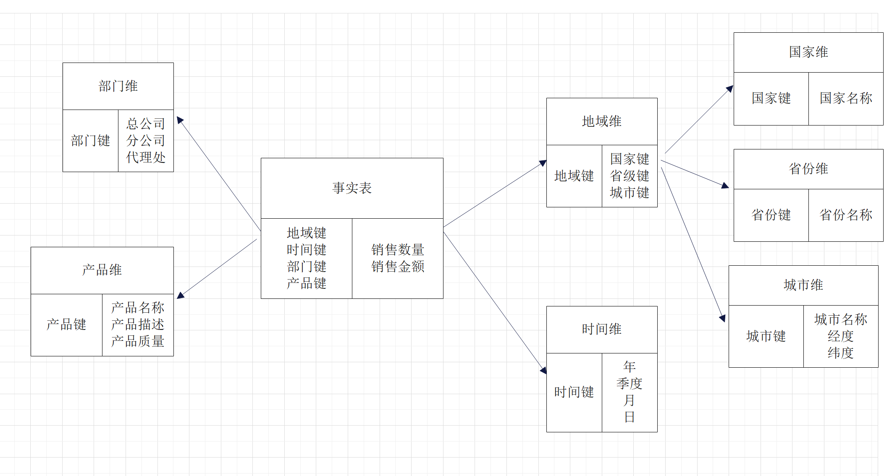
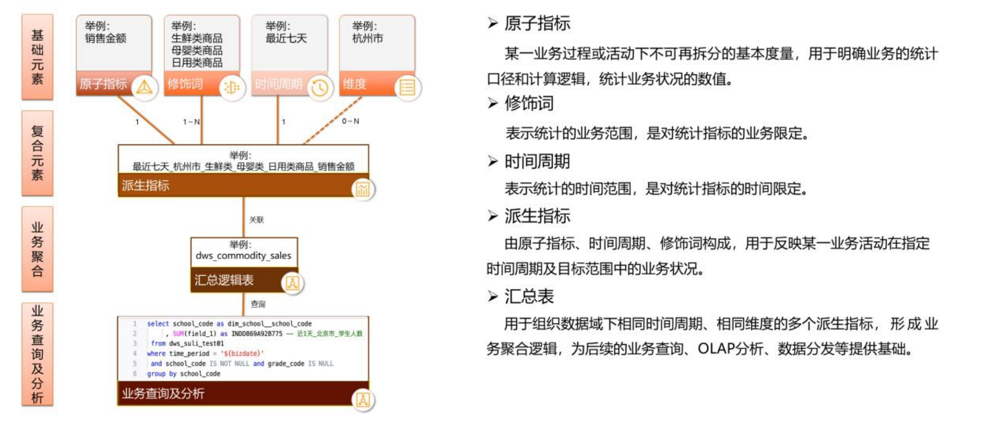
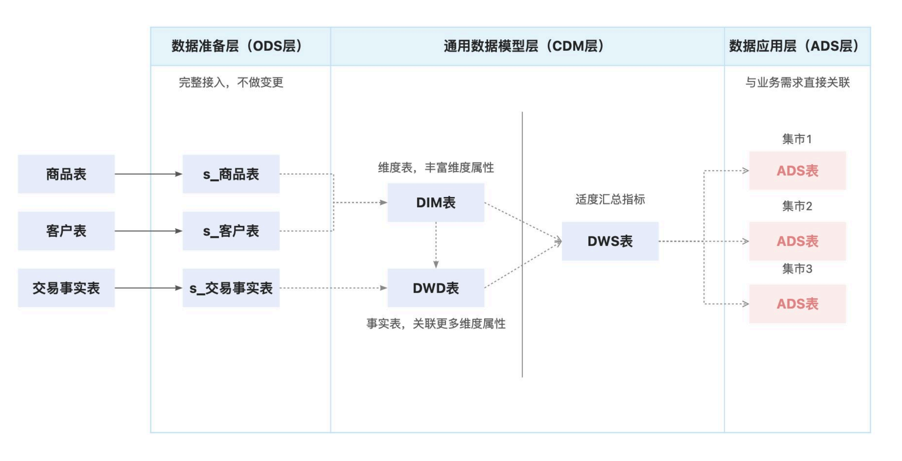
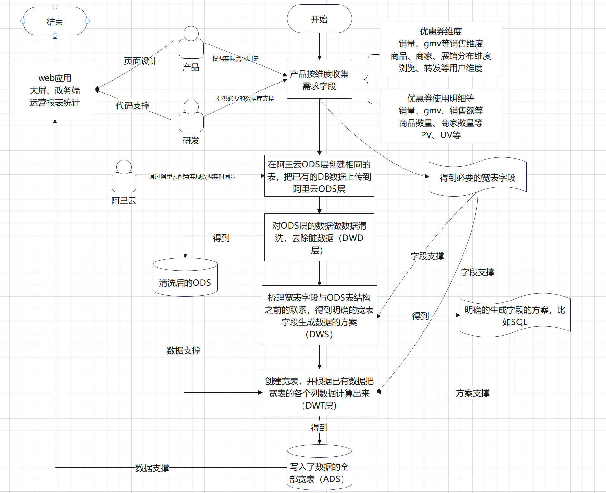

# 数据仓库DataWorks模型概念

# 1：什么是数仓：

<1>：数仓的概念：

数据仓库并不是数据的最终目的地，而是为数据最终的目的地做好准备。说白了就是对已有的DB数据进行清洗、转义、分类、重组、合并、拆分、统计等等，然后把清洗之后的数据糅合在一起，存进一个新的数据库里面去，这样业务层就可以直接从数仓去拿到清洗好的数据。等于是一个基于DB和应用的中间层。

DataWorks相当于一个操作面板，工作台，是一个框架。它整合了多种数据库，并且可以通过操作业务流程、节点、任务配置、数据库等实现数据清洗、离线同步、数据写入等。它需要绑定**MaxCompute引擎**才能做上述的操作。

MaxComputer原名ODPS（Open Data Processing Service），开放数据处理服务，简单来说，就是阿里巴巴的一个数据仓库解决方案。可以理解为，为了实现数据仓库而研发出来的一种数据库类型，SQL脚本和常用的Mysql有一定的差距。


<2>：数仓的数据来源

1：最直接的就是Java 后台产生的业务数据，如直接写入DB的实时数据

2：埋点产生的用户行为数据：如抢券等埋点行为

<3>：数仓清洗后的数据拿来干什么

最直观的就是搭建报表和风控系统。如按某种规律（比如SQL）清洗后的数据直接存进数仓，可以每天通过任务去执行这个SQL存进数仓，把每天最有可能要统计的数据都存进去，需要数据直接从数仓拿，节省时间和人力成本


# 2：数仓的搭建

## 2.1：数据分层

数据分层就是字面意思，把已有的数据按某种维度分成三个层次

### 2.1.1 存储层：ODS（ Operational Data Store  ） 操作型数据存储层

ODS又叫贴源层，原始数据层，它要做的事或者说它存在的意义主要有以下三个

▶ 保持数据原貌，不做任何修改，是最基本的数据源；

▶ 数据压缩，比如使用LZO（一种高速压缩和解压的基于C语言的算法）把数据进行压缩，压缩比例约为10:1

▶创建分区表，防止后续的全表扫描

### 2.1.2   中间层：CDM（Common Data Model）公共数据模型层    

中间层又细分为三种数据模型

#### <1>: DWD（Data Warehouse Detail）：明细类数据事实模型

DWD层还要做以下几件事：

▶数据清洗，包括但不限于：

1：空值去除

2：过滤核心字段无意义的数据，比如订单表中order_id 为 null，包裹商品表中商品 id 为空

3：将用户行为宽表（点赞、评价、收藏、分享等）和业务表进行数据一致性处理

数据清洗的手段主要是sql，也可以通过Python等工具

▶数据脱敏 如手机号、地址等

▶维度模型构建

模型建立使用星型模型， 也就是主表冗余其他各个表的主键。

维度建模一般按照以下四个步骤：选择业务过程→声明粒度→确认维度→确认事实

① 选择业务过程：

在业务系统中，如果业务表过多，挑选最必要的业务线，比如下单业务，支付业务，退款业务，物流业务，一条业务线对应一张事实表。如果业务表比较少，建议选择所有业务线。

② 声明粒度

数据粒度指数据仓库的数据中保存数据的细化程度或综合程度的级别。

声明粒度意味着精确定义事实表中的一行数据表示什么，应该尽可能选择最小粒度，以此来应各种各样的需求。

典型的粒度声明如下：

●订单当中的每个商品项作为下单事实表中的一行，粒度为每次

●每周的订单次数作为一行，粒度为每周。

●每月的订单次数作为一行，粒度为每月。

注意：如果在 DWD 层粒度就是每周或者每月，那么后续就没有办法统计细粒度的指标了。所以建议采用最小粒度。

③ 确定维度

维度的主要作用是描述业务是事实，主要表示的是“谁，何处，何时”等信息。例如：

时间维度、用户维度、地区维度等常见维度。

④ 确定事实

此处的“事实”一词，指的是业务中的度量值，例如订单金额、下单次数等。

在 DWD 层，以业务过程为建模驱动，基于每个具体业务过程的特点，构建最细粒度的明细层事实表。事实表可做适当的宽表化处理。




#### <2>:  DWS（Data Warehouse Summary）：服务数据层 

DWS 层统计各个主题对象的当天行为，服务于 DWT 层的主题宽表。DWS层的宽表字段，是站在不同维度的视角去看事实表，重点关注事实表的度量值，通过与之关联的事实表，获得不同的事实表的度量值。


这个层级关注的是DWT层的各个宽表的字段，与ODS层的各个事实表之间的关联关系，即最终的宽表的每一个字段要怎么去获取，是通过sql,还是其他的一些途径，它是一个做关联关系分析的用来过渡的层级，强调的是搞清楚事实表的关联关系，类似于需求的开发设计流程图。

#### <3>:  DWT（Data Warehouse Topic）数据主题层

以分析的主题对象为建模驱动，以DWS为基础，按主题进行汇总。要对DWS层的数据进一步进行汇总

这个层级强调的是对DWS层所做的理论分析去完成具体的实现并写入到ADS层，就是把最终计算的结果写入到数据库。也就是ADS，因为ADS就是存放最终宽表的地方。

### 2.1.3   应用层：ADS（Application Data Store)：数据应用层

面向实际的数据需求，同步到关系型数据库服务RDS。该层主要是提供数据产品和数据分析使用的数据，一般会存储在ES、mysql等系统中供线上系统使用。我们通过说的报表数据，或者说那种大宽表，一般就放在这里。为应用层，这层数据是完全为了满足具体的分析需求而构建的数据，也是星形结构的数据。应用层为前端应用的展现提现数据，可以为关系型数据库组成。


## 2.2：名词概念

 ●   原子指标：某一业务过程或活动下不可再拆分的基本度量，用于明确业务的统计口 径和计算逻辑，统计业务         状况的数值。 

 ●   修饰词：表示统计的业务范围，是对统计指标的业务限定。

 ●   时间周期：表示统计的时间范围，是对统计指标的时间限定。

 ●   派生指标：由原子指标、时间周期、修饰词构成，用于反映某一业务活动在指定时 间周期及目标范围中的业         务状况。

 ●   汇总表：用于组织数据域下相同时间周期、相同维度的多个派生指标，形成业务聚 合逻辑，为后续的业务查         询、OLAP 分析、数据分发等提供基础。  




## 2.2：数仓搭建流程梳理

阿里云给到的流程图



梳理流程如下




# 3：规范（建议）

## 3.1：表名命名规范

♦ ODS层命名为ods_表名

♦ DWD层命名为dwd_dim/fact_表名

♦ DWS层命名为dws_表名

♦ DWT层命名为dwt_表名

♦ ADS层命名为ads_表名

♦ 临时表命名为xxx_tmp

♦ 用户行为表，以log为后缀

## 3.2：脚本命名规范

♦ 数据源_to_目标_db/log.sh

♦ 用户行为脚本以log为后缀

♦ 业务数据脚本以db为后缀


# 4：示例

## 4.1：建表示例

### 4.1.1：创建用户维度表

```sql
DROP TABLE IF EXISTS dwt_user_topic;
CREATE EXTERNAL TABLE dwt_user_topic
(
  `user_id` STRING  COMMENT '用户id',
  `login_date_first` STRING COMMENT '首次活跃日期',
  `login_date_last` STRING COMMENT '末次活跃日期',
  `login_date_1d_count` STRING COMMENT '最近1日登录次数',
  `login_last_1d_day_count` BIGINT COMMENT '最近1日登录天数',
  `login_last_7d_count` BIGINT COMMENT '最近7日登录次数',
  `login_last_7d_day_count` BIGINT COMMENT '最近7日登录天数',
  `login_last_30d_count` BIGINT COMMENT '最近30日登录次数',
  `login_last_30d_day_count` BIGINT COMMENT '最近30日登录天数',
  `login_count` BIGINT COMMENT '累积登录次数',
  `login_day_count` BIGINT COMMENT '累积登录天数',
  `order_date_first` STRING COMMENT '首次下单时间',
  `order_date_last` STRING COMMENT '末次下单时间',
  `order_last_1d_count` BIGINT COMMENT '最近1日下单次数',
  `order_activity_last_1d_count` BIGINT COMMENT '最近1日订单参与活动次数',
  `order_activity_reduce_last_1d_amount` DECIMAL(16,2) COMMENT '最近1日订单减免金额(活动)',
  `order_coupon_last_1d_count` BIGINT COMMENT '最近1日下单用券次数',
  `order_coupon_reduce_last_1d_amount` DECIMAL(16,2) COMMENT '最近1日订单减免金额(优惠券)',
  `order_last_1d_original_amount` DECIMAL(16,2) COMMENT '最近1日原始下单金额',
  `order_last_1d_final_amount` DECIMAL(16,2) COMMENT '最近1日最终下单金额',
  `order_last_7d_count` BIGINT COMMENT '最近7日下单次数',
  `order_activity_last_7d_count` BIGINT COMMENT '最近7日订单参与活动次数',
  `order_activity_reduce_last_7d_amount` DECIMAL(16,2) COMMENT '最近7日订单减免金额(活动)',
  `order_coupon_last_7d_count` BIGINT COMMENT '最近7日下单用券次数',
  `order_coupon_reduce_last_7d_amount` DECIMAL(16,2) COMMENT '最近7日订单减免金额(优惠券)',
  `order_last_7d_original_amount` DECIMAL(16,2) COMMENT '最近7日原始下单金额',
  `order_last_7d_final_amount` DECIMAL(16,2) COMMENT '最近7日最终下单金额',
  `order_last_30d_count` BIGINT COMMENT '最近30日下单次数',
  `order_activity_last_30d_count` BIGINT COMMENT '最近30日订单参与活动次数',
  `order_activity_reduce_last_30d_amount` DECIMAL(16,2) COMMENT '最近30日订单减免金额(活动)',
  `order_coupon_last_30d_count` BIGINT COMMENT '最近30日下单用券次数',
  `order_coupon_reduce_last_30d_amount` DECIMAL(16,2) COMMENT '最近30日订单减免金额(优惠券)',
  `order_last_30d_original_amount` DECIMAL(16,2) COMMENT '最近30日原始下单金额',
  `order_last_30d_final_amount` DECIMAL(16,2) COMMENT '最近30日最终下单金额',
  `order_count` BIGINT COMMENT '累积下单次数',
  `order_activity_count` BIGINT COMMENT '累积订单参与活动次数',
  `order_activity_reduce_amount` DECIMAL(16,2) COMMENT '累积订单减免金额(活动)',
  `order_coupon_count` BIGINT COMMENT '累积下单用券次数',
  `order_coupon_reduce_amount` DECIMAL(16,2) COMMENT '累积订单减免金额(优惠券)',
  `order_original_amount` DECIMAL(16,2) COMMENT '累积原始下单金额',
  `order_final_amount` DECIMAL(16,2) COMMENT '累积最终下单金额',
  `payment_date_first` STRING COMMENT '首次支付时间',
  `payment_date_last` STRING COMMENT '末次支付时间',
  `payment_last_1d_count` BIGINT COMMENT '最近1日支付次数',
  `payment_last_1d_amount` DECIMAL(16,2) COMMENT '最近1日支付金额',
  `payment_last_7d_count` BIGINT COMMENT '最近7日支付次数',
  `payment_last_7d_amount` DECIMAL(16,2) COMMENT '最近7日支付金额',
  `payment_last_30d_count` BIGINT COMMENT '最近30日支付次数',
  `payment_last_30d_amount` DECIMAL(16,2) COMMENT '最近30日支付金额',
  `payment_count` BIGINT COMMENT '累积支付次数',
  `payment_amount` DECIMAL(16,2) COMMENT '累积支付金额',
  `refund_order_last_1d_count` BIGINT COMMENT '最近1日退单次数',
  `refund_order_last_1d_num` BIGINT COMMENT '最近1日退单件数',
  `refund_order_last_1d_amount` DECIMAL(16,2) COMMENT '最近1日退单金额',
  `refund_order_last_7d_count` BIGINT COMMENT '最近7日退单次数',
  `refund_order_last_7d_num` BIGINT COMMENT '最近7日退单件数',
  `refund_order_last_7d_amount` DECIMAL(16,2) COMMENT '最近7日退单金额',
  `refund_order_last_30d_count` BIGINT COMMENT '最近30日退单次数',
  `refund_order_last_30d_num` BIGINT COMMENT '最近30日退单件数',
  `refund_order_last_30d_amount` DECIMAL(16,2) COMMENT '最近30日退单金额',
  `refund_order_count` BIGINT COMMENT '累积退单次数',
  `refund_order_num` BIGINT COMMENT '累积退单件数',
  `refund_order_amount` DECIMAL(16,2) COMMENT '累积退单金额',
  `refund_payment_last_1d_count` BIGINT COMMENT '最近1日退款次数',
  `refund_payment_last_1d_num` BIGINT COMMENT '最近1日退款件数',
  `refund_payment_last_1d_amount` DECIMAL(16,2) COMMENT '最近1日退款金额',
  `refund_payment_last_7d_count` BIGINT COMMENT '最近7日退款次数',
  `refund_payment_last_7d_num` BIGINT COMMENT '最近7日退款件数',
  `refund_payment_last_7d_amount` DECIMAL(16,2) COMMENT '最近7日退款金额',
  `refund_payment_last_30d_count` BIGINT COMMENT '最近30日退款次数',
  `refund_payment_last_30d_num` BIGINT COMMENT '最近30日退款件数',
  `refund_payment_last_30d_amount` DECIMAL(16,2) COMMENT '最近30日退款金额',
  `refund_payment_count` BIGINT COMMENT '累积退款次数',
  `refund_payment_num` BIGINT COMMENT '累积退款件数',
  `refund_payment_amount` DECIMAL(16,2) COMMENT '累积退款金额',
  `cart_last_1d_count` BIGINT COMMENT '最近1日加入购物车次数',
  `cart_last_7d_count` BIGINT COMMENT '最近7日加入购物车次数',
  `cart_last_30d_count` BIGINT COMMENT '最近30日加入购物车次数',
  `cart_count` BIGINT COMMENT '累积加入购物车次数',
  `favor_last_1d_count` BIGINT COMMENT '最近1日收藏次数',
  `favor_last_7d_count` BIGINT COMMENT '最近7日收藏次数',
  `favor_last_30d_count` BIGINT COMMENT '最近30日收藏次数',
  `favor_count` BIGINT COMMENT '累积收藏次数',
  `coupon_last_1d_get_count` BIGINT COMMENT '最近1日领券次数',
  `coupon_last_1d_using_count` BIGINT COMMENT '最近1日用券(下单)次数',
  `coupon_last_1d_used_count` BIGINT COMMENT '最近1日用券(支付)次数',
  `coupon_last_7d_get_count` BIGINT COMMENT '最近7日领券次数',
  `coupon_last_7d_using_count` BIGINT COMMENT '最近7日用券(下单)次数',
  `coupon_last_7d_used_count` BIGINT COMMENT '最近7日用券(支付)次数',
  `coupon_last_30d_get_count` BIGINT COMMENT '最近30日领券次数',
  `coupon_last_30d_using_count` BIGINT COMMENT '最近30日用券(下单)次数',
  `coupon_last_30d_used_count` BIGINT COMMENT '最近30日用券(支付)次数',
  `coupon_get_count` BIGINT COMMENT '累积领券次数',
  `coupon_using_count` BIGINT COMMENT '累积用券(下单)次数',
  `coupon_used_count` BIGINT COMMENT '累积用券(支付)次数',
  `appraise_last_1d_good_count` BIGINT COMMENT '最近1日好评次数',
  `appraise_last_1d_mid_count` BIGINT COMMENT '最近1日中评次数',
  `appraise_last_1d_bad_count` BIGINT COMMENT '最近1日差评次数',
  `appraise_last_1d_default_count` BIGINT COMMENT '最近1日默认评价次数',
  `appraise_last_7d_good_count` BIGINT COMMENT '最近7日好评次数',
  `appraise_last_7d_mid_count` BIGINT COMMENT '最近7日中评次数',
  `appraise_last_7d_bad_count` BIGINT COMMENT '最近7日差评次数',
  `appraise_last_7d_default_count` BIGINT COMMENT '最近7日默认评价次数',
  `appraise_last_30d_good_count` BIGINT COMMENT '最近30日好评次数',
  `appraise_last_30d_mid_count` BIGINT COMMENT '最近30日中评次数',
  `appraise_last_30d_bad_count` BIGINT COMMENT '最近30日差评次数',
  `appraise_last_30d_default_count` BIGINT COMMENT '最近30日默认评价次数',
  `appraise_good_count` BIGINT COMMENT '累积好评次数',
  `appraise_mid_count` BIGINT COMMENT '累积中评次数',
  `appraise_bad_count` BIGINT COMMENT '累积差评次数',
  `appraise_default_count` BIGINT COMMENT '累积默认评价次数'
)COMMENT '用户主题宽表'
PARTITIONED BY (`dt` STRING)
STORED AS ORC
LOCATION '/warehouse/gmall/dwt/dwt_user_topic/'
TBLPROPERTIES ("orc.compress"="snappy");
```

### 4.1.2：创建商品维度表

```sql
DROP TABLE IF EXISTS dwt_sku_topic;
CREATE EXTERNAL TABLE dwt_sku_topic
(
    `sku_id` STRING COMMENT 'sku_id',
    `order_last_1d_count` BIGINT COMMENT '最近1日被下单次数',
    `order_last_1d_num` BIGINT COMMENT '最近1日被下单件数',
    `order_activity_last_1d_count` BIGINT COMMENT '最近1日参与活动被下单次数',
    `order_coupon_last_1d_count` BIGINT COMMENT '最近1日使用优惠券被下单次数',
    `order_activity_reduce_last_1d_amount` DECIMAL(16,2) COMMENT '最近1日优惠金额(活动)',
    `order_coupon_reduce_last_1d_amount` DECIMAL(16,2) COMMENT '最近1日优惠金额(优惠券)',
    `order_last_1d_original_amount` DECIMAL(16,2) COMMENT '最近1日被下单原始金额',
    `order_last_1d_final_amount` DECIMAL(16,2) COMMENT '最近1日被下单最终金额',
    `order_last_7d_count` BIGINT COMMENT '最近7日被下单次数',
    `order_last_7d_num` BIGINT COMMENT '最近7日被下单件数',
    `order_activity_last_7d_count` BIGINT COMMENT '最近7日参与活动被下单次数',
    `order_coupon_last_7d_count` BIGINT COMMENT '最近7日使用优惠券被下单次数',
    `order_activity_reduce_last_7d_amount` DECIMAL(16,2) COMMENT '最近7日优惠金额(活动)',
    `order_coupon_reduce_last_7d_amount` DECIMAL(16,2) COMMENT '最近7日优惠金额(优惠券)',
    `order_last_7d_original_amount` DECIMAL(16,2) COMMENT '最近7日被下单原始金额',
    `order_last_7d_final_amount` DECIMAL(16,2) COMMENT '最近7日被下单最终金额',
    `order_last_30d_count` BIGINT COMMENT '最近30日被下单次数',
    `order_last_30d_num` BIGINT COMMENT '最近30日被下单件数',
    `order_activity_last_30d_count` BIGINT COMMENT '最近30日参与活动被下单次数',
    `order_coupon_last_30d_count` BIGINT COMMENT '最近30日使用优惠券被下单次数',
    `order_activity_reduce_last_30d_amount` DECIMAL(16,2) COMMENT '最近30日优惠金额(活动)',
    `order_coupon_reduce_last_30d_amount` DECIMAL(16,2) COMMENT '最近30日优惠金额(优惠券)',
    `order_last_30d_original_amount` DECIMAL(16,2) COMMENT '最近30日被下单原始金额',
    `order_last_30d_final_amount` DECIMAL(16,2) COMMENT '最近30日被下单最终金额',
    `order_count` BIGINT COMMENT '累积被下单次数',
    `order_num` BIGINT COMMENT '累积被下单件数',
    `order_activity_count` BIGINT COMMENT '累积参与活动被下单次数',
    `order_coupon_count` BIGINT COMMENT '累积使用优惠券被下单次数',
    `order_activity_reduce_amount` DECIMAL(16,2) COMMENT '累积优惠金额(活动)',
    `order_coupon_reduce_amount` DECIMAL(16,2) COMMENT '累积优惠金额(优惠券)',
    `order_original_amount` DECIMAL(16,2) COMMENT '累积被下单原始金额',
    `order_final_amount` DECIMAL(16,2) COMMENT '累积被下单最终金额',
    `payment_last_1d_count` BIGINT COMMENT '最近1日被支付次数',
    `payment_last_1d_num` BIGINT COMMENT '最近1日被支付件数',
    `payment_last_1d_amount` DECIMAL(16,2) COMMENT '最近1日被支付金额',
    `payment_last_7d_count` BIGINT COMMENT '最近7日被支付次数',
    `payment_last_7d_num` BIGINT COMMENT '最近7日被支付件数',
    `payment_last_7d_amount` DECIMAL(16,2) COMMENT '最近7日被支付金额',
    `payment_last_30d_count` BIGINT COMMENT '最近30日被支付次数',
    `payment_last_30d_num` BIGINT COMMENT '最近30日被支付件数',
    `payment_last_30d_amount` DECIMAL(16,2) COMMENT '最近30日被支付金额',
    `payment_count` BIGINT COMMENT '累积被支付次数',
    `payment_num` BIGINT COMMENT '累积被支付件数',
    `payment_amount` DECIMAL(16,2) COMMENT '累积被支付金额',
    `refund_order_last_1d_count` BIGINT COMMENT '最近1日退单次数',
    `refund_order_last_1d_num` BIGINT COMMENT '最近1日退单件数',
    `refund_order_last_1d_amount` DECIMAL(16,2) COMMENT '最近1日退单金额',
    `refund_order_last_7d_count` BIGINT COMMENT '最近7日退单次数',
    `refund_order_last_7d_num` BIGINT COMMENT '最近7日退单件数',
    `refund_order_last_7d_amount` DECIMAL(16,2) COMMENT '最近7日退单金额',
    `refund_order_last_30d_count` BIGINT COMMENT '最近30日退单次数',
    `refund_order_last_30d_num` BIGINT COMMENT '最近30日退单件数',
    `refund_order_last_30d_amount` DECIMAL(16,2) COMMENT '最近30日退单金额',
    `refund_order_count` BIGINT COMMENT '累积退单次数',
    `refund_order_num` BIGINT COMMENT '累积退单件数',
    `refund_order_amount` DECIMAL(16,2) COMMENT '累积退单金额',
    `refund_payment_last_1d_count` BIGINT COMMENT '最近1日退款次数',
    `refund_payment_last_1d_num` BIGINT COMMENT '最近1日退款件数',
    `refund_payment_last_1d_amount` DECIMAL(16,2) COMMENT '最近1日退款金额',
    `refund_payment_last_7d_count` BIGINT COMMENT '最近7日退款次数',
    `refund_payment_last_7d_num` BIGINT COMMENT '最近7日退款件数',
    `refund_payment_last_7d_amount` DECIMAL(16,2) COMMENT '最近7日退款金额',
    `refund_payment_last_30d_count` BIGINT COMMENT '最近30日退款次数',
    `refund_payment_last_30d_num` BIGINT COMMENT '最近30日退款件数',
    `refund_payment_last_30d_amount` DECIMAL(16,2) COMMENT '最近30日退款金额',
    `refund_payment_count` BIGINT COMMENT '累积退款次数',
    `refund_payment_num` BIGINT COMMENT '累积退款件数',
    `refund_payment_amount` DECIMAL(16,2) COMMENT '累积退款金额',
    `cart_last_1d_count` BIGINT COMMENT '最近1日被加入购物车次数',
    `cart_last_7d_count` BIGINT COMMENT '最近7日被加入购物车次数',
    `cart_last_30d_count` BIGINT COMMENT '最近30日被加入购物车次数',
    `cart_count` BIGINT COMMENT '累积被加入购物车次数',
    `favor_last_1d_count` BIGINT COMMENT '最近1日被收藏次数',
    `favor_last_7d_count` BIGINT COMMENT '最近7日被收藏次数',
    `favor_last_30d_count` BIGINT COMMENT '最近30日被收藏次数',
    `favor_count` BIGINT COMMENT '累积被收藏次数',
    `appraise_last_1d_good_count` BIGINT COMMENT '最近1日好评数',
    `appraise_last_1d_mid_count` BIGINT COMMENT '最近1日中评数',
    `appraise_last_1d_bad_count` BIGINT COMMENT '最近1日差评数',
    `appraise_last_1d_default_count` BIGINT COMMENT '最近1日默认评价数',
    `appraise_last_7d_good_count` BIGINT COMMENT '最近7日好评数',
    `appraise_last_7d_mid_count` BIGINT COMMENT '最近7日中评数',
    `appraise_last_7d_bad_count` BIGINT COMMENT '最近7日差评数',
    `appraise_last_7d_default_count` BIGINT COMMENT '最近7日默认评价数',
    `appraise_last_30d_good_count` BIGINT COMMENT '最近30日好评数',
    `appraise_last_30d_mid_count` BIGINT COMMENT '最近30日中评数',
    `appraise_last_30d_bad_count` BIGINT COMMENT '最近30日差评数',
    `appraise_last_30d_default_count` BIGINT COMMENT '最近30日默认评价数',
    `appraise_good_count` BIGINT COMMENT '累积好评数',
    `appraise_mid_count` BIGINT COMMENT '累积中评数',
    `appraise_bad_count` BIGINT COMMENT '累积差评数',
    `appraise_default_count` BIGINT COMMENT '累积默认评价数'
 )COMMENT '商品主题宽表'
PARTITIONED BY (`dt` STRING)
STORED AS ORC
LOCATION '/warehouse/gmall/dwt/dwt_sku_topic/'
TBLPROPERTIES ("orc.compress"="snappy");
```

### 4.1.2：创建优惠券维度表

```sql
DROP TABLE IF EXISTS dwt_coupon_topic;
CREATE EXTERNAL TABLE dwt_coupon_topic(
    `coupon_id` STRING COMMENT '优惠券ID',
    `get_last_1d_count` BIGINT COMMENT '最近1日领取次数',
    `get_last_7d_count` BIGINT COMMENT '最近7日领取次数',
    `get_last_30d_count` BIGINT COMMENT '最近30日领取次数',
    `get_count` BIGINT COMMENT '累积领取次数',
    `order_last_1d_count` BIGINT COMMENT '最近1日使用某券下单次数',
    `order_last_1d_reduce_amount` DECIMAL(16,2) COMMENT '最近1日使用某券下单优惠金额',
    `order_last_1d_original_amount` DECIMAL(16,2) COMMENT '最近1日使用某券下单原始金额',
    `order_last_1d_final_amount` DECIMAL(16,2) COMMENT '最近1日使用某券下单最终金额',
    `order_last_7d_count` BIGINT COMMENT '最近7日使用某券下单次数',
    `order_last_7d_reduce_amount` DECIMAL(16,2) COMMENT '最近7日使用某券下单优惠金额',
    `order_last_7d_original_amount` DECIMAL(16,2) COMMENT '最近7日使用某券下单原始金额',
    `order_last_7d_final_amount` DECIMAL(16,2) COMMENT '最近7日使用某券下单最终金额',
    `order_last_30d_count` BIGINT COMMENT '最近30日使用某券下单次数',
    `order_last_30d_reduce_amount` DECIMAL(16,2) COMMENT '最近30日使用某券下单优惠金额',
    `order_last_30d_original_amount` DECIMAL(16,2) COMMENT '最近30日使用某券下单原始金额',
    `order_last_30d_final_amount` DECIMAL(16,2) COMMENT '最近30日使用某券下单最终金额',
    `order_count` BIGINT COMMENT '累积使用(下单)次数',
    `order_reduce_amount` DECIMAL(16,2) COMMENT '使用某券累积下单优惠金额',
    `order_original_amount` DECIMAL(16,2) COMMENT '使用某券累积下单原始金额',
    `order_final_amount` DECIMAL(16,2) COMMENT '使用某券累积下单最终金额',
    `payment_last_1d_count` BIGINT COMMENT '最近1日使用某券支付次数',
    `payment_last_1d_reduce_amount` DECIMAL(16,2) COMMENT '最近1日使用某券优惠金额',
    `payment_last_1d_amount` DECIMAL(16,2) COMMENT '最近1日使用某券支付金额',
    `payment_last_7d_count` BIGINT COMMENT '最近7日使用某券支付次数',
    `payment_last_7d_reduce_amount` DECIMAL(16,2) COMMENT '最近7日使用某券优惠金额',
    `payment_last_7d_amount` DECIMAL(16,2) COMMENT '最近7日使用某券支付金额',
    `payment_last_30d_count` BIGINT COMMENT '最近30日使用某券支付次数',
    `payment_last_30d_reduce_amount` DECIMAL(16,2) COMMENT '最近30日使用某券优惠金额',
    `payment_last_30d_amount` DECIMAL(16,2) COMMENT '最近30日使用某券支付金额',
    `payment_count` BIGINT COMMENT '累积使用(支付)次数',
    `payment_reduce_amount` DECIMAL(16,2) COMMENT '使用某券累积优惠金额',
    `payment_amount` DECIMAL(16,2) COMMENT '使用某券累积支付金额',
    `expire_last_1d_count` BIGINT COMMENT '最近1日过期次数',
    `expire_last_7d_count` BIGINT COMMENT '最近7日过期次数',
    `expire_last_30d_count` BIGINT COMMENT '最近30日过期次数',
    `expire_count` BIGINT COMMENT '累积过期次数'
)comment '优惠券主题表'
PARTITIONED BY (`dt` STRING)
STORED AS ORC
LOCATION '/warehouse/gmall/dwt/dwt_coupon_topic/'
TBLPROPERTIES ("orc.compress"="snappy");
```

# 5：问题提出