# git Creating a personal access token

 August 13, 2021之后，github取消了对用户密码push代码的支持，在push代码时需要生成token。

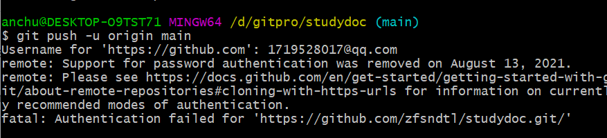

官方文档如下

https://docs.github.com/en/authentication/keeping-your-account-and-data-secure/creating-a-personal-access-token

https://docs.github.com/zh/authentication/keeping-your-account-and-data-secure/creating-a-personal-access-token

参考文档

https://blog.csdn.net/qq_40036754/article/details/127740947


# 官方文档建议如下：

## 关于 personal access token

使用 [GitHub API](https://docs.github.com/zh/rest/overview/other-authentication-methods#via-oauth-and-personal-access-tokens) 或[命令行](https://docs.github.com/zh/authentication/keeping-your-account-and-data-secure/creating-a-personal-access-token#using-a-token-on-the-command-line)时，可使用 Personal access token 替代密码向 GitHub 进行身份验证。 Personal access token 旨在代表你自己访问 GitHub 资源。 若要代表组织访问资源，或为长时间的集成而访问，应使用 GitHub App。 有关详细信息，请参阅“[关于应用](https://docs.github.com/zh/developers/apps/getting-started-with-apps/about-apps)”。

GitHub 目前支持两种类型的 personal access token：fine-grained personal access token 和 personal access tokens (classic)。 GitHub 建议尽可能使用 fine-grained personal access token 而不是 personal access tokens (classic)。 与 personal access tokens (classic) 相比，Fine-grained personal access token 具有几个安全优势：

- 每个令牌只能访问单个用户或组织拥有的资源。
- 每个令牌只能访问特定的存储库。
- 每个令牌都被授予特定的权限，这些权限比授予 personal access tokens (classic) 的范围提供更多的控制。
- 每个令牌都必须具有到期日期。
- 组织所有者可要求必须获取对可访问组织中资源的任何 fine-grained personal access token 的批准。

此外，组织所有者还可以限制 personal access token (classic) 对其组织的访问。

注意：目前，某些功能仅适用于 personal access tokens (classic)：

- 只有 personal access tokens (classic) 对不由你或你所属的组织拥有的公共存储库具有写入访问权限。

- 外部协作者只能使用 personal access tokens (classic) 访问他们参与协作处理的组织存储库。

- 以下 API 仅支持 personal access tokens (classic)。 有关 fine-grained personal access token 支持的 REST API 操作列表，请参阅“

  可用于 fine-grained personal access token 的终结点

  ”。

  - GraphQL API
  - 用于管理源导入的 REST API
  - 用于管理 Projects (classic) 的 REST API
  - 用于管理 GitHub Packages 的 REST API
  - 用于管理通知的 REST API
  - 用于传输存储库的 REST API
  - 用于从模板创建存储库的 REST API
  - 用于为已通过身份验证的用户创建存储库的 REST API

作为安全预防措施，GitHub 会自动删除一年内未使用过的 personal access token。 为了提供进一步的安全性，强烈建议将过期时间添加到 personal access token。

## 创建 fine-grained personal access token

注意：Fine-grained personal access token 目前处于 beta 状态，且可能会更改。 若要留下反馈，请参阅[反馈讨论](https://github.com/community/community/discussions/36441)。

1。 [验证电子邮件地址](https://docs.github.com/zh/get-started/signing-up-for-github/verifying-your-email-address)（如果尚未验证）。 1. 在任何页面的右上角，单击个人资料照片，然后单击“设置”。


1. 在左侧边栏中，单击“ 开发人员设置”。
2. 在左侧栏中，在“ Personal access token”下，单击“细粒度令牌” 。
3. 单击“生成新令牌”。
4. 在“令牌名称”下，输入令牌的名称。
5. 在“过期时间”下，选择令牌的过期时间。
6. （可选）在“说明”下，添加说明来描述令牌的用途。
7. 在“资源所有者”下，选择资源所有者。 令牌只能访问所选资源所有者拥有的资源。 除非你所属的组织选择加入 fine-grained personal access token，否则不会显示该组织。 有关详细信息，请参阅“[为组织设置 personal access token 策略](https://docs.github.com/zh/organizations/managing-programmatic-access-to-your-organization/setting-a-personal-access-token-policy-for-your-organization)”。
8. （可选）如果资源所有者是需要批准 fine-grained personal access token 的组织，请在资源所有者下方的框中输入请求的理由。
9. 在“存储库访问权限”下，选择希望令牌访问的存储库。 应选择满足需求的最小存储库访问权限。 令牌始终包括对 GitHub 上所有公共存储库的只读访问权限。
10. 如果在上一步中选择了“仅选择存储库”，则在“所选存储库”下拉列表下，选择希望令牌访问的存储库 。
11. 在“权限”下，选择要授予令牌的权限。 根据指定的资源所有者和存储库访问权限，有存储库、组织和帐户权限这几种可能性。 应根据需要选择最小权限。 有关每个 REST API 操作所需的权限的详细信息，请参阅“[fine-grained personal access token 所需的权限](https://docs.github.com/zh/rest/overview/permissions-required-for-fine-grained-personal-access-tokens)”。
12. 单击“生成令牌”。****

如果选择了某个组织作为资源所有者，并且该组织需要批准 fine-grained personal access token，则令牌将被标记为 `pending`，直到组织管理员审核为止。 令牌在得到批准之前只能读取公共资源。 如果你是组织的所有者，请求将自动获得批准。 有关详细信息，请参阅“[查看和撤销组织中的 personal access token](https://docs.github.com/zh/organizations/managing-programmatic-access-to-your-organization/reviewing-and-revoking-personal-access-tokens-in-your-organization)”。

## 创建 personal access token (classic)

注意：组织所有者可以限制 personal access token (classic) 对其组织的访问。 如果尝试使用 personal access token (classic) 访问已禁用 personal access token (classic) 访问权限的组织中的资源，则请求将失败并出现 403 响应。 相反，必须使用 GitHub App、OAuth App 或 fine-grained personal access token。

注意：personal access token (classic) 可以访问你有权访问的每个存储库。 GitHub 建议改用 fine-grained personal access token，你可以将其限制为特定的存储库。 Fine-grained personal access token 还允许指定细粒度的权限，而不是宽泛的范围。

1。 [验证电子邮件地址](https://docs.github.com/zh/get-started/signing-up-for-github/verifying-your-email-address)（如果尚未验证）。 1. 在任何页面的右上角，单击个人资料照片，然后单击“设置”。


1. 在左侧边栏中，单击“ 开发人员设置”。 1。 在左侧栏中的 Personal access token 下，单击“令牌（经典）”。 1 。 选择“生成新令牌”，然后单击“生成新令牌（经典）”。
2. 给令牌一个描述性名称。
3. 若要为令牌提供到期时间，请选择“到期”下拉菜单，然后单击默认值或使用日历选择器。
4. 选择要授予此令牌的作用域。 若要使用令牌从命令行访问存储库，请选择“存储库”。 没有指定范围的令牌只能访问公共信息。 有关详细信息，请参阅“[可用范围](https://docs.github.com/zh/developers/apps/building-oauth-apps/scopes-for-oauth-apps#available-scopes)”。
5. 单击“生成令牌”。****
6. 要使用令牌访问使用 SAML 单一登录的组织所拥有的资源，请对令牌进行授权。 有关详细信息，请参阅 GitHub Enterprise Cloud 文档中的“[授权 personal access token 以用于 SAML 单一登录](https://docs.github.com/zh/enterprise-cloud@latest/authentication/authenticating-with-saml-single-sign-on/authorizing-a-personal-access-token-for-use-with-saml-single-sign-on)”。

## 在命令行上使用令牌

如果您有令牌，则可以在通过 HTTPS 执行 Git 操作时输入令牌，而不是密码。

例如，在命令行中输入以下内容：

```shell
$ git clone https://github.com/USERNAME/REPO.git
Username: YOUR_USERNAME
Password: YOUR_TOKEN
```

Personal access token 只能用于 HTTPS Git 操作。 如果存储库使用 SSH 远程 URL，则需要[将远程 URL 从 SSH 切换到 HTTPS](https://docs.github.com/zh/get-started/getting-started-with-git/managing-remote-repositories#switching-remote-urls-from-ssh-to-https)。

如果没有提示您输入用户名和密码，说明您的凭据可能已缓存在计算机上。 可[在密钥链中更新凭据](https://docs.github.com/zh/get-started/getting-started-with-git/updating-credentials-from-the-macos-keychain)，从而用令牌替换旧密码。

可以使用 Git 客户端缓存 personal access token 而不是为每个 HTTPS Git 操作手动输入 personal access token。 Git 会将您的凭据临时存储在内存中，直到过期为止。 您还可以将令牌存储在 Git 可以在每个请求之前读取的纯文本文件中。 有关详细信息，请参阅“[在 Git 中缓存 GitHub 凭据](https://docs.github.com/zh/get-started/getting-started-with-git/caching-your-github-credentials-in-git)”。


## Fine-grained personal access tokens具体操作：

账号下面 settings入口

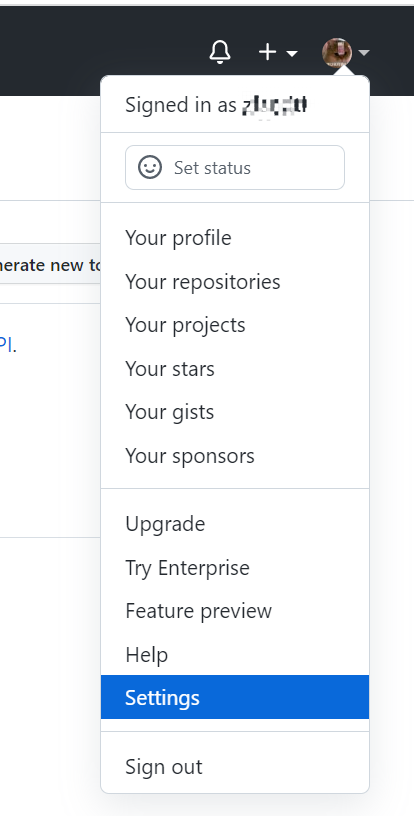

然后点击Developer settings

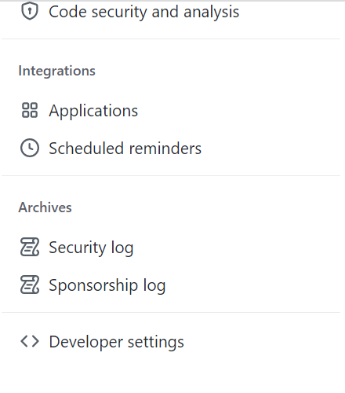

 如下操作 ：Generate a personal access token

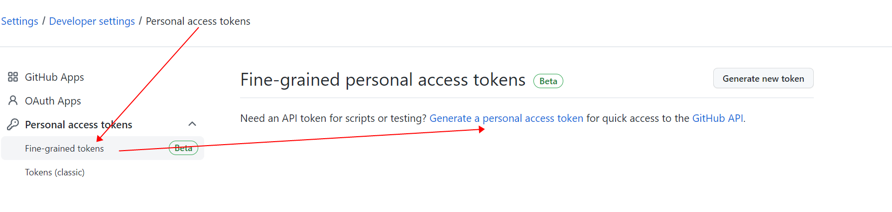


配置token，然后生成token

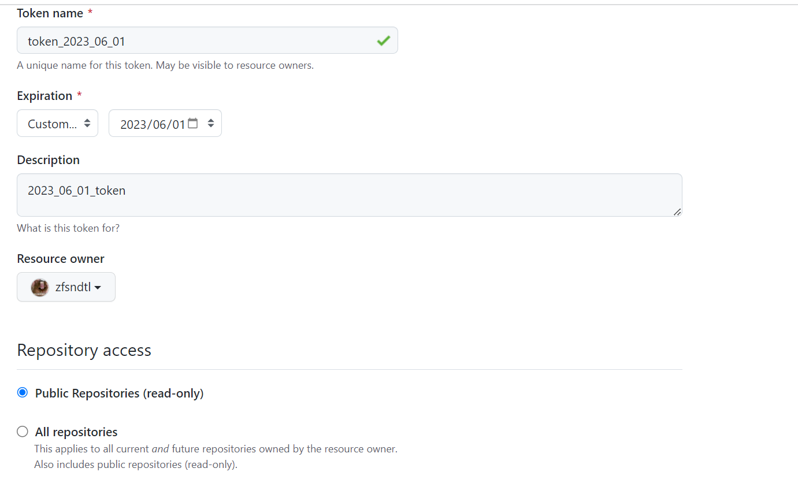

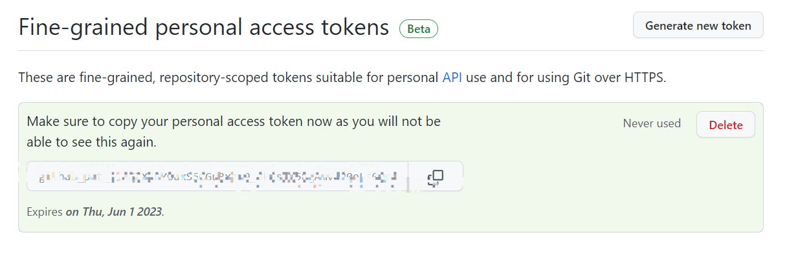

接下来就可以使用账号token登录。还是不行，因为上面配置的只能操作public 的仓库

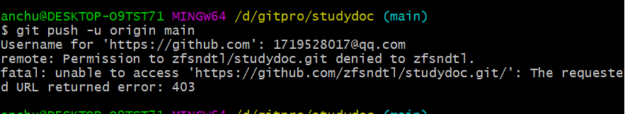

## Personal access tokens (classic)具体操作：

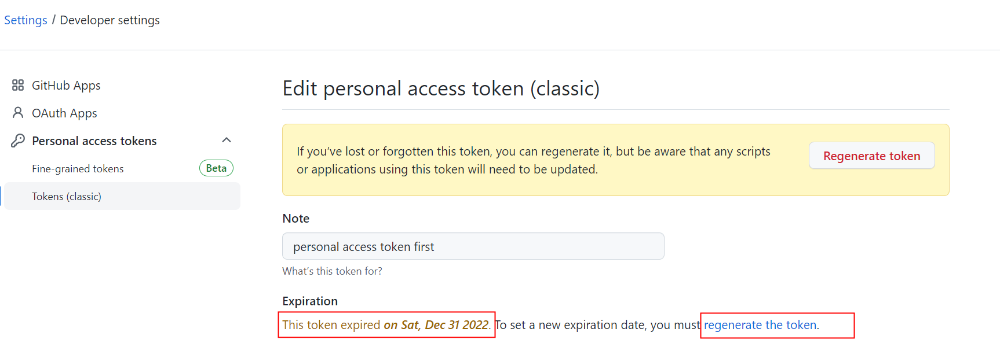逾期了自动重新生成 regenerate the token

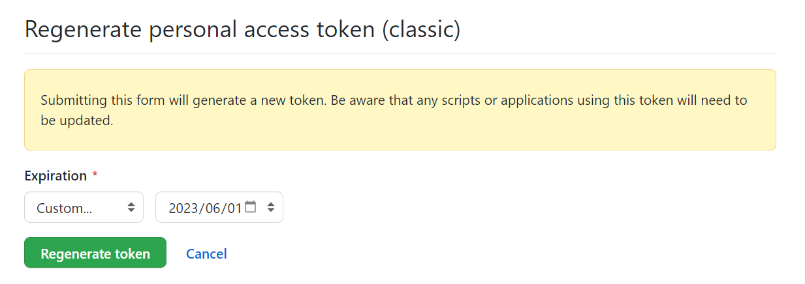

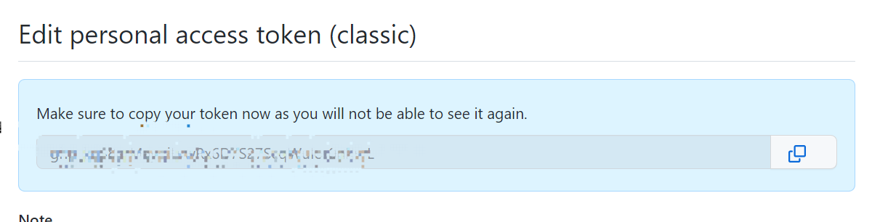

点击update token,生成token

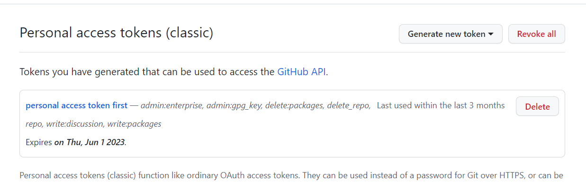

用账号密码登录，push成功

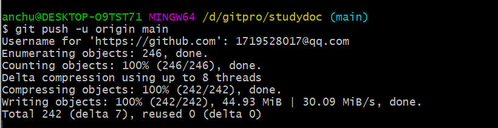