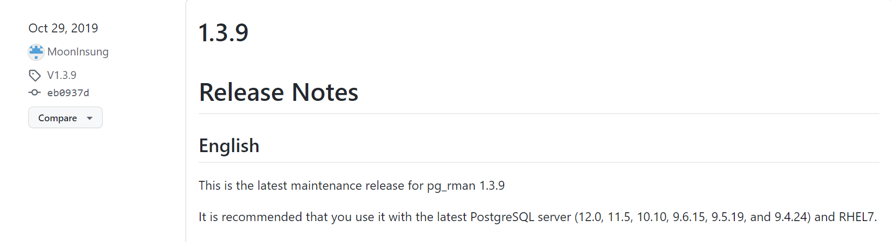

# 【pg物理备份】pg_rman介绍及使用

## 1.环境概述

阿里云ecs centos8.0 cpu1G 内存2G 硬盘40G;polarDB for postgres 11

## 2.pg_rman 介绍

### 2.1 pg_rman 介绍

```
• pg_rman类似于oracle的rman备份策略，实现了全量、增量、归档的层级的备份，可以很灵活的管理PostgreSQL数据库的备份，pg_rman是一款开源的pg的备份恢复插件支持在线和基于PITR的备份恢复方式。

• pg_rman特点：
    ○ 使用简单.一个命令即可完成备份和恢复.
    ○ 支持在线全备,增量备份，归档备份.
    ○ 支持备份压缩.通过gzip工具实现页内压缩.
    ○ 自动备份维护.自动删除过期的WAL备份文件.
    ○ 支持备份验证.
    ○ 恢复期间无事务丢失.支持基于PITR的配置文件生成器.


  • pg_rman 注意事项：
    ○  pg_rman 基于 pg_start_backup
    ○  pg_rman 基于 需要在本地安装，不能远程德份
    ○  pg_rman 需要下载对应的版本
```

### 2.2 pg_rman 下载

下载地址：

https://github.com/ossc-db/pg_rman/releases

由于polarDB for postgres的pg版本是pg 11, pg_rman下载 1.3.9




```shell
[root@iZbp16q2a88a3l0pqujhabZ ~]# cat /proc/version
Linux version 5.10.84-10.4.al8.x86_64 (mockbuild@x86-006.build.alibaba.eu6) (gcc (GCC) 10.2.1 20200825 (Alibaba 10.2.1-3 2.32), GNU ld version 2.35-12.2.al8) #1 SMP Tue Apr 12 12:31:07 CST 2022
[root@iZbp16q2a88a3l0pqujhabZ ~]# docker ps -a
CONTAINER ID   IMAGE                                       COMMAND                  CREATED       STATUS                     PORTS     NAMES
0852dbf78886   polardb/polardb_pg_local_instance:withrep   "/bin/sh -c '~/tmp_b…"   3 weeks ago   Exited (137) 2 weeks ago             polardb_pg_withrep
4f5f76377b6d   polardb/polardb_pg_local_instance:single    "/bin/sh -c '~/tmp_b…"   3 weeks ago   Up 13 hours                          polardb_pg_single
[root@iZbp16q2a88a3l0pqujhabZ ~]# docker exec -it 4f5f /bin/bash
[postgres@4f5f76377b6d ~]$ psql --version
psql (PostgreSQL) 11.9
[postgres@4f5f76377b6d ~]$ 


```


**方式1**

基于之前搭建的polarDB的环境，详情参照文件 D:\gitpro\studydoc\tools的 《PolarDB for PostgreSQL从入门到放弃》,**启动已经存在的单实例容器 ,直接下载文件到容器内，但是下载失败，貌似容器内连不上git**，操作如下：

```shell
[root@iZbp16q2a88a3l0pqujhabZ ~]# docker ps -a
CONTAINER ID   IMAGE                                       COMMAND                 
0852dbf78886   polardb/polardb_pg_local_instance:withrep   "/bin/sh -c '~/tmp_b…" 
4f5f76377b6d   polardb/polardb_pg_local_instance:single    "/bin/sh -c '~/tmp_b…" 
[root@iZbp16q2a88a3l0pqujhabZ ~]# docker start 4f5f
4f5f


[root@iZbp16q2a88a3l0pqujhabZ ~]# docker exec -it 4f5f /bin/bash
[postgres@4f5f76377b6d ~]$ ls
PolarDB-FileSystem  tmp_basedir_polardb_pg_1100_bld  tmp_datadir_polardb_pg_1100_bl
[postgres@4f5f76377b6d ~]$ 
[postgres@4f5f76377b6d ~]$ 
[postgres@4f5f76377b6d ~]$ 
[postgres@4f5f76377b6d ~]$ 
[postgres@4f5f76377b6d ~]$ 
[postgres@4f5f76377b6d ~]$  wget  https://github.com/ossc-db/pg_rman/releases/downl
--2023-02-02 02:04:34--  https://github.com/ossc-db/pg_rman/releases/download/V1.3.
Resolving github.com (github.com)... 20.205.243.166
Connecting to github.com (github.com)|20.205.243.166|:443... connected.

```

**方式2：下载文件到ecs宿主机，然后copy到容器内**。

wget  https://github.com/ossc-db/pg_rman/releases/download/V1.3.7/pg_rman-1.3.7-pg10.tar.gz


如下图：左边容器内，右边ecs宿主机。

```shell
#宿主机
[root@iZbp16q2a88a3l0pqujhabZ ~]# docker cp pg_rman-1.3.9-pg11.tar.gz 4f5f:/home/postgres/ 
#容器
[root@iZbp16q2a88a3l0pqujhabZ ~]# source /etc/profile
[root@iZbp16q2a88a3l0pqujhabZ ~]# set -o |grep history
history        	on
[root@iZbp16q2a88a3l0pqujhabZ ~]# docker exec -it 4f5f /bin/bash
[postgres@4f5f76377b6d ~]$ ls
pg_rman-1.3.7-pg10.tar.gz  tmp_basedir_polardb_pg_1100_bld
pg_rman-1.3.9-pg11.tar.gz  tmp_datadir_polardb_pg_1100_bld
PolarDB-FileSystem         tmp_master_dir_polardb_pg_1100_bld


```


解压到指定目录**

```shell
[postgres@4f5f76377b6d ~]$ tar -xzvf pg_rman-1.3.9-pg11.tar.gz

[postgres@4f5f76377b6d ~]$ ls
pg_rman-1.3.7-pg10.tar.gz  tmp_basedir_polardb_pg_1100_bld
pg_rman-1.3.9-pg11         tmp_datadir_polardb_pg_1100_bld
pg_rman-1.3.9-pg11.tar.gz  tmp_master_dir_polardb_pg_1100_bld
PolarDB-FileSystem

```

**进入到rman目录进行编译安装** (pg_rman-1.3.7-pg10.tar.gz的版本不匹配，重新下了1.3.9版本)

```shell
[postgres@4f5f76377b6d pg_rman-1.3.9-pg11]$cd /home/postgres/pg_rman-1.3.9-pg11/
[postgres@4f5f76377b6d pg_rman-1.3.9-pg11]$make          
[postgres@4f5f76377b6d pg_rman-1.3.9-pg11]$ make install
/usr/bin/mkdir -p '/home/postgres/tmp_basedir_polardb_pg_1100_bld/bin'
/usr/bin/install -c  pg_rman '/home/postgres/tmp_basedir_polardb_pg_1100_bld/bin'

[postgres@4f5f76377b6d pg_rman-1.3.9-pg11]$ cd ../
[postgres@4f5f76377b6d ~]$ ls
pg_rman-1.3.7-pg10.tar.gz  tmp_basedir_polardb_pg_1100_bld
pg_rman-1.3.9-pg11         tmp_datadir_polardb_pg_1100_bld
pg_rman-1.3.9-pg11.tar.gz  tmp_master_dir_polardb_pg_1100_bld
PolarDB-FileSystem
[postgres@4f5f76377b6d ~]$ cd /home/postgres/tmp_basedir_polardb_pg_1100_bld/bin
[postgres@4f5f76377b6d bin]$ ls
clusterdb          pg_basebackup   pg_resetwal          polar_basebackup
createdb           pgbench         pg_restore           polar-initdb.sh
createuser         pg_config       pg_rewind            polar-replica-initdb.sh
dbatools.sql       pg_controldata  pg_rman              polar_tools
dropdb             pg_ctl          pg_standby           postgres
dropuser           pg_dump         pg_test_fsync        postmaster
ecpg               pg_dumpall      pg_test_timing       psql
initdb             pg_isready      pg_upgrade           reindexdb
oid2name           pg_receivewal   pg_verify_checksums  vacuumdb
pg_archivecleanup  pg_recvlogical  pg_waldump           vacuumlo
[postgres@4f5f76377b6d bin]$ pg_rman --help
pg_rman manage backup/recovery of PostgreSQL database.

Usage:
  pg_rman OPTION init
  pg_rman OPTION backup
  pg_rman OPTION restore
  pg_rman OPTION show [DATE]
  pg_rman OPTION show detail [DATE]
  pg_rman OPTION validate [DATE]
  pg_rman OPTION delete DATE
  pg_rman OPTION purge

```


## 3.pg_rman 使用

### 3.1 pg_rman的用法

```
pg_rman的使用相对简单核心8个命令

pg_rman manage backup/recovery of PostgreSQL database.

Usage:
  pg_rman OPTION init
  pg_rman OPTION backup
  pg_rman OPTION restore
  pg_rman OPTION show [DATE]
  pg_rman OPTION show detail [DATE]
  pg_rman OPTION validate [DATE]
  pg_rman OPTION delete DATE
  pg_rman OPTION purge
init      初始化备份目录
backup    在线备份
restore   恢复
show      查看备份历史
validate  验证备份
delete    删除备份文件
purge     从备份目录中删除已删除备份
```

### 3.2 初始化备份目录

```shell
/home/postgres/tmp_basedir_polardb_pg_1100_bld/bin/postgres -D /home/postgres/tmp_master_dir_polardb_pg_1100_bld
postgres      10       9  0 01:44 ?        00:00:00 postgres(5432): logger  0
postgres      11       9  0 01:44 ?        00:00:00 postgres(5432): logger  1
postgres      12       9  0 01:44 ?        00:00:00 postgres(5432): logger  2
postgres      13       9  0 01:44 ?        00:00:13 postgres(5432): background flashback log inserter  
postgres      14       9  0 01:44 ?        00:00:13 postgres(5432): background flashback log writer  
postgres      16       9  0 01:44 ?        00:00:16 postgres(5432): polar worker process  
postgres      17       9  0 01:44 ?        00:00:19 postgres(5432): polar wal pipeliner  
postgres      19       9  0 01:44 ?        00:00:00 postgres(5432): checkpointer  
postgres      20       9  0 01:44 ?        00:00:00 postgres(5432): background writer  
postgres      21       9  0 01:44 ?        00:00:00 postgres(5432): walwriter  
postgres      22       9  0 01:44 ?        00:01:55 postgres(5432): background logindex writer  
postgres      23       9  0 01:44 ?        00:00:00 postgres(5432): autovacuum launcher  
postgres      24       9  0 01:44 ?        00:00:00 postgres(5432): stats collector  
postgres      25       9  0 01:44 ?        00:00:00 postgres(5432): logical replication launcher  
postgres      26       9  0 01:44 ?        00:00:04 postgres(5432): polar parallel bgwriter  
postgres      27       9  0 01:44 ?        00:00:04 postgres(5432): polar parallel bgwriter  
postgres      28       9  0 01:44 ?        00:00:04 postgres(5432): polar parallel bgwriter  
postgres      29       9  0 01:44 ?        00:00:04 postgres(5432): polar parallel bgwriter  
postgres      30       9  0 01:44 ?        00:00:04 postgres(5432): polar parallel bgwriter 

#polardb 把数据目录和实例目录分离了
#实例命令操作目录
[postgres@4f5f76377b6d tmp_master_dir_polardb_pg_1100_bld]$ ll  ~/tmp_basedir_polardb_pg_1100_bld/
total 28
drwx------ 1 postgres postgres 4096 Feb  2 15:09 bin
drwx------ 1 postgres postgres 4096 Dec 23 15:04 include
drwx------ 1 postgres postgres 4096 Dec 23 15:06 lib
drwx------ 1 postgres postgres 4096 Dec 23 15:06 share
[postgres@4f5f76377b6d tmp_master_dir_polardb_pg_1100_bld]$ 
[postgres@4f5f76377b6d ~]$ cd tmp_master_dir_polardb_pg_1100_bld
#实例数据目录
[postgres@4f5f76377b6d tmp_master_dir_polardb_pg_1100_bld]$ ls
base              pg_log        pg_stat            polar_fullpage
current_logfiles  pg_logical    pg_stat_tmp        polar_node_static.conf
global            pg_logindex   pg_subtrans        polar_rel_size_cache
pg_commit_ts      pg_multixact  pg_tblspc          polar_shmem_stat_file
pg_csnlog         pg_notify     PG_VERSION         postgresql.auto.conf
pg_dynshmem       pg_replslot   pg_xact            postgresql.conf
pg_hba.conf       pg_serial     polar_cache_trash  postmaster.opts
pg_ident.conf     pg_snapshots  polar_dma.conf     postmaster.pid

#pg_rman init初始化备份目录
[postgres@4f5f76377b6d bin]$ pg_rman init -help
ERROR: required parameter not specified: BACKUP_PATH (-B, --backup-path)
[postgres@4f5f76377b6d bin]$ pg_rman init -B pg_rman_backup20230202
ERROR: -B, --backup-path must be an absolute path
[postgres@4f5f76377b6d bin]$ pg_rman init -B /home/postgres/pg_rman_backup20230202
ERROR: required parameter not specified: PGDATA (-D, --pgdata)
[postgres@4f5f76377b6d bin]$ pg_rman init -B /home/postgres/pg_rman_backup20230202 -D ^C
[postgres@4f5f76377b6d bin]$ echo $PGDATA

# 需要指定PGDATA实例目录，或者—D 实例
[postgres@4f5f76377b6d bin]$ pg_rman init -B /home/postgres/pg_rman_backup20230202 -D /home/postgres/tmp_master_dir_polardb_pg_1100_bld


[postgres@4f5f76377b6d bin]$ pg_rman init -B /home/postgres/pg_rman_backup20230202 -D /home/postgres/tmp_master_dir_polardb_pg_1100_bld
WARNING: ARCLOG_PATH is not set yet
DETAIL: The archive_command is not set in postgresql.conf.
HINT: Please set ARCLOG_PATH in pg_rman.ini or environmental variable.
INFO: SRVLOG_PATH is set to '/home/postgres/tmp_master_dir_polardb_pg_1100_bld/pg_log'

#查看初始化目录
[postgres@4f5f76377b6d bin]$ ll /home/postgres/pg_rman_backup20230202/
total 16
drwx------ 4 postgres postgres 4096 Feb  2 15:23 backup
-rw-rw-r-- 1 postgres postgres   72 Feb  2 15:23 pg_rman.ini
-rw-rw-r-- 1 postgres postgres   40 Feb  2 15:23 system_identifier
drwx------ 2 postgres postgres 4096 Feb  2 15:23 timeline_history

首先需要初始化一个backup catalog，目录将用于存放备份的文件，目录也会存放一些元数据，例如备份的配置文件，数据库的systemid，时间线文件历史   
注意：在初始化的时候，要先确认环境变量是否设置正确。
```

### 3.3 查看pg_rman的配置文件信息

```
[postgres@4f5f76377b6d bin]$ cat /home/postgres/pg_rman_backup20230202/pg_rman.ini SRVLOG_PATH='/home/postgres/tmp_master_dir_polardb_pg_1100_bld/pg_log'


ARCLOG_PATH=‘/home/postgres/arch’                        --归档目录
SRVLOG_PATH=‘/home/postgres/data/log’                   --数据库错误日志目录
COMPRESS_DATA = YES                                   --压缩数据
KEEP_ARCLOG_FILES = 10                                 --保存归档文件个数
KEEP_ARCLOG_DAYS = 10                                  --保存归档的天数
KEEP_DATA_GENERATIONS = 3                               --备份冗余度
KEEP_DATA_DAYS = 10                                   --保存备份集时间
KEEP_SRVLOG_FILES = 10                                 --保存日志文件个数
KEEP_SRVLOG_DAYS = 10                                  --保存日志文件天数
```

### 3.4 pg_rman的全量备份

```shell
设置备份目录环境变量
export BACKUP_PATH=/opt/pg_rman
export PGDATA=/home/postgres/tmp_master_dir_polardb_pg_1100_bld
，如果没配置，在备份时需要手动指明备份路径 
--backup-path=/opt/pg_rman
-D 实例数据目录
例如：
pg_rman backup --backup-mode=full --with-serverlog --backup-path=/home/postgres/pg_rman_backup20230202/ -h 127.0.0.1 -D /home/postgres/tmp_master_dir_polardb_pg_1100_bld

##具体操作如下
[postgres@4f5f76377b6d bin]$ pg_rman backup --backup-mode=full --with-serverlog --backup-path=/home/postgres/pg_rman_backup20230202/ -h 127.0.0.1
ERROR: required parameter not specified: PGDATA (-D, --pgdata)
[postgres@4f5f76377b6d bin]$ pg_rman backup --backup-mode=full --with-serverlog --backup-path=/home/postgres/pg_rman_backup20230202/ -h 127.0.0.1 -D ^C
[postgres@4f5f76377b6d bin]$ pg_rman backup --backup-mode=full --with-serverlog --backup-path=/home/postgres/pg_rman_backup20230202/ -h 127.0.0.1 -D /home/postgres/tmp_master_dir_polardb_pg_1100_bld
ERROR: required parameter not specified: ARCLOG_PATH (-A, --arclog-path)
## 归档目录，配置文件配置或者参数指定
[postgres@4f5f76377b6d bin]$  pg_rman backup --backup-mode=full --with-serverlog --backup-path=/home/postgres/pg_rman_backup20230202/  -h 127.0.0.1 -D /home/postgres/tmp_master_dir_polardb_pg_1100_bld --arclog-path /home/postgres/pg_rman_backup20230202/arch
INFO: copying database files
WARNING:  polar_enable_switch_wal_in_backup is off, last WAL may be missing. Please ensure polar_enable_switch_wal_in_backup is set correctly
ERROR: switched WAL could not be archived in 10 seconds

##需要开启  polar_enable_switch_wal_in_backup=on
[postgres@4f5f76377b6d bin]$ psql -c "show polar_enable_switch_wal_in_backup"
 polar_enable_switch_wal_in_backup 
-----------------------------------
 off
(1 row)
###
修改配置文件重启待定


postgres@s2ahumysqlpg01-> pg_rman backup --backup-mode=full --with-serverlog  -h 127.0.0.1
INFO: copying database files
INFO: copying archived WAL files
INFO: copying server log files
INFO: backup complete
INFO: Please execute 'pg_rman validate' to verify the files are correctly copied.

一、pg_rman 校验备份集：

postgres@s2ahumysqlpg01-> pg_rman show
=====================================================================
 StartTime           EndTime              Mode    Size   TLI  Status 
=====================================================================
2022-02-22 17:18:39  2022-02-22 17:19:12  FULL   942MB     5  DONE

二、未校验备份集 Status 显示为 DONE，开始校验

[postgres@mxl pg_rman]$ pg_rman validate
INFO: validate: "2019-12-03 11:53:39" backup, archive log files and server log files by CRC
INFO: backup "2019-12-03 11:53:39" is valid
[postgres@mxl pg_rman]$ pg_rman show

=====================================================================
 StartTime           EndTime              Mode    Size   TLI  Status 
=====================================================================
2019-12-03 11:53:39  2018-12-03 11:54:00  FULL   461MB     1  OK


一、pg_rman 备份集查看：
[postgres@mxl pg_rman]$ pg_rman show
=====================================================================
 StartTime           EndTime              Mode    Size   TLI  Status 
====================================================================

2019-12-03 11:53:39  2019-12-03 11:54:00  FULL   461MB     1  DONE

二、未校验备份集 Status 显示为 DONE，开始校验
postgres@s2ahumysqlpg01-> pg_rman validate
INFO: validate: "2022-02-22 17:18:39" backup, archive log files and server log files by CRC
INFO: backup "2022-02-22 17:18:39" is valid
postgres@s2ahumysqlpg01->  pg_rman show
=====================================================================
 StartTime           EndTime              Mode    Size   TLI  Status 
=====================================================================

2022-02-22 17:18:39  2022-02-22 17:19:12  FULL   942MB     5  OK
```

### 3.5 pg_rman的增量备份

```
增量备份是基于文件系统的update time时间线，增量备份必须有个对应的全库备份
postgres@s2ahumysqlpg01-> pg_rman backup --backup-mode=incremental --progress --compress-data  -h 127.0.0.1
INFO: copying database files
INFO: copying archived WAL filesipped 3028
Processed 16 of 16 files, skipped 13
INFO: backup complete

INFO: Please execute 'pg_rman validate' to verify the files are correctly copied.


备份集查看：

$ pg_rman show
    postgres@s2ahumysqlpg01-> pg_rman show
=====================================================================
 StartTime           EndTime              Mode    Size   TLI  Status 
=====================================================================
2022-02-22 17:22:54  2022-02-22 17:22:58  INCR    33kB     5  DONE
2022-02-22 17:18:39  2022-02-22 17:19:12  FULL   942MB     5  OK

postgres@s2ahumysqlpg01-> pg_rman validate
INFO: validate: "2022-02-22 17:22:54" backup and archive log files by CRC
INFO: backup "2022-02-22 17:22:54" is valid
postgres@s2ahumysqlpg01-> 
postgres@s2ahumysqlpg01-> 
postgres@s2ahumysqlpg01-> pg_rman show
=====================================================================
 StartTime           EndTime              Mode    Size   TLI  Status 
=====================================================================
2022-02-22 17:22:54  2022-02-22 17:22:58  INCR    33kB     5  OK
2022-02-22 17:18:39  2022-02-22 17:19:12  FULL   942MB     5  OK
postgres@s2ahumysqlpg01->
```

### 3.6 pg_rman 归档备份

```
一、pg_rman 归档备份：
归档备份就是静态文件的拷贝。

$ pg_rman backup --backup-mode=archive --progress --compress-data 
$ pg_rman validate
$ pg_rman show

二、删除备份集
删除备份集指定日期之前的，不需要用来指定时间点之前的备份删除掉
[postgres@mxl ~]$ pg_rman delete " pg_rman delete "2022-02-22 17:22:58""

三、清除备份集
物理删除已从catalog删除的备份集
上面从备份集中删除的备份，备份集文件夹并没有一起删除。
[postgres@mxl ~]$ pg_rman purge
```

## 4 pg_rman 恢复

```
pg_rman 恢复默认原地恢复（覆盖式），或者使用新的$PGDATA作为恢复目标。需注意如果在本机恢复pg_rman可能会覆盖原有的数据文件arch,pg_xlog目录中的文件, 可以先将原数据文件做下备份,默认pg_rman restore会在$PGDATA下产生recovery.conf根据实际需要修改相关恢复参数即可。

1、recovery-target-timeline TIMELINE  
Specifies recovering into a particular timeline. If not specified, the current timeline from ($PGDATA/global/pg_control) is used. 
如果不指定时间线，则使用$PGDATA/global/pg_control，如果没有$PGDATA/global/pg_control，则使用最新的全量备份集的时间线。

2、recovery-target-time TIMESTAMP  
This parameter specifies the time stamp up to which recovery will proceed. If not specified, continue recovery to the latest time.
如果不指定，则恢复到最新时间  

3、recovery-target-xid XID  
This parameter specifies the transaction ID up to which recovery will proceed. If not specified, continue recovery to the latest xid.
如果不指定，则恢复到最新xid


4、recovery-target-inclusive
    Specifies whether we stop just after the specified recovery target (true), or just before the recovery target (false). Default is true. 
    是否在指定的恢复目标（true）之后停止，默认为true，如果指定false意识是在恢复目标之前停止
    

• The following parameter determines the behavior of restore.  
    --hard-copy  
    The archive WAL are copied to archive WAL storage area. If not specified, pg_rman makes symbolic link to archive WAL where are in the backup catalog directory. 
    是否使用硬链接复制archive log，如果不指定使用符号连接（软连接）的方式。
#示例:  
    #pg_rman restore  --recovery-target-time "2022-02-22 17:25:30";  下面是没有指定的恢复

    [postgres@mxl~]$ pg_rman restore 
    INFO: backup "2022-02-22 17:25:30" is valid
    INFO: the recovery target timeline ID is not given
    INFO: use timeline ID of current database cluster as recovery target: 5
    INFO: calculating timeline branches to be used to recovery target point
    INFO: searching latest full backup which can be used as restore start point
    INFO: found the full backup can be used as base in recovery: "2022-02-22 17:25:30"
    INFO: copying online WAL files and server log files
    INFO: clearing restore destination
    INFO: validate: "2022-02-22 17:25:30" backup, archive log files and server log files by SIZE
    INFO: backup "2022-02-22 17:25:30" is valid
    INFO: restoring database files from the full mode backup "2022-02-22 17:25:30"
    INFO: searching incremental backup to be restored
    INFO: searching backup which contained archived WAL files to be restored
    INFO: backup "2022-02-22 17:25:30" is valid
    INFO: restoring WAL files from backup "2022-02-22 17:25:30"
    INFO: restoring online WAL files and server log files
    INFO: create pg_rman_recovery.conf for recovery-related parameters.
    INFO: remove an 'include' directive added by pg_rman in postgresql.conf if exists
    INFO: append an 'include' directive in postgresql.conf for pg_rman_recovery.conf
    INFO: generating recovery.signal
    INFO: removing standby.signal if exists to restore as primary
    INFO: restore complete
    HINT: Recovery will start automatically when the PostgreSQL server is started. After the recovery is done, we recommend to remove        recovery-related parameters configured by pg_rman.

    pg_ctl start 

    
```