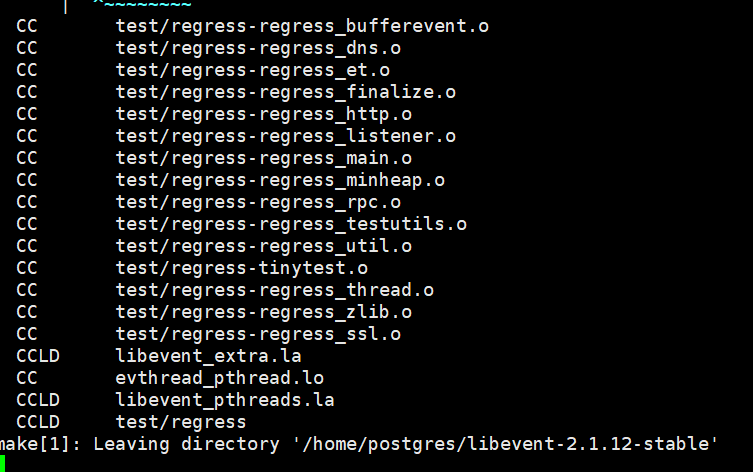
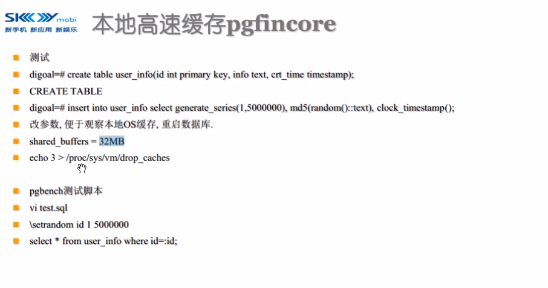
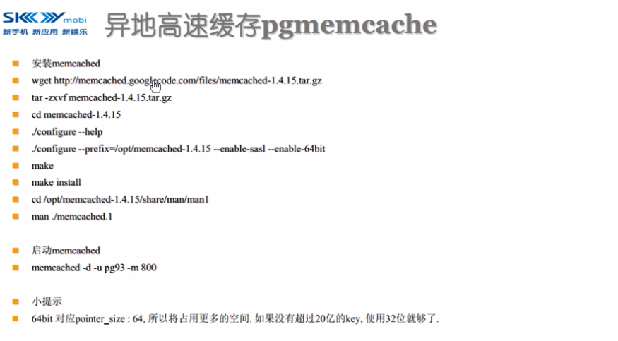

PostgreSQL快速入门

# 课时6: 6 PostgreSQL 连接池, 本地高速缓存, 异地高速缓存

## 连接池


pgbouncer

https://github.com/pgbouncer/pgbouncer.git

由于polarDB for postgresql 基于pg11，所以下个pg11版的，地址如下：

https://github.com/pgbouncer/pgbouncer/releases

先下载最新releases版试一试


pgbouncer 依赖到libevent库，下载地址及版本如下 https://github.com/libevent/libevent/releases




pgbouncer 依赖到c-ares库，下载地址及版本如下   https://github.com/c-ares/c-ares


```shell
#宿主机
[root@iZbp16q2a88a3l0pqujhabZ ~]# ls
oneinstack  pg_rman-1.3.7-pg10.tar.gz  pg_rman-1.3.9-pg11.tar.gz  PolarDB-FileSystem  ReadMe
[root@iZbp16q2a88a3l0pqujhabZ ~]# 
[root@iZbp16q2a88a3l0pqujhabZ ~]# rz -E
rz waiting to receive.
[root@iZbp16q2a88a3l0pqujhabZ ~]# ls
oneinstack               pg_rman-1.3.7-pg10.tar.gz  PolarDB-FileSystem
pgbouncer-1.18.0.tar.gz  pg_rman-1.3.9-pg11.tar.gz  ReadMe
[root@iZbp16q2a88a3l0pqujhabZ ~]# docker cp pgbouncer-1.18.0.tar.gz 4f5f:/home/postgres


#docker容器
[root@iZbp16q2a88a3l0pqujhabZ ~]# docker exec -it 4f5f /bin/bash
[postgres@4f5f76377b6d ~]$ ls
pgbouncer-1.18.0.tar.gz    PolarDB-FileSystem
pg_rman-1.3.7-pg10.tar.gz  tmp_basedir_polardb_pg_1100_bld
pg_rman-1.3.9-pg11         tmp_datadir_polardb_pg_1100_bld
pg_rman-1.3.9-pg11.tar.gz  tmp_master_dir_polardb_pg_1100_bld
pg_rman_backup20230202

[postgres@4f5f76377b6d pgbouncer-1.18.0]$ tar xzvf pgbouncer-1.18.0.tar.gz
[postgres@4f5f76377b6d pgbouncer-1.18.0]$ cd pgbouncer-1.18.0
[postgres@4f5f76377b6d pgbouncer-1.18.0]$ ls
AUTHORS        config.sub    doc         lib        src
autogen.sh     configure     etc         Makefile   test
config.guess   configure.ac  include     NEWS.md    win32
config.mak.in  COPYRIGHT     install-sh  README.md

[postgres@4f5f76377b6d pgbouncer-1.18.0]$ make &make install
[1] 979
Please run ./configure
Makefile:2: config.mak: No such file or directory
make: *** [Makefile:138: config.mak] Error 1
[postgres@4f5f76377b6d pgbouncer-1.18.0]$ Please run ./configure
Makefile:2: config.mak: No such file or directory
make: *** [Makefile:138: config.mak] Error 1
^C
[1]+  Exit 2                  make

##编译
$ ./configure --prefix=/usr/local

checking for LIBEVENT... no
configure: error: Package requirements (libevent) were not met:

No package 'libevent' found

Consider adjusting the PKG_CONFIG_PATH environment variable if you
installed software in a non-standard prefix.

Alternatively, you may set the environment variables LIBEVENT_CFLAGS
and LIBEVENT_LIBS to avoid the need to call pkg-config.
See the pkg-config man page for more details.

#缺少libevent

$ make
$ make install

#libevent下载地址
https://github.com/libevent/libevent/releases
#宿主机
[root@iZbp16q2a88a3l0pqujhabZ ~]# ls
libevent-2.1.12-stable.tar.gz  pgbouncer-1.18.0.tar.gz    pg_rman-1.3.9-pg11.tar.gz  ReadMe
oneinstack                     pg_rman-1.3.7-pg10.tar.gz  PolarDB-FileSystem

[root@iZbp16q2a88a3l0pqujhabZ ~]# docker cp libevent-2.1.12-stable.tar.gz 4f5f:/home/postgre

#docker容器
[root@iZbp16q2a88a3l0pqujhabZ ~]# docker exec -it 4f5f /bin/bash
[postgres@4f5f76377b6d ~]$ ls
[postgres@4f5f76377b6d pgbouncer-1.18.0]$ ls ~
libevent-2.1.12-stable.tar.gz  pg_rman_backup20230202
pgbouncer-1.18.0               PolarDB-FileSystem
pgbouncer-1.18.0.tar.gz        tmp_basedir_polardb_pg_1100_bld
pg_rman-1.3.7-pg10.tar.gz      tmp_datadir_polardb_pg_1100_bld
pg_rman-1.3.9-pg11             tmp_master_dir_polardb_pg_1100_bld
pg_rman-1.3.9-pg11.tar.gz
[postgres@4f5f76377b6d pgbouncer-1.18.0]$ tar -xzvf ~/libevent-2.1.12-stable.tar.gz
[postgres@4f5f76377b6d ~]$ cd ~/libevent-2.1.12-stable
[postgres@4f5f76377b6d libevent-2.1.12-stable]$ ls
[postgres@4f5f76377b6d libevent-2.1.12-stable]$ ./configure
.............
configure: creating ./config.status
config.status: creating libevent.pc
config.status: creating libevent_openssl.pc
config.status: creating libevent_pthreads.pc
config.status: creating libevent_core.pc
config.status: creating libevent_extra.pc
config.status: creating Makefile
config.status: creating config.h
config.status: creating evconfig-private.h
config.status: executing depfiles commands
config.status: executing libtool commands

config.status: executing libtool commands
[postgres@4f5f76377b6d libevent-2.1.12-stable]$sudo  make && sudo make install
[1] 10539
  GEN      test/rpcgen-attempted
  GEN      test/rpcgen-attempted
  GEN      include/event2/event-config.h
  GEN      include/event2/event-config.h
  .............
   sudo make install

libtool: finish: PATH="/opt/rh/devtoolset-9/root/usr/bin:/home/postgres/tmp_basedir_polardb_pg_1100_bld/bin:/opt/rh/llvm-toolset-7.0/root/usr/bin:/opt/rh/llvm-toolset-7.0/root/usr/sbin:/opt/rh/devtoolset-9/root/usr/bin:/usr/local/sbin:/usr/local/bin:/usr/sbin:/usr/bin:/sbin:/bin:/sbin" ldconfig -n /usr/local/lib
----------------------------------------------------------------------
Libraries have been installed in:
   /usr/local/lib

If you ever happen to want to link against installed libraries
in a given directory, LIBDIR, you must either use libtool, and
specify the full pathname of the library, or use the '-LLIBDIR'
flag during linking and do at least one of the following:
   - add LIBDIR to the 'LD_LIBRARY_PATH' environment variable
     during execution
   - add LIBDIR to the 'LD_RUN_PATH' environment variable
     during linking
   - use the '-Wl,-rpath -Wl,LIBDIR' linker flag
   - have your system administrator add LIBDIR to '/etc/ld.so.conf'

See any operating system documentation about shared libraries for
more information, such as the ld(1) and ld.so(8) manual pages.
----------------------------------------------------------------------
 /usr/bin/mkdir -p '/usr/local/include'
 /usr/bin/install -c -m 644 include/evdns.h include/event.h include/evhttp.h include/evrpc.h include/evutil.h '/usr/local/include'
 /usr/bin/mkdir -p '/usr/local/include/event2'
 /usr/bin/install -c -m 644 include/event2/buffer.h include/event2/buffer_compat.h include/event2/bufferevent.h include/event2/bufferevent_compat.h include/event2/bufferevent_struct.h include/event2/dns.h include/event2/dns_compat.h include/event2/dns_struct.h include/event2/event.h include/event2/event_compat.h include/event2/event_struct.h include/event2/http.h include/event2/http_compat.h include/event2/http_struct.h include/event2/keyvalq_struct.h include/event2/listener.h include/event2/rpc.h include/event2/rpc_compat.h include/event2/rpc_struct.h include/event2/tag.h include/event2/tag_compat.h include/event2/thread.h include/event2/util.h include/event2/visibility.h include/event2/bufferevent_ssl.h '/usr/local/include/event2'
 /usr/bin/mkdir -p '/usr/local/include/event2'
 /usr/bin/install -c -m 644 include/event2/event-config.h '/usr/local/include/event2'
 /usr/bin/mkdir -p '/usr/local/lib/pkgconfig'
 /usr/bin/install -c -m 644 libevent.pc libevent_core.pc libevent_extra.pc libevent_pthreads.pc libevent_openssl.pc '/usr/local/lib/pkgconfig'
make[2]: Leaving directory '/home/postgres/libevent-2.1.12-stable'
make[1]: Leaving directory '/home/postgres/libevent-2.1.12-stable'

##查看libevent库是否安装编译成功
[postgres@4f5f76377b6d libevent-2.1.12-stable]$ cd ~/pgbouncer-1.18.0
[postgres@4f5f76377b6d pgbouncer-1.18.0]$ ll /usr/local/lib |grep libevent
lrwxrwxrwx 1 root root      21 Feb  5 15:17 libevent-2.1.so.7 -> libevent-2.1.so.7.0.1

##查看libevent库是否安装编译成功
[postgres@4f5f76377b6d pgbouncer-1.18.0]$ ldconfig -p|grep libevent
	libverto-libevent.so.1 (libc6,x86-64) => /lib64/libverto-libevent.so.1
	libevent_pthreads-2.0.so.5 (libc6,x86-64) => /lib64/libevent_pthreads-2.0.so.5
	libevent_openssl-2.0.so.5 (libc6,x86-64) => /lib64/libevent_openssl-2.0.so.5
	libevent_extra-2.0.so.5 (libc6,x86-64) => /lib64/libevent_extra-2.0.so.5
	libevent_core-2.0.so.5 (libc6,x86-64) => /lib64/libevent_core-2.0.so.5
	libevent-2.0.so.5 (libc6,x86-64) => /lib64/libevent-2.0.so.5
	..........
[postgres@4f5f76377b6d pgbouncer-1.18.0]$ ./configure --prefix=/usr/local 
configure: error: Package requirements (libevent) were not met:

No package 'libevent' found

Consider adjusting the PKG_CONFIG_PATH environment variable if you
installed software in a non-standard prefix.


##修改
[postgres@4f5f76377b6d pgbouncer-1.18.0]$ ll /etc/ld.so.conf
-rw-r--r-- 1 root root 43 Dec 23 13:55 /etc/ld.so.conf

echo "/usr/local/lib" >> /etc/ld.so.conf


[postgres@4f5f76377b6d pgbouncer-1.18.0]$ ./configure --with-event=/usr/local/lib64 --with-cares=/usr/local/bin --prefix=/home/postgres/tmp_basedir_polardb_pg_1100_bld PKG_CONFIG_PATH=/usr/local/lib/pkgconfig
...........
checking for asn1_time_parse... no
checking for root CA certs... /etc/pki/tls/certs/ca-bundle.crt
checking whether to build debug binary... yes
checking whether to enable asserts... no
checking whether to fail on warnings... no
configure: creating ./config.status
config.status: creating config.mak
config.status: creating lib/usual/config.h
configure: WARNING: unrecognized options: --with-event

Results:
  adns    = c-ares
  pam     = no
  systemd = no
  tls     = yes

## 缺少ares
[postgres@4f5f76377b6d pgbouncer-1.18.0]$  make &make install
[1] 33863
     CC       src/admin.c
     CC       src/admin.c
     CC       src/client.c
     CC       src/client.c
     CC       src/dnslookup.c
     CC       src/dnslookup.c
src/dnslookup.c:35:10: fatal error: ares.h: No such file or directory
   35 | #include <ares.h>
      |          ^~~~~~~~
compilation terminated.
src/dnslookup.c:35:10: fatal error: ares.h: No such file or directory
   35 | #include <ares.h>
      |          ^~~~~~~~
compilation terminated.
make: *** [/home/postgres/pgbouncer-1.18.0/lib/mk/antimake.mk:1230: .objs/pgbouncer/src/dnslookup.o] Error 1
[postgres@4f5f76377b6d pgbouncer-1.18.0]$ make: *** [/home/postgres/pgbouncer-1.18.0/lib/mk/antimake.mk:1230: .objs/pgbouncer/src/dnslookup.o] Error 1
^C
[1]+  Exit 2   


##宿主机下载c-ares
[root@iZbp16q2a88a3l0pqujhabZ ~]# ls
c-ares-1.19.0.tar.gz           pgbouncer-1.18.0.tar.gz    PolarDB-FileSystem
libevent-2.1.12-stable.tar.gz  pg_rman-1.3.7-pg10.tar.gz  ReadMe
oneinstack                     pg_rman-1.3.9-pg11.tar.gz
[root@iZbp16q2a88a3l0pqujhabZ ~]# docker cp c-ares-1.19.0.tar.gz 4f5f:/home/postgres


##docker容器
[postgres@4f5f76377b6d pgbouncer-1.18.0]$ cd ~
[postgres@4f5f76377b6d ~]$ ls
c-ares-1.19.0.tar.gz           pg_rman-1.3.9-pg11.tar.gz
libevent-2.1.12-stable         pg_rman_backup20230202
libevent-2.1.12-stable.tar.gz  PolarDB-FileSystem
pgbouncer-1.18.0               tmp_basedir_polardb_pg_1100_bld
pgbouncer-1.18.0.tar.gz        tmp_datadir_polardb_pg_1100_bld
pg_rman-1.3.7-pg10.tar.gz      tmp_master_dir_polardb_pg_1100_bld
pg_rman-1.3.9-pg11
[postgres@4f5f76377b6d ~]$ tar xzvf c-ares-1.19.0.tar.gz
[postgres@4f5f76377b6d ~]$ cd c-ares-1.19.0
[postgres@4f5f76377b6d c-ares-1.19.0]$ ls
acinclude.m4            depcomp            Makefile.msvc
aclocal.m4              docs               Makefile.netware
aminclude_static.am     get_ver.awk        Makefile.Watcom
AUTHORS                 include            maketgz
buildconf               INSTALL.md         missing
buildconf.bat           install-sh         msvc_ver.inc
c-ares-config.cmake.in  libcares.pc.cmake  NEWS
CHANGES                 libcares.pc.in     README.cares
CMakeLists.txt          LICENSE.md         README.md
compile                 ltmain.sh          README.msvc
config.guess            m4                 RELEASE-NOTES
config.sub              Makefile.am        SECURITY.md
configure               Makefile.dj        src
configure.ac            Makefile.in        test
CONTRIBUTING.md         Makefile.m32       TODO
[postgres@4f5f76377b6d c-ares-1.19.0]$ ./configure 
.......
config.status: creating Makefile
config.status: creating config.h
config.status: executing depfiles commands
config.status: executing libtool commands
[postgres@4f5f76377b6d c-ares-1.19.0]$ sudo make && sudo make install
.....
make[2]: Leaving directory '/home/postgres/c-ares-1.19.0/docs'
make[1]: Leaving directory '/home/postgres/c-ares-1.19.0/docs'
Making install in test
make[1]: Entering directory '/home/postgres/c-ares-1.19.0/test'
make[2]: Entering directory '/home/postgres/c-ares-1.19.0/test'
make[2]: Nothing to be done for 'install-exec-am'.
make[2]: Nothing to be done for 'install-data-am'.
make[2]: Leaving directory '/home/postgres/c-ares-1.19.0/test'
make[1]: Leaving directory '/home/postgres/c-ares-1.19.0/test'
make[1]: Entering directory '/home/postgres/c-ares-1.19.0'
make[2]: Entering directory '/home/postgres/c-ares-1.19.0'
make[2]: Nothing to be done for 'install-exec-am'.
 /usr/bin/mkdir -p '/usr/local/lib/pkgconfig'
 /usr/bin/install -c -m 644 libcares.pc '/usr/local/lib/pkgconfig'
make[2]: Leaving directory '/home/postgres/c-ares-1.19.0'
make[1]: Leaving directory '/home/postgres/c-ares-1.19.0'

##查看是否安装编译成功

[postgres@4f5f76377b6d pgbouncer-1.18.0]$ ldconfig -p|grep ares

[postgres@4f5f76377b6d c-ares-1.19.0]$ ll /usr/local/lib|grep ares
-rw-r--r-- 1 root root  203678 Feb  5 15:58 libcares.a
-rwxr-xr-x 1 root root     938 Feb  5 15:58 libcares.la
lrwxrwxrwx 1 root root      17 Feb  5 15:58 libcares.so -> libcares.so.2.6.0
lrwxrwxrwx 1 root root      17 Feb  5 15:58 libcares.so.2 -> libcares.so.2.6.0
-rwxr-xr-x 1 root root  102464 Feb  5 15:58 libcares.so.2.6.0


#编译pgbouncer
[postgres@4f5f76377b6d c-ares-1.19.0]$ cd ~/pgbouncer-1.18.0
[postgres@4f5f76377b6d pgbouncer-1.18.0]$ sudo make && sudo make install
.......
       INSTALL  pgbouncer /home/postgres/tmp_basedir_polardb_pg_1100_bld/bin
     INSTALL  README.md /home/postgres/tmp_basedir_polardb_pg_1100_bld/share/doc/pgbouncer
     INSTALL  NEWS.md /home/postgres/tmp_basedir_polardb_pg_1100_bld/share/doc/pgbouncer
     INSTALL  etc/pgbouncer-minimal.ini /home/postgres/tmp_basedir_polardb_pg_1100_bld/share/doc/pgbouncer
     INSTALL  etc/pgbouncer.ini /home/postgres/tmp_basedir_polardb_pg_1100_bld/share/doc/pgbouncer
     INSTALL  etc/pgbouncer.service /home/postgres/tmp_basedir_polardb_pg_1100_bld/share/doc/pgbouncer
     INSTALL  etc/pgbouncer.socket /home/postgres/tmp_basedir_polardb_pg_1100_bld/share/doc/pgbouncer
     INSTALL  etc/userlist.txt /home/postgres/tmp_basedir_polardb_pg_1100_bld/share/doc/pgbouncer
     INSTALL  doc/pgbouncer.1 /home/postgres/tmp_basedir_polardb_pg_1100_bld/share/man/man1
     INSTALL  doc/

[postgres@4f5f76377b6d pgbouncer-1.18.0]$ ll /home/postgres/tmp_basedir_polardb_pg_1100_bld/bin/ |grep pgbouncer
-rwxr-xr-x 1 root     root      2147400 Feb  5 16:05 pgbouncer

##权限赋给postgres用户
[postgres@4f5f76377b6d pgbouncer-1.18.0]$ sudo chown postgres用户:postgres /home/postgres/tmp_basedir_polardb_pg_1100_bld/bin/pgbouncer 

[postgres@4f5f76377b6d pgbouncer-1.18.0]$ pgbouncer --help
pgbouncer: error while loading shared libraries: libcares.so.2: cannot open shared object file: No such file or directory

[postgres@4f5f76377b6d ~]$ pg_ctl -D ~/tmp_master_dir_polardb_pg_1100_bld restart

```


配置文件


## 高速缓存








·

