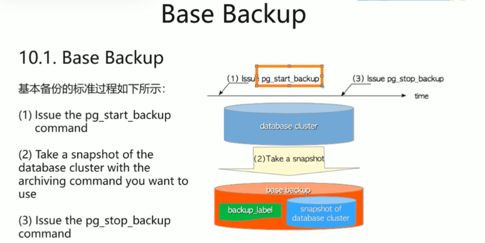

### 7天突破PolarDB for PostgreSQL 2022版课时6: 备份与恢复实践

视频地址

https://developer.aliyun.com/learning/course/992/detail/14979?spm=a2c6h.21258778.0.0.54544576Vzd7it#noteTaking

课程地址

https://developer.aliyun.com/learning/course/992

