# 1.工具使用：canal从入门到实战（1）

## **1.安装前准备**

### **1.1 操作系统(cenos7.9 x86)**

```
#查看
/etc/redhat-release文件
cat /etc/redhat-releaseCentOS Linux release 7.9.2009 (Core)
#查看/proc/version文件
# proc 为process的缩写，里面存放与内核相关的文件
cat /proc/version
Linux version 3.10.0-1160.el7.x86_64 (mockbuild@kbuilder.bsys.centos.org) (gcc version 4.8.5 20150623 (Red Hat 4.8.5-44) (GCC) )#1 SMP Mon Oct 19 16:18:59 UTC 2020
#使用uname -a 命令
uname -a
Linux localhost.localdomain 3.10.0-1160.el7.x86_64 #1 SMP Mon Oct 19 16:18:59 UTC 2020 x86_64 x86_64 x86_64 GNU/Linux
```

### **1.2 工具版本选择**

mysql: MySQL-5.7

rocketMQ:rocketmq-all-4.9.3

canal版本:canal.deployer-1.1.5.tar.gz

## **2 安装环境搭建**

### **2.1 MySQL安装**

参考文档： https://zhuanlan.zhihu.com/p/87069388


#### **（1）检查是否已经安装过mysql，执行命令**

```
[root@localhost software]# rpm -qa | grep mysql[root@localhost software]#
```

从结果来看，当前机器没有安装mysql。可以直接安装MySQL，如果需要卸载旧版，操作如下：


```shell
[root@localhost /]#rpm -e --nodeps mysql-libs-5.1.73-5.el6_6.x86_64
#再次执行查询命令，查看是否删除
[root@localhost /]# rpm -qa | grep mysql
#查询所有Mysql对应的文件夹
[root@localhost /]
# whereis mysqlmysql: 
/usr/bin/mysql 
/usr/include/mysql
[root@localhost lib]
# find / -name mysql/data/mysql/data/mysql/mysql
#删除相关目录或文件[root@localhost /]
#  rm -rf /usr/bin/mysql /usr/include/mysql /data/mysql /data/mysql/mysql 
#验证是否删除完毕
[root@localhost /]# whereis mysql
mysql:
[root@localhost /]# find / -name mysql
[root@localhost /]#
```

#### **（2）安装mysql**

从官网下载用于Linux的Mysql安装包

```shell
wget https://dev.mysql.com/get/Downloads/MySQL-5.7/mysql-5.7.24-linux-glibc2.12-x86_64.tar.gz
--2022-04-25 23:11:17--  
https://dev.mysql.com/get/Downloads/MySQL-5.7/mysql-5.7.24-linux-glibc2.12-x86_64.tar.gzResolving dev.mysql.com (dev.mysql.com)... 137.254.60.11Connecting to dev.mysql.com (dev.mysql.com)|137.254.60.11|:443... 
connected.HTTP request sent, awaiting response... 302 FoundLocation: https://cdn.mysql.com//archives/mysql-5.7/mysql-5.7.24-linux-glibc2.12-x86_64.tar.gz [following]--2022-04-25 23:11:18--  
https://cdn.mysql.com//archives/mysql-5.7/mysql-5.7.24-linux-glibc2.12-x86_64.tar.gzResolving cdn.mysql.com (cdn.mysql.com)... 
23.56.1.19Connecting to cdn.mysql.com (cdn.mysql.com)|23.56.1.19|:443...
connected.HTTP request sent, awaiting response... 200 OKLength: 644930593 (615M) [application/x-tar-gz]Saving to: ‘mysql-5.7.24-linux-glibc2.12-x86_64.tar.gz’100%[=============================================] in 6m0s2022-04-25 23:17:19 (1.71 MB/s)
- ‘mysql-5.7.24-linux-glibc2.12-x86_64.tar.gz’ saved [644930593/644930593]
```

解压，赋权限，切换用户到anchu

```shell
#解压当前目录
[root@localhost software]# pwd/home/anchu/software
[root@localhost software]# ls canal  
canal.deployer-1.1.5.tar.gz  canal.example-1.1.5.tar.gz  mysql-5.7.24-linux-glibc2.12-x86_64.tar.gz
[root@localhost software]# tar xzvf mysql-5.7.24-linux-glibc2.12-x86_64.tar.gz 
#赋权给anchu
[root@localhost software]# chown -R anchu:anchu mysql-5.7.24-linux-glibc2.12-x86_64
#切换到anchu
[root@localhost software]# su anchu
#重命名目录为 mysql-5.7.24
[anchu@localhost software]$ mv mysql-5.7.24-linux-glibc2.12-x86_64 mysql-5.7.24
[anchu@localhost software]$ 
[anchu@localhost software]$ ls canal  
canal.deployer-1.1.5.tar.gz  canal.example-1.1.5.tar.gz  mysql-5.7.24  mysql-5.7.24-linux-glibc2.12-x86_64.tar.gz
#设置mysql环境变量
[anchu@localhost software]$ cd mysql-5.7.24/
[anchu@localhost mysql-5.7.24]$ cd bin
[anchu@localhost bin]$ pwd/home/anchu/software/mysql-5.7.24/bin
[anchu@localhost bin]$ vi ~/.bash_profile 
[anchu@localhost bin]$ ls
innochecksum    myisam_ftdump  my_print_defaults  mysqlbinlog                 mysql_config         mysqld-debug  mysqldump       mysqlimport       mysqlpump                  mysqlslap            mysql_tzinfo_to_sql  perror     resolve_stack_dumplz4_decompress  myisamlog      mysql              mysqlcheck                  mysql_config_editor  mysqld_multi  mysqldumpslow   mysql_install_db  mysql_secure_installation  mysql_ssl_rsa_setup  mysql_upgrade        replace    zlib_decompressmyisamchk       myisampack     mysqladmin         mysql_client_test_embedded  mysqld               mysqld_safe   mysql_embedded  mysql_plugin      mysqlshow                  mysqltest_embedded   mysqlxtest           resolveip
[anchu@localhost bin]$ pwd/home/anchu/software/mysql-5.7.24/bin
[anchu@localhost bin]$ echo 'MYSQL_HOME=/home/anchu/software/mysql-5.7.24/' >>~/.bash_profile
[anchu@localhost bin]$ echo 'PATH=$PATH:$MYSQL_HOME/bin' >>~/.bash_profile
[anchu@localhost bin]$ echo 'export PATH'  >>~/.bash_profile
[anchu@localhost bin]$ source ~/.bash_profile 
[anchu@localhost bin]$ mysql --versionmysql 
Ver 14.14 Distrib 5.7.24, for linux-glibc2.12 (x86_64) using  EditLine wrapper
```

创建数据目录初始化mysql,务必记住初始化输出日志末尾的密码（数据库管理员临时密码）

```shell
[anchu@localhost mysql-5.7.24]$ pwd/home/anchu/software/mysql-5.7.24
[anchu@localhost mysql-5.7.24]$ mkdir data
[anchu@localhost mysql-5.7.24]$ cd data
[anchu@localhost data]$ pwd/home/anchu/software/mysql-5.7.24/data 

[anchu@localhost mysql-5.7.24]$ mysqld --initialize --user=anchu --datadir=/home/anchu/software/mysql-5.7.24/data --basedir=/home/anchu/software/mysql-5.7.24/
2022-04-26T07:26:58.470872Z 0
[Warning] Changed limits: max_open_files: 1024 (requested 5000)2022-04-26T07:26:58.471169Z 0 [Warning] Changed limits: table_open_cache: 431 (requested 2000)2022-04-26T07:26:58.471516Z 0 [Warning] TIMESTAMP with implicit DEFAULT value is deprecated. Please use --explicit_defaults_for_timestamp server option (see documentation for more details).2022-04-26T07:26:59.096129Z 0 [Warning] InnoDB: New log files created, LSN=457902022-04-26T07:26:59.272923Z 0 [Warning] InnoDB: Creating foreign key constraint system tables.2022-04-26T07:26:59.346943Z 0 [Warning] No existing UUID has been found, so we assume that this is the first time that this server has been started. Generating a new UUID: 4253d31b-c532-11ec-9f60-000c29924945.2022-04-26T07:26:59.358828Z 0 [Warning] Gtid table is not ready to be used. Table 'mysql.gtid_executed' cannot be opened.2022-04-26T07:26:59.381263Z 1 [Note] A temporary password is generated for root@localhost: )wR#VWfgd0O<
```

由上可知：密码为*)wR#VWfgd0O<*

编辑配置文件my.cnf，添加配置如下：

```shell
[anchu@localhost bin]$  su root
[root@localhost bin]#  vi /etc/my.cnf
[mysqld]
#datadir=/var/lib/mysql
#socket=/var/lib/mysql/mysql.sockdata
dir=/home/anchu/software/mysql-5.7.24/
datasocket=/home/anchu/software/mysql-5.7.24/data/mysql.sock
port=3306
sql_mode=NO_ENGINE_SUBSTITUTION,STRICT_TRANS_TABLES
max_connections=400
innodb_file_per_table=1#表名大小写不明感，敏感为1
#lower_case_table_names=0  表名存储为给定的大小和比较是区分大小写的
#lower_case_table_names = 1  表名存储在磁盘是小写的，但是比较的时候是不区分大小写#lower_case_table_names=2 表名存储为给定的大小写但是比较的时候是小写的
#unix,linux下lower_case_table_names默认值为 0 .Windows下默认值是 1 .Mac OS X下默认值是 2
lower_case_table_names=1
# Disabling symbolic-links is recommended to prevent assorted security riskssymbolic-links=0
# Settings user and group are ignored when systemd is used.# If you need to run mysqld under a different user or group,
# customize your systemd unit file for mariadb according to the
# instructions in http://fedoraproject.org/wiki/Systemd
[mysqld_safe]
log-error=/home/anchu/software/mysql-5.7.24/data/mariadb.log
pid-file=/home/anchu/software/mysql-5.7.24/data/mariadb.pid
## include all files from the config directory#!includedir /etc/my.cnf.d
[root@localhost bin]# cp /etc/my.cnf /home/anchu/software/mysql-5.7.24/
[root@localhost bin]# chown anchu:anchu /home/anchu/software/mysql-5.7.24/my.cnf
```

#### **（3）启动mysql服务器**

```shell
[anchu@localhost support-files]$ su anchuPassword: 
[anchu@localhost support-files]$ pwd/home/anchu/software/mysql-5.7.24/support-files
[anchu@localhost support-files]$ mysql.server start
bash: mysql.server: command not found...
[anchu@localhost support-files]$ ls
magic  mysqld_multi.server  mysql-log-rotate  mysql.server
[anchu@localhost support-files]$ ./mysql.server start
./mysql.server: line 239: my_print_defaults: command not found./mysql.server: line 259: cd: /usr/local/mysql: No such file or directoryStarting MySQL ERROR! Couldn't find MySQL server (/usr/local/mysql/bin/mysqld_safe)
#通过mysqld_safe启动
[anchu@localhost mysql-5.7.24]$  /bin/sh /home/anchu/software/mysql-5.7.24/bin/mysqld_safe --defaults-file=/home/anchu/software/mysql-5.7.24/my.cnf 2>&1 > /dev/null & 
[1] 81651
#查看进程
[anchu@localhost mysql-5.7.24]$ ps -ef|grep mysql
anchu     81651  80040  0 19:44 pts/1    00:00:00 /bin/sh /home/anchu/software/mysql-5.7.24/bin/mysqld_safe --defaults-file=/home/anchu/software/mysql-5.7.24/my.cnf
anchu     81841  81651 11 19:44 pts/1    00:00:00 /home/anchu/software/mysql-5.7.24/bin/mysqld --defaults-file=/home/anchu/software/mysql-5.7.24/my.cnf --basedir=/home/anchu/software/mysql-5.7.24 --datadir=/home/anchu/software/mysql-5.7.24/data --plugin-dir=/home/anchu/software/mysql-5.7.24/lib/plugin --log-error=/home/anchu/software/mysql-5.7.24/data/mariadb.log --pid-file=/home/anchu/software/mysql-5.7.24/data/mariadb.pid --socket=/home/anchu/software/mysql-5.7.24/data/mysql.sock --port=3306

[anchu@localhost support-files]$ ps -ef|grep mysqld
anchu    81651  80040  0 19:44 pts/1    00:00:00 /bin/sh /home/anchu/software/mysql-5.7.24/bin/mysqld_safe --defaults-file=/home/anchu/software/mysql-5.7.24/my.cnf
anchu     81841  81651  0 19:44 pts/1    00:00:00 /home/anchu/software/mysql-5.7.24/bin/mysqld --defaults-file=/home/anchu/software/mysql-5.7.24/my.cnf --basedir=/home/anchu/software/mysql-5.7.24 --datadir=/home/anchu/software/mysql-5.7.24/data --plugin-dir=/home/anchu/software/mysql-5.7.24/lib/plugin --log-error=/home/anchu/software/mysql-5.7.24/data/mariadb.log --pid-file=/home/anchu/software/mysql-5.7.24/data/mariadb.pid --socket=/home/anchu/software/mysql-5.7.24/data/mysql.sock --port=3306
```

登录mysql，修改密码(密码为步骤5生成的临时密码) 123456

```shell
[anchu@localhost support-files]$ mysql -u root -P 3306 -h 127.0.0.1  -p
Enter password:   )wR#VWfgd0O
<Welcome to the MySQL monitor.  Commands end with ; or \g.Your MySQL connection id is 13Server version: 5.7.24Copyright (c) 2000, 2018, Oracle and/or its affiliates. All rights reserved.Oracle is a registered trademark of Oracle Corporation and/or itsaffiliates. Other names may be trademarks of their respectiveowners.Type 'help;' or '\h' for help. Type '\c' to clear the current input statement.
mysql> set password for root@localhost = password('123456');
Query OK, 0 rows affected, 1 warning (0.03 sec)
mysql>exit 
#重新登陆验证密码
[anchu@localhost support-files]$ mysql -u root -P 3306 -h 127.0.0.1  -pEnter password:   123456
```

#### **（4）开放远程连接，测试应用**

```shell
mysql>use mysql;^C
mysql> use anchu;
ERROR 1049 (42000): Unknown database 'anchu'
mysql> use mysql;
Reading table information for completion of table and column namesYou can turn off this feature to get a quicker startup with -ADatabase changed

mysql> update user set user.Host='%' where user.User='root';
Query OK, 1 row affected (0.03 sec)Rows matched: 1  Changed: 1  Warnings: 0
mysql> flush privileges;
Query OK, 0 rows affected (0.00 sec)

mysql> exit

#测试

[anchu@localhost support-files]$ mysql -u root -P 3306 -h 192.168.120.110 -p
Enter password: 

Welcome to the MySQL monitor.  Commands end with ; or \g.Your MySQL connection id is 17Server version: 5.7.24 MySQL Community Server (GPL)Copyright (c) 2000, 2018, Oracle and/or its affiliates. All rights reserved.Oracle is a registered trademark of Oracle Corporation and/or itsaffiliates. Other names may be trademarks of their respectiveowners.
Type 'help;' or '\h' for help. Type '\c' to clear the current input statement.

mysql> show tables;
ERROR 1046 (3D000): No database selected

mysql> create database test;
Query OK, 1 row affected (0.00 sec)

mysql> connect test;
Connection id:    20
Current database: test

mysql> show tables;
Empty set (0.01 sec)
mysql> create table test(id int(10),name varchar(10));
Query OK, 0 rows affected (0.17 sec)

mysql> show tables;
+----------------+| Tables_in_test |
+----------------+| test           |+
----------------+1 row in set (0.00 sec)
```

至此，mysql安装结束

### **2.1 canal安装**


#### **（1）git下载canal,选择最新release版本 1.1.5**

参考文档：

https://blog.csdn.net/A_nonym/article/details/120299939

https://blog.csdn.net/weixin_44224292/article/details/103181040


下载地址： https://github.com/alibaba/canal/releases

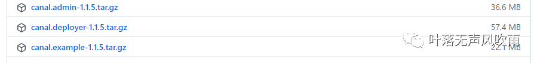

上传到linux虚拟机 ，查看解压

```shell
[anchu@localhost software]$ pwd/home/anchu/software
[anchu@localhost software]$mkdir canal
[anchu@localhost software]$ ls
canal  canal.example-1.1.5.tar.gz  mysql-5.7.24-linux-glibc2.12-x86_64.tar.gzcanal.deployer-1.1.5.tar.gz  mysql-5.7.24
[anchu@localhost software]$cd canal
[anchu@localhost software]tar xzvf ../canal.deployer-1.1.5.tar.gz
[anchu@localhost software]tar xzvf ../canal.example-1.1.5.tar.gz
[anchu@localhost software]tar xzvf ../canal.admin-1.1.5.tar.gz
[anchu@localhost canal]$ ls
bin  conf  lib  logs  plugin
```

#### **（2）数据库配置**

查看当前配置，可以看到*binlog*未开启，需要修改配置开启binlog

```
[anchu@localhost support-files]$ mysql -u root -P 3306 -h 192.168.120.110 -D test -pEnter password: Reading table information for completion of table and column namesYou can turn off this feature to get a quicker startup with -AWelcome to the MySQL monitor. 
Commands end with ; or \g.Your MySQL connection id is 24Server version: 5.7.24 MySQL Community Server (GPL)Copyright (c) 2000, 2018, Oracle and/or its affiliates. All rights reserved.Oracle is a registered trademark of Oracle Corporation and/or itsaffiliates. Other names may be trademarks of their respectiveowners.Type 'help;' or '\h' for help. Type '\c' to clear the current input statement.
mysql> show variables like '%log_bin%';
+---------------------------------+-------+
| Variable_name                   | Value |
+---------------------------------+-------+
| log_bin                         | OFF   |
| log_bin_basename                |       |
| log_bin_index                   |       |
| log_bin_trust_function_creators | OFF   |
| log_bin_use_v1_row_events       | OFF   |
| sql_log_bin                     | ON    |
+---------------------------------+-------+
6 rows in set (0.03 sec)mysql>
```

修改需要被同步的数据库 /home/anchu/software/mysql-5.7.24/my.cfg配置，有则修改无则添加

```shell
#启动时，使用的copy到/home/anchu/software/mysql-5.7.24的my.cfg 
vi /home/anchu/software/mysql-5.7.24/my.cfg
[mysqld]
log-bin=mysql-bin # 开启 binlog
binlog-format=ROW # 选择 ROW 模式
server_id=1 # 配置 MySQL replaction 需要定义，不要和 canal 的 slaveId 重复
binlog-rows-query-log-events  = 1  #查看完整的sql语句
```

重启mysql，使配置生效

```shell
[anchu@localhost support-files]$ jobs[1]
+  Running                 /bin/sh /home/anchu/software/mysql-5.7.24/bin/mysqld_safe --defaults-file=/home/anchu/software/mysql-5.7.24/my.cnf 2>&1 > /dev/null &
[anchu@localhost support-files]$ 
[anchu@localhost support-files]$ kill -9 %1
[anchu@localhost support-files]$  /home/anchu/software/mysql-5.7.24/bin/mysqld_safe --defaults-file=/home/anchu/software/mysql-5.7.24/my.cnf 2>&1 > /dev/null
&[1] 82914
[anchu@localhost support-files]$ ps -ef |grep mysql

anchu     82914  80040  0 20:47 pts/1    00:00:00 /bin/sh /home/anchu/software/mysql-5.7.24/bin/mysqld_safe --defaults-file=/home/anchu/software/mysql-5.7.24/my.cnf

anchu     83155  82914  3 20:47 pts/1    00:00:00 /home/anchu/software/mysql-5.7.24/bin/mysqld --defaults-file=/home/anchu/software/mysql-5.7.24/my.cnf --basedir=/home/anchu/software/mysql-5.7.24 --datadir=/home/anchu/software/mysql-5.7.24/data --plugin-dir=/home/anchu/software/mysql-5.7.24/lib/plugin --log-error=/home/anchu/software/mysql-5.7.24/data/mariadb.log --pid-file=/home/anchu/software/mysql-5.7.24/data/mariadb.pid --socket=/home/anchu/software/mysql-5.7.24/data/mysql.sock --port=3306
```

重新连接mysql查看配置

```shell
[anchu@localhost support-files]$ mysql -u root -P 3306 -h 192.168.120.110 -D test -p
Enter password: 
Reading table information for completion of table and column namesYou can turn off this feature to get a quicker startup with -AWelcome to the MySQL monitor.  
Commands end with ; or \g.
Your MySQL connection id is 2Server version: 5.7.24-log 
MySQL Community Server (GPL)Copyright (c) 2000, 2018, Oracle and/or its affiliates. All rights reserved.Oracle is a registered trademark of Oracle Corporation and/or itsaffiliates. 
Other names may be trademarks of their respectiveowners.
Type 'help;' or '\h' for help. Type '\c' to clear the current input statement.

mysql> show tables;
+----------------+| Tables_in_test |
+----------------+| test           |
+----------------+1 row in set (0.00 sec)
mysql> show variables like '%log_bin%';
+---------------------------------+--------------------------------------------------------+| Variable_name                   | Value                                                  |+---------------------------------+-----------------------------------------------
| log_bin                         | ON                                                     |
| log_bin_basename                | /home/anchu/software/mysql-5.7.24/data/mysql-bin       |
| log_bin_index                   | /home/anchu/software/mysql-5.7.24/data/mysql-bin.index |
| log_bin_trust_function_creators | OFF                                                    
| log_bin_use_v1_row_events       | OFF                                                    | sql_log_bin                     | ON                                                    |+---------------------------------+--------------------------------------------------------+6 rows in set (0.01 sec)mysql>
```

查看*binlog*日志目录及文件

```shell
[anchu@localhost support-files]$ ll /home/anchu/software/mysql-5.7.24/data/*bin*

-rw-r-----. 1 anchu anchu 1431 Apr 26 23:23 /home/anchu/software/mysql-5.7.24/data/mysql-bin.000001
-rw-r-----. 1 anchu anchu   19 Apr 26 20:47 /home/anchu/software/mysql-5.7.24/data/mysql-bin.index
```

创建一个有相关权限的mysql slave账号，用户名canal,密码canal

```
# 创建账号
CREATE USER canal IDENTIFIED WITH MYSQL_NATIVE_PASSWORD BY 'canal';
# 给账号赋权限
GRANT SELECT, REPLICATION SLAVE, REPLICATION CLIENT ON *.* TO 'canal'@'%'; 
# 刷新
FLUSH PRIVILEGES;
```

创建和测试canal账号

```shell
mysql> CREATE USER canal IDENTIFIED WITH MYSQL_NATIVE_PASSWORD BY 'canal';
Query OK, 0 rows affected (0.02 sec)
mysql> GRANT SELECT, REPLICATION SLAVE, REPLICATION CLIENT ON *.* TO 'canal'@'%'; 
Query OK, 0 rows affected (0.01 sec)
mysql> FLUSH PRIVILEGES;
Query OK, 0 rows affected (0.02 sec)
mysql> exit
Bye
[anchu@localhost support-files]$ mysql -u canal -P 3306 -h 192.168.120.110 -D test -p
Enter password: 
Reading table information for completion of table and column namesYou can turn off this feature to get a quicker startup with -AWelcome to the MySQL monitor.
Commands end with ; or \g.
Your MySQL connection id is 3Server version: 5.7.24-log MySQL Community Server (GPL)
mysql> exit
```

#### **（3）canal的工作原理**

- canal 模拟 MySQL slave 的交互协议，伪装自己为 MySQL slave ，向 MySQL master 发送dump 协议
- MySQL master 收到 dump 请求，开始推送 binary log 给 slave (即 canal )
- canal 解析 binary log 对象(原始为 byte 流)

#### **（4）canal配置**

修改instance 配置文件instance.properties

```shell
[anchu@localhost example]$cd  /home/anchu/software/canal/conf/example
[anchu@localhost example]$ vi instance.properties
################################################### 
mysql serverId , v1.0.26+ will autoGen
# canal.instance.mysql.slaveId=0
# enable gtid use true/false
canal.instance.gtidon=false
# position info数据库实例地址，主数据库,注意端口canal.instance.master.address=192.168.120.110:3306
canal.instance.master.journal.name=
canal.instance.master.position=
canal.instance.master.timestamp=
canal.instance.master.gtid=
# rds oss binlog
canal.instance.rds.accesskey=
canal.instance.rds.secretkey=
canal.instance.rds.instanceId=
# table meta tsdb infocanal.instance.tsdb.enable=true
#canal.instance.tsdb.url=jdbc:mysql://127.0.0.1:3306/canal_tsdb
#canal.instance.tsdb.dbUsername=canal
#canal.instance.tsdb.dbPassword=canal
#canal.instance.standby.address =
#canal.instance.standby.journal.name =
#canal.instance.standby.position =
#canal.instance.standby.timestamp =
#canal.instance.standby.gtid=
# username/password  数据库账号密码
canal.instance.dbUsername=canal
canal.instance.dbPassword=canal
canal.instance.connectionCharset = UTF-8
# enable druid Decrypt database password
canal.instance.enableDruid=false
#canal.instance.pwdPublicKey=MFwwDQYJKoZIhvcNAQEBBQADSwAwSAJBALK4BUxdDltRRE5/zXpVEVPUgunvscYFtEip3pmLlhrWpacX7y7GCMo2/JM6LeHmiiNdH1FWgGCpUfircSwlWKUCAwEAAQ==
# table regex 白名单过滤canal.instance.filter.regex=.*\\..*
# table black regexcanal.instance.filter.black.regex=mysql\\.slave_.*
# table field filter(format:schema1.tableName1:field1/field2,schema2.tableName2:field1/field2)#
canal.instance.filter.field=test1.t_product:id/subject/keywords,test2.t_company:id/name/contact/ch
# table field black filter(format:schema1.tableName1:field1/field2,schema2.tableName2:field1/field2)
#canal.instance.filter.black.field=test1.t_product:subject/product_image,test2.t_company:id/name/contact/ch
# mq config  定义主题
canal.mq.topic=example
# dynamic topic route by schema or table regex
#canal.mq.dynamicTopic=mytest1.user,mytest2\\..*,.*\\..*
#消息分区
canal.mq.partition=0  
# hash partition config
#canal.mq.partitionsNum=3
#canal.mq.partitionHash=test.table:id^name,.*\\..*
#canal.mq.dynamicTopicPartitionNum=test.*:4,mycanal:6#################################################
```

修改canal 配置文件canal.properties,暂时不用MQ,不用注册中心，不用admin


```shell
[anchu@localhost conf]$ cd /home/anchu/software/canal/conf
[anchu@localhost conf]$ vi canal.properties
#主要改动
#canal server的唯一标识，没有实际意义，但是我们建议同一个cluster上的不同节点，其ID尽可能唯一
canal.id =110
#canal server因为binding的本地IP地址，建议使用内网（唯一，集群可见，consumer可见）IP地址，比如“10.0.1.21”。
#此IP主要为canalServer提供TCP服务而使用，将会被注册到ZK中,Consumer将与此IP建立连接。
canal.ip =192.168.120.110
# register ip to zookeeper
canal.register.ip =
#cannal server的TCP端口
canal.port = 11111
canal.metrics.pull.port = 11112
# canal instance user/passwd
canal.user = canal
canal.passwd = canal
# canal admin config
#canal.admin.manager = 127.0.0.1:8089
canal.admin.port = 11110
canal.admin.user = admin
canal.admin.passwd = 4ACFE3202A5FF5CF467898FC58AAB1D615029441
# admin auto register
#canal.admin.register.auto = true
#canal.admin.register.cluster =
#canal.admin.register.name =
#zookeeper地址，可集群
canal.zkServers =
# flush data to zk
canal.zookeeper.flush.period = 1000
canal.withoutNetty = false
# tcp, kafka, rocketMQ, rabbitMQ
canal.serverMode = tcp
# flush meta cursor/parse position to file
#canal将parse、position数据写入的本地文件目录 
canal.file.data.dir = ${canal.conf.dir}
canal.file.flush.period = 1000
## memory store RingBuffer size, should be Math.pow(2,n)
canal.instance.memory.buffer.size = 16384
## memory store RingBuffer used memory unit size , default 1kb
canal.instance.memory.buffer.memunit = 1024 
## meory store gets mode used MEMSIZE or ITEMSIZE
canal.instance.memory.batch.mode = MEMSIZE
canal.instance.memory.rawEntry = true
# table meta tsdb info
canal.instance.tsdb.enable = true
canal.instance.tsdb.dir = ${canal.file.data.dir:../conf}/${canal.instance.destination:}
canal.instance.tsdb.url = jdbc:h2:${canal.instance.tsdb.dir}/h2;CACHE_SIZE=1000;MODE=MYSQL;
canal.instance.tsdb.dbUsername = canal
canal.instance.tsdb.dbPassword = canal
# dump snapshot interval, default 24 hour
canal.instance.tsdb.snapshot.interval = 24
# purge snapshot expire , default 360 hour(15 days)
canal.instance.tsdb.snapshot.expire = 360
```

#### **（5）启动canal，测试**

```shell
[anchu@localhost bin]$ pwd/home/anchu/software/canal/bin
[anchu@localhost bin]$ ./canal-startup.sh 
cd to /home/anchu/software/canal/bin for workaround relative pathLOG CONFIGURATION : /home/anchu/software/canal/bin/../conf/logback.xml
#查看进程
[anchu@localhost bin]$ ps -ef |grep canal
anchu     83236  80040  0 20:51 pts/1    00:00:00 mysql -u canal -P 3306 -h 192.168.120.110 -D test -p 
anchu     84725      1  8 23:10 pts/2    00:00:04 /usr/bin/java -server -Xms2048m -Xmx3072m -Xmn1024m -XX:SurvivorRatio=2 -XX:PermSize=96m.........省略号...........
#停止canal
[anchu@localhost canal]$ ./bin/canal-stop.sh
localhost.localdomain: stopping canal 84725 ... Oook! cost:1
#查看日志
[anchu@localhost canal]$ tail -f ../logs/canal/canal_stdout.log 
2022-04-26 23:20:22.419 [destination = example , address = /192.168.120.110:3306 , EventParser] INFO  c.alibaba.otter.canal.parse.driver.mysql.MysqlConnector - connect MysqlConnection to /192.168.120.110:3306...
2022-04-26 23:20:22.438 [destination = example , address = /192.168.120.110:3306 , EventParser] INFO  c.alibaba.otter.canal.parse.driver.mysql.MysqlConnector - handshake initialization packet received, prepare the client authentication packet to send2022-04-26 23:20:22.439 [destination = example , address = /192.168.120.110:3306 , EventParser] INFO  c.alibaba.otter.canal.parse.driver.mysql.MysqlConnector - client authentication packet is sent out.
2022-04-26 23:20:22.440 [destination = example , address = /192.168.120.110:3306 , EventParser] INFO  c.alibaba.otter.canal.parse.driver.mysql.MysqlConnector - disConnect MysqlConnection to /192.168.120.110:3306...2022-04-26 23:20:22.441 [destination = example , address = /192.168.120.110:3306 , EventParser] INFO  c.alibaba.otter.canal.parse.driver.mysql.MysqlConnector - connect MysqlConnection to /192.168.120.110:3306...
2022-04-26 23:20:22.444 [destination = example , address = /192.168.120.110:3306 , EventParser] INFO  c.alibaba.otter.canal.parse.driver.mysql.MysqlConnector - handshake initialization packet received, prepare the client authentication packet to send
2022-04-26 23:20:22.445 [destination = example , address = /192.168.120.110:3306 , EventParser] INFO  c.alibaba.otter.canal.parse.driver.mysql.MysqlConnector - client authentication packet is sent out.
2022-04-26 23:20:22.540 [destination = example , address = /192.168.120.110:3306 , EventParser] INFO  c.a.otter.canal.parse.inbound.mysql.MysqlConnection - Register slave RegisterSlaveCommandPacket[reportHost=192.168.120.110,reportPort=47134,reportUser=canal,reportPasswd=canal,serverId=1778384897,command=21]
2022-04-26 23:20:22.545 [destination = example , address = /192.168.120.110:3306 , EventParser] INFO  c.a.otter.canal.parse.inbound.mysql.MysqlConnection - COM_BINLOG_DUMP with position:BinlogDumpCommandPacket[binlogPosition=4,slaveServerId=1778384897,binlogFileName=mysql-bin.000001,command=18]
2022-04-26 23:20:22.546 [MultiStageCoprocessor-other-example-0] INFO  com.taobao.tddl.dbsync.binlog.LogEvent - common_header_len= 19, number_of_event_types= 38
```

测试

```shell
# mysql增加数据[anchu@localhost support-files]$ mysql -u root -P 3306 -h 192.168.120.110 -D test -p
Enter password: 123456
mysql> insert into test(id,name) values(1,"t1");
Query OK, 1 row affected (0.04 sec)
mysql> 
mysql> insert into test(id,name) values(2,"t2");
Query OK, 1 row affected (0.02 sec)
mysql> \q
Bye
#查看canal本地同步数据
[anchu@localhost example]$ cat ../canal.properties |grep h2
canal.instance.tsdb.url = jdbc:h2:${canal.instance.tsdb.dir}/h2;CACHE_SIZE=1000;MODE=MYSQL;
canal.instance.tsdb.spring.xml = classpath:spring/tsdb/h2-tsdb.xml
[anchu@localhost example]$ ll -h ../../conf/example/
total 120K
-rw-rw-r--. 1 anchu anchu 116K Apr 26 23:21 h2.mv.db
-rwxrwxr-x. 1 anchu anchu 2.2K Apr 26 23:19 instance.properties
```

需要注意canal.properties配置文件的几个相对路径配置，方便查看数据

```shell
# 使用本地文件创建的连接
canal.conf.dir = ../conf  #/home/anchu/software/canal/conf
canal.file.data.dir= ${canal.conf.dir}  #/home/anchu/software/canal/conf
canal.instance.tsdb.dir = ${canal.file.data.dir:../conf}/${canal.instance.destination:}  
# /home/anchu/software/canal/conf/example
canal.instance.tsdb.url = jdbc:h2:${canal.instance.tsdb.dir}/h2;CACHE_SIZE=1000;MODE=MYSQL;
# 及上面的h2文件为什么会在 /home/anchu/software/canal/conf/example/h2.mv.db 目录，是从这里配置的
```

可以将文件copy到windows并用dbeaver打开是否有添加的数据。

可以下载客户端去查询 https://dbschema.com/download.html

也可以下载驱动jdbc查询如下：

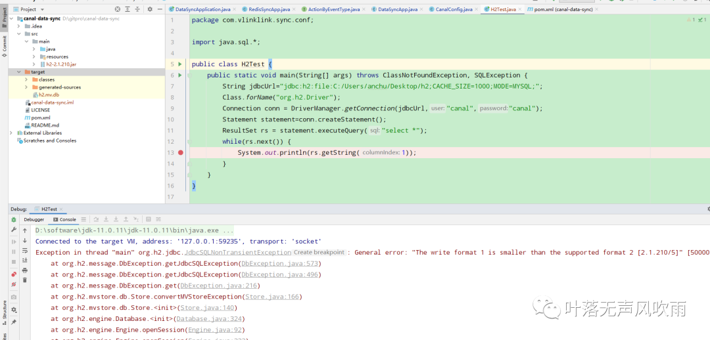

出现异常：General error: "The write format 1 is smaller than the supported format 2 [2.1.210/5]" 

原因canal的h2版本和测试代码的版本不一致，将canal的h2包copy到测试代码，再次测试

```shell
[anchu@localhost lib]$ pwd/home/anchu/software/canal/lib
[anchu@localhost lib]$ ls |grep h2
h2-1.4.196.jar
```


或者查看生成的h2.mv.db文件，查询test和insert关键字，可以看到数据更新信息同步到h2中


发现找不到test表，明明h2文件看到了关键字，却查不到这是为什么呢？

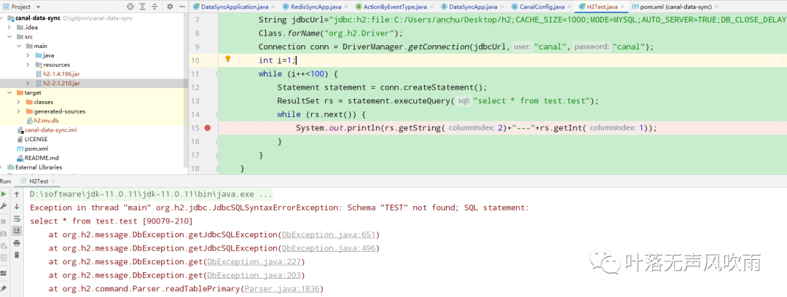

**那是因为，canal 使用 tsdb 保存保存表结构 meta的信息变化，本地使用默认使用的 h2db，可以配置为mysql**

参考文档：https://blog.csdn.net/wfh45678/article/details/118546668

由于版本问题，修改canal lib包的h2版本为2.1.210，然后就可以通过h2查看别结构元数据信息

```shell
[anchu@localhost lib]$ mv h2-1.4.196.jar h2-1.4.196.jarold
[anchu@localhost lib]$ mv h2-2.1.210.jarold h2-2.1.210.jar
[anchu@localhost lib]$ ll |grep h2
-rwxrwxr-x. 1 anchu anchu 1821816 Oct 13  2017 h2-1.4.196.jarold
-rw-r--r--. 1 anchu anchu 2531600 Jan 17 01:12 h2-2.1.210.jar
```

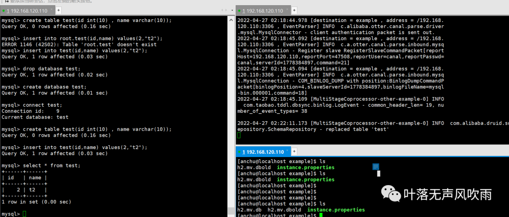

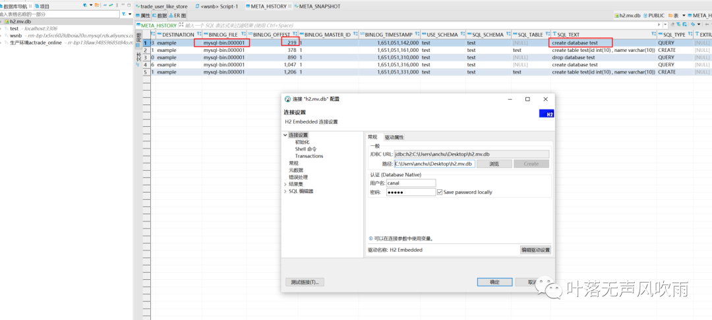

由上图可以以看到，元数据信息变化表，会存储ddl语句相关日志文件及其偏移量。

我们可以借助mysql提供的mysqlbinlog工具进行查看，操作如下：

```shell
mysqlbinlog --base64-output=decode-rows --start-position="219" ~/software/mysql-5.7.24/data/mysql-bin.000001
/*!50530 
SET @@SESSION.PSEUDO_SLAVE_MODE=1*/;/*!50003 
SET @OLD_COMPLETION_TYPE=@@COMPLETION_TYPE,COMPLETION_TYPE=0*/;DELIMITER /*!*/;
# at 219
#220427  2:19:02 server id 1  end_log_pos 313 CRC32 0xacaaf5d4   Query  thread_id=7  exec_time=0  error_code=0SET TIMESTAMP=1651051142/*!*/;
SET @@session.pseudo_thread_id=7/*!*/;
SET @@session.foreign_key_checks=1, 
@@session.sql_auto_is_null=0,
@@session.unique_checks=1, 
@@session.autocommit=1/*!*/;
SET @@session.sql_mode=1075838976/*!*/;
SET @@session.auto_increment_increment=1, 
@@session.auto_increment_offset=1/*!*/;/*!\C utf8 *//*!*/;
SET @@session.character_set_client=33,
@@session.collation_connection=33,
@@session.collation_server=8/*!*/;
SET @@session.lc_time_names=0/*!*/;
SET @@session.collation_database=DEFAULT/*!*/;create database test/*!*/;
# at 313............
```

如图：可以看到219开始确实紧跟着create database test

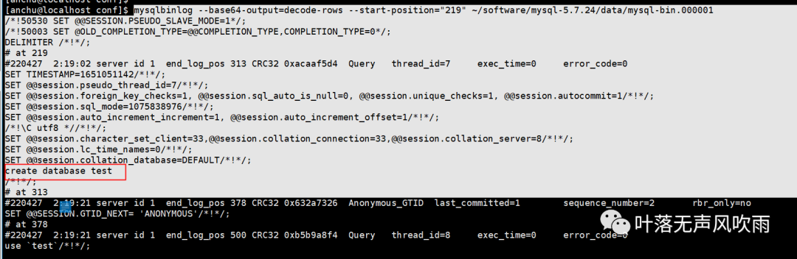

**扩展**

**binlog日志类型**

- statement：记录执行的语句；对于更新而言不需要记录大量的行数据，但是有些信息无法记录比如随机数或者当前时间，所以还需要一些上下文信息。
- row：只记录修改的行，不用上下文，但是数据量可能较大。
- mixed：对于不需要上下文的语句，使用statement，否则使用row，所以会 同时存在两种格式；

**如何查看binlog**

- 如果在mysql客户端内，可以使用show binlog events;这条命令会显示第一个binlog文件内的事件；当然可以指定binlog文件，比如：show binlog events in 'xxx-bin.0000N'。另外也可以使用show binary logs命令查看当前所有binlog文件名。
- 如果不在mysql客户端，可以使用mysql提供的mysqlbinlog命令。比如：mysqlbinlog -v --base64-output=decode-rows --start-position="156" ~/mysql/master/data/mysql-bin.000004
- 简单记一下几个参数的含义：
- -v：将row模式的反解为statement模式，方便查阅；
- --base64-output：如果不加，默认输出是base64格式的，加上这个参数，输出是base64解密后的；
- --start-position：指定开始位置，当然也可以指定结束位置；
- 另外还有一些其他参数也可以指定，比如库名以及表名等。

**binlog事件类型**

- 总共有3个版本：v1，v2和v4。mysql5以上使用过的v4。这里只记录这几个关键的事件类型：
- QUERY_EVENT：在statement模式下，增删改的语句都会生成该事件；在row模式下，DDL的改动会生成该事件;
- ROTATE_EVENT：新的binlog文件生成时，会记录该事件，内容就是下一个binlog文件的文件名；
- FORMAT_DESCRIPTION_EVENT：每一个binlog文件的起始事件，描述文件属性；
- TABLE_MAP_EVENT：在row模式下会有，每一个更新事件都会先有一个TABLE_MAP_EVENT事件，用于记录表的一些信息。
- WRITE_ROWS_EVENT：在row模式下会有，insert；
- UPDATE_ROWS_EVENT：在row模式下会有，update；
- DELETE_ROWS_EVENT：在row模式下会有，delete

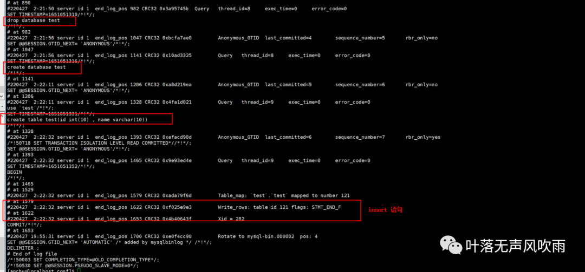


参考文档：

开源实战 | Canal生产环境常见问题总结与分析

https://cloud.tencent.com/developer/article/1645881

【MySQL（二十一）】binlog 事件

https://blog.csdn.net/u010900754/article/details/108458028

#### **（6）canal client测试**

测试消费，canal开源项目地址中有个测试用例，只需要修改ip然后启动

https://github.com/alibaba/canal/blob/master/example/src/main/java/com/alibaba/otter/canal/example/SimpleCanalClientTest.java

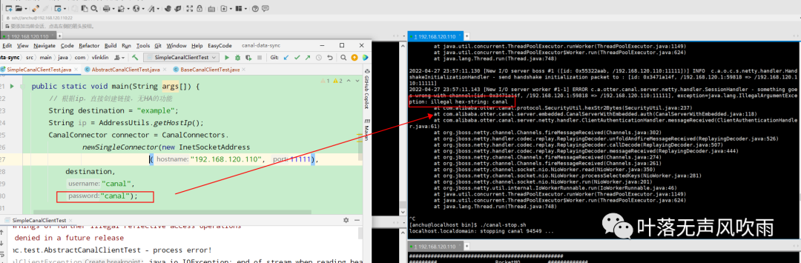

启动失败，原因查看canal日志，是因为密码校验不能识别canal，所以需要修改canal.properties密码为二进制加密的。

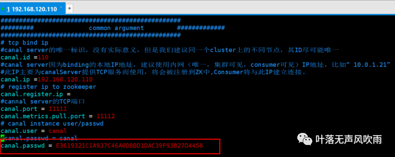

再次启动消费成功，可以从日志中看到增量的sql

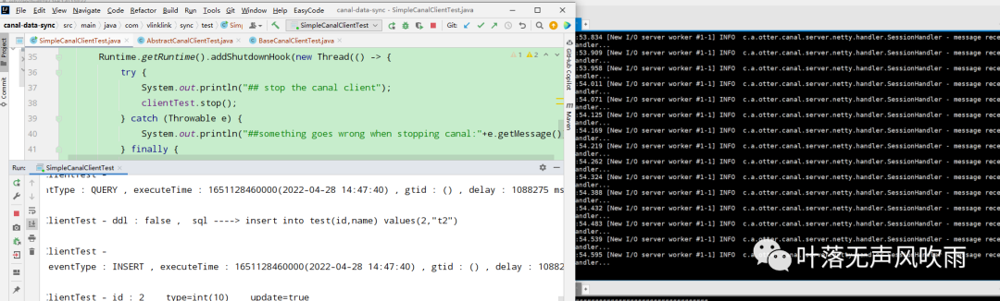

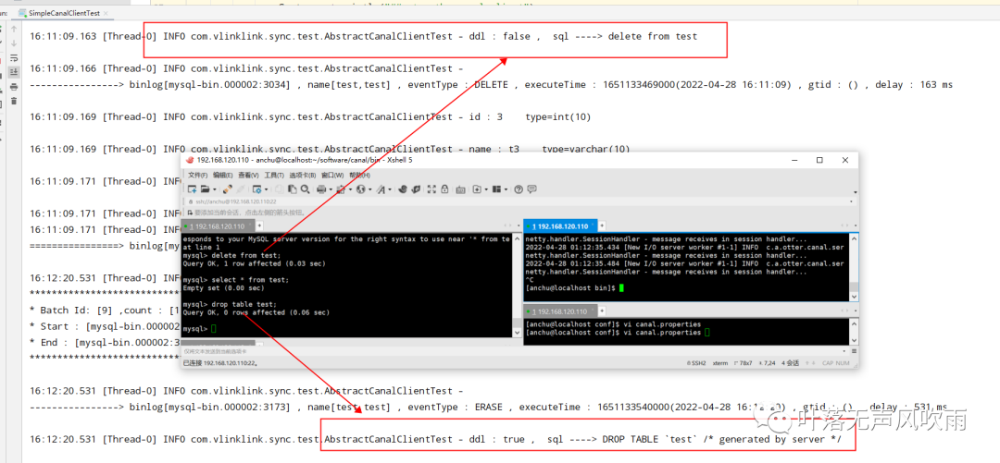

分享一个canal +springboot整合的小项目，git地址：

https:*//github.com/zfsndtl/canal-data-sync*


