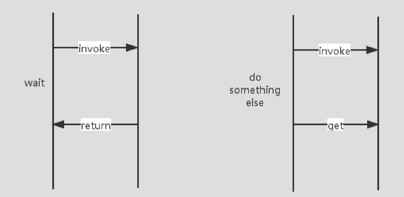
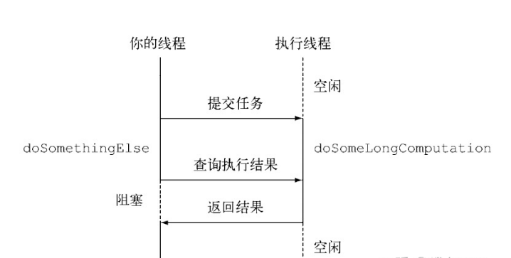

# 12. Java1.8新特性 CompletableFuture从入门到放弃

参考文档：

```java
https://blog.csdn.net/qq_31865983/article/details/106137777 Java8 CompletableFuture 用法全解
https://zhuanlan.zhihu.com/p/344431341  CompletableFuture用法详解
```

 CompletableFuture实现了CompletionStage接口和Future接口，前者是对后者的一个扩展，增加了异步回调、流式处理、多个Future组合处理的能力，使Java在处理多任务的协同工作时更加顺畅便利。

## 一.Future

### 1.Future.submit

常用的线程池接口类ExecutorService，其中execute方法的返回值是void，即无法获取异步任务的执行状态，3个重载的submit方法的返回值是Future，可以据此获取任务执行的状态和结果，示例如下：

```java
public class CompletableFutureDemo3 {
    public static void main(String[] args) throws ExecutionException, InterruptedException {
        // 创建异步执行任务:
        Stopwatch  stopwatch=Stopwatch.createStarted();
        ExecutorService executorService= Executors.newSingleThreadExecutor();
        Future<Double> cf = executorService.submit(()->{
            System.out.println(Thread.currentThread()+" start,time->"+System.currentTimeMillis());
            try {
                Thread.sleep(2000);
            } catch (InterruptedException e) {
            }
            if(false){
                throw new RuntimeException("test");
            }else{
                System.out.println(Thread.currentThread()+" exit,time->"+System.currentTimeMillis());
                return 1.2;
            }
        });
        System.out.println("main thread start,time->"+System.currentTimeMillis()+"执行时间:"+stopwatch.elapsed(TimeUnit.MILLISECONDS)+"毫秒");
        //等待子任务执行完成,如果已完成则直接返回结果
        //如果执行任务异常，则get方法会把之前捕获的异常重新抛出
        System.out.println("run result->"+cf.get());
        System.out.println("main thread exit,time->"+System.currentTimeMillis()+"执行时间:"+stopwatch.elapsed(TimeUnit.MILLISECONDS)+"毫秒");
    }
}
```

执行结果如下：

```java
main thread start,time->1659491600371
Thread[pool-1-thread-1,5,main] start,time->1659491600372执行时间:3毫秒
Thread[pool-1-thread-1,5,main] exit,time->1659491602402
run result->1.2
main thread exit,time->1659491602410 执行时间:2044毫秒
```

模拟异常：将上述用例中if(false)改成if(true) ，执行结果如下：

```java
public class CompletableFutureDemo3 {
    public static void main(String[] args) throws ExecutionException, InterruptedException {
        // 创建异步执行任务:
        Stopwatch  stopwatch=Stopwatch.createStarted();
        ExecutorService executorService= Executors.newSingleThreadExecutor();
        Future<Double> cf = executorService.submit(()->{
            System.out.println(Thread.currentThread()+" start,time->"+System.currentTimeMillis());
            try {
                Thread.sleep(2000);
            } catch (InterruptedException e) {
            }
            if(true){
                throw new RuntimeException("test");
            }else{
                System.out.println(Thread.currentThread()+" exit,time->"+System.currentTimeMillis());
                return 1.2;
            }
        });
        System.out.println("main thread start,time->"+System.currentTimeMillis()+"执行时间:"+stopwatch.elapsed(TimeUnit.MILLISECONDS)+"毫秒");
        //等待子任务执行完成,如果已完成则直接返回结果
        //如果执行任务异常，则get方法会把之前捕获的异常重新抛出
        System.out.println("run result->"+cf.get());
        System.out.println("main thread exit,time->"+System.currentTimeMillis()+"执行时间:"+stopwatch.elapsed(TimeUnit.MILLISECONDS)+"毫秒");
    }
}
```

异常打印

```java
D:\software\jdk-11.0.11\jdk-11.0.11\bin\java.exe "-javaagent:D:\Program Files\JetBrains\IntelliJ IDEA 2021.2.2\lib\idea_rt.jar=60326:D:\Program Files\JetBrains\IntelliJ IDEA 2021.2.2\bin" -Dfile.encoding=UTF-8 @C:\Users\anchu\AppData\Local\Temp\idea_arg_file1849447106 com.anchu.analyse.test.CompletableFutureDemo3
main thread start,time->1659491648940执行时间:4毫秒
Thread[pool-1-thread-1,5,main] start,time->1659491648941
Exception in thread "main" java.util.concurrent.ExecutionException: java.lang.RuntimeException: test
	at java.base/java.util.concurrent.FutureTask.report(FutureTask.java:122)
	at java.base/java.util.concurrent.FutureTask.get(FutureTask.java:191)
	at com.anchu.analyse.test.CompletableFutureDemo3.main(CompletableFutureDemo3.java:28)
Caused by: java.lang.RuntimeException: test
	at com.anchu.analyse.test.CompletableFutureDemo3.lambda$main$0(CompletableFutureDemo3.java:19)
	at java.base/java.util.concurrent.FutureTask.run(FutureTask.java:264)
	at java.base/java.util.concurrent.ThreadPoolExecutor.runWorker(ThreadPoolExecutor.java:1128)
	at java.base/java.util.concurrent.ThreadPoolExecutor$Worker.run(ThreadPoolExecutor.java:628)
	at java.base/java.lang.Thread.run(Thread.java:834)
```

Future接口在Java5中被引入，设计初衷是对将来某个时刻会产生的结果进行建模。它建模了一种异步运算，返回一个执行结果的引用，当运算结束后，这个引用被返回给调用方。在Future中触发那些潜在耗时的操作完成。
如下图： 我们从最初的串行操作变成了并行，在异步的同时，我们还可以做其他事情来节约程序运行时间。



### 2.Future接口的局限性

当我们得到包含结果的Future时，我们可以使用get方法**等待线程完成**并获取返回值，注意我加粗的地方，Future的**get()** 方法会阻塞主线程。Future文档原文如下

> A {@code Future} represents the result of an asynchronous computation. Methods are provided to check if the computation is complete, to wait for its completion, and to retrieve the result of the computation.
>
> {@code Future}代表异步*计算的结果。提供了一些方法来检查计算是否完成，等待其完成并检索计算结果。

### 3.Future执行耗时任务

由此我们得知，Future获取得线程执行结果前，我们的主线程get()得到结果需要一直阻塞等待，即使我们使用isDone()方法轮询去查看线程执行状态，但是这样也非常浪费cpu资源。



当Future的线程进行了一个非常耗时的操作，那我们的主线程也就阻塞了。 当我们在简单业务上，**可以使用Future的另一个重载方法get(long,TimeUnit)来设置超时时间，避免我们的主线程被无穷尽地阻塞**。 不过，有没有更好的解决方案呢？

不仅如此，当我们在碰到一下业务场景的时候，单纯使用Future接口或者FutureTask类并不能很好地完成以下我们所需的业务

- 将两个异步计算合并为一个，这两个异步计算之间相互独立，同时第二个又依赖于第一个的结果
- 等待Future集合种的所有任务都完成。
- 仅等待Future集合种最快结束的任务完成（有可能因为他们试图通过不同的方式计算同一个值），并返回它的结果。
- 通过编程方式完成一个Future任务的执行（即以手工设定异步操作结果的方式）。
- 应对Future的完成时间（即当Future的完成时间完成时会收到通知，并能使用Future的计算结果进行下一步的的操作，不只是简单地阻塞等待操作的结果）

## 二.CompletableFuture

### 1.CompletableFuture概述

#### 1.1 什么是CompletableFuture

在Java 8中, 新增加了一个包含50个方法左右的类: CompletableFuture，结合了Future的优点，提供了非常强大的Future的扩展功能，可以帮助我们简化异步编程的复杂性，提供了函数式编程的能力，可以通过回调的方式处理计算结果，并且提供了转换和组合CompletableFuture的方法。

**CompletableFuture被设计在Java中进行异步编程。异步编程意味着在主线程之外创建一个独立的线程，与主线程分隔开，并在上面运行一个非阻塞的任务，然后通知主线程进展，成功或者失败。**

通过这种方式，你的**主线程不用为了任务的完成而阻塞/等待，你可以用主线程去并行执行其他的任务**。 使用这种并行方式，极大地提升了程序的表现。

#### 1.2 使用CompletableFuture场景

- 执行比较耗时的操作时，尤其是那些依赖一个或多个远程服务的操作，使用异步任务可以改善程序的性能，加快程序的响应速度
- 使用CompletableFuture类，它提供了异常管理的机制，让你有机会抛出、管理异步任务执行种发生的异常
- 如果这些异步任务之间相互独立，或者他们之间的的某一些的结果是另一些的输入，你可以讲这些异步任务构造或合并成一个

### 2.CompletableFuture API

#### 2.1 实例化CompletableFuture

```java
public static <U> CompletableFuture<U> supplyAsync(Supplier<U> supplier);
public static <U> CompletableFuture<U> supplyAsync(Supplier<U> supplier, Executor executor);

public static CompletableFuture<Void> runAsync(Runnable runnable);
public static CompletableFuture<Void> runAsync(Runnable runnable, Executor executor);
```

有两种格式，一种是supply开头的方法，一种是run开头的方法

- supply开头：这种方法，可以返回异步线程执行之后的结果
- run开头：这种不会返回结果，就只是执行线程任务

或者可以通过一个简单的无参构造器

```
CompletableFuture<String> completableFuture = new CompletableFuture<String>();
```

**小贴士**：我们注意到，在实例化方法中，我们是可以指定Executor参数的，**当我们不指定的试话，我们所开的并行线程使用的是默认系统及公共线程池ForkJoinPool，而且这些线程都是守护线程**。我们在编程的时候需要谨慎使用守护线程，如果将我们普通的用户线程设置成守护线程，当我们的程序主线程结束，JVM中不存在其余用户线程，那么CompletableFuture的守护线程会直接退出，造成任务无法完成的问题，其余的包括守护线程阻塞问题我就不在本篇赘述。

#### 2.2 获取结果

同步获取结果

```java
public T    get()
public T    get(long timeout, TimeUnit unit)
public T    getNow(T valueIfAbsent)
public T    join()
```

**简单的例子**

```java
CompletableFuture<Integer> future = new CompletableFuture<>();
Integer integer = future.get();
```

**get()** 方法同样会阻塞直到任务完成，上面的代码，主线程会一直阻塞，因为这种方式创建的future从未完成。有兴趣的小伙伴可以打个断点看看，状态会一直是not completed

前两个方法比较通俗易懂，认真看完上面Future部分的小伙伴肯定知道什么意思。 **getNow()** 则有所区别，参数valueIfAbsent的意思是当计算结果不存在或者Now时刻没有完成任务，给定一个确定的值。

**join()** 与**get()** 区别在于**join()** 返回计算的结果或者抛出一个unchecked异常(CompletionException)，而**get()** 返回一个具体的异常.

#### 异步回调

#### 2.3 计算完成后续操作1——complete

 whenComplete是当某个任务执行完成后执行的回调方法，会将执行结果或者执行期间抛出的异常传递给回调方法，如果是正常执行则异常为null，回调方法对应的CompletableFuture的result和该任务一致，如果该任务正常执行，则get方法返回执行结果，如果是执行异常，则get方法抛出异常。


```java
public CompletableFuture<T>     whenComplete(BiConsumer<? super T,? super Throwable> action)
public CompletableFuture<T>     whenCompleteAsync(BiConsumer<? super T,? super Throwable> action)
public CompletableFuture<T>     whenCompleteAsync(BiConsumer<? super T,? super Throwable> action, Executor executor)
public CompletableFuture<T>     exceptionally(Function<Throwable,? extends T> fn)
```

**方法1和2的区别在于是否使用异步处理，2和3的区别在于是否使用自定义的线程池**，前三个方法都会提供**一个返回结果和可抛出异常**，我们可以使用lambda表达式的来接收这两个参数，然后自己处理。 方法4：接收一个可抛出的异常，且必须return一个返回值，类型与钻石表达式种的类型一样，详见下文的**exceptionally()** 部分，更详细.举例如下：

```java
    //通过 ExecutorService  线程池
        ExecutorService executorService= Executors.newSingleThreadExecutor();
        // 创建异步执行任务:
        CompletableFuture cf5 = CompletableFuture.runAsync(()->{
            System.out.println(Thread.currentThread()+"CompletableFuture通过 ExecutorService  线程池及异常处理 start,time->"+System.currentTimeMillis()+"执行时间"+stopwatch.elapsed(TimeUnit.MILLISECONDS)+"毫秒");
            try {
                Thread.sleep(2000);
            } catch (InterruptedException e) {
            }
            if(false){
                throw new RuntimeException("test");
            }else{
                System.out.println(Thread.currentThread()+" exit,time->"+System.currentTimeMillis());
            }
        },executorService).whenCompleteAsync((result,throwable)->{
            System.out.println(Thread.currentThread()+"CompletableFuture通过 ExecutorService  线程池及异常处理  exit,time->"+System.currentTimeMillis()+"执行时间"+stopwatch.elapsed(TimeUnit.MILLISECONDS)+"毫秒");
            if(throwable!=null){
                throwable.printStackTrace();
            }
        });

//执行结果
java.util.concurrent.CompletionException: java.lang.RuntimeException: test
	at java.base/java.util.concurrent.CompletableFuture.encodeThrowable(CompletableFuture.java:314)
	at java.base/java.util.concurrent.CompletableFuture.completeThrowable(CompletableFuture.java:319)
	at java.base/java.util.concurrent.CompletableFuture$AsyncRun.run(CompletableFuture.java:1739)
	at java.base/java.util.concurrent.ThreadPoolExecutor.runWorker(ThreadPoolExecutor.java:1128)
	at java.base/java.util.concurrent.ThreadPoolExecutor$Worker.run(ThreadPoolExecutor.java:628)
	at java.base/java.lang.Thread.run(Thread.java:834)
Caused by: java.lang.RuntimeException: test
	at com.anchu.analyse.test.CompletableFutureDemo.lambda$main$5(CompletableFutureDemo.java:168)
	at java.base/java.util.concurrent.CompletableFuture$AsyncRun.run(CompletableFuture.java:1736)
	... 3 more
Exception in thread "main" java.util.concurrent.ExecutionException: 
```


#### 2.4 计算完成后续操作2——handle

```java
public <U> CompletableFuture<U>     handle(BiFunction<? super T,Throwable,? extends U> fn)
public <U> CompletableFuture<U>     handleAsync(BiFunction<? super T,Throwable,? extends U> fn)
public <U> CompletableFuture<U>     handleAsync(BiFunction<? super T,Throwable,? extends U> fn, Executor executor)
```

眼尖的小伙伴可能已经发现了，handle方法集和上面的complete方法集没有区别，同样有两个参数**一个返回结果和可抛出异常**，区别就在于返回值，没错，虽然同样返回CompletableFuture类型，但是里面的参数类型，handle方法是可以自定义的。

```java
// 开启一个异步方法
        CompletableFuture<List> future = CompletableFuture.supplyAsync(() -> {
            List<String> list = new ArrayList<>();
            list.add("语文");
            list.add("数学");
            // 获取得到今天的所有课程
            return list;
        });
        // 使用handle()方法接收list数据和error异常
        CompletableFuture<Integer> future2 = future.handle((list,error)-> {
            // 如果报错，就打印出异常
            error.printStackTrace();
            // 如果不报错，返回一个包含Integer的全新的CompletableFuture
            return list.size();
             // 注意这里的两个CompletableFuture包含的返回类型不同
        });
```

#### 2.5 计算完成的后续操作3——apply

```java
public <U> CompletableFuture<U>     thenApply(Function<? super T,? extends U> fn)
public <U> CompletableFuture<U>     thenApplyAsync(Function<? super T,? extends U> fn)
public <U> CompletableFuture<U>     thenApplyAsync(Function<? super T,? extends U> fn, Executor executor)
```

为什么这三个方法被称作，计算完成的后续操作2呢，因为apply方法和handle方法一样，都是结束计算之后的后续操作，唯一的不同是，handle方法会给出异常，可以让用户自己在内部处理，而apply方法**只有一个返回结果**，如果异常了，会被直接抛出，交给上一层处理。 如果不想每个链式调用都处理异常，那么就使用apply吧。

##### **supplyAsync / runAsync**

​     **supplyAsync表示创建带返回值的异步任务的**，相当于ExecutorService submit(Callable<T> task) 方法，**runAsync表示创建无返回值的异步任务**，相当于ExecutorService submit(Runnable task)方法，这两方法的效果跟submit是一样的

```java
    //2. 创建异步执行任务，有返回值--默认线程池
        CompletableFuture<Double> cf2 = CompletableFuture.supplyAsync(()->{
            System.out.println(Thread.currentThread()+"CompletableFuture 默认线程池,supplyAsync有返回值 start,time->"+System.currentTimeMillis()+"执行时间"+stopwatch.elapsed(TimeUnit.MILLISECONDS)+"毫秒");
            try {
                Thread.sleep(2000);
            } catch (InterruptedException e) {
            }
            if(false){
                throw new RuntimeException("test");
            }else{
                System.out.println(Thread.currentThread()+"CompletableFuture 默认线程池,supplyAsync有返回值 exit,time->"+System.currentTimeMillis()+"执行时间"+stopwatch.elapsed(TimeUnit.MILLISECONDS)+"毫秒");
                return 1.2;
            }
        });
        //等待子任务执行完成
        System.out.println("run result->"+cf2.get()+"执行时间"+stopwatch.elapsed(TimeUnit.MILLISECONDS)+"毫秒");
        System.out.println("main thread exit,time->"+System.currentTimeMillis()+"执行时间"+stopwatch.elapsed(TimeUnit.MILLISECONDS)+"毫秒");
        System.out.println("------------------------------------------------------------------------------------------------------------");

        //
        // 创建异步执行任务，无返回值
        CompletableFuture cf3 = CompletableFuture.runAsync(()->{
            System.out.println(Thread.currentThread()+"CompletableFuture 默认线程池,runAsync无返回值 start,time->"+System.currentTimeMillis()+"执行时间"+stopwatch.elapsed(TimeUnit.MILLISECONDS)+"毫秒");
            try {
                Thread.sleep(2000);
            } catch (InterruptedException e) {
            }
            if(false){
                throw new RuntimeException("test");
            }else{
                System.out.println(Thread.currentThread()+"CompletableFuture 默认线程池,runAsync无返回值 exit,time->"+System.currentTimeMillis()+"执行时间"+stopwatch.elapsed(TimeUnit.MILLISECONDS)+"毫秒");
            }
        });
        System.out.println("main thread start,time->"+System.currentTimeMillis()+"执行时间"+stopwatch.elapsed(TimeUnit.MILLISECONDS)+"毫秒");
        //等待子任务执行完成
        System.out.println("run result->"+cf3.get());
        System.out.println("main thread exit,time->"+System.currentTimeMillis()+"执行时间"+stopwatch.elapsed(TimeUnit.MILLISECONDS)+"毫秒");
        System.out.println("------------------------------------------------------------------------------------------------------------");
```

 这两方法各有一个重载版本，可以指定执行异步任务的Executor实现，如果不指定，默认使用ForkJoinPool.commonPool()，如果机器是单核的，则默认使用ThreadPerTaskExecutor，该类是一个内部类，每次执行execute都会创建一个新线程。测试用例如下：

```
  ForkJoinPool pool2=new ForkJoinPool();
        // 创建异步执行任务:
        CompletableFuture<Double> cf4 = CompletableFuture.supplyAsync(()->{
            System.out.println(Thread.currentThread()+"CompletableFuture 自定义ForkJoinPool,supplyAsync有返回值 start,time->"+System.currentTimeMillis()+"执行时间"+stopwatch.elapsed(TimeUnit.MILLISECONDS)+"毫秒");
            try {
                Thread.sleep(2000);
            } catch (InterruptedException e) {
            }
            if(false/*true*/){
                throw new RuntimeException("test");
            }else{
                System.out.println(Thread.currentThread()+"CompletableFuture 自定义ForkJoinPool,supplyAsync有返回值 exit,time->"+System.currentTimeMillis()+"执行时间"+stopwatch.elapsed(TimeUnit.MILLISECONDS)+"毫秒");
                return 1.2;
            }
        },pool2);
        System.out.println("main thread start,time->"+System.currentTimeMillis()+"执行时间"+stopwatch.elapsed(TimeUnit.MILLISECONDS)+"毫秒");
        //等待子任务执行完成
        System.out.println("run result->"+cf4.get()+"执行时间"+stopwatch.elapsed(TimeUnit.MILLISECONDS)+"毫秒");
        System.out.println("main thread exit,time->"+System.currentTimeMillis()+"执行时间"+stopwatch.elapsed(TimeUnit.MILLISECONDS)+"毫秒");
        System.out.println("------------------------------------------------------------------------------------------------------------");


//通过 ExecutorService  线程池
        ExecutorService executorService= Executors.newSingleThreadExecutor();
        // 创建异步执行任务:
        CompletableFuture cf5 = CompletableFuture.runAsync(()->{
            System.out.println(Thread.currentThread()+"CompletableFuture通过 ExecutorService  线程池及异常处理 start,time->"+System.currentTimeMillis()+"执行时间"+stopwatch.elapsed(TimeUnit.MILLISECONDS)+"毫秒");
            try {
                Thread.sleep(2000);
            } catch (InterruptedException e) {
            }
            if(true){
                throw new RuntimeException("test");
            }else{
                System.out.println(Thread.currentThread()+" exit,time->"+System.currentTimeMillis());
            }
        },/*executorService*/pool).whenCompleteAsync((result,throwable)->{
            System.out.println(Thread.currentThread()+"CompletableFuture通过 ExecutorService  线程池及异常处理  exit,time->"+System.currentTimeMillis()+"执行时间"+stopwatch.elapsed(TimeUnit.MILLISECONDS)+"毫秒");
            if(throwable!=null){
                throwable.printStackTrace();
            }
        });
        System.out.println("main thread start,time->"+System.currentTimeMillis());
        //等待子任务执行完成
        System.out.println("run result->"+cf5.get());
        System.out.println("main thread exit,time->"+System.currentTimeMillis());
        System.out.println("------------------------------------------------------------------------------------------------------------");
```

##### thenApply / thenApplyAsync

 thenApply 表示某个任务执行完成后执行的动作，即回调方法，会将该任务的执行结果即方法返回值作为入参传递到回调方法中，测试用例如下：

```java
 // 创建异步执行任务:  supplyAsync 先异步采集带返回值，然后thenApplyAsync 异步去重排序
        Stopwatch stopwatch = Stopwatch.createStarted();
        CompletableFuture cf = CompletableFuture.supplyAsync(()->{
            List<String> list=new ArrayList<String>();
            list.add("a");
            list.add("b");
            list.add("c");
            list.add("d");
            list.add("a");
            list.add("c");
            try {
                Thread.sleep(2000);
            } catch (InterruptedException e) {
            }
            System.out.println(Thread.currentThread().getName()+"采集时间"+stopwatch.elapsed(TimeUnit.MILLISECONDS)+"毫秒");
            return list;
        },/*executorService*/pool).thenApplyAsync(result->{

            List list2=result.stream().distinct().sorted().collect(Collectors.toList());
            try {
                Thread.sleep(2000);
            } catch (InterruptedException e) {
            }
            System.out.println(Thread.currentThread().getName()+"合并去重排序时间"+stopwatch.elapsed(TimeUnit.MILLISECONDS)+"毫秒");
            return list2;
        },pool);//注意：需要定义同一个线程池，不然第一个结束，thenApplyAsync不指定线程池，默认就是ForkJoinPool.commonPool-worker

        //等待子任务执行完成
        System.out.println("run result->"+cf.get());
        System.out.println(Thread.currentThread().getName()+"main thread exit,time->"+stopwatch.elapsed(TimeUnit.MILLISECONDS)+"毫秒");

```

job1执行结束后，将job1的方法返回值作为入参传递到job2中并立即执行job2。t**henApplyAsync与thenApply的区别在于，前者是将job2提交到线程池中异步执行，实际执行job2的线程可能是另外一个线程，后者是由执行job1的线程立即执行job2，即两个job都是同一个线程执行的。**


#### 2.6计算完成的后续操作4——accept

```java
public CompletableFuture<Void>  thenAccept(Consumer<? super T> action)
public CompletableFuture<Void>  thenAcceptAsync(Consumer<? super T> action)
public CompletableFuture<Void>  thenAcceptAsync(Consumer<? super T> action, Executor executor)
```

accept（）三个方法只做最终结果的消费，注意此时返回的CompletableFuture是空返回。只消费，无返回，有点像流式编程的**终端操作**。

##### 异步回调thenAccept / thenRun

 thenAccept 同 thenApply 接收上一个任务的返回值作为参数，但是无返回值；thenRun 的方法没有入参，也没有返回值，测试如下：

```java
 ForkJoinPool pool=new ForkJoinPool();
        // 创建异步执行任务:
        CompletableFuture<Double> cf = CompletableFuture.supplyAsync(()->{
            System.out.println(Thread.currentThread()+" start job1,time->"+System.currentTimeMillis());
            try {
                Thread.sleep(2000);
            } catch (InterruptedException e) {
            }
            System.out.println(Thread.currentThread()+" exit job1,time->"+System.currentTimeMillis());
            return 1.2;
        },pool);
        //cf关联的异步任务的返回值作为方法入参，传入到thenApply的方法中
        CompletableFuture cf2=cf.thenApply((result)->{
            System.out.println(Thread.currentThread()+" start job2,time->"+System.currentTimeMillis());
            try {
                Thread.sleep(2000);
            } catch (InterruptedException e) {
            }
            System.out.println(Thread.currentThread()+" exit job2,time->"+System.currentTimeMillis());
            return "test:"+result;
        }).thenAccept((result)-> { //接收上一个任务的执行结果作为入参，但是没有返回值
            System.out.println(Thread.currentThread()+" start job3,time->"+System.currentTimeMillis());
            try {
                Thread.sleep(2000);
            } catch (InterruptedException e) {
            }
            System.out.println(result);
            System.out.println(Thread.currentThread()+" exit job3,time->"+System.currentTimeMillis());
        }).thenRun(()->{ //无入参，也没有返回值
            System.out.println(Thread.currentThread()+" start job4,time->"+System.currentTimeMillis());
            try {
                Thread.sleep(2000);
            } catch (InterruptedException e) {
            }
            System.out.println("thenRun do something");
            System.out.println(Thread.currentThread()+" exit job4,time->"+System.currentTimeMillis());
        });
        System.out.println("main thread start cf.get(),time->"+System.currentTimeMillis());
        //等待子任务执行完成
        System.out.println("run result->"+cf.get());
        System.out.println("main thread start cf2.get(),time->"+System.currentTimeMillis());
        //cf2 等待最后一个thenRun执行完成
        System.out.println("run result->"+cf2.get());
        System.out.println("main thread exit,time->"+System.currentTimeMillis());
```


#### 2.7 捕获中间产生的异常——exceptionally

```java
public CompletableFuture<T> exceptionally(Function<Throwable, ? extends T> fn)
```

**exceptionally()** 可以帮我们捕捉到所有中间过程的异常，方法会给我们一个异常作为参数，我们可以处理这个异常，同时返回一个默认值，跟**服务降级** 有点像，默认值的类型和上一个操作的返回值相同。 **小贴士** ：向线程池提交任务的时候发生的异常属于外部异常，是无法捕捉到的，毕竟还没有开始执行任务。作者也是在触发线程池

```java
  CompletableFuture<Integer> future = CompletableFuture.supplyAsync(() -> {
            // 返回null
            return null;
        });

        CompletableFuture<String> exceptionally = future.thenApply(result -> {
            // 制造一个空指针异常NPE
            int i = result;
            return i;
        }).thenApply(result -> {
            // 这里不会执行，因为上面出现了异常
            String words = "现在是" + result + "点钟";
            return words;
        }).exceptionally(error -> {
            // 我们选择在这里打印出异常
            error.printStackTrace();
            // 并且当异常发生的时候，我们返回一个默认的文字
            return "出错啊~";
        });

        exceptionally.thenAccept(System.out::println);

    }


//执行结果
出错啊~
java.util.concurrent.CompletionException: java.lang.NullPointerException
	at java.base/java.util.concurrent.CompletableFuture.encodeThrowable(CompletableFuture.java:314)
	at java.base/java.util.concurrent.CompletableFuture.uniApplyNow(CompletableFuture.java:683)
	at java.base/java.util.concurrent.CompletableFuture.uniApplyStage(CompletableFuture.java:658)
	at java.base/java.util.concurrent.CompletableFuture.thenApply(CompletableFuture.java:2094)
	at com.anchu.analyse.test.CompletableFutureDemo.main(CompletableFutureDemo.java:188)
Caused by: java.lang.NullPointerException
	at com.anchu.analyse.test.CompletableFutureDemo.lambda$main$8(CompletableFutureDemo.java:190)
	at java.base/java.util.concurrent.CompletableFuture.uniApplyNow(CompletableFuture.java:680)
	... 3 more
```

#### 组合处理


#### 2.8 thenApply()

**将两个异步计算合并为一个，这两个异步计算之间相互独立，同时第二个又依赖于第一个的结果。**

假设一个场景，我是一个小学生，我想知道今天我需要上几门课程 此时我需要两个步骤，1.根据我的名字获取我的学生信息 2.根据我的学生信息查询课程 我们可以用下面这种方式来链式调用api，使用上一步的结果进行下一步操作

```java
CompletableFuture<List<Lesson>> future = CompletableFuture.supplyAsync(() -> {
            // 根据学生姓名获取学生信息
            return StudentService.getStudent(name);
        }).thenApply(student -> {
            // 再根据学生信息获取今天的课程
            return LessonsService.getLessons(student);
        });
```

我们根据学生姓名获取学生信息，然后使用把得到的学生信息student传递到**apply（）** 方法再获取得到学生今天的课程列表。

#### 2.9 thenCompose/thenComposeAsync  

- **将两个异步计算合并为一个，这两个异步计算之间相互独立，互不依赖,之间存在着先后顺序**

- thenCompose/thenComposeAsync  分别指在相同线程和不同线程中执行

  ```java
   //第一个任务。
          CompletableFuture<String> f3 = CompletableFuture.supplyAsync(new Supplier<String>() {
              @Override
              public String get() {
                  try {
                      TimeUnit.SECONDS.sleep(3);
                  } catch (InterruptedException e) {
                      e.printStackTrace();
                  }
  
                  return "叶落无声";
              }
          }, pool);
  
          //第二个任务把第一个任务联合起来。
          CompletableFuture<String> f4 = f3.thenCompose(
                  result ->
                  {
                      CompletableFuture insiderFuture = CompletableFuture.supplyAsync(new Supplier<String>() {
                          @Override
                          public String get() {
                              try {
                                  TimeUnit.SECONDS.sleep(1);
                              } catch (InterruptedException e) {
                                  e.printStackTrace();
                              }
                              return result + "风吹雨";
                          }
                      }, pool);
                       return insiderFuture;
                  }/*, pool*/);//thenComposeAsync
  
          f4.whenCompleteAsync(new BiConsumer<String, Throwable>() {
              @Override
              public void accept(String s, Throwable throwable) {
                  System.out.println("等待联合任务的全部执行完毕...");
                  System.out.println("联合任务均完成");
                  System.out.println(s);
              }
          });
          System.out.println("代码运行至此。");
          stopwatch.stop();
  ```

  我们通过**CompletableFuture.supplyAsync(）** 方法创建第一个任务，获得美术课所需的物品list，然后使用**thenCompose（）** 接口传递list到第二个任务，然后第二个任务获取劳技课所需的物品，整合之后再返回。至此我们完成两个任务的合并。 （说实话，用compose去实现这个业务场景看起来有点别扭，我们看下一个例子）

#### 2.10 thenCombine/thenCombineAsync  

thenCombine() 会在两个任务都执行完成后，把两个任务的结果合并。两个任务是并行执行的，它们之间并没有先后依赖顺序 thenCombine/thenCombineAsync分别指在相同线程和不同线程中执行

```java
      /**
         * 那 thenCompose() 和 thenCombine() 有什么区别呢？
         *
         * thenCompose() 可以两个 CompletableFuture 对象，并将前一个任务的返回结果作为下一个任务的参数，
         * 它们之间存在着先后顺序。
         * thenCombine() 会在两个任务都执行完成后，把两个任务的结果合并。两个任务是并行执行的，
         * 它们之间并没有先后依赖顺序
         */
        //第一个任务。
        CompletableFuture<String> f1 = CompletableFuture.supplyAsync(new Supplier<String>() {
            @Override
            public String get() {
                try {
                    TimeUnit.SECONDS.sleep(3);
                } catch (InterruptedException e) {
                    e.printStackTrace();
                }

                return "叶落无声";
            }
        }, pool);

        //第二个任务把第一个任务联合起来。
        CompletableFuture<String> f2 = f1.thenCombine(
                CompletableFuture.supplyAsync(new Supplier<String>() {
                    @Override
                    public String get() {
                        try {
                            TimeUnit.SECONDS.sleep(1);
                        } catch (InterruptedException e) {
                            e.printStackTrace();
                        }

                        return "风吹雨";
                    }
                }, pool), new BiFunction<String, String, String>() {
                    @Override
                    public String apply(String s1, String s2) {
                        return s1 + s2;
                    }
                }
        );

        System.out.println("等待联合任务的全部执行完毕...");
        f2.whenCompleteAsync(new BiConsumer<String, Throwable>() {
            @Override
            public void accept(String s, Throwable throwable) {
                System.out.println("联合任务均完成");
                System.out.println(s);
            }
        });
        System.out.println("代码运行至此。执行时间" + stopwatch.elapsed(TimeUnit.MILLISECONDS) + "毫秒");


//举例2：我是一个小学生，今天有劳技课和美术课，我需要查询到今天需要带什么东西到学校
CompletableFuture<List<String>> painting = CompletableFuture.supplyAsync(() -> {
            // 第一个任务获取美术课需要带的东西，返回一个list
            List<String> stuff = new ArrayList<>();
            stuff.add("画笔");
            stuff.add("颜料");
            return stuff;
        });
        CompletableFuture<List<String>> handWork = CompletableFuture.supplyAsync(() -> {
            // 第二个任务获取劳技课需要带的东西，返回一个list
            List<String> stuff = new ArrayList<>();
            stuff.add("剪刀");
            stuff.add("折纸");
            return stuff;
        });
        CompletableFuture<List<String>> total = painting
                // 传入handWork列表，然后得到两个CompletableFuture的参数Stuff1和2
                .thenCombine(handWork, (stuff1, stuff2) -> {
                    // 合并成新的list
                    List<String> totalStuff = Stream.of(stuff1, stuff1)
                            .flatMap(Collection::stream)
                            .collect(Collectors.toList());
                    return totalStuff;
                });
        System.out.println(JSONObject.toJSONString(total.join()));
```


####  2.11 thenCombine/thenAcceptBoth / runAfterBoth

 **thenCombine / thenAcceptBoth / runAfterBoth** 这**三个方法都是将两个CompletableFuture组合起来，只有这两个都正常执行完了才会执行某个任务**，

区别在于：

**thenCombine会将两个任务的执行结果作为方法入参传递到指定方法中，且该方法有返回值；**

**thenAcceptBoth同样将两个任务的执行结果作为方法入参，但是无返回值；**

**runAfterBoth没有入参，也没有返回值。**

注意两个任务中只要有一个执行异常，则将该异常信息作为指定任务的执行结果。

```java
public class CompletableFutureDemo4 {
    public static void main(String[] args) throws ExecutionException, InterruptedException {
        //**thenCombine会将两个任务的执行结果作为方法入参传递到指定方法中，且该方法有返回值；**
        //**thenAcceptBoth同样将两个任务的执行结果作为方法入参，但是无返回值；**
        //**runAfterBoth没有入参，也没有返回值。**
        ForkJoinPool pool=new ForkJoinPool();
        // 创建异步执行任务:
        CompletableFuture<Double> cf = CompletableFuture.supplyAsync(()->{
            System.out.println(Thread.currentThread()+" start job1,time->"+System.currentTimeMillis());
            try {
                Thread.sleep(2000);
            } catch (InterruptedException e) {
            }
            System.out.println(Thread.currentThread()+" exit job1,time->"+System.currentTimeMillis());
            return 1.2;
        });
        CompletableFuture<Double> cf2 = CompletableFuture.supplyAsync(()->{
            System.out.println(Thread.currentThread()+" start job2,time->"+System.currentTimeMillis());
            try {
                Thread.sleep(1500);
            } catch (InterruptedException e) {
            }
            System.out.println(Thread.currentThread()+" exit job2,time->"+System.currentTimeMillis());
            return 3.2;
        });
        //cf和cf2的异步任务都执行完成后，会将其执行结果作为方法入参传递给cf3,且有返回值
        CompletableFuture<Double> cf3=cf.thenCombine(cf2,(a,b)->{
            System.out.println(Thread.currentThread()+" start job3,time->"+System.currentTimeMillis());
            System.out.println("job3 param a->"+a+",b->"+b);
            try {
                Thread.sleep(2000);
            } catch (InterruptedException e) {
            }
            System.out.println(Thread.currentThread()+" exit job3,time->"+System.currentTimeMillis());
            return a+b;
        });

        //cf和cf2的异步任务都执行完成后，会将其执行结果作为方法入参传递给cf3,无返回值
        CompletableFuture cf4=cf.thenAcceptBoth(cf2,(a,b)->{
            System.out.println(Thread.currentThread()+" start job4,time->"+System.currentTimeMillis());
            System.out.println("job4 param a->"+a+",b->"+b);
            try {
                Thread.sleep(1500);
            } catch (InterruptedException e) {
            }
            System.out.println(Thread.currentThread()+" exit job4,time->"+System.currentTimeMillis());
        });

        //cf4和cf3都执行完成后，执行cf5，无入参，无返回值
        CompletableFuture cf5=cf4.runAfterBoth(cf3,()->{
            System.out.println(Thread.currentThread()+" start job5,time->"+System.currentTimeMillis());
            try {
                Thread.sleep(1000);
            } catch (InterruptedException e) {
            }
            System.out.println("cf5 do something");
            System.out.println(Thread.currentThread()+" exit job5,time->"+System.currentTimeMillis());
        });

        System.out.println("main thread start cf.get(),time->"+System.currentTimeMillis());
        //等待子任务执行完成
        System.out.println("cf run result->"+cf.get());
        System.out.println("main thread start cf5.get(),time->"+System.currentTimeMillis());
        System.out.println("cf5 run result->"+cf5.get());
        System.out.println("main thread exit,time->"+System.currentTimeMillis());


       }
}


//结果
main thread start cf.get(),time->1659509409587
Thread[ForkJoinPool.commonPool-worker-5,5,main] start job2,time->1659509409585
Thread[ForkJoinPool.commonPool-worker-3,5,main] start job1,time->1659509409585
Thread[ForkJoinPool.commonPool-worker-5,5,main] exit job2,time->1659509411106
Thread[ForkJoinPool.commonPool-worker-3,5,main] exit job1,time->1659509411619
Thread[main,5,main] start job3,time->1659509411619
Thread[ForkJoinPool.commonPool-worker-3,5,main] start job4,time->1659509411619
job4 param a->1.2,b->3.2
job3 param a->1.2,b->3.2
Thread[ForkJoinPool.commonPool-worker-3,5,main] exit job4,time->1659509413163
Thread[main,5,main] exit job3,time->1659509413663
Thread[main,5,main] start job5,time->1659509413664
cf5 do something
Thread[main,5,main] exit job5,time->1659509414678
cf run result->1.2
main thread start cf5.get(),time->1659509414688
cf5 run result->null
main thread exit,time->1659509414689
Process finished with exit code 0

```

#### 2.12 applyToEither / acceptEither / runAfterEither

​     **这三个方法都是将两个CompletableFuture组合起来，只要其中一个执行完了就会执行某个任务**，其

区别在于

**applyToEither会将已经执行完成的任务的执行结果作为方法入参，并有返回值；**

**acceptEither同样将已经执行完成的任务的执行结果作为方法入参，但是没有返回值；**

**runAfterEither没有方法入参，也没有返回值。**

注意两个任务中只要有一个执行异常，则将该异常信息作为指定任务的执行结果。

```java
 // 创建异步执行任务:
        CompletableFuture<Double> cf = CompletableFuture.supplyAsync(()->{
            System.out.println(Thread.currentThread()+" start job1,time->"+System.currentTimeMillis());
            try {
                Thread.sleep(2000);
            } catch (InterruptedException e) {
            }
            System.out.println(Thread.currentThread()+" exit job1,time->"+System.currentTimeMillis());
            return 1.2;
        });
        CompletableFuture<Double> cf2 = CompletableFuture.supplyAsync(()->{
            System.out.println(Thread.currentThread()+" start job2,time->"+System.currentTimeMillis());
            try {
                Thread.sleep(1500);
            } catch (InterruptedException e) {
            }
            System.out.println(Thread.currentThread()+" exit job2,time->"+System.currentTimeMillis());
            return 3.2;
        });
        //cf和cf2的异步任务都执行完成后，会将其执行结果作为方法入参传递给cf3,且有返回值
        CompletableFuture<Double> cf3=cf.applyToEither(cf2,(result)->{
            System.out.println(Thread.currentThread()+" start job3,time->"+System.currentTimeMillis());
            System.out.println("job3 param result->"+result);
            try {
                Thread.sleep(2000);
            } catch (InterruptedException e) {
            }
            System.out.println(Thread.currentThread()+" exit job3,time->"+System.currentTimeMillis());
            return result;
        });
 
        //cf和cf2的异步任务都执行完成后，会将其执行结果作为方法入参传递给cf3,无返回值
        CompletableFuture cf4=cf.acceptEither(cf2,(result)->{
            System.out.println(Thread.currentThread()+" start job4,time->"+System.currentTimeMillis());
            System.out.println("job4 param result->"+result);
            try {
                Thread.sleep(1500);
            } catch (InterruptedException e) {
            }
            System.out.println(Thread.currentThread()+" exit job4,time->"+System.currentTimeMillis());
        });
 
        //cf4和cf3都执行完成后，执行cf5，无入参，无返回值
        CompletableFuture cf5=cf4.runAfterEither(cf3,()->{
            System.out.println(Thread.currentThread()+" start job5,time->"+System.currentTimeMillis());
            try {
                Thread.sleep(1000);
            } catch (InterruptedException e) {
            }
            System.out.println("cf5 do something");
            System.out.println(Thread.currentThread()+" exit job5,time->"+System.currentTimeMillis());
        });
 
        System.out.println("main thread start cf.get(),time->"+System.currentTimeMillis());
        //等待子任务执行完成
        System.out.println("cf run result->"+cf.get());
        System.out.println("main thread start cf5.get(),time->"+System.currentTimeMillis());
        System.out.println("cf5 run result->"+cf5.get());
        System.out.println("main thread exit,time->"+System.currentTimeMillis());

//执行结果
main thread start cf.get(),time->1659510794997
Thread[ForkJoinPool.commonPool-worker-5,5,main] start job2,time->1659510794994
Thread[ForkJoinPool.commonPool-worker-3,5,main] start job1,time->1659510794994
Thread[ForkJoinPool.commonPool-worker-5,5,main] exit job2,time->1659510796516
Thread[ForkJoinPool.commonPool-worker-5,5,main] start job4,time->1659510796517
job4 param result->3.2
Thread[ForkJoinPool.commonPool-worker-3,5,main] exit job1,time->1659510797026
Thread[ForkJoinPool.commonPool-worker-3,5,main] start job3,time->1659510797026
cf run result->1.2
job3 param result->1.2
main thread start cf5.get(),time->1659510797027
Thread[ForkJoinPool.commonPool-worker-5,5,main] exit job4,time->1659510798026
Thread[ForkJoinPool.commonPool-worker-5,5,main] start job5,time->1659510798026
cf5 do something
Thread[ForkJoinPool.commonPool-worker-5,5,main] exit job5,time->1659510799037
Thread[ForkJoinPool.commonPool-worker-3,5,main] exit job3,time->1659510799037
cf5 run result->null
main thread exit,time->1659510799039

```


#### 2.13 获取所有完成结果——allOf

```java
public static CompletableFuture<Void> allOf(CompletableFuture<?>... cfs)
```

allOf方法，当所有给定的任务完成后，返回一个全新的已完成CompletableFuture

```java
CompletableFuture<Integer> future1 = CompletableFuture.supplyAsync(() -> {
            try {
                //使用sleep()模拟耗时操作
                TimeUnit.SECONDS.sleep(2);
            } catch (InterruptedException e) {
                e.printStackTrace();
            }
            return 1;
        });

        CompletableFuture<Integer> future2 = CompletableFuture.supplyAsync(() -> {
            return 2;
        });
        CompletableFuture.allOf(future1, future1);
        // 输出3
        System.out.println(future1.join()+future2.join());
```

#### 2.13 获取率先完成的任务结果——anyOf

仅等待Future集合种最快结束的任务完成（有可能因为他们试图通过不同的方式计算同一个值），并返回它的结果。 **小贴士** ：如果最快完成的任务出现了异常，也会先返回异常，如果害怕出错可以加个**exceptionally()** 去处理一下可能发生的异常并设定默认返回值

```java
public static CompletableFuture<Object> anyOf(CompletableFuture<?>... cfs)
CompletableFuture<Integer> future = CompletableFuture.supplyAsync(() -> {
            throw new NullPointerException();
        });

        CompletableFuture<Integer> future2 = CompletableFuture.supplyAsync(() -> {
            try {
                // 睡眠3s模拟延时
                TimeUnit.SECONDS.sleep(3);
            } catch (InterruptedException e) {
                e.printStackTrace();
            }
            return 1;
        });
        CompletableFuture<Object> anyOf = CompletableFuture
                .anyOf(future, future2)
                .exceptionally(error -> {
                    error.printStackTrace();
                    return 2;
                });
        System.out.println(anyOf.join());
```

### 3.自测用例

**自定义线程池工厂**

```java
public class TradeSpmLogDtoNamedThreadFactory implements ThreadFactory {

    protected static final AtomicInteger POOL_SEQ = new AtomicInteger(1);

    protected final AtomicInteger mThreadNum = new AtomicInteger(1);

    protected final String mPrefix;

    protected final boolean mDaemon;

    protected final ThreadGroup mGroup;

    public TradeSpmLogDtoNamedThreadFactory() {
        this("pool-" + POOL_SEQ.getAndIncrement(), false);
    }

    public TradeSpmLogDtoNamedThreadFactory(String prefix) {
        this(prefix, false);
    }

    public TradeSpmLogDtoNamedThreadFactory(String prefix, boolean daemon) {
        mPrefix = prefix + "-thread-";
        mDaemon = daemon;
        SecurityManager s = System.getSecurityManager();
        mGroup = (s == null) ? Thread.currentThread().getThreadGroup() : s.getThreadGroup();
    }

    @Override
    public Thread newThread(Runnable runnable) {
        String name = mPrefix + mThreadNum.getAndIncrement();
        Thread ret = new Thread(mGroup, runnable, name, 0);
        ret.setDaemon(mDaemon);
        return ret;
    }

    public ThreadGroup getThreadGroup() {
        return mGroup;
    }
}


public class CompletableFutureDemo {


    private static final int BUFFER_SIZE=1024;
    private static final int EXECUTOR_SIZE=5;
    //线程池
    private  static ThreadPoolExecutor pool = null;


    public static void main(String[] args) throws Exception{
        Stopwatch stopwatch = Stopwatch.createStarted();
          pool = new ThreadPoolExecutor(// 自定义一个线程池
                EXECUTOR_SIZE, // coreSize
                EXECUTOR_SIZE, // maxSize
                60, // 60s
                TimeUnit.SECONDS, new ArrayBlockingQueue<>(EXECUTOR_SIZE) // 有界队列，容量是3个
                , new TradeSpmLogDtoNamedThreadFactory("collectionExecutor", false)
                , new ThreadPoolExecutor.AbortPolicy()//拒绝策略
        );
         //1.采集任务 jdk1.8以前future
        Future<Double> cf = pool.submit(()->{
            System.out.println(Thread.currentThread()+"采集任务 jdk1.8以前future start,time->"+System.currentTimeMillis()+"执行时间"+stopwatch.elapsed(TimeUnit.MILLISECONDS)+"毫秒");
            try {
                Thread.sleep(2000);
            } catch (InterruptedException e) {
            }
            if(false){
                throw new RuntimeException("test");
            }else{
                System.out.println(Thread.currentThread()+"采集任务 jdk1.8以前future exit,time->"+System.currentTimeMillis()+"执行时间"+stopwatch.elapsed(TimeUnit.MILLISECONDS)+"毫秒");
                return 1.2;
            }
        });
        System.out.println("main thread start,time->"+System.currentTimeMillis()+"执行时间"+stopwatch.elapsed(TimeUnit.MILLISECONDS)+"毫秒");
        //等待子任务执行完成,如果已完成则直接返回结果
        //如果执行任务异常，则get方法会把之前捕获的异常重新抛出
        System.out.println("run result->"+cf.get()+"执行时间"+stopwatch.elapsed(TimeUnit.MILLISECONDS)+"毫秒");
        System.out.println("main thread exit,time->"+System.currentTimeMillis()+"执行时间"+stopwatch.elapsed(TimeUnit.MILLISECONDS)+"毫秒");
        System.out.println("------------------------------------------------------------------------------------------------------------");
        //子线程是异步执行的，主线程休眠等待子线程执行完成，子线程执行完成后唤醒主线程，
        // 主线程获取任务执行结果后退出。
        //
        //很多博客说使用不带等待时间限制的get方法时，如果子线程执行异常了会导致主线程长期阻塞，
        // 这其实是错误的，子线程执行异常时其异常会被捕获，
        // 然后修改任务的状态为异常结束并唤醒等待的主线程，get方法判断任务状态发生变更，
        // 就终止等待了，并抛出异常，可参考《Java8 AbstractExecutorService
        // 和 FutureTask 源码解析》中FutureTask的实现。将上述用例中if(false)改成if(true)
        //原文链接：https://blog.csdn.net/qq_31865983/article/details/106137777


        //jdk 1.8 supplyAsync / runAsync
        //supplyAsync表示创建带返回值的异步任务的，
        // 相当于ExecutorService submit(Callable<T> task) 方法，
        // runAsync表示创建无返回值的异步任务，相当于ExecutorService
        // submit(Runnable task)方法，这两方法的效果跟submit是一样的，
        // 测试用例如下：

        //2. 创建异步执行任务，有返回值--默认线程池
        CompletableFuture<Double> cf2 = CompletableFuture.supplyAsync(()->{
            System.out.println(Thread.currentThread()+"CompletableFuture 默认线程池,supplyAsync有返回值 start,time->"+System.currentTimeMillis()+"执行时间"+stopwatch.elapsed(TimeUnit.MILLISECONDS)+"毫秒");
            try {
                Thread.sleep(2000);
            } catch (InterruptedException e) {
            }
            if(false){
                throw new RuntimeException("test");
            }else{
                System.out.println(Thread.currentThread()+"CompletableFuture 默认线程池,supplyAsync有返回值 exit,time->"+System.currentTimeMillis()+"执行时间"+stopwatch.elapsed(TimeUnit.MILLISECONDS)+"毫秒");
                return 1.2;
            }
        });
        //等待子任务执行完成
        System.out.println("run result->"+cf2.get()+"执行时间"+stopwatch.elapsed(TimeUnit.MILLISECONDS)+"毫秒");
        System.out.println("main thread exit,time->"+System.currentTimeMillis()+"执行时间"+stopwatch.elapsed(TimeUnit.MILLISECONDS)+"毫秒");
        System.out.println("------------------------------------------------------------------------------------------------------------");

        //
        // 创建异步执行任务，无返回值
        CompletableFuture cf3 = CompletableFuture.runAsync(()->{
            System.out.println(Thread.currentThread()+"CompletableFuture 默认线程池,runAsync无返回值 start,time->"+System.currentTimeMillis()+"执行时间"+stopwatch.elapsed(TimeUnit.MILLISECONDS)+"毫秒");
            try {
                Thread.sleep(2000);
            } catch (InterruptedException e) {
            }
            if(false){
                throw new RuntimeException("test");
            }else{
                System.out.println(Thread.currentThread()+"CompletableFuture 默认线程池,runAsync无返回值 exit,time->"+System.currentTimeMillis()+"执行时间"+stopwatch.elapsed(TimeUnit.MILLISECONDS)+"毫秒");
            }
        });
        System.out.println("main thread start,time->"+System.currentTimeMillis()+"执行时间"+stopwatch.elapsed(TimeUnit.MILLISECONDS)+"毫秒");
        //等待子任务执行完成
        System.out.println("run result->"+cf3.get());
        System.out.println("main thread exit,time->"+System.currentTimeMillis()+"执行时间"+stopwatch.elapsed(TimeUnit.MILLISECONDS)+"毫秒");
        System.out.println("------------------------------------------------------------------------------------------------------------");


        // supplyAsync / runAsync 这两方法各有一个重载版本，可以指定执行异步任务的Executor实现，
        // 如果不指定，默认使用ForkJoinPool.commonPool()，
        // 如果机器是单核的，则默认使用ThreadPerTaskExecutor，
        // 该类是一个内部类，每次执行execute都会创建一个新线程
        ForkJoinPool pool2=new ForkJoinPool();
        // 创建异步执行任务:
        CompletableFuture<Double> cf4 = CompletableFuture.supplyAsync(()->{
            System.out.println(Thread.currentThread()+"CompletableFuture 自定义ForkJoinPool,supplyAsync有返回值 start,time->"+System.currentTimeMillis()+"执行时间"+stopwatch.elapsed(TimeUnit.MILLISECONDS)+"毫秒");
            try {
                Thread.sleep(2000);
            } catch (InterruptedException e) {
            }
            if(false/*true*/){
                throw new RuntimeException("test");
            }else{
                System.out.println(Thread.currentThread()+"CompletableFuture 自定义ForkJoinPool,supplyAsync有返回值 exit,time->"+System.currentTimeMillis()+"执行时间"+stopwatch.elapsed(TimeUnit.MILLISECONDS)+"毫秒");
                return 1.2;
            }
        },pool2);
        System.out.println("main thread start,time->"+System.currentTimeMillis()+"执行时间"+stopwatch.elapsed(TimeUnit.MILLISECONDS)+"毫秒");
        //等待子任务执行完成
        System.out.println("run result->"+cf4.get()+"执行时间"+stopwatch.elapsed(TimeUnit.MILLISECONDS)+"毫秒");
        System.out.println("main thread exit,time->"+System.currentTimeMillis()+"执行时间"+stopwatch.elapsed(TimeUnit.MILLISECONDS)+"毫秒");
        System.out.println("------------------------------------------------------------------------------------------------------------");


        CompletableFuture<Double> cf6 = CompletableFuture.supplyAsync(()->{
            System.out.println(Thread.currentThread()+"CompletableFuture 自定义线程池,supplyAsync有返回值 start,time->"+System.currentTimeMillis()+"执行时间"+stopwatch.elapsed(TimeUnit.MILLISECONDS)+"毫秒");
            try {
                Thread.sleep(2000);
            } catch (InterruptedException e) {
            }
            if(false){
                throw new RuntimeException("test");
            }else{
                System.out.println(Thread.currentThread()+"CompletableFuture 自定义线程池,supplyAsync有返回值 exit,time->"+System.currentTimeMillis()+"执行时间"+stopwatch.elapsed(TimeUnit.MILLISECONDS)+"毫秒");
                return 1.2;
            }
        },pool);
        System.out.println("main thread start,time->"+System.currentTimeMillis()+"执行时间"+stopwatch.elapsed(TimeUnit.MILLISECONDS)+"毫秒");
        //等待子任务执行完成
        System.out.println("run result->"+cf6.get()+"执行时间"+stopwatch.elapsed(TimeUnit.MILLISECONDS)+"毫秒");
        System.out.println("main thread exit,time->"+System.currentTimeMillis()+"执行时间"+stopwatch.elapsed(TimeUnit.MILLISECONDS)+"毫秒");
        System.out.println("------------------------------------------------------------------------------------------------------------");


        //通过 ExecutorService  线程池
        ExecutorService executorService= Executors.newSingleThreadExecutor();
        // 创建异步执行任务:
        CompletableFuture cf5 = CompletableFuture.runAsync(()->{
            System.out.println(Thread.currentThread()+"CompletableFuture通过 ExecutorService  线程池及异常处理 start,time->"+System.currentTimeMillis()+"执行时间"+stopwatch.elapsed(TimeUnit.MILLISECONDS)+"毫秒");
            try {
                Thread.sleep(2000);
            } catch (InterruptedException e) {
            }
            if(true){
                throw new RuntimeException("test");
            }else{
                System.out.println(Thread.currentThread()+" exit,time->"+System.currentTimeMillis());
            }
        },/*executorService*/pool).whenCompleteAsync((result,throwable)->{
            System.out.println(Thread.currentThread()+"CompletableFuture通过 ExecutorService  线程池及异常处理  exit,time->"+System.currentTimeMillis()+"执行时间"+stopwatch.elapsed(TimeUnit.MILLISECONDS)+"毫秒");
            if(throwable!=null){
                throwable.printStackTrace();
            }
        });
        System.out.println("main thread start,time->"+System.currentTimeMillis());
        //等待子任务执行完成
        System.out.println("run result->"+cf5.get());
        System.out.println("main thread exit,time->"+System.currentTimeMillis());
        System.out.println("------------------------------------------------------------------------------------------------------------");


    }


}
```

查看结果

```java
main thread start,time->1659498466551执行时间50毫秒
Thread[collectionExecutor-thread-1,5,main]采集任务 jdk1.8以前future start,time->1659498466551执行时间50毫秒
Thread[collectionExecutor-thread-1,5,main]采集任务 jdk1.8以前future exit,time->1659498468601执行时间2099毫秒
run result->1.2执行时间2101毫秒
main thread exit,time->1659498468611执行时间2110毫秒
------------------------------------------------------------------------------------------------------------
Thread[ForkJoinPool.commonPool-worker-3,5,main]CompletableFuture 默认线程池,supplyAsync有返回值 start,time->1659498468619执行时间2117毫秒
Thread[ForkJoinPool.commonPool-worker-3,5,main]CompletableFuture 默认线程池,supplyAsync有返回值 exit,time->1659498470625执行时间4124毫秒
run result->1.2执行时间4126毫秒
main thread exit,time->1659498470628执行时间4126毫秒
------------------------------------------------------------------------------------------------------------
main thread start,time->1659498470629执行时间4127毫秒
Thread[ForkJoinPool.commonPool-worker-3,5,main]CompletableFuture 默认线程池,runAsync无返回值 start,time->1659498470629执行时间4127毫秒
Thread[ForkJoinPool.commonPool-worker-3,5,main]CompletableFuture 默认线程池,runAsync无返回值 exit,time->1659498472632执行时间6131毫秒
run result->null
main thread exit,time->1659498472638执行时间6136毫秒
------------------------------------------------------------------------------------------------------------
main thread start,time->1659498472640执行时间6139毫秒
Thread[ForkJoinPool-1-worker-3,5,main]CompletableFuture 自定义ForkJoinPool,supplyAsync有返回值 start,time->1659498472640执行时间6139毫秒
Thread[ForkJoinPool-1-worker-3,5,main]CompletableFuture 自定义ForkJoinPool,supplyAsync有返回值 exit,time->1659498474645执行时间8143毫秒
run result->1.2执行时间8145毫秒
main thread exit,time->1659498474646执行时间8145毫秒
------------------------------------------------------------------------------------------------------------
main thread start,time->1659498474648执行时间8147毫秒
Thread[collectionExecutor-thread-2,5,main]CompletableFuture 自定义线程池,supplyAsync有返回值 start,time->1659498474649执行时间8148毫秒
Thread[collectionExecutor-thread-2,5,main]CompletableFuture 自定义线程池,supplyAsync有返回值 exit,time->1659498476664执行时间10163毫秒
run result->1.2执行时间10164毫秒
main thread exit,time->1659498476666执行时间10166毫秒
------------------------------------------------------------------------------------------------------------
Thread[collectionExecutor-thread-3,5,main]CompletableFuture通过 ExecutorService  线程池及异常处理 start,time->1659498476673执行时间10172毫秒
main thread start,time->1659498476675
Thread[ForkJoinPool.commonPool-worker-3,5,main]CompletableFuture通过 ExecutorService  线程池及异常处理  exit,time->1659498478676执行时间12174毫秒
java.util.concurrent.CompletionException: java.lang.RuntimeException: test
	at java.base/java.util.concurrent.CompletableFuture.encodeThrowable(CompletableFuture.java:314)
	at java.base/java.util.concurrent.CompletableFuture.completeThrowable(CompletableFuture.java:319)
	at java.base/java.util.concurrent.CompletableFuture$AsyncRun.run(CompletableFuture.java:1739)
	at java.base/java.util.concurrent.ThreadPoolExecutor.runWorker(ThreadPoolExecutor.java:1128)
	at java.base/java.util.concurrent.ThreadPoolExecutor$Worker.run(ThreadPoolExecutor.java:628)
	at java.base/java.lang.Thread.run(Thread.java:834)
Caused by: java.lang.RuntimeException: test
	at com.anchu.analyse.test.CompletableFutureDemo.lambda$main$5(CompletableFutureDemo.java:168)
	at java.base/java.util.concurrent.CompletableFuture$AsyncRun.run(CompletableFuture.java:1736)
	... 3 more
Exception in thread "main" java.util.concurrent.ExecutionException: java.lang.RuntimeException: test
	at java.base/java.util.concurrent.CompletableFuture.reportGet(CompletableFuture.java:395)
	at java.base/java.util.concurrent.CompletableFuture.get(CompletableFuture.java:1999)
	at com.anchu.analyse.test.CompletableFutureDemo.main(CompletableFutureDemo.java:180)
Caused by: java.lang.RuntimeException: test
	at com.anchu.analyse.test.CompletableFutureDemo.lambda$main$5(CompletableFutureDemo.java:168)
	at java.base/java.util.concurrent.CompletableFuture$AsyncRun.run(CompletableFuture.java:1736)
	at java.base/java.util.concurrent.ThreadPoolExecutor.runWorker(ThreadPoolExecutor.java:1128)
	at java.base/java.util.concurrent.ThreadPoolExecutor$Worker.run(ThreadPoolExecutor.java:628)
	at java.base/java.lang.Thread.run(Thread.java:834)

```


