# 14.metabase使用

## 下载说明

官网：

[Metabase Open Source Editions](https://www.metabase.com/start/oss/)

下载地址：

https://downloads.metabase.com/v0.44.1/metabase.jar

## 下载启动

下载目录：
D:\software\

文件

metabase.jar

cmd命令行启动

D:\software>java -jar metabase.jar

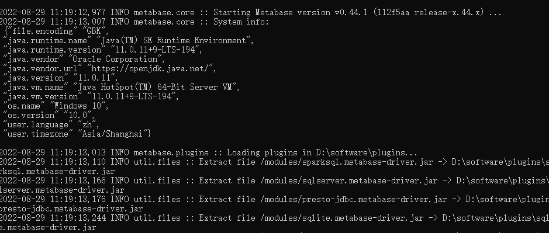

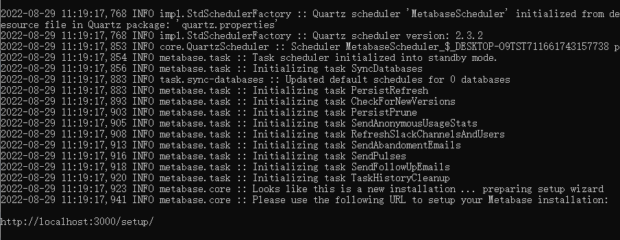

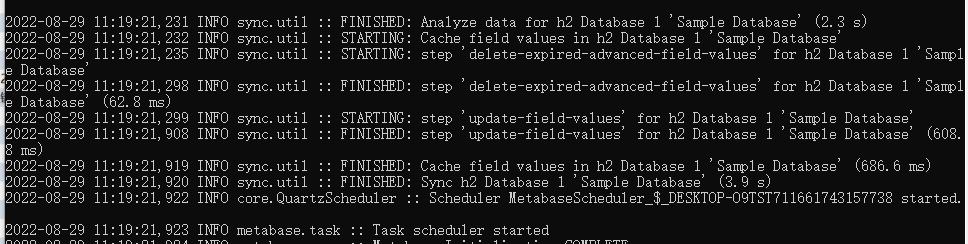

访问地址

http://localhost:3000/setup/

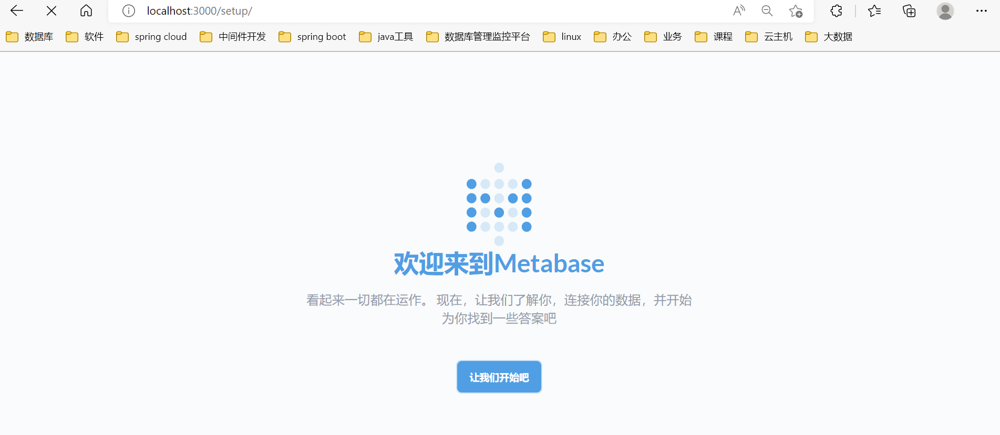

查看目录，生成了几个h2本地文件库

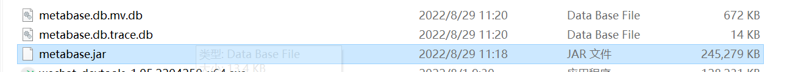

metabase提供了示例数据库，是附带元数据库的小型数据库，因此您可以在连接到数据库之前开始提问并创建仪表板。示例数据库包含四个表：`Orders``People``Products``Reviews`。这是一个 ‎**‎H2‎**‎ 数据库。

[Sample Database (metabase.com)](https://www.metabase.com/glossary/sample_database)

进入主页数据库列表，列表已经默认链连接了示例数据库sample datebase

在matebase运行时，这块选择连接库的时候，因为h2文件被占用，所以也没法创建示例库连接（其他工具也不行）

## 开始使用

选语言

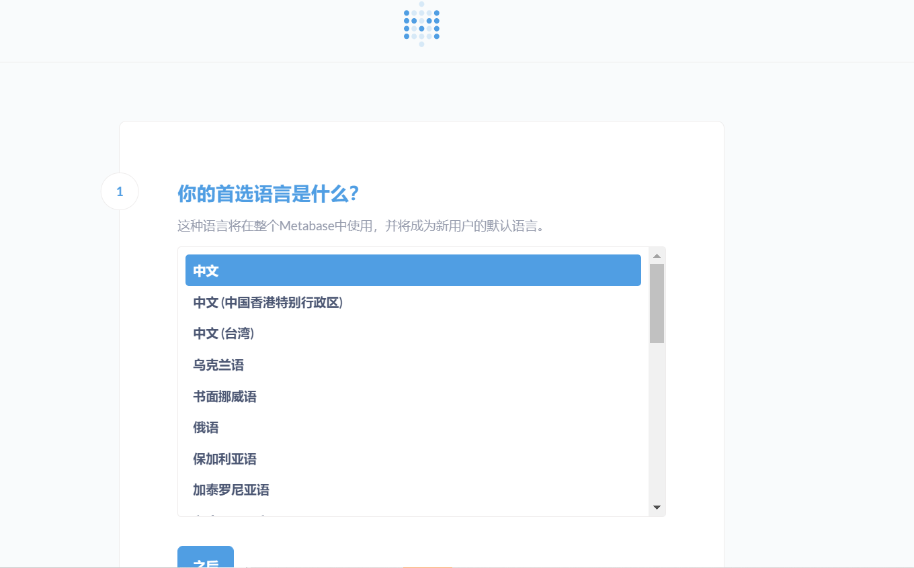

填信息

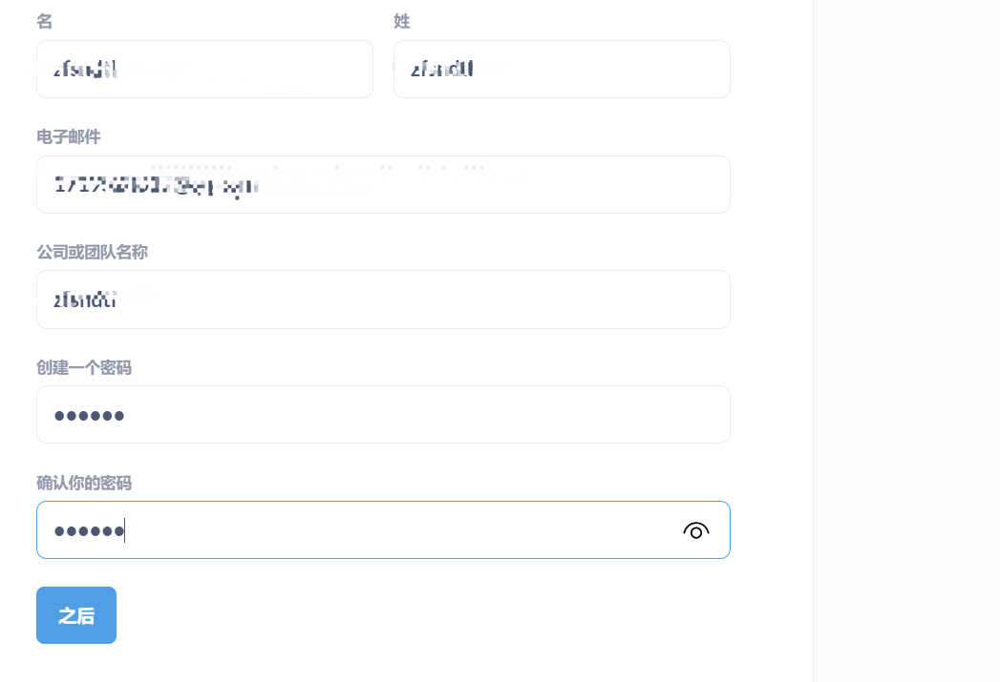

添加数据源

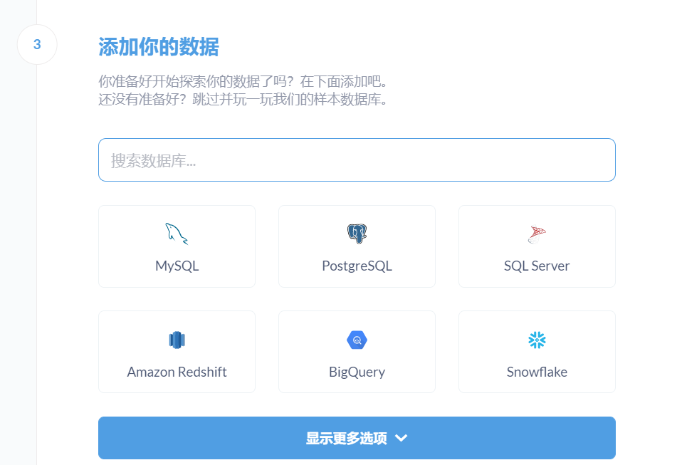

跳过配置数据源，下一步

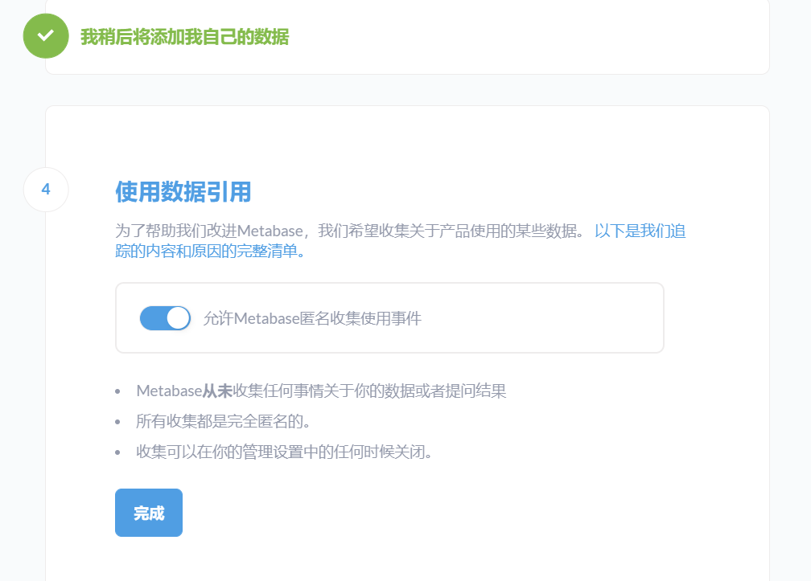

点击完成

继续点击，进入主页

查看示例库及数据模型

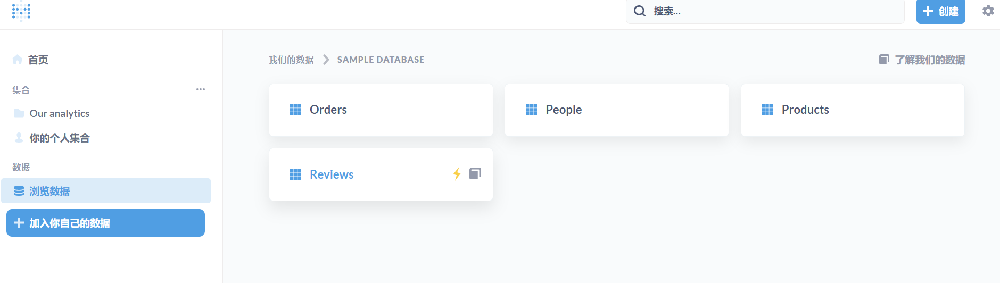

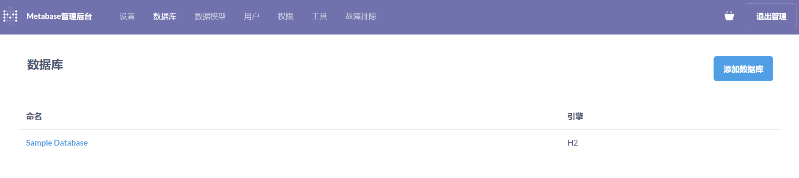

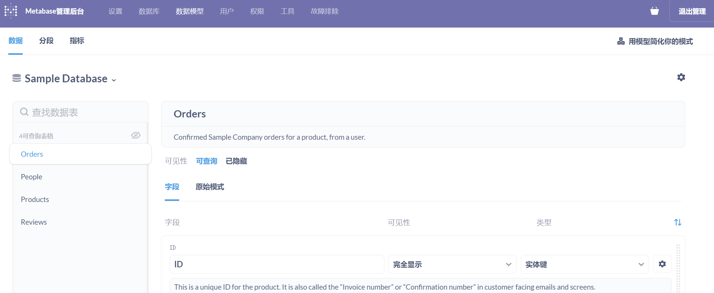

点击新公制：创建指标，查看结果

比如查看：order id>1000的订单

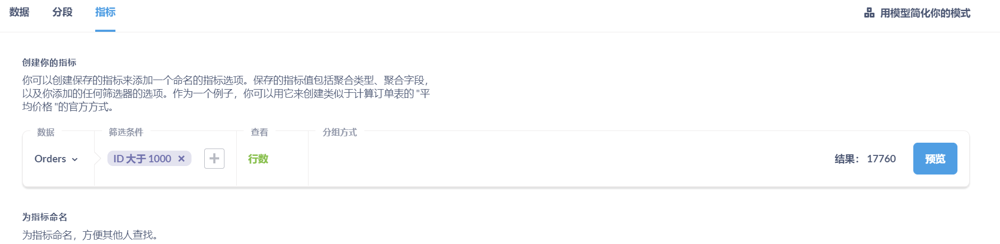

预览

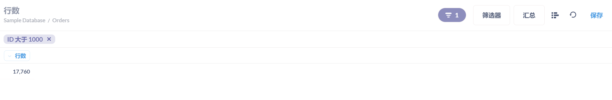

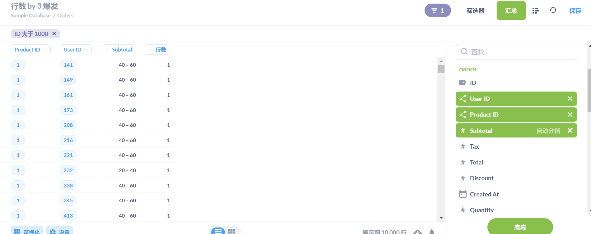

sample_database按月统计订单数，2018-2019年；相关配置及页面如图

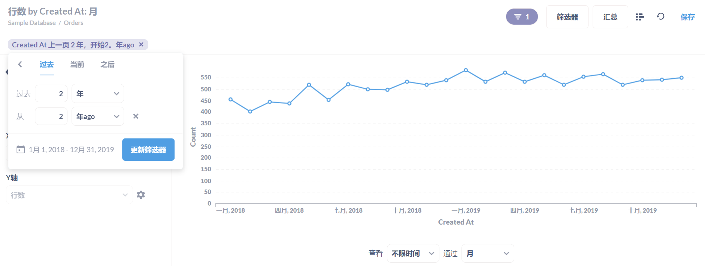

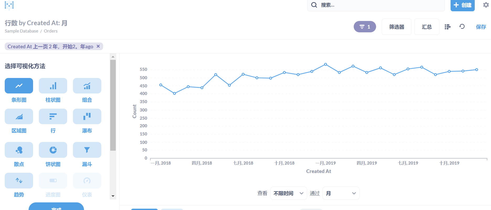

## 简单查看spm日志行为分析

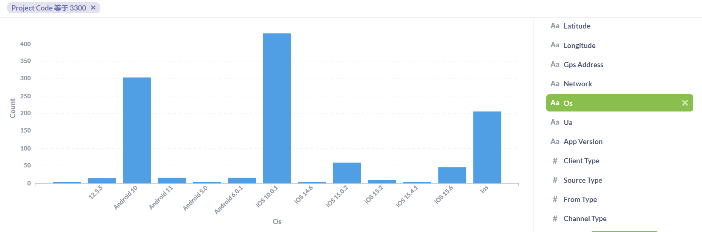

