# 14.metabase使用

## 下载说明

官网：

[Metabase Open Source Editions](https://www.metabase.com/start/oss/)

下载地址：

https://downloads.metabase.com/v0.44.1/metabase.jar

## 下载启动

下载目录：
D:\software\

文件

metabase.jar

cmd命令行启动

D:\software>java -jar metabase.jar

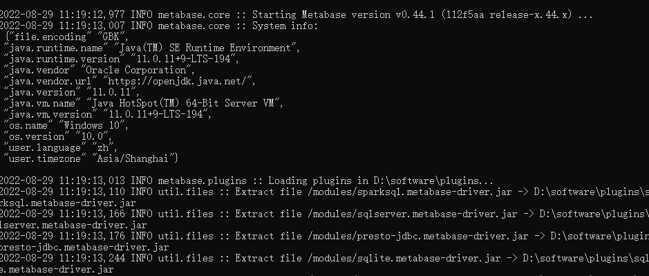

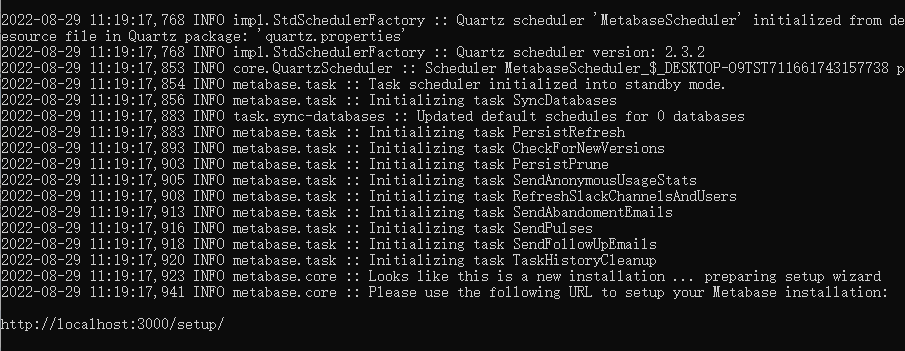

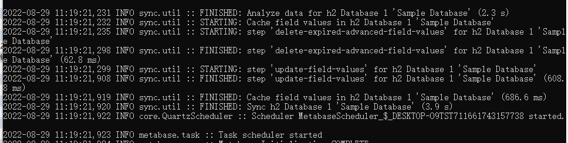

访问地址

http://localhost:3000/setup/

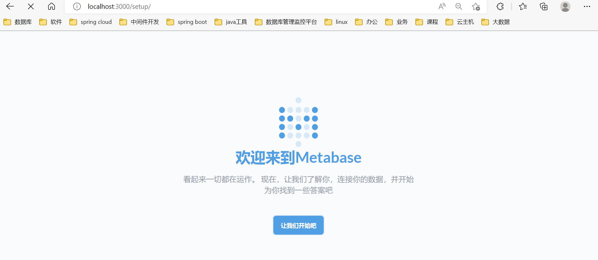

查看目录，生成了几个h2本地文件库

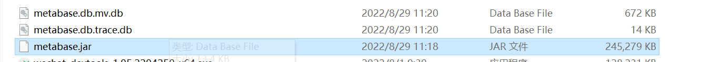

metabase提供了示例数据库，是附带元数据库的小型数据库，因此您可以在连接到数据库之前开始提问并创建仪表板。示例数据库包含四个表：`Orders``People``Products``Reviews`。这是一个 ‎**‎H2‎**‎ 数据库。

[Sample Database (metabase.com)](https://www.metabase.com/glossary/sample_database)

进入主页数据库列表，列表已经默认链连接了示例数据库sample datebase

在matebase运行时，这块选择连接库的时候，因为h2文件被占用，所以也没法创建示例库连接（其他工具也不行）

## 开始使用

选语言

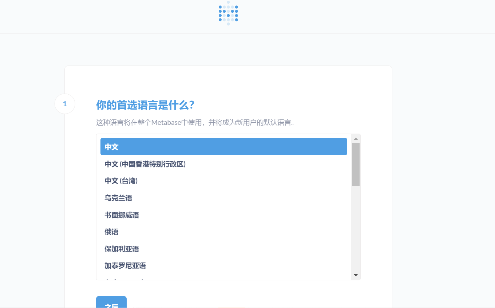

填信息  zfsndtl dfz168

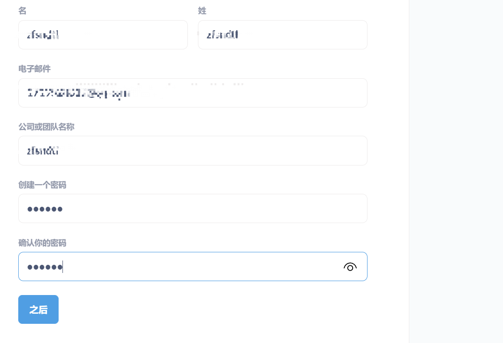

添加数据源

跳过配置数据源，下一步

点击完成

继续点击，进入主页

查看示例库及数据模型

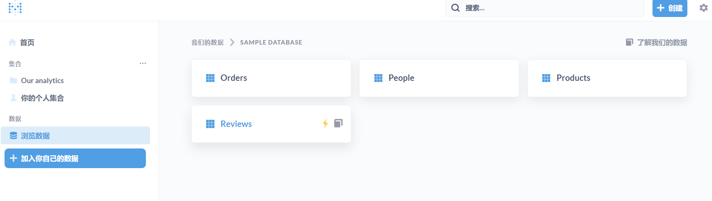

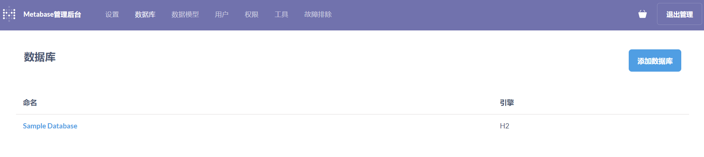

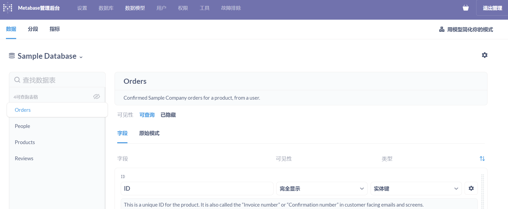

点击新公制：创建指标，查看结果

比如查看：order id>1000的订单

预览

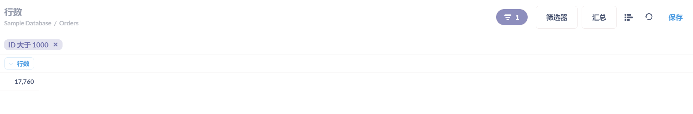

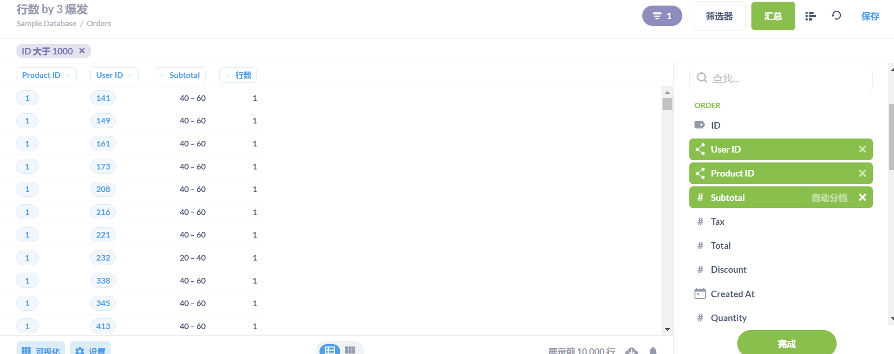

sample_database按月统计订单数，2018-2019年；相关配置及页面如图

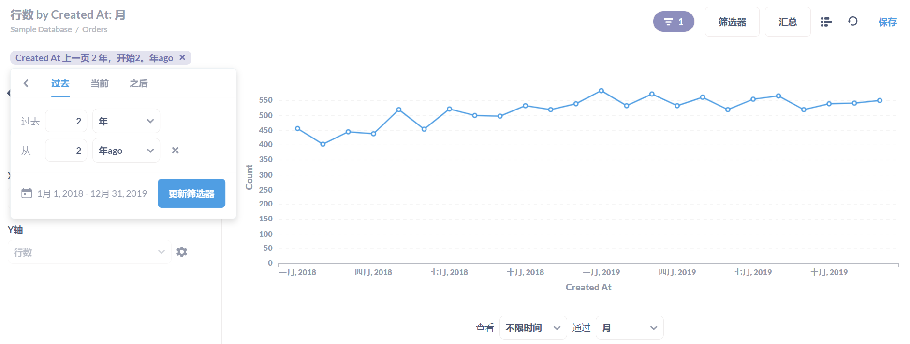

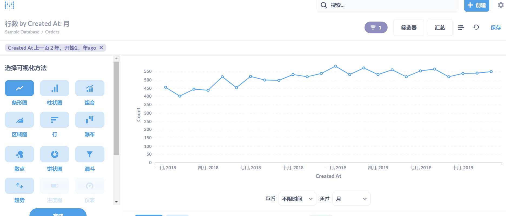

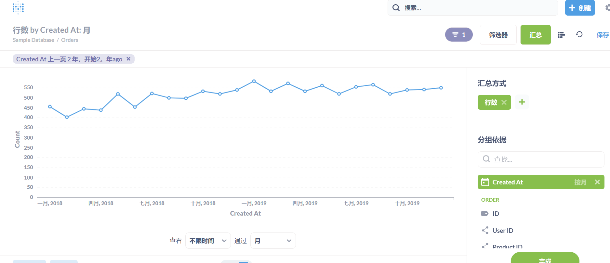

## 配置clickhouse

metabase 默认不支持[Clickhouse](https://so.csdn.net/so/search?q=Clickhouse&spm=1001.2101.3001.7020) 需要加个插件 metabase-clickhouse-driver,

下载地址如下：

[Releases · enqueue/metabase-clickhouse-driver · GitHub](https://github.com/enqueue/metabase-clickhouse-driver/releases)

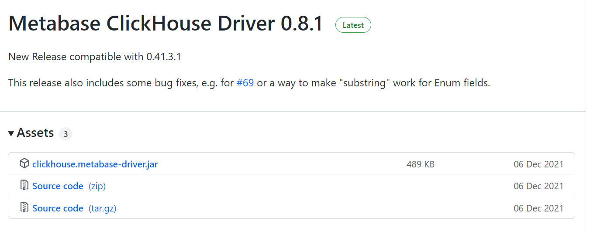

按照git提示安装下载

### Download Metabase Jar and Run

1. Download a fairly recent Metabase binary release (jar file) from the [Metabase distribution page](https://metabase.com/start/jar.html).
2. Download the ClickHouse driver jar from this repository's "Releases" page
3. Create a directory and copy the `metabase.jar` to it.
4. In that directory create a sub-directory called `plugins`.
5. Copy the ClickHouse driver jar to the `plugins` directory.
6. Make sure you are the in the directory where your `metabase.jar` lives.
7. Run `MB_PLUGINS_DIR=./plugins; java -jar metabase.jar`.

### Choosing the Right Version

| Metabase Release | Driver Version |
| ---------------- | -------------- |
| 0.33.x           | 0.6            |
| 0.34.x           | 0.7.0          |
| 0.35.x           | 0.7.1          |
| 0.37.3           | 0.7.3          |
| 0.38.1+          | 0.7.5          |
| 0.41.2           | 0.8.0          |
| 0.41.3.1         | 0.8.1          |
| 0.42.x           | 0.8.1          |

### 下载目录

D:\software\metabase-plugin

文件

clickhouse.metabase-driver.jar

### 启动

**java -DMB_PLUGINS_DIR=./metabase-plugin -jar metabase.jar** 

 //注意加了启动参数 MB_PLUGINS_DIR=./metabase-plugin

### **查看驱动插件目录，又加了好多新的plugin**

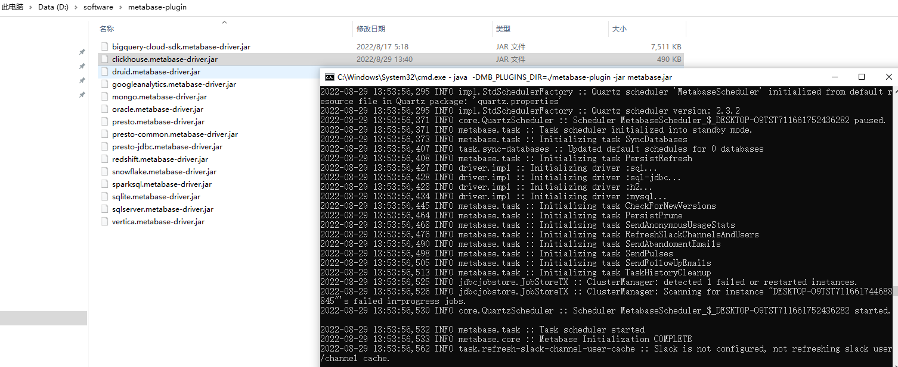

重新登陆，创建clickhouse数据源,同步数据库

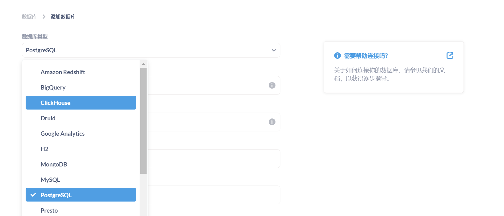

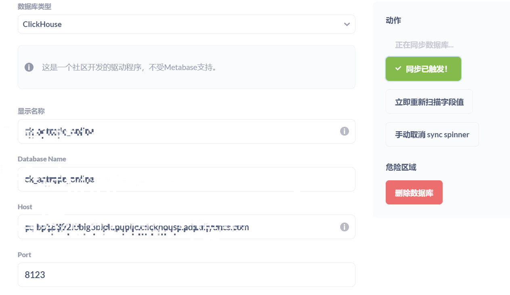

### 查看spm日志行为分析，不同端数据量

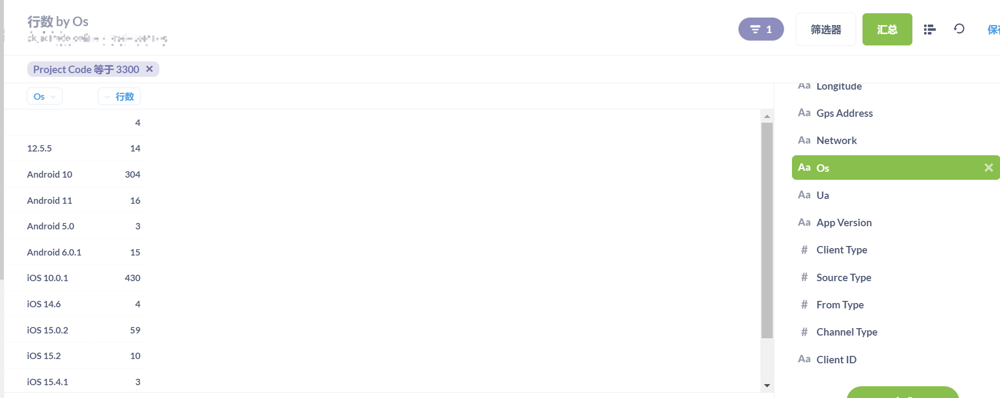

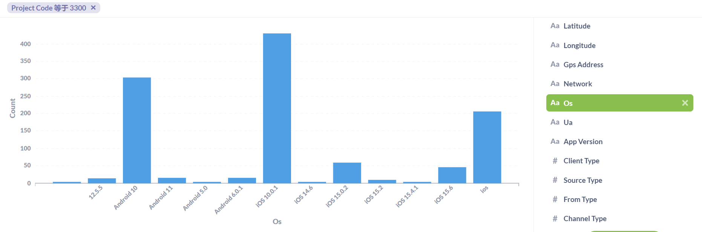

可以创建仪表盘，问题

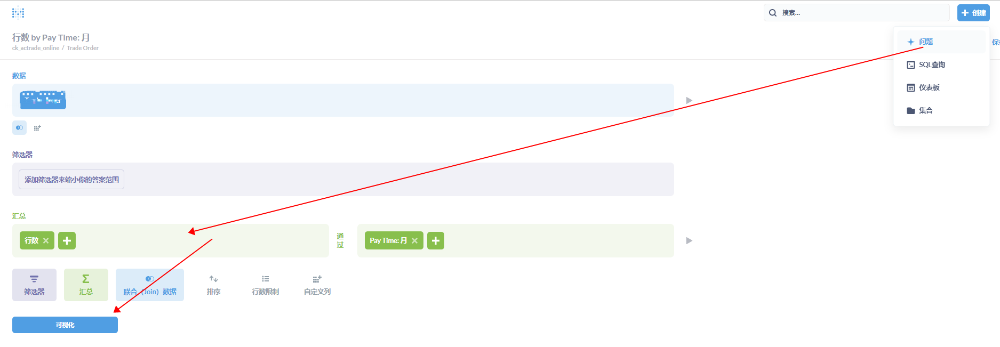

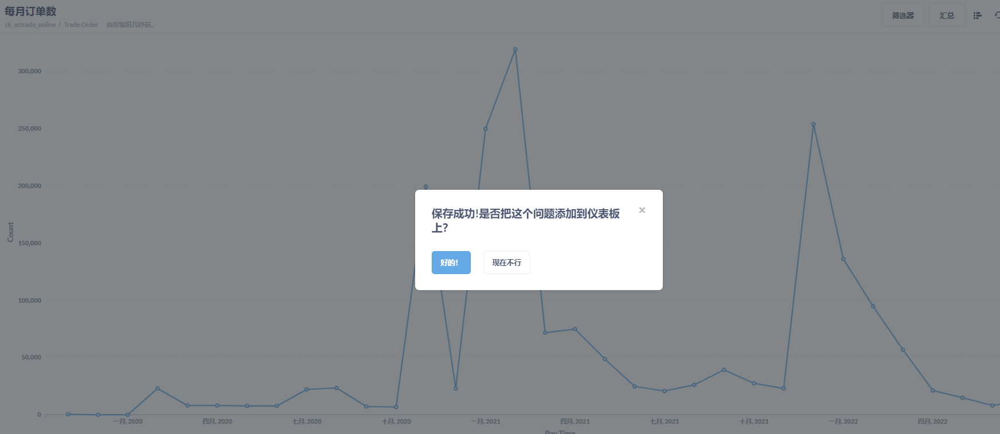

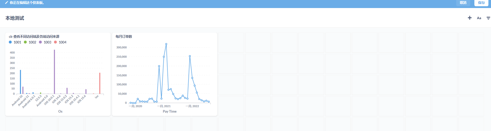