# 2.工具使用：canal从入门到实战（2）

基于上次mysql+canal的环境，继续优化整个环境。首先分析一个问题，就是如果项目中直接用canal client去消费会有什么问题？

## **1.问题**

首先先看一个问题:

参考文档：https://cloud.tencent.com/developer/article/1645881

### **问题：消费落后**

Canal现在的架构是单机消费，就算是高可用架构，为了保证binlog消费的顺序，依然是单机高可用，也就是在一台消费者挂了之后在其他待命的消费者中启动一台继续消费。（这个是目前版本我的理解，以后或许会有并发消费的新版本出来。）可以看下图：

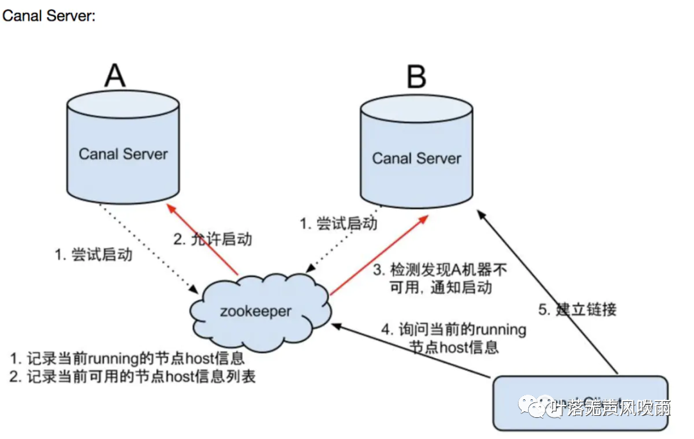

这种情况下，在Binlog数据量极大时，消费进程就有可能处理不过来。最后就会**「体现在消费跟不上，进度滞后，甚至挂掉」**。在Canal开源仓库的issues中你可以看到很多类似的问题报告：

https://github.com/alibaba/canal/issues/726

我在部署完Canal后，当数据库写入高峰期，就遇到了数据延迟问题。数据延迟还是小事，但是一旦延迟到堆满了内存缓冲区，不消费的话，新的消息就进不来了。

进一步分析这个问题，Canal整体架构如下图：

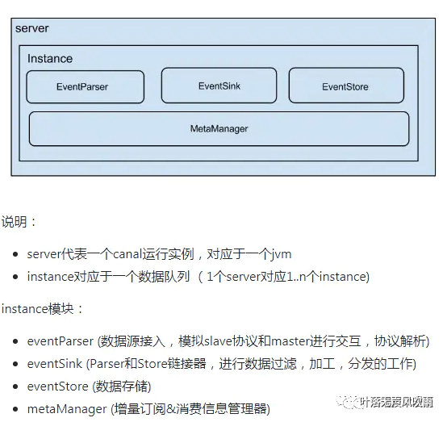

而在消息的存储设计中，Canal使用了RingBuffer，架构如下图：

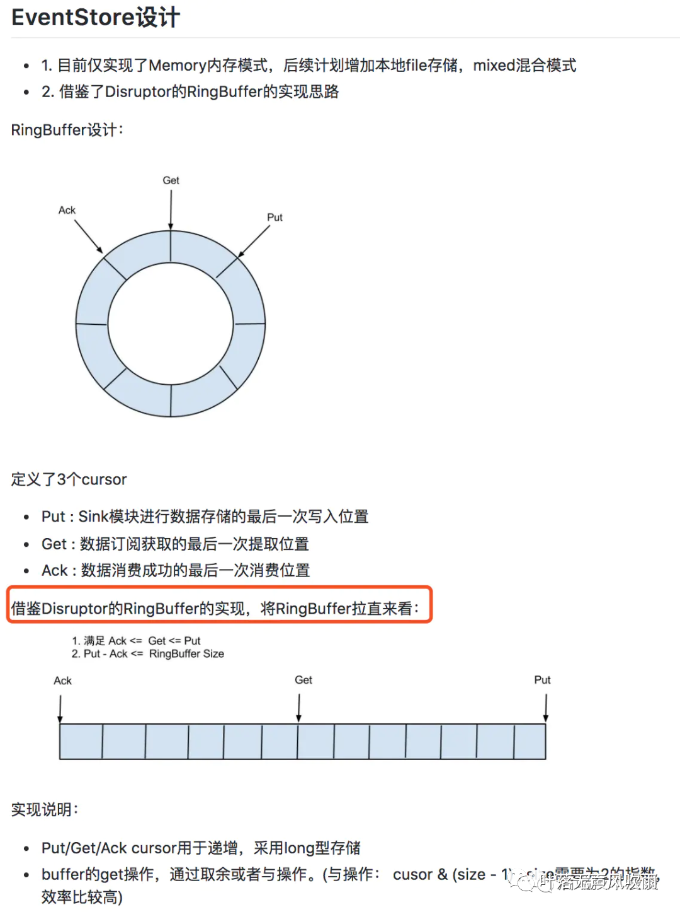

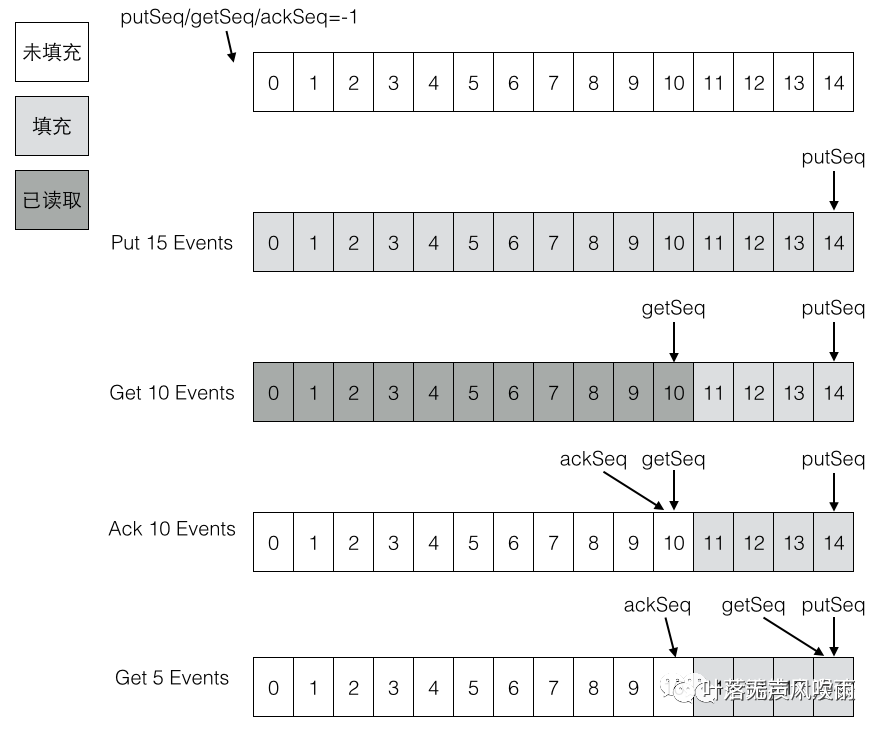

**「可以看到，现在Canal是在内存中来缓存消息的，并不会对数据进行持久化，而且缓存空间大小肯定是固定的，所以就会存在一直不提交确认ACK，导致内存缓存被占满的情况。」**

下面贴几个看到的写的比较好的对于Canal消费堆积分析的文字，并贴出原文链接：

https://zqhxuyuan.github.io/2017/10/10/Midd-canal/

> ❝这里假设环形缓冲区的最大大小为15个（源码中是16MB），那么上面两批一共产生了15个元素，刚好填满了环形缓冲区。如果又有Put事件进来，由于环形缓冲区已经满了，没有可用的slot，则Put操作会被阻塞，直到被消费掉。❞

https://blog.csdn.net/zhanlanmg/article/details/51213631

> ❝查看canal源码，为了寻找canal是否进行了文件持久化，大致上是没有的，只有一个发现就是会有临时的存储，存储接口CanalEventStore，CanalServerWithEmbedded.getWithoutAck()方法。继续～真正处理数据是在AbstractEventParser类，它会开启线程持续向master提交复制请求，直到有数据流过时，会调用EventTransactionBuffer的add(CanalEntry.Entry entry)方法，然后是put，可以看到put方法里面，会把数据放在内存缓存起来，当缓存满了以后会flush，而这个flush会调用TransactionFlushCallback接口的flush实现，这个接口在AbstractEventParser类里面有一个匿名实现，它会把数据处理掉，在consumeTheEventAndProfilingIfNecessary方法中会调用sink方法，它会一直调用到entryEventSink.doSink(Listevents)方法，这里面证实了，如果缓存区已经满了，那么会等待，等待，直到有空位放。所以当缓存区满了以后会阻塞。这就是为什么canal的数据走了很多之后，如果一直不对它ack那么就不会再有新的数据过来了的原因。另外，由于测试方法的问题，导致昨天的描述不正确，并不是插入和更新有区别，而是我的操作问题，因为我的操作是批量更新和单条插入，而缓存的大小取决于获取数据的条数（就是一次master到slave的dump是一条数据），而不是因为数据量的原因。❞

**「一个可行的解决办法是，将消息拉取后，写入****消息队列****（如RabbitMQ/Kafka），用消息队列来堆积消息处理，来保证大量消息堆积后不会导致canal卡死，并且可以支持数据持久化。」**

**「对Canal这样做的的猜测：Canal应该想是让专业的工具做专业的事，Canal就只是一个读取Binlog的****中间件****，并不是专业的消息队列，消息应该让专业的消息队列来处理。」**

## 2.安装配置rocketMQ

### (1)  下载rocketMQ

参考文档：

https://rocketmq.apache.org/docs/quick-start/

https://github.com/apache/rocketmq/tree/master/docs/cn

下载版本4.9.3，下载地址如下：

```
[anchu@localhost software]$ wget https://downloads.apache.org/rocketmq/4.9.3/rocketmq-all-4.9.3-bin-release.zip --no-check-certificate
```

由于下载的是二进制版，已经编译好，无需编译,使用如下：

```shell
# 解压zip包[anchu@localhost software]$ cd /home/anchu/software
[anchu@localhost software]$ unzip rocketmq-all-4.9.3-bin-release.zip 
[anchu@localhost software]$ mv rocketmq-4.9.3/ rocketmq-4.9.3-bin/
[anchu@localhost bin]$ cd /home/anchu/software/rocketmq-4.9.3-bin/bin
# 启动 Name Server
[anchu@localhost bin]$ nohup sh ./mqnamesrv &
[1] 96117
# 查看日志
[anchu@localhost bin]$ tail -f  nohup.out 
sh: bin/mqnamesrv: No such file or directoryOpenJDK 64-Bit Server VM warning: Using the DefNew young collector with the CMS collector is deprecated and will likely be removed in a future releaseOpenJDK 64-Bit Server VM warning: UseCMSCompactAtFullCollection is deprecated and will likely be removed in a future release.The Name Server boot success. serializeType=JSON

# 查看进程[anchu@localhost bin]$ ps -ef|grep rocketmq
anchu     96121  96117  0 01:49 pts/3    00:00:00 sh /home/anchu/software/rocketmq-4.9.3-bin/bin/runserver.sh org.apache.rocketmq.namesrv.NamesrvStartup

anchu     96136  96121  6 01:49 pts/3    00:00:06 /bin/java -server....省略... 

# 启动broker
[anchu@localhost bin]$ nohup sh ./mqbroker -n localhost:9876 &
[2] 96202

# 查看日志

[anchu@localhost bin]$ tail -f nohup.out 
OpenJDK 64-Bit Server VM warning: Using the DefNew young collector with the CMS collector is deprecated and will likely be removed in a future releaseOpenJDK 64-Bit Server VM warning: UseCMSCompactAtFullCollection is deprecated and will likely be removed in a future release.The Name Server boot success. serializeType=JSONOpenJDK 64-Bit Server VM warning: If the number of processors is expected to increase from one, then you should configure the number of parallel GC threads appropriately using -XX:ParallelGCThreads=NOpenJDK 64-Bit Server VM warning: INFO: os::commit_memory(0x00000005c0000000, 8589934592, 0) failed; error='Cannot allocate memory' (errno=12)# There is insufficient memory for the Java Runtime Environment to continue.# Native memory allocation (mmap) failed to map 8589934592 bytes for committing reserved memory.# An error report file with more information is saved as:# /home/anchu/software/rocketmq-4.9.3-bin/bin/hs_err_pid96225.log

# 启动失败，原因内存太大
# 修改nameserver启动脚本  runserver.sh

[anchu@localhost bin]$ vi runserver.sh 

JAVA_OPT="${JAVA_OPT} -server -Xms1g -Xmx1g -Xmn1g -XX:MetaspaceSize=128m -XX:MaxMetaspaceSize=320m"

# 修改broker启动脚本  runbroker.sh
[anchu@localhost bin]$  vi runbroker.sh 

JAVA_OPT="${JAVA_OPT} -server -Xms1g -Xmx1g"

# 查看日志 

[anchu@localhost bin]$ nohup sh ./mqnamesrv & 
[1] 96644

[anchu@localhost bin]$ nohup sh ./mqbroker -n 192.168.120.110:9876 &
[2] 96681

[anchu@localhost bin]$ tail -f nohup.out
OpenJDK 64-Bit Server VM warning: Using the DefNew young collector with the CMS collector is deprecated and will likely be removed in a future releaseOpenJDK 64-Bit Server VM warning: UseCMSCompactAtFullCollection is deprecated and will likely be removed in a future release.The Name Server boot success. serializeType=JSONOpenJDK 64-Bit Server VM warning: If the number of processors is expected to increase from one, then you should configure the number of parallel GC threads appropriately using -XX:ParallelGCThreads=NThe broker[localhost.localdomain, 192.168.120.110:10911] boot success. serializeType=JSON and name server is localhost:9876OpenJDK 64-Bit Server VM warning: Using the DefNew young collector with the CMS collector is deprecated and will likely be removed in a future releaseOpenJDK 64-Bit Server VM warning: UseCMSCompactAtFullCollection is deprecated and will likely be removed in a future release.OpenJDK 64-Bit Server VM warning: MaxNewSize (1048576k) is equal to or greater than the entire heap (1048576k).  A new max generation size of 1048512k will be used.The Name Server boot success. serializeType=JSONOpenJDK 64-Bit Server VM warning: If the number of processors is expected to increase from one, then you should configure the number of parallel GC threads appropriately using -XX:ParallelGCThreads=NThe broker[localhost.localdomain, 192.168.120.110:10911] boot success. serializeType=JSON and name server is 192.168.120.110:9876

# 查看进程

[anchu@localhost bin]$ jobs[1]
-  Running                 nohup sh ./mqnamesrv &[2]
+  Running                 nohup sh ./mqbroker -n 192.168.120.110:9876 &

# 测试生产消费
[anchu@localhost bin]$  export NAMESRV_ADDR=localhost:9876
[anchu@localhost bin]$  sh .bin/tools.sh org.apache.rocketmq.example.quickstart.ProducerSendResult [sendStatus=SEND_OK, msgId= ...省略号....

[anchu@localhost bin]$ sh ./tools.sh org.apache.rocketmq.example.quickstart.Consumer ConsumeMessageThread_%d Receive New Messages: [MessageExt...省略号... # 停止rocketMQ

[anchu@localhost bin]$  sh ./mqshutdown brokerThe mqbroker(96704) is running...Send shutdown request to mqbroker(96704) OK

[anchu@localhost bin]$ sh ./mqshutdown namesrvThe mqnamesrv(96663) is running...Send shutdown request to mqnamesrv(96663) OK
[2]+  Exit 143                nohup sh ./mqbroker -n 192.168.120.110:9876

# 查看进程[anchu@localhost bin]$ 
jobs
[anchu@localhost bin]
$ [anchu@localhost bin]$ ps -ef|grep rocket
[anchu@localhost bin]$
```

如果下载编译版，编译操作如下：

```shell
 [anchu@localhost software] wget https://downloads.apache.org/rocketmq/4.9.3/rocketmq-all-4.9.3-source-release.zip --no-check-certificate 
 [anchu@localhost software] unzip rocketmq-all-4.9.3-source-release.zip 
 [anchu@localhost software]$ mv rocketmq-all-4.9.3 rocketmq-4.9.3-source 
 [anchu@localhost software]$cd /home/anchu/software/rocketmq-4.9.3-source [anchu@localhost software]$ mvn -Prelease-all -DskipTests clean install -U [anchu@localhost software]$ cd distribution/target/rocketmq-4.9.3/rocketmq-4.9.3 
 # 接下来的使用操作同上,暂不演示
```

### (2)下载rocketmq-console

参考文档：https://blog.csdn.net/so_geili/article/details/90142461

RocketMQ-Console是RocketMQ项目的扩展插件，是一个图形化管理控制台，提供Broker集群状态查看，Topic管理，Producer、Consumer状态展示，消息查询等常用功能，这个功能在安装好RocketMQ后需要额外单独安装、运行。

下载地址：

```shell
// 克隆项目到本地$ git clone -b release-rocketmq-console-1.0.0 https://github.com/zfsndtl/rocketmq-externals.git cd rocketmq-externals/rocketmq-console/ mvn clean package -Dmaven.test.skip=true 
# 由于是windows上打的包，把包拷到linux环境中，运行
[anchu@localhost rocketmq-4.9.3-bin]$pwd
/home/anchu/software/rocketmq-4.9.3-bin
[anchu@localhost rocketmq-4.9.3-bin]$ mkdir rocketmq-console-1.0
[anchu@localhost rocketmq-4.9.3-bin]$ cd rocketmq-console-1.0/
[anchu@localhost rocketmq-console-1.0]$ rz -Erz waiting to receive.
[anchu@localhost rocketmq-console-1.0]$ lsrocketmq-console-ng.jarjava -jar rocketmq-console-ng-1.0.0.jar --rocketmq.config.namesrvAddr="192.168.120.110:9876"
Error: Unable to access jarfile rocketmq-console-ng.jar

# 报错原因是需要输入绝对路径或者包名不对
java -jar rocketmq-console-ng.jar --rocketmq.config.namesrvAddr="192.168.120.110:9876"
#  或者windows执行,jar包绝对路径 
D:\gitpro\rocketmq-externals\rocketmq-console\target>java -jar D:\gitpro\rocketmq-externals\rocketmq-console\target\rocketmq-console-ng-1.0.0.jar  --rocketmq.config.namesrvAddr="192.168.120.110:9876"
# 启动报错
```

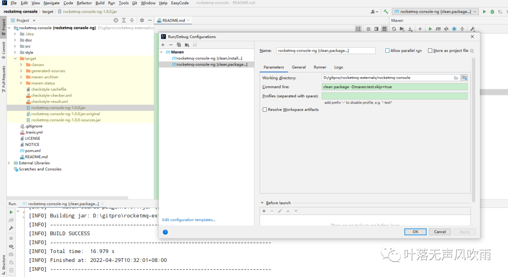

启动报错：org.aspectj.apache.bcel.classfile.ClassFormatException: Invalid byte tag in constant pool: 18

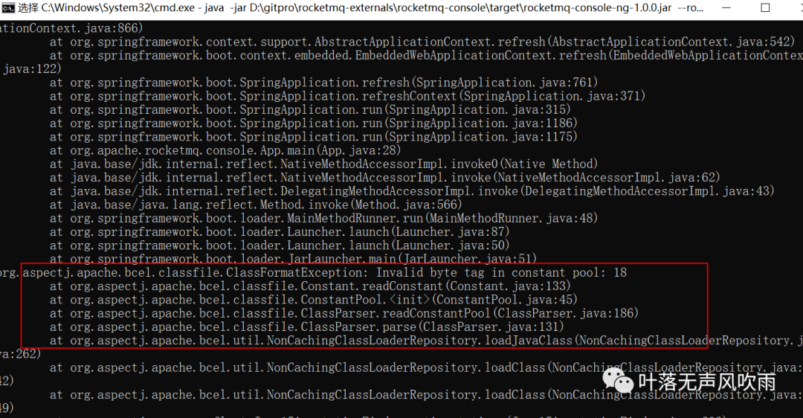

原因：aspectj版本和jdk1.8不兼容，不支持lamda表达式

参考文档：https://blog.csdn.net/chen051318/article/details/68927464

将pom.xml的aspectj版本改为1.8.10

```
<aspectj.version>1.8.10</aspectj.version>
```

重新打包，再次启动，浏览器访问：


### (3)  canal配置MQ（使用二进制版MQ）

canal默认支持MQ,并在canal.properties提供了rocketMQ的配置模板。基于上次canal.properties配置基础上，配置MQ相关配置

参照文档https://github.com/alibaba/canal/wiki/Canal-Kafka-RocketMQ-QuickStart

```shell
# canal.properties配置rocketMQ
# tcp, kafka, rocketMQ, rabbitMQ
canal.serverMode = rocketMQ
canal.aliyun.accessKey =
canal.aliyun.secretKey =
canal.aliyun.uid=
canal.mq.flatMessage = true
canal.mq.canalBatchSize = 50
canal.mq.canalGetTimeout = 100
# Set this value to "cloud", if you want open message trace feature in aliyun.canal.mq.accessChannel = local
canal.mq.database.hash = true
canal.mq.send.thread.size = 30
canal.mq.build.thread.size = 8
rocketmq.producer.group = canal
rocketmq.enable.message.trace = false
rocketmq.customized.trace.topic = example
rocketmq.namespace =
rocketmq.namesrv.addr = 192.168.120.110:9876
rocketmq.retry.times.when.send.failed = 0
rocketmq.vip.channel.enabled = false
rocketmq.tag =
# 重新启动canal
[anchu@localhost bin]$  /home/anchu/software/canal/bin
[anchu@localhost bin]$ ./canal-stop.sh 
localhost.localdomain: stopping canal 94757 ... Oook! cost:4
[anchu@localhost bin]$ 
[anchu@localhost bin]$ ./canal-startup.sh
[anchu@localhost bin]$ tail -f ../logs/canal/canal_stdout.log
```

canal配好后，在rocketmq-console中查看是否生效，可以看到确实生成了example的topic和

生产者的group为canal

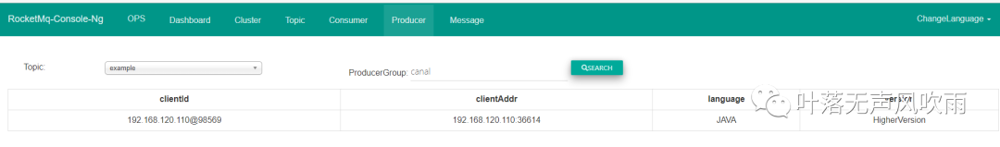

查看消息及详情

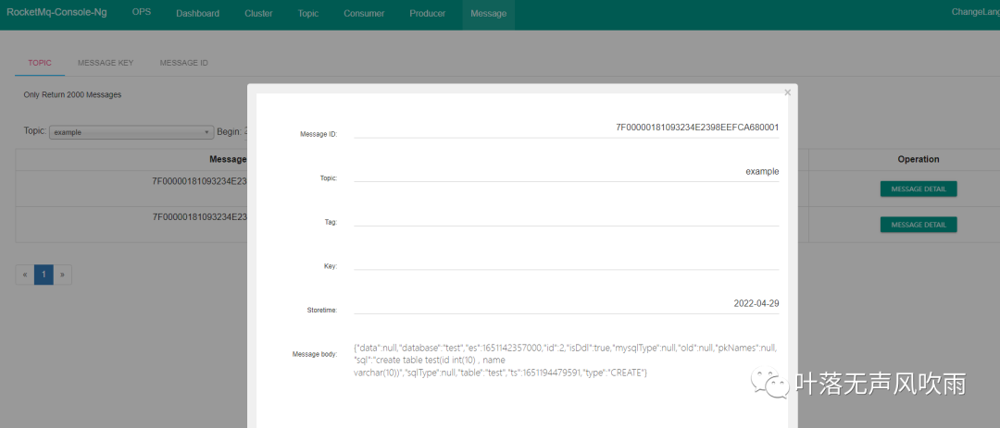


### (4)  客户端连接测试

测试消费，canal开源项目地址中有个测试用例，

修改配置类ip，topic,group

https://github.com/alibaba/canal/blob/master/example/src/main/java/com/alibaba/otter/canal/example/rocketmq/AbstractRocektMQTest.java

打包

```
clean package -Dmaven.test.skip=true
```

然后启动

https://github.com/alibaba/canal/blob/master/example/src/main/java/com/alibaba/otter/canal/example/rocketmq/CanalRocketMQClientExample.java

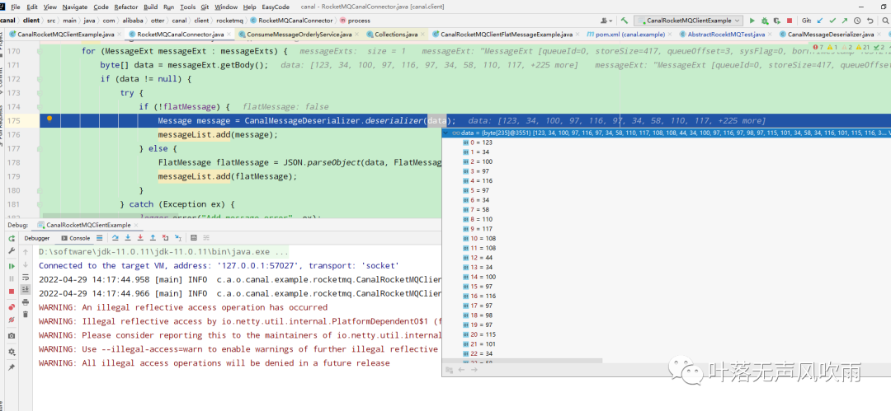


查看确实消费到消息，但是消息格式解析不对：

```
2022-04-29 14:24:47.442 [ConsumeMessageThread_1] ERROR c.a.otter.canal.client.rocketmq.RocketMQCanalConnector - Add message errorcom.alibaba.otter.canal.protocol.exception.CanalClientException: deserializer failed
```

原因如下，由于canal配置的是json格式接收数据：

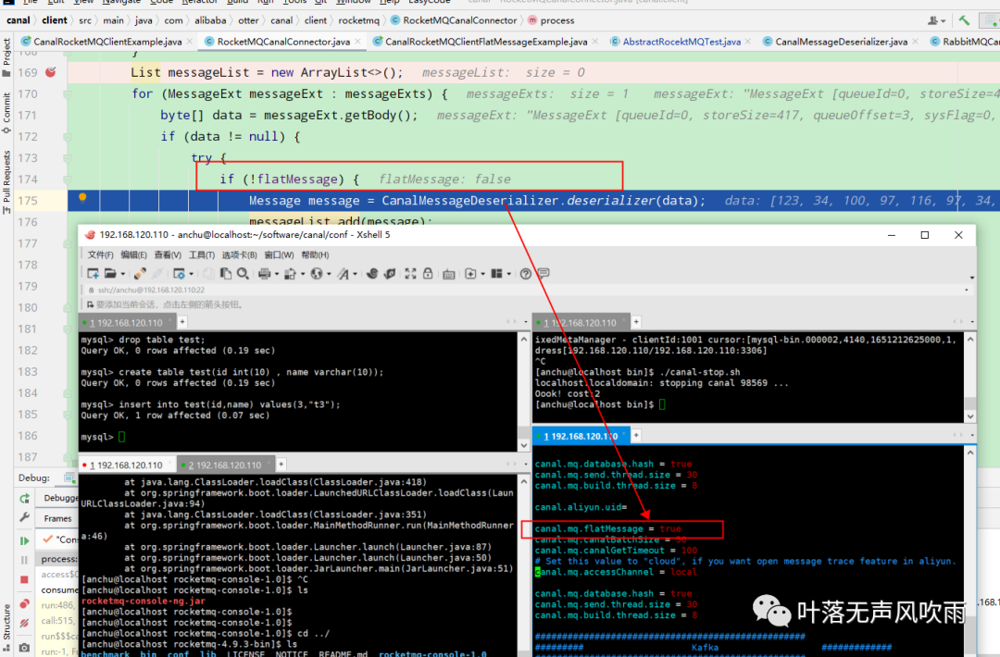

修改如下，可以看到json的数据：

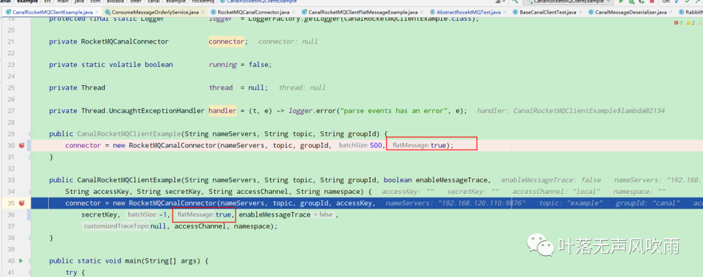

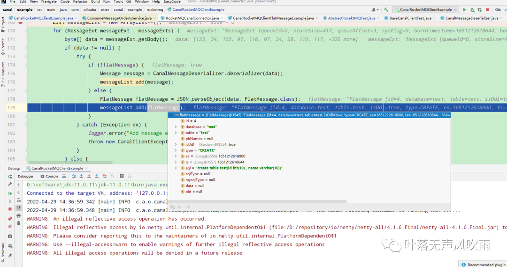

消息放入队列，注意泛型类型是FlatMessage啊

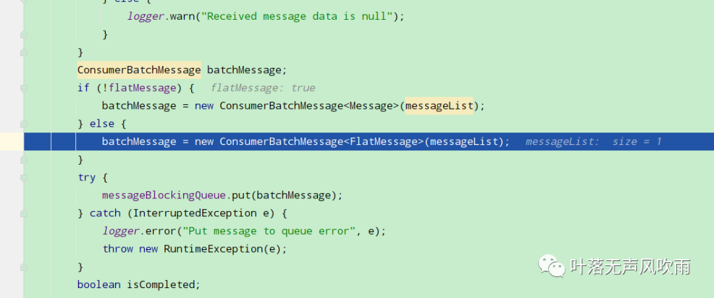

消费队列

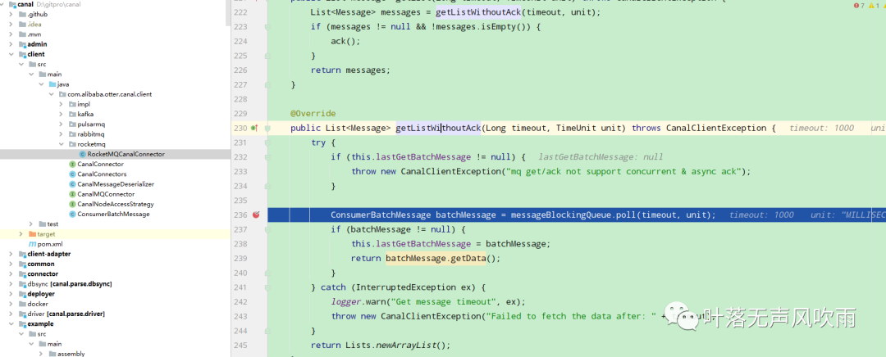

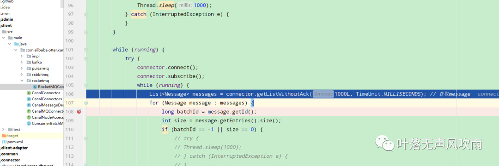

继续debug还是报错，原因是上面队列放入的是FlatMessage，它不能转换为Message

```
class com.alibaba.otter.canal.protocol.FlatMessage cannot be cast to class com.alibaba.otter.canal.protocol.Message
```

貌似给的例子消费那块使用List<Message>接收的，所以还得改，至少目前来看，数据确实消费到了。为了方便，还是把canal的配置改成false并重启，rocket客户端这边flatMessage改回false吧，也就是不用json格式接受数据了。

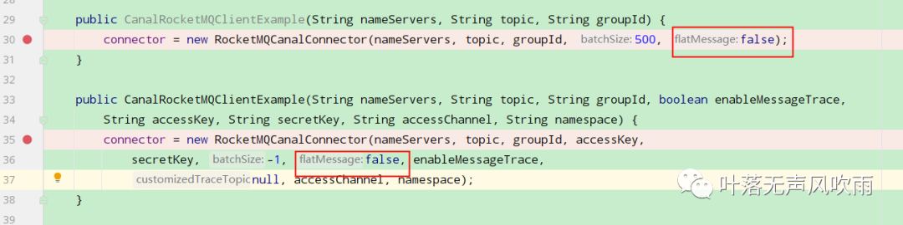

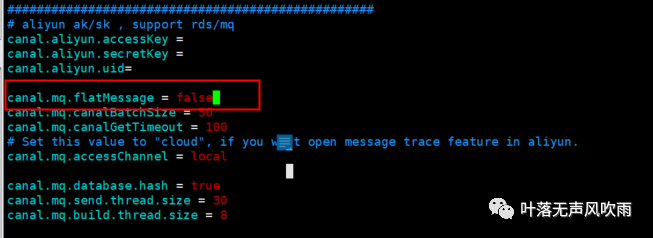

由于rocket旧的消息未成功消费，flatMessage改回false的话，就会继续报前面的格式解析异常。可以通过rocket-console删掉旧的topic，重启canal，mysql添加数据重新测试一遍增量。

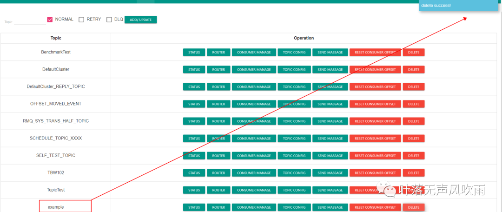

重新测试：

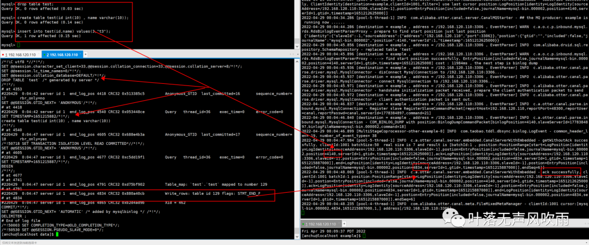

rocket-console重新查看，可以看到消息已经不是json格式啦

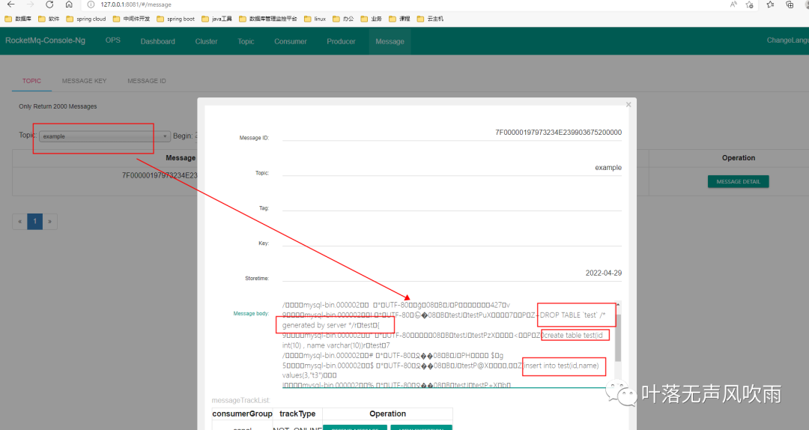

启动java类，格式解析成功

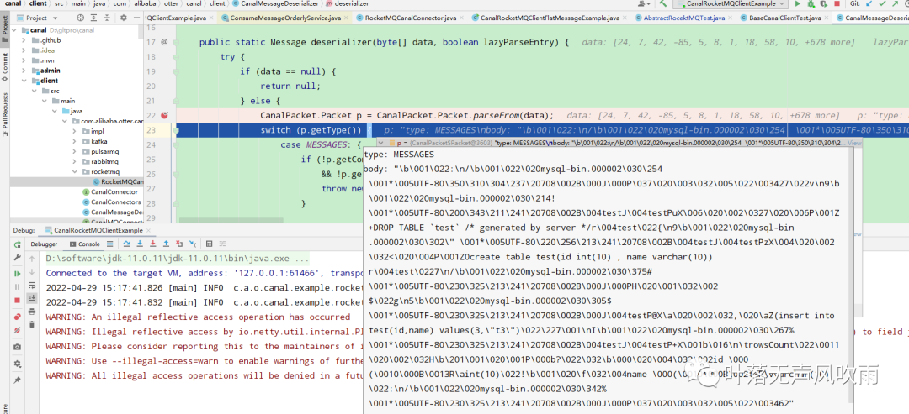

查看日志，消费成功

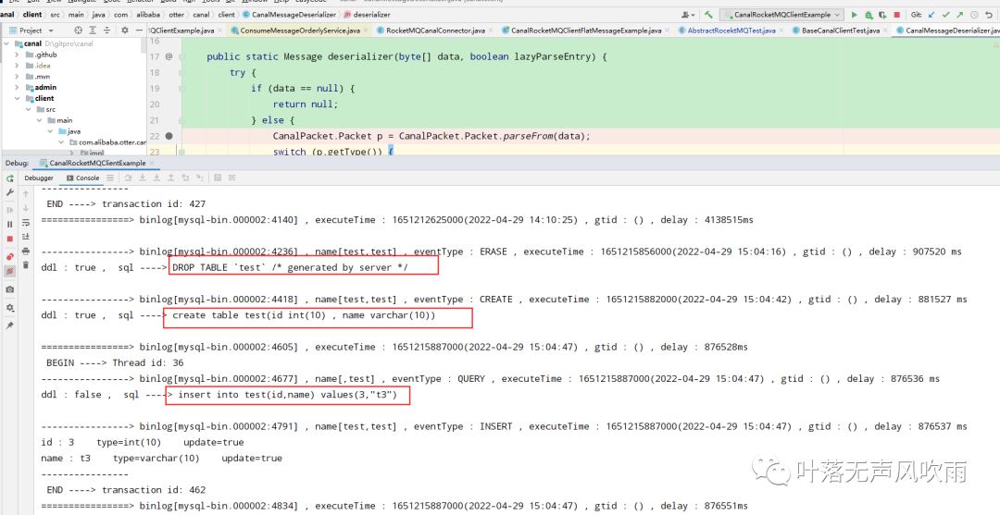

至此mysql+canal+rocketmq实现数据库同步简单环境及测试已经ok.

总结一下几个点：

（1）注意rocketmq-console 的aspectj版本和jdk1.8需要兼容

（2）注意canal和rocket消费端的消息解析格式，flatMessage是否为true(为true是否为flat json格式对象)