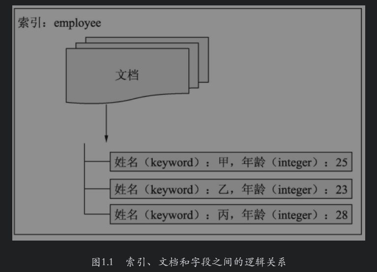
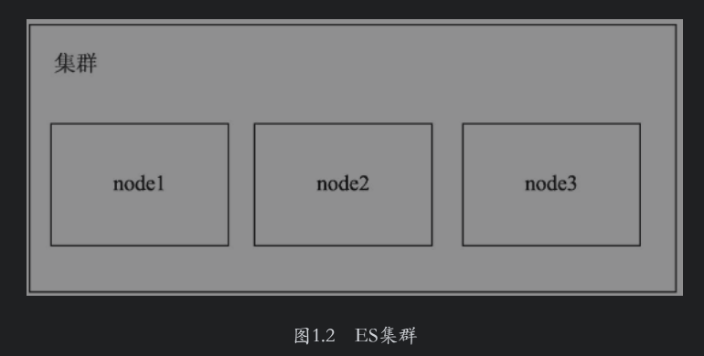
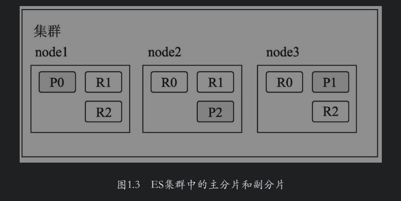
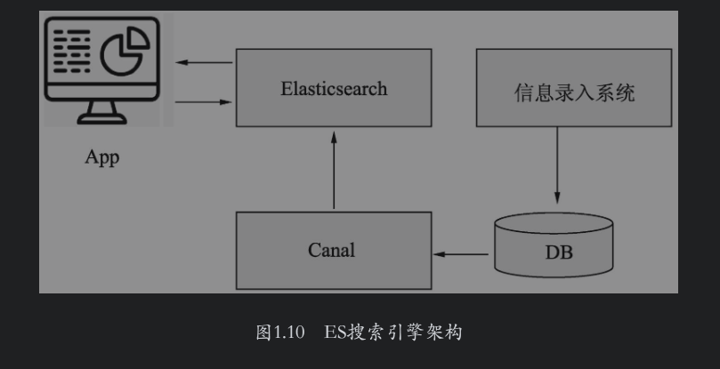
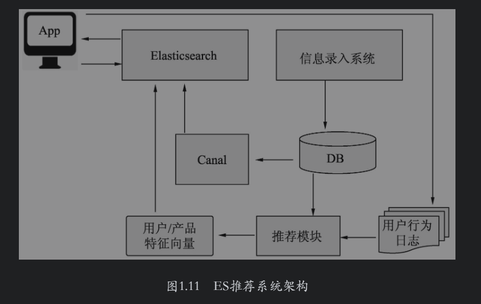
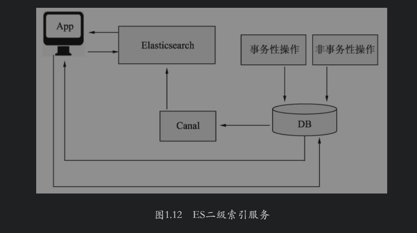
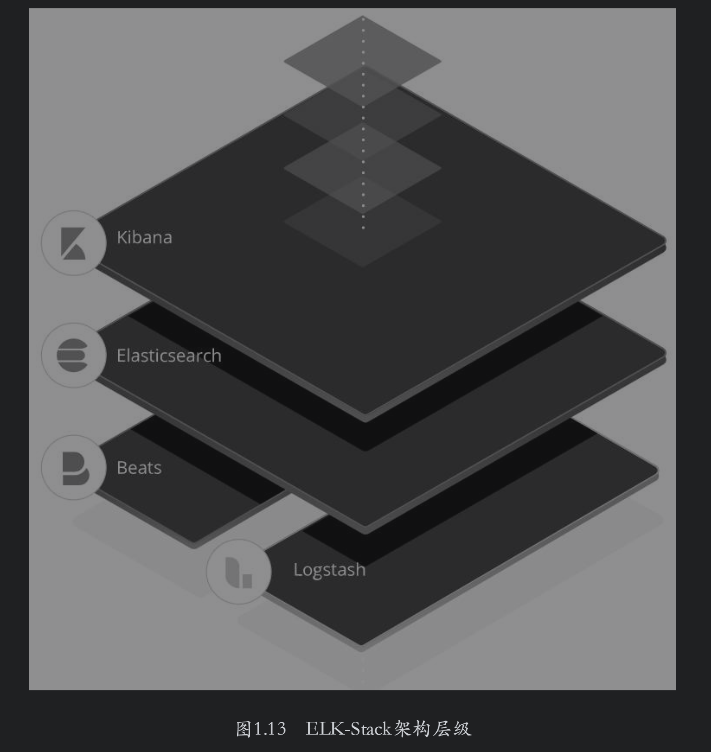
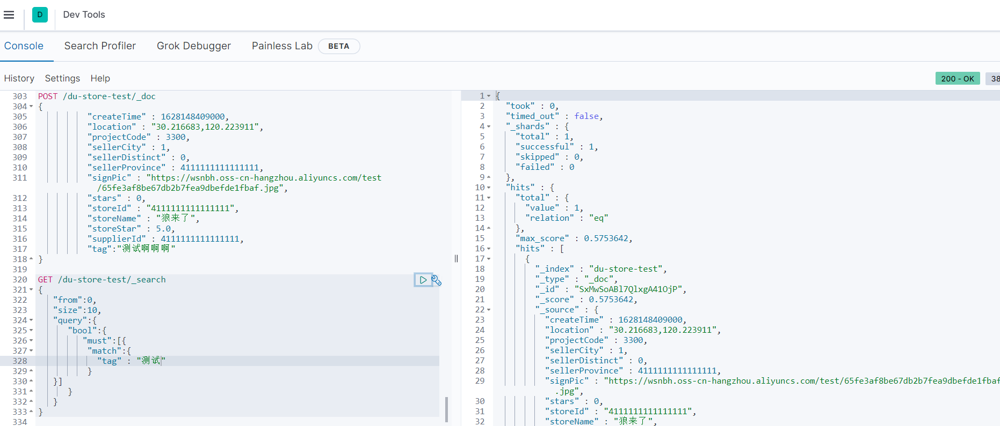
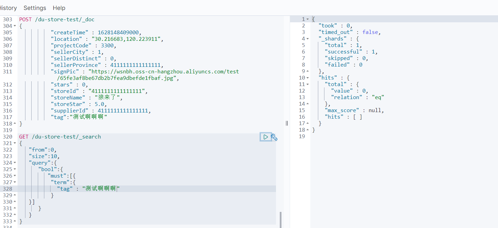
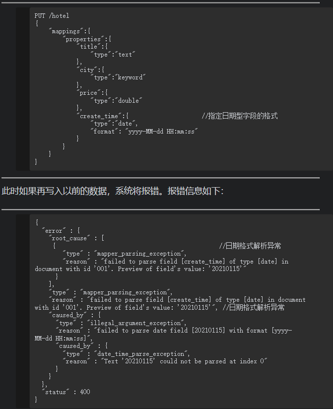

## Elasticsearch从入门到放弃

文档摘自《Elasticsearch搜索引擎构建入门与实战》

### 1.Elasticsearch简介

​        当前，很多应用都有搜索功能。Lucene作为“老牌”的搜索技术支持库，它提供的很多功能都能用于处理文本类型的数据。但是使用Lucene架设搜索引擎需要使用者熟悉搜索引擎的很多知识，对使用者的要求非常高，并且Lucene仅仅提供了基础的搜索引擎支持，而对搜索的分布式、容错性和实时性并不支持。

​       ES是建立在Lucene基础之上的分布式准实时搜索引擎，它所提供的诸多功能中有一大优点，即实时性好。那么什么是实时性好呢？在一般的业务需求中，新增加的数据至少要1min才能被搜索到，而在ES中，数秒甚至1s内即可搜索到新增的数据。

​       除了良好的实时性外，ES还提供了很多优秀的功能。例如，ES是分布式的架构设计，当单台或者少量的计算机不能很好地支持搜索任务时，完全可以扩展到足够多的计算机上进行搜索；以往在使用Lucene时，需要用户有Java语言基础，而ES提供了REST风格的API接口，使用户可以借助任何语言使用HTTP对ES执行请求来完成搜索任务；ES本身还提供了聚合功能，用户可以使用该功能对索引中的数据进行统计分析；在数据安全方面，ES提供了X-Pack进行用户验证。

​       如今，ES不仅是一个搜索引擎框架，而且其官方还提供了ELK“全家桶”，为构建搜索引擎提供了很好的解决方案。其中，E代表Elasticsearch，主要提供数据搜索和分析功能；L代表Logstash，借助它可以将数据库和日志等结构化或非结构化数据轻松地导入ES中；K代表Kibana，它可以将分析结果进行图形化展示，此外还可以使用它提供的开发工具对ES进行请求的交互。

### 2.Elasticsearch的基本概念

在使用ES进行数据的索引和搜索时，会用到一些基本概念，下面分别进行介绍。

**1.索引**

在使用传统的关系型数据库时，如果对数据有存取和更新操作，需要建立一个数据库。相应地，在ES中则需要建立索引。用户的数据新增、搜索和更新等操作的对象全部对应索引。但是，ES中的索引和Lucene中的索引不是一一对应的。ES中的一个索引对应一个或多个Lucene索引，这是由其分布式的设计方案决定的。

**2.文档**

在使用传统的关系型数据库时，需要把数据封装成数据库中的一条记录，而在ES中对应的则是文档。ES的文档中可以有一个或多个字段，每个字段可以是各种类型。用户对数据操作的最细粒度对象就是文档。ES文档操作使用了版本的概念，即文档的初始版本为1，每次的写操作会把文档的版本加1，每次使用文档时，ES返回给用户的是最新版本的文档。另外，为了减轻集群负载和提升效率，ES提供了文档的批量索引、更新和删除功能。

**3.字段**

一个文档可以包含一个或多个字段，每个字段都有一个类型与其对应。除了常用的数据类型（如字符串型、文本型和数值型）外，ES还提供了多种数据类型，如数组类型、经纬度类型和IP地址类型等。ES对不同类型的字段可以支持不同的搜索功能。例如，**当使用文本类型的数据时，可以按照某种分词方式对数据进行搜索，并且可以设定搜索后的打分因子来影响最终的排序**。再如，**使用经纬度的数据时，ES可以搜索某个地点附近的文档，也可以查询地理围栏内的文档。**排序函数的使用上，ES也可以基于某个地点按照衰减函数进行排序。

索引、文档和字段的逻辑关系如图1.1所示，从图中可以看出它们之间的包含关系。

**4.映射**

建立索引时需要定义文档的数据结构，这种结构叫作映射。在映射中，文档的字段类型一旦设定后就不能更改。因为字段类型在定义后，ES已经针对定义的类型建立了特定的索引结构，这种结构不能更改。借助映射可以给文档新增字段。另外，ES还提供了自动映射功能，即在添加数据时，如果该字段没有定义类型，ES会根据用户提供的该字段的真实数据来猜测可能的类型，从而自动进行字段类型的定义。



**5.集群和节点**

在分布式系统中，为了完成海量数据的存储、计算并提升系统的高可用性，需要多台计算机集成在一起协作，这种形式被称为集群，如图1.2所示。这些集群中的每台计算机叫作节点。ES集群的节点个数不受限制，用户可以根据需求增加计算机对搜索服务进行扩展。



**6.分片**

在分布式系统中，为了能存储和计算海量的数据，会先对数据进行切分，然后再将它们存储到多台计算机中。这样不仅能分担集群的存储和计算压力，而且在该架构基础上进一步优化，还可以提升系统中数据的高可用性。在ES中，一个分片对应的就是一个Lucene索引，每个分片可以设置多个副分片，这样当主分片所在的计算机因为发生故障而离线时，副分片会充当主分片继续服务。索引的分片个数只能设置一次，之后不能更改。在默认情况下，ES的每个索引设置为5个分片。

**7.副分片**

**为了提升系统索引数据的高可用性并减轻集群搜索的负载，可以启用分片的副本，该副本叫作副分片，而原有分片叫作主分片。**在一个索引中，主分片的副分片个数是没有限制的，用户可以按需设定。在默认情况下，ES不会为索引的分片开启副分片，用户需要手动设置。副分片的个数设定后，也可以进行更改。一个分片的主分片和副分片分别存储在不同的计算机上，如图1.3所示为一个3个节点的集群，某个索引设置了3个主分片，每个主分片分配两个副分片。图1.3中深色方框中的P表示该分片为主分片，R表示该分片为副分片，P和R后面的数字表示其编号。在极端情况下，当只有一个节点时，如果索引的副分片个数设置大于1，则系统只分配主分片，而不会分配副分片。



**8.DSL**

ES使用DSL（Domain Specific Language，领域特定语言），来定义查询。与编程语言不同，DSL是在特定领域解决特定任务的语言，它可以有多种表达形式，如我们常见的HTML、CSS、SQL等都属于DSL。ES中的DSL采用JSON进行表达，相应地，ES也将响应客户端请求的返回数据封装成了JSON形式。这样不仅可以简单明了地表达请求/响应内容，而且还屏蔽了各种编程语言之间数据通信的差异。

### 3.Elasticsearch和关系型数据库的对比

应用系统一般需要借助数据产品实现数据查询加速的需求。业界主流的数据产品分为两类，一类是传统的关系型数据库，另一类是非关系型数据库。ES属于非关系型数据库。在判断该使用ES还是关系型数据库之前，要先比较一下这两种不同类别的产品。

**1.索引方式**

关系型数据库的索引大多是B-Tree结构，而ES使用的是倒排索引，两种不同的数据索引方式决定了这两种产品在某些场景中性能和速度的差异。例如，对一个包含几亿条数据的关系型数据表执行最简单的count查询时，关系型数据库可能需要秒级的响应时间，如果数据表的设计不合理，甚至有可能把整个关系型数据库拖垮，影响其他的数据服务；而ES可以在毫秒级别进行返回，该查询对整个集群的影响微乎其微。再例如，一个需求是进行分词匹配，关系型数据库需要依靠其他的组件才能完成这种查询，查询的结果只能是满足匹配，但是不能按照匹配程度进行打分排序；ES建立在Lucene基础之上，与生俱来就能完成分词匹配，并且支持多种打分排序算法，还支持用户自定义排序脚本。

**2.事务支持**

**事务是关系型数据库的核心组成模块，而ES是不支持事务的。ES更新文档时，先读取文档再进行修改，然后再为文档重新建立索引。如果同一个文档同时有多个并发请求，则极有可能会丢失某个更新操作。为了解决这个问题，ES使用了乐观锁，即假定冲突是不会发生的，不阻塞当前数据的更新操作，每次更新会增加当前文档的版本号，最新的数据由文档的最新版本来决定，这种机制就决定了ES没有事务管理。**因此，如果你的需求是类似商品库存的精准查询或者金融系统的核心并发业务的支持，那么关系型数据是不错的选择。

**3.SQL和DSL**

SQL和DSL都有自己的语法结构，都是各自和用户之间进行交互的一种语言表达方式。**SQL是关系型数据库使用的语言，主要是因为SQL查询的逻辑比较简单和直接，一般是大小、相等之类的比较运算，以及逻辑与、或、非的关系运算。ES不仅包含上述运算，而且支持文本搜索、地理位置搜索等复杂数据的搜索，因此ES使用DSL查询进行请求通信。虽然ES的高版本也开始支持SQL查询，但若需要完成比较复杂的数据搜索需求，使用DSL查询会更加方便快捷。**

**4.扩展方式**

假设随着业务的增长，我们的数据也迅速膨胀了几倍甚至几十倍。这时需要考虑数据产品扩展方式的难易程度。关系型数据库的扩展，需要借助第三方组件完成分库分表的支持。**分库分表即按照某个ID取模将数据打散后分散到不同的数据节点中，借此来分摊集群的压力。但是分库分表有多种策略，需要使用人员对业务数据特别精通才能进行正确的选择。**另外，分库分表会对一些业务造成延迟，如查询结果的合并及多表Join操作。**ES本身就是支持分片的，只要初期对分片的个数进行了合理的设置，后期是不需要对扩展过分担心的**，即使现有集群负载较高，也可以通过后期增加节点和副分片的方式来解决。

**5.数据的查询速度**

在少量字段和记录的情况下，传统的关系型数据库的查询速度非常快。如果单表有上百个字段和几十亿条记录，则查询速度是比较慢的。虽然可以通过索引进行缓解，但是随着数据量的增长，查询速度还是会越来越慢。ES是基于Lucene库的搜索引擎，可以支持全字段建立索引。在ES中，单个索引存储上百个字段或几十亿条记录都是没有问题的，并且查询速度也不会变慢。

**6.数据的实时性**

关系型数据库存储和查询数据基本上是实时的，即单条数据写入之后可以立即查询。为了提高数据写入的性能，ES在内存和磁盘之间增加了一层系统缓存。ES响应写入数据的请求后，会先将数据存储在内存中，此时该数据还不能被搜索到。内存中的数据每隔一段时间（默认为1s）被刷新到系统缓存内，此时数据才能被搜索到。因此，ES的数据写入不是实时的，而是准实时的。

### 4.Elasticsearch的应用场景

依靠ES强大的对海量数据的搜索和分析能力，业界使用ES的场景可以说是百花齐放，各有千秋。本节总结了ES常见的业务场景。当然，读者也不必拘泥于下面介绍的这些场景，可以在掌握ES基本原理的情况下合理使用。

#### 4.1 搜索引擎

毫无疑问，ES最擅长的是充当搜索引擎，在这类场景中较典型的应用领域是垂直搜索，如电商搜索、地图搜索、新闻搜索等各类站内搜索。

创建索引时，业务系统模块把数据存储到数据库中，第三方数据同步模块（如Canal）负责将数据库中的数据按照业务需求同步到ES中。搜索时，前端应用先向搜索模块发起搜索请求，然后搜索模块组织搜索DSL向ES发起请求，ES响应搜索模块的请求开始搜索，并将搜索到的商品信息（如名称、价格、地理位置等）进行封装，然后把数据传送给搜索模块，进而数据再由搜索模块传递到前端进行展现，如图1.10所示。



#### 4.2 推荐系统

**ES在高版本（7.0及以上版本）中引入了高维向量的数据类型。可以把推荐模型算法计算的商品和用户向量存储到ES索引中，当实时请求时，加载用户向量并使用ES的Script Score进行查询，使每个文档最终的排序分值等于当前用户向量与当前文档向量的相似度。**为同时满足实时向量计算和实时数据过滤的需求，可以在ScriptScore查询中添加filter（即过滤条件，如库存、上下架状态等）。ES推荐系统架构如图1.11所示。



#### 4.3 二级索引

在有些场景中，**部分数据是强事务性的**，或者说这些数据需要关联多张表才可以获取到，这种数据不适合在ES中作为最终数据进行呈现，最好将它们存储在RDBMS中。如果还需要使用任意组合字段进行查询，或者按照某些文本字段进行搜索且这些字段是弱事务性的，那么可以考虑使用ES作为二级索引，如图1.12所示。**数据存储在RDBMS中，建立ES索引时其中仅包含查询字段，RDBMS中的主键在ES中仅存储不用建立索引。这些主键存在于RDBMS的索引中，叫作一级索引；ES中的查询字段构成的索引叫作二级索引。查询时客户端可以把查询请求分发到ES中，ES从索引中查询并返回符合条件的记录主键，客户端再根据返回的记录主键请求RDBMS得到实时数据。**



#### 4.4 日志分析

ES具有很强的查询能力，支持任意字段的各种组合查询，同时它又具有很强大的数据统计和分析能力，因此也可以当作数据分析引擎。ES官方提供的ELK（Elasticsearch+Logstash+Kibana）全家桶可以完成日志采集、索引创建再到可视化的数据分析等工作，使用户可以0代码完成搭建工作。ES支持的日志分析类型可以是多种多样的，生产中的用户行为日志、Web容器日志、接口调用日志及数据库日志等都可以通过ELK进行分析。如图1.13所示为ES官网提供的ELK-Stack架构层级，其中的Beats是新加入的成员，定位为轻量型的单一功能数据采集器。



### 5.


### 附录.需要注意的相关操作

#### 查看映射

在ES中写入文档请求的类型是GET，其请求形式如下：

```json
GET /${index_name}/_mapping

//例如查看商品列表
GET /goods_test/_mapping

{
  "goods_test" : {
    "mappings" : {
      "properties" : {
        "createTime" : {
          "type" : "long"
        },
        "goodsTags" : {
          "type" : "text",
          "fields" : {
            "keyword" : {
              "type" : "keyword",
              "ignore_above" : 256
            }
          }
        },
        "id" : {
          "type" : "long"
        },
        "imageUrls" : {
          "type" : "text",
          "fields" : {
            "keyword" : {
              "type" : "keyword",
              "ignore_above" : 256
            }
          }
        },
        "latitude" : {
          "type" : "text",
          "fields" : {
            "keyword" : {
              "type" : "keyword",
              "ignore_above" : 256
            }
          }
        },
        "location" : {
          "type" : "text",
          "fields" : {
            "keyword" : {
              "type" : "keyword",
              "ignore_above" : 256
            }
          }
        },
        "longitude" : {
          "type" : "text",
          "fields" : {
            "keyword" : {
              "type" : "keyword",
              "ignore_above" : 256
            }
          }
        },
        "name" : {
          "type" : "text",
          "fields" : {
            "keyword" : {
              "type" : "keyword",
              "ignore_above" : 256
            }
          }
        },
        "price" : {
          "type" : "float"
        },
        "projectCode" : {
          "type" : "long"
        },
        "storeId" : {
          "type" : "text",
          "fields" : {
            "keyword" : {
              "type" : "keyword",
              "ignore_above" : 256
            }
          }
        },
        "supplierId" : {
          "type" : "long"
        }
      }
    }
  }
}

```


针对同一个字段，有时需要不同的数据类型，这通常表现在为了不同的目的以不同的方式索引相同的字段。例如，在订单搜索系统中，既希望能够按照**用户姓名进行搜索，又希望按照姓氏进行排列**，可以在mapping定义中将姓名字段先后定义为text类型和keyword类型，其中，keyword类型的字段叫作子字段，这样**ES在建立索引时会将姓名字段建立两份索引，即text类型的索引和keyword类型的索引**。

例如：

```
 "name" : {
          "type" : "text",
          "fields" : {
            "keyword" : {
              "type" : "keyword",
              "ignore_above" : 256
            }
          }
        }
```


#### 基本的数据类型

##### **1.keyword类型**

**keyword类型是不进行切分的字符串类型。**这里的“不进行切分”指的是：**在索引时，对keyword类型的数据不进行切分，直接构建倒排索引；在搜索时，对该类型的查询字符串不进行切分后的部分匹配**。**keyword类型数据一般用于对文档的过滤、排序和聚合。**在现实场景中，keyword经常用于描述姓名、产品类型、用户ID、URL和状态码等。keyword类型数据一般用于比较字符串是否相等，不对数据进行部分匹配，因此一般查询这种类型的数据时使用term查询。

例如：基于店铺id精准查询商品(查一个)

```json
GET /goods_test/_search?from=0&size=1
{
  "query":{
        "term":{
          "storeId" : "41608917913010176"
        }

  }
}
//写法二 value
GET /goods_test/_search?from=0&size=1
{
  "query":{
        "term":{
          "storeId" : {"value":"41608917913010176"}
        }

  }
}


//结果
{
  "took" : 0,
  "timed_out" : false,
  "_shards" : {
    "total" : 1,
    "successful" : 1,
    "skipped" : 0,
    "failed" : 0
  },
  "hits" : {
    "total" : {
      "value" : 50,
      "relation" : "eq"
    },
    "max_score" : 5.188326,
    "hits" : [
      {
        "_index" : "goods_test",
        "_type" : "_doc",
        "_id" : "30146",
        "_score" : 5.188326,
        "_source" : {
          "ancestryCategoryId" : 1,
          "atmosphereImage" : "https://nb-img.hzanchu.com/test/91937552650059776.png",
          "backCatId" : 255,
          "createTime" : 1629773758000,
          "frontendIds" : "_1_11_12_1166",
          "goodCommentRate" : 0,
          "goodsTags" : "[农博展品]",
          "id" : 30146,
          "imageUrls" : "https://wsnbh-img.hzanchu.com/test/48724518611550208.jfif",
          "isDistribute" : 0,
          "name" : "【2021农博金奖】直播商品1号",
          "onOff" : 1,
          "price" : 111.0,
          "projectCode" : 3300,
          "promType" : 0,
          "salesSum" : 18,
          "salesSumTrue" : 18,
          "sellerCity" : 1,
          "sellerDistinct" : 17,
          "sellerProvince" : 43282904292360190,
          "siteName" : "杭州馆",
          "storeId" : "41608917913010176",
          "supplierId" : 41607833467322368,
          "trait" : "直播商品1号",
          "visitCount" : 10
        }
      }
    ]
  }
}
```

只查店铺id

```json
//错误写法，不支持value写法，模糊查询
GET /goods_test/_search?from=0&size=1
{
  "query":{
        "match":{
          "storeId" : {"value":"416089179"}
        }

  }
}

//结果
{
  "error" : {
    "root_cause" : [
      {
        "type" : "parsing_exception",
        "reason" : "[match] query does not support [value]",
        "line" : 4,
        "col" : 32
      }
    ],
    "type" : "parsing_exception",
    "reason" : "[match] query does not support [value]",
    "line" : 4,
    "col" : 32
  },
  "status" : 400
}

//正确写法 ，模糊查询
GET /goods_test/_search?from=0&size=1
{
  "query":{
        "match":{
          "storeId" :"4160891"
        }

  }
}

//结果，由搜索结果可见，对keyword类型使用match搜索进行匹配是不会命中文档的
{
  "took" : 0,
  "timed_out" : false,
  "_shards" : {
    "total" : 1,
    "successful" : 1,
    "skipped" : 0,
    "failed" : 0
  },
  "hits" : {
    "total" : {
      "value" : 0,
      "relation" : "eq"
    },
    "max_score" : null,
    "hits" : [ ]
  }
}


//如果改成完整id,结果能查出来，所以storeId是keyword类型，是无法match模糊查询的，除非输入的是完整字段值
GET /goods_test/_search?from=0&size=1
{
  "query":{
        "match":{
          "storeId" : "41608917913010176"
        }

  }
}
//结果
{
  "took" : 0,
  "timed_out" : false,
  "_shards" : {
    "total" : 1,
    "successful" : 1,
    "skipped" : 0,
    "failed" : 0
  },
  "hits" : {
    "total" : {
      "value" : 50,
      "relation" : "eq"
    },
    "max_score" : 5.188326,
    "hits" : [
      {
        "_index" : "goods_test",
        "_type" : "_doc",
        "_id" : "30146",
        "_score" : 5.188326,
        "_source" : {
          "ancestryCategoryId" : 1,
          "atmosphereImage" : "https://nb-img.hzanchu.com/test/91937552650059776.png",
          "backCatId" : 255,
          "createTime" : 1629773758000,
          "frontendIds" : "_1_11_12_1166",
          "goodCommentRate" : 0,
          "goodsTags" : "[农博展品]",
          "id" : 30146,
          "imageUrls" : "https://wsnbh-img.hzanchu.com/test/48724518611550208.jfif",
          "isDistribute" : 0,
          "name" : "【2021农博金奖】直播商品1号",
          "onOff" : 1,
          "price" : 111.0,
          "projectCode" : 3300,
          "promType" : 0,
          "salesSum" : 18,
          "salesSumTrue" : 18,
          "sellerCity" : 1,
          "sellerDistinct" : 17,
          "sellerProvince" : 43282904292360190,
          "siteName" : "杭州馆",
          "storeId" : "41608917913010176",
          "supplierId" : 41607833467322368,
          "trait" : "直播商品1号",
          "visitCount" : 10
        }
      }
    ]
  }
}

```

由搜索结果可见，对keyword类型使用match搜索进行匹配是不会命中文档的

##### 2.text类型

**text类型是可进行切分的字符串类型**。这里的“可切分”指的是：**在索引时，可按照相应的切词算法对文本内容进行切分，然后构建倒排索引；在搜索时，对该类型的查询字符串按照用户的切词算法进行切分，然后对切分后的部分匹配打分。**

```json
//更新索引 增加text类型
POST /du-store-test/_mapping
{
   "properties" : {
        "tag" : {
          "type" : "text"
        }
   }
}

//添加测试数据
POST /du-store-test/_doc
{
          "createTime" : 1628148409000,
          "location" : "30.216683,120.223911",
          "projectCode" : 3300,
          "sellerCity" : 1,
          "sellerDistinct" : 0,
          "sellerProvince" : 4111111111111111,
          "signPic" : "https://wsnbh.oss-cn-hangzhou.aliyuncs.com/test/65fe3af8be67db2b7fea9dbefde1fbaf.jpg",
          "stars" : 0,
          "storeId" : "4111111111111111",
          "storeName" : "狼来了",
          "storeStar" : 5.0,
          "supplierId" : 4111111111111111,
          "tag":"测试啊啊啊"
}

//模糊查询，可以查到数据
GET /du-store-test/_search
{
   "from":0,
   "size":10,
   "query":{
      "bool":{
         "must":[{
          "match":{
            "tag" : "测试"
          }
   }]
      }
   }
}

//结果
{
  "took" : 0,
  "timed_out" : false,
  "_shards" : {
    "total" : 1,
    "successful" : 1,
    "skipped" : 0,
    "failed" : 0
  },
  "hits" : {
    "total" : {
      "value" : 1,
      "relation" : "eq"
    },
    "max_score" : 0.5753642,
    "hits" : [
      {
        "_index" : "du-store-test",
        "_type" : "_doc",
        "_id" : "SxMwSoABl7QlxgA41OjP",
        "_score" : 0.5753642,
        "_source" : {
          "createTime" : 1628148409000,
          "location" : "30.216683,120.223911",
          "projectCode" : 3300,
          "sellerCity" : 1,
          "sellerDistinct" : 0,
          "sellerProvince" : 4111111111111111,
          "signPic" : "https://wsnbh.oss-cn-hangzhou.aliyuncs.com/test/65fe3af8be67db2b7fea9dbefde1fbaf.jpg",
          "stars" : 0,
          "storeId" : "4111111111111111",
          "storeName" : "狼来了",
          "storeStar" : 5.0,
          "supplierId" : 4111111111111111,
          "tag" : "测试啊啊啊"
        }
      }
    ]
  }
}


//term精准匹配，查不到
GET /du-store-test/_search
{
   "from":0,
   "size":10,
   "query":{
      "bool":{
         "must":[{
          "term":{
            "tag" : "测试啊啊啊"
          }
   }]
      }
   }
}
//结果
GET /du-store-test/_search
{
   "from":0,
   "size":10,
   "query":{
      "bool":{
         "must":[{
          "term":{
            "tag" : "测试"
          }
   }]
      }
   }
}
```





##### 3.数值类型

ES支持的数值类型有long、integer、short、byte、double、float、half_float、scaled_float和unsigned_long等。各类型所表达的数值范围可以参考官方文档，网址为https://www.elastic.co/guide/en/elasticsearch/reference/current/number.html。为节约存储空间并提升搜索和索引的效率，在实际应用中，在满足需求的情况下应尽可能选择范围小的数据类型。比如，年龄字段的取值最大值不会超过200，因此选择byte类型即可。**数值类型的数据也可用于对文档进行过滤、排序和聚合。**

```json
GET /du-store-test/_mapping

{
  "du-store-test" : {
    "mappings" : {
      "properties" : {
        "createTime" : {
          "type" : "long"
        },
        "location" : {
          "type" : "geo_point"
        },
        "location2" : {
          "type" : "geo_point"
        },
        "projectCode" : {
          "type" : "long"
        },
        "sellerCity" : {
          "type" : "long"
        },
        "sellerDistinct" : {
          "type" : "long"
        },
        "sellerProvince" : {
          "type" : "long"
        },
        "signPic" : {
          "type" : "text",
          "fields" : {
            "keyword" : {
              "type" : "keyword",
              "ignore_above" : 256
            }
          }
        },
        "stars" : {
          "type" : "long"
        },
        "storeId" : {
          "type" : "text",
          "fields" : {
            "keyword" : {
              "type" : "keyword",
              "ignore_above" : 256
            }
          }
        },
        "storeName" : {
          "type" : "text",
          "fields" : {
            "keyword" : {
              "type" : "keyword",
              "ignore_above" : 256
            }
          }
        },
        "storeStar" : {
          "type" : "float"
        },
        "supplierId" : {
          "type" : "long"
        },
        "tag" : {
          "type" : "text"
        }
      }
    }
  }
}
```


##### 4.布尔类型

布尔类型使用boolean定义，用于业务中的二值表示，如商品是否售罄，房屋是否已租，酒店房间是否满房等。写入或者查询该类型的数据时，其值可以使用true和false，或者使用字符串形式的"true"和"false"。

```json
//加入boolean类型
POST /du-store-test/_mapping
{
   "properties" : {
        "testBoolean" : {
          "type" : "boolean"
        }
   }
}

//结果
{
  "acknowledged" : true
}

```


##### 5.日期类型

在ES中，日期类型的名称为date。ES中存储的日期是标准的UTC格式。下面定义索引hotel，该索引有一个create_time字段，现在把它定义成date类型。

一般使用如下形式表示日期类型数据：·格式化的日期字符串。·毫秒级的长整型，表示从1970年1月1日0点到现在的毫秒数。·秒级别的整型，表示从1970年1月1日0点到现在的秒数。日期类型的默认格式为strict_date_optional_time||epoch_millis。其中，strict_date_optional_time的含义是严格的时间类型，支持yyyy-MM-dd、yyyyMMdd、yyyyMMddHHmmss、yyyy-MM-ddTHH:mm:ss、yyyy-MM-ddTHH:mm:ss.SSS和yyyy-MM-ddTHH:mm:ss.SSSZ等格式，epoch_millis的含义是从1970年1月1日0点到现在的毫秒数。

```json
//加入date类型
POST /du-store-test/_mapping
{
   "properties" : {
        "testDate" : {
          "type" : "date"
        }
   }
}

//结果
{
  "acknowledged" : true
}

```

搜索日期型数据时，一般使用ranges查询。例如:

```json

```

**日期类型默认不支持yyyy-MM-dd HH:mm:ss格式，如果经常使用这种格式，可以在索引的mapping中设置日期字段的format属性为自定义格式。**



##### 6.复杂数据类型

```json
//查看映射
GET /du_location_test/_mapping

//添加geo_point类型，注意只能新增，旧的映射不能修改为其他类型
POST /du-store-test/_mapping
{
   "properties" : {
         "location2" : {
          "type" : "geo_point"
        }
   }
}

//无法更新其他类型为地理位置类型
POST /du-store-test/_mapping
{
   "properties" : {
         "testDate" : {
          "type" : "geo_point"
        }
   }
}
{
  "error" : {
    "root_cause" : [
      {
        "type" : "illegal_argument_exception",
        "reason" : "mapper [testDate] cannot be changed from type [date] to [geo_point]"
      }
    ],
    "type" : "illegal_argument_exception",
    "reason" : "mapper [testDate] cannot be changed from type [date] to [geo_point]"
  },
  "status" : 400
}

//查看3公里以内
GET /du_location_test/_search
{
   "query":{
       "geo_distance":{
            "distance":"3km",
            "location":{
                 "lat":40.087689,
                 "lon":116.553348
            }
          }
   }
}
//查看3公里以内--filter
GET /du_location_test/_search
{
   "query":{
      "bool":{
         "filter":{
           "geo_distance":{
            "distance":"1km",
            "location":{
                 "lat":40.087689,
                 "lon":116.553348
            }
          }
   }
   }
}
}

//结果
{
  "took" : 0,
  "timed_out" : false,
  "_shards" : {
    "total" : 1,
    "successful" : 1,
    "skipped" : 0,
    "failed" : 0
  },
  "hits" : {
    "total" : {
      "value" : 1,
      "relation" : "eq"
    },
    "max_score" : 0.0,
    "hits" : [
      {
        "_index" : "du_location_test",
        "_type" : "_doc",
        "_id" : "9",
        "_score" : 0.0,
        "_source" : {
          "createTime" : 1649834709527,
          "goodsTags" : "商品",
          "id" : 9,
          "location" : "40.087689,116.553348",
          "location2" : {
            "latitude" : 116.553348,
            "location" : {
              "fragment" : true,
              "geohash" : "wx4uh1xx9yg7",
              "lat" : 40.087689,
              "lon" : 116.553348
            },
            "longitude" : 40.087689
          },
          "name" : "商品9"
        }
      }
    ]
  }
}


//加入排序条件，计算距离
GET /du_location_test/_search
{
   "query":{
      "bool":{
         "filter":{
           "geo_distance":{
            "distance":"15km",
            "location":{
                 "lat":40.087689,
                 "lon":116.553348
            }
          }
   }
   }
},
"sort":[
  {
    "_geo_distance": {
      "location": {
        "lat":40.087689,
        "lon":116.553348
      },
      "order": "asc",
      "unit":"km",
      "distance_type": "plane"
    }
  }]
}


//结果
{
  "took" : 0,
  "timed_out" : false,
  "_shards" : {
    "total" : 1,
    "successful" : 1,
    "skipped" : 0,
    "failed" : 0
  },
  "hits" : {
    "total" : {
      "value" : 1,
      "relation" : "eq"
    },
    "max_score" : null,
    "hits" : [
      {
        "_index" : "du_location_test",
        "_type" : "_doc",
        "_id" : "9",
        "_score" : null,
        "_source" : {
          "createTime" : 1649834709527,
          "goodsTags" : "商品",
          "id" : 9,
          "location" : "40.087689,116.553348",
          "location2" : {
            "latitude" : 116.553348,
            "location" : {
              "fragment" : true,
              "geohash" : "wx4uh1xx9yg7",
              "lat" : 40.087689,
              "lon" : 116.553348
            },
            "longitude" : 40.087689
          },
          "name" : "商品9"
        },
        "sort" : [
          4.755134498252108E-6
        ]
      }
    ]
  }
}


//地理位置查询
GET /du-store-test/_search
{
   "from":0,
   "size":10,
   "query":{
      "bool":{
         "filter":{
           "geo_distance":{
            "distance":"10km",
            "location":{
                 "lat":30.177516,
                 "lon":120.201693
            }
          }
   }
   }
},
"sort":[
  {
    "_geo_distance": {
      "location": {
        "lat":30.177516,
        "lon":120.201693
      },
      "order": "asc",
      "unit":"km",
      "distance_type": "plane"
    }
  }]
}
```


### 注意事项

Text fields are not optimised for operations that require per-document field data like aggregations and sorting

1. text 类型不支持排序，除非设置子字段类型（书籍3.2.6）；

例如商品搜索：

```json
//查看映射，其中storeId有设置子字段类型keyword，可以基于子字段排序，但是本身不能排序
"storeId" : {
          "type" : "text",
          "fields" : {
            "keyword" : {
              "type" : "keyword",
              "ignore_above" : 256
            }
          }
        }
//storeId本身不能排序,因为是text类型
GET /goods_test/_search?from=0&size=1
{
  "query":{
        "term":{
          "storeId" : "41608917913010176"
        }

  },
  "sort":{"storeId":"asc"}
}
//执行结果
{
  "error" : {
    "root_cause" : [
      {
        "type" : "illegal_argument_exception",
        "reason" : "Text fields are not optimised for operations that require per-document field data like aggregations and sorting, so these operations are disabled by default. Please use a keyword field instead. Alternatively, set fielddata=true on [storeId] in order to load field data by uninverting the inverted index. Note that this can use significant memory."
      }
    ],
    "type" : "search_phase_execution_exception",
    "reason" : "all shards failed",
    "phase" : "query",
    "grouped" : true,
    "failed_shards" : [
      {
        "shard" : 0,
        "index" : "goods_test",
        "node" : "fTeqUiPtTFyJAZVTU0AYfQ",
        "reason" : {
          "type" : "illegal_argument_exception",
          "reason" : "Text fields are not optimised for operations that require per-document field data like aggregations and sorting, so these operations are disabled by default. Please use a keyword field instead. Alternatively, set fielddata=true on [storeId] in order to load field data by uninverting the inverted index. Note that this can use significant memory."
        }
      }
    ],
    "caused_by" : {
      "type" : "illegal_argument_exception",
      "reason" : "Text fields are not optimised for operations that require per-document field data like aggregations and sorting, so these operations are disabled by default. Please use a keyword field instead. Alternatively, set fielddata=true on [storeId] in order to load field data by uninverting the inverted index. Note that this can use significant memory.",
      "caused_by" : {
        "type" : "illegal_argument_exception",
        "reason" : "Text fields are not optimised for operations that require per-document field data like aggregations and sorting, so these operations are disabled by default. Please use a keyword field instead. Alternatively, set fielddata=true on [storeId] in order to load field data by uninverting the inverted index. Note that this can use significant memory."
      }
    }
  },
  "status" : 400
}

//使用子字段storeId.keyword排序，类型keyword
GET /goods_test/_search?from=0&size=1
{
  "query":{
        "term":{
          "storeId" : "41608917913010176"
        }

  },
  "sort":{"storeId.keyword":"asc"}
}
//结果
{
  "took" : 0,
  "timed_out" : false,
  "_shards" : {
    "total" : 1,
    "successful" : 1,
    "skipped" : 0,
    "failed" : 0
  },
  "hits" : {
    "total" : {
      "value" : 50,
      "relation" : "eq"
    },
    "max_score" : null,
    "hits" : [
      {
        "_index" : "goods_test",
        "_type" : "_doc",
        "_id" : "30146",
        "_score" : null,
        "_source" : {
          "ancestryCategoryId" : 1,
          "atmosphereImage" : "https://nb-img.hzanchu.com/test/91937552650059776.png",
          "backCatId" : 255,
          "createTime" : 1629773758000,
          "frontendIds" : "_1_11_12_1166",
          "goodCommentRate" : 0,
          "goodsTags" : "[农博展品]",
          "id" : 30146,
          "imageUrls" : "https://wsnbh-img.hzanchu.com/test/48724518611550208.jfif",
          "isDistribute" : 0,
          "name" : "【2021农博金奖】直播商品1号",
          "onOff" : 1,
          "price" : 111.0,
          "projectCode" : 3300,
          "promType" : 0,
          "salesSum" : 18,
          "salesSumTrue" : 18,
          "sellerCity" : 1,
          "sellerDistinct" : 17,
          "sellerProvince" : 43282904292360190,
          "siteName" : "杭州馆",
          "storeId" : "41608917913010176",
          "supplierId" : 41607833467322368,
          "trait" : "直播商品1号",
          "visitCount" : 10
        },
        "sort" : [
          "41608917913010176"
        ]
      }
    ]
  }
}

```


2. keyword类型是不进行切分的字符串类型

3. text类型是可进行切分的字符串类型


4. 性能，高亮，多条件查询

```json
GET /goods_test/_search
{
  "profile": true, //性能分析
  "from":0,    //分页,类似于sql offset
  "size":100,    //分页,类似于sql limit
  "highlight": {   //高亮
        "fields" : {
            "name" : {}
        }
  },
  
  "query":{
    "bool":{
      "must": [
        {
          //用多个条件的话，需要和term同级,不能写在term{}里面
         "term":{
            "storeId" : "41608917913010176"
          }
        },{
        "match":{
            "name" : "直播商品2" //由于分词查询，包含直播 商品 2 的都查到了
          }
        },{
        "term":{
           "trait.keyword": "直播商品2号" //精准查询只查全文匹配,而且必须为keyword类型，因为trait是text类型(查看映射子类型叫keyword,也为keyword类型)，使用原本类型无法匹配到，用子类型
          }
        },{
        "term":{
          "id":42614 //查不到，因为和trait.keyword条件冲突
         }
        }
     //   ,{
      //     "geo_distance":{
       //     "distance":"3km",
         //   "location":{ //需要location字段为geo_point类型
         //     "lat":29.3,
         //     "lon":129.1
         //   }
         // }
        //}
      ]
    }
  }
}
```

//地理位置查询，查询三公里以内商家

```json
GET /du_location_test/_mapping

GET /du_location_test/_search
{
   "query":{
       "geo_distance":{
            "distance":"3km",
            "location":{
                 "lat":40.087689,
                 "lon":116.553348
            }
          }
   }
}

GET /du_location_test/_search
{
   "query":{
      "bool":{
         "filter":{
           "geo_distance":{
            "distance":"1km",
            "location":{
                 "lat":40.087689,
                 "lon":116.553348
            }
          }
   }
   }
}
}

//结果
{
  "took" : 0,
  "timed_out" : false,
  "_shards" : {
    "total" : 1,
    "successful" : 1,
    "skipped" : 0,
    "failed" : 0
  },
  "hits" : {
    "total" : {
      "value" : 1,
      "relation" : "eq"
    },
    "max_score" : 0.0,
    "hits" : [
      {
        "_index" : "du_location_test",
        "_type" : "_doc",
        "_id" : "9",
        "_score" : 0.0,
        "_source" : {
          "createTime" : 1649834709527,
          "goodsTags" : "商品",
          "id" : 9,
          "location" : "40.087689,116.553348",
          "location2" : {
            "latitude" : 116.553348,
            "location" : {
              "fragment" : true,
              "geohash" : "wx4uh1xx9yg7",
              "lat" : 40.087689,
              "lon" : 116.553348
            },
            "longitude" : 40.087689
          },
          "name" : "商品9"
        }
      }
    ]
  }
}


//加入排序条件，计算距离
GET /du_location_test/_search
{
   "query":{
      "bool":{
         "filter":{
           "geo_distance":{
            "distance":"15km",
            "location":{
                 "lat":40.087689,
                 "lon":116.553348
            }
          }
   }
   }
},
"sort":[
  {
    "_geo_distance": {
      "location": {
        "lat":40.087689,
        "lon":116.553348
      },
      "order": "asc",
      "unit":"km",
      "distance_type": "plane"
    }
  }]
}


//结果
{
  "took" : 0,
  "timed_out" : false,
  "_shards" : {
    "total" : 1,
    "successful" : 1,
    "skipped" : 0,
    "failed" : 0
  },
  "hits" : {
    "total" : {
      "value" : 1,
      "relation" : "eq"
    },
    "max_score" : null,
    "hits" : [
      {
        "_index" : "du_location_test",
        "_type" : "_doc",
        "_id" : "9",
        "_score" : null,
        "_source" : {
          "createTime" : 1649834709527,
          "goodsTags" : "商品",
          "id" : 9,
          "location" : "40.087689,116.553348",
          "location2" : {
            "latitude" : 116.553348,
            "location" : {
              "fragment" : true,
              "geohash" : "wx4uh1xx9yg7",
              "lat" : 40.087689,
              "lon" : 116.553348
            },
            "longitude" : 40.087689
          },
          "name" : "商品9"
        },
        "sort" : [
          4.755134498252108E-6
        ]
      }
    ]
  }
}


//地理位置查询
GET /du-store-test/_search
{
   "from":0,
   "size":10,
   "query":{
      "bool":{
         "filter":{
           "geo_distance":{
            "distance":"10km",
            "location":{
                 "lat":30.177516,
                 "lon":120.201693
            }
          }
   }
   }
},
"sort":[
  {
    "_geo_distance": {
      "location": {
        "lat":30.177516,
        "lon":120.201693
      },
      "order": "asc",
      "unit":"km",
      "distance_type": "plane"
    }
  }]
}
```

```
http://10.10.11.12:9001/doc.html
/store/searchStoreByKey
商品店铺信息查询  原接口非数组
{
	"distance": 10000,
	"latitude": "30.177516",
	"localCity": 0,
	"longitude": "120.201693",
	"pageSize": 10,
	"province": 0,
	"searchKey": "烟",
	"startPage": 1
}
```


```
/store/searchStoreByKey
商品店铺信息查询  新接口数组
{
	"distance": 10000,
	"localCity": 0,
        "storeLocations": [
		{
			"latitude": "30.177516",
			"longitude": "120.201693"
		}, {
			"latitude": "32.177516",
			"longitude": "120.201693"
		}
	],
	"pageSize": 10,
	"province": 0,
	"searchKey": "",
	"startPage": 1
}

响应
{
  "code": 0,
  "msg": "",
  "data": [
    {
      "storeInfo": {
        "signPic": "https://wsnbh.oss-cn-hangzhou.aliyuncs.com/test/d57359db21ee95f131654ca892c2ba07.jpg",
        "storeName": "鑫鑫烟酒店",
        "storeId": "41202119318011904",
        "storeStar": 4.83,
        "latitude": "30.177409",
        "longitude": "120.201644",
        "distance": 12.800404
      },
      "goodsDOList": [
        {
          "promType": 0,
          "atmosphereImage": "",
          "salesSumTrue": 329,
          "price": 0.01,
          "imageUrls": "https://nb-img.hzanchu.com/acimg/1641366635762.jpg",
          "name": "测试普通商品，勿拍",
          "ancestryCategoryId": 1,
          "id": 42235,
          "storeId": "41202119318011904"
        },
        {
          "promType": 0,
          "salesSumTrue": 13,
          "price": 2,
          "imageUrls": "https://nb-img.hzanchu.com/acimg/1644226673058.jpeg",
          "name": "测试民宿商品！勿拍！",
          "ancestryCategoryId": 2,
          "id": 42562,
          "storeId": "41202119318011904"
        },
        {
          "promType": 0,
          "atmosphereImage": "",
          "salesSumTrue": 6,
          "price": 1,
          "imageUrls": "https://nb-img.hzanchu.com/acimg/1641367232038.eastday",
          "name": "测试分销商品，勿拍~",
          "ancestryCategoryId": 1,
          "id": 42238,
          "storeId": "41202119318011904"
        }
      ]
    }
  ]
}
```

