## 3.2 Elasticsearch从入门到放弃-相关性算法

文档摘自《Elasticsearch搜索引擎构建入门与实战》

参考：

```
https://blog.csdn.net/qq_29860591/article/details/109574595
https://blog.csdn.net/pbrlovejava/article/details/122290078
```


## 1.搜索排序

搜索排序是搜索引擎的核心工作之一，搜索排序的好坏影响着搜索质量的好坏。诸如ES、Solr等开源的搜索引擎，它们在默认情况下使用的都是相关性排序。那么什么是相关性呢？

**相关性**指的是搜索结果和查询条件的相关程度，它是搜索质量的重要指标之一。就ES来说，搜索结果中的每个结果都有一个_score字段，ES默认按照相关性算法计算每个命中的文档的_score字段值，命中的文档按照该字段的值进行降序排列。

除了使用**相关性算法，ES还开放了用户可以重度参与的打分功能**。可以使用Function Score对文档完成基于规则权重或者衰减函数的打分。对于用户来说，最自由的打分方式莫过于Script Score方式，因为它支持用户直接编写脚本代码对文档进行打分。

## 2.相关性排序

对于用户搜索，**结果中的文档和查询条件相关性越高，排序越靠前**。如果查询使用的是文本搜索，ES默认使用**BM25算法**进行相关性计算，用户也可以选择其他相关性算法。本节先介绍ES的相关性排序涉及的算法，然后介绍分布式场景对排序因子的影响。

### 3.2.1 TF-IDF模型

**TF-IDF（Term Frequency-Inverse Document Frequency，词频-逆文档频率）**是文本挖掘和信息检索工作中数据处理的常用加权技术之一，主要作用是评估词语在文档中的重要程度。

**TF-IDF由TF和IDF两部分组成。TF指的是某个词语在文本中的词频，词频越大，TF值就越大。**TF的计算公式为：


其中，i为某个词语，f为该词语在文档中的词频。TF的意义在于，如果一个词在文档中多次出现，说明该词对文档比较重要，甚至文档的主题很可能和该词相关。

**IDF指文档的重要程度与包含某个词的文档个数是负相关的**，这也是其全称里有个Inverse的原因。IDF的计算公式为：


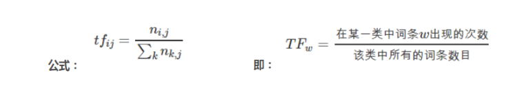

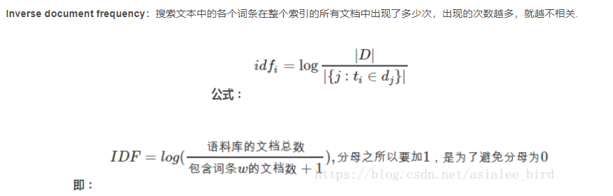

其中，**i为某个词语，N为文档的总数量，n为包含某词语的文档数量。IDF的意义是词语重要程度的度量。如果一个词只在一个文档中出现，则该词是这个文档独特性的一种体现；反之，如果一个词在很多个文档中出现，则该词很可能是一个通用词语，它对文档之间区分度的贡献不高。**

有了TF和IDF的定义，最终TF-IDF值的定义为：TF-IDF=TF·IDF

TF-IDF为什么不只依赖于词频，还要依赖于反向文档频率呢？

文档长度影响：词频越高不代表越相关，比如A文档只有10个词并命中了1个关键字，而B文档有100个词并命中了5个关键字，此时A文档词频是更高的，但是不一定A文档比B文档更相关
常见词影响：如果只看文档的局部词频，那么常见词的影响会很大，并且搜索出来的结果也并不一定相关
所以综合文档长度影响和常见词影响，不只需要考虑文档局部词频，还需要综合考虑该关键字在全部文档中出现次数，以获取更相关的评分。

### 3.2.2 向量空间模型

在文本挖掘领域，一般将文本分词后进行向量化处理。每个词作为一个维度，将词的TF-IDF值作为该维度的值。假设某个文档由n个词语组成，每个词语的TF-IDF用S表示，则向量可以表示为一个一维数组：

V=[S1,S2,…,Sn]

假设查询词为“金都酒店”，查询词中“金都”不是很常见，其TF-IDF值假设为8，几乎每个文档中都包含“酒店”，因此假设“酒店”的TF-IDF值为6。所以，查询词的向量化表示为[8,6]，在二维直角坐标系中画一条直线，起点为[0,0]，终点为[8,6]，如图6.1所示。

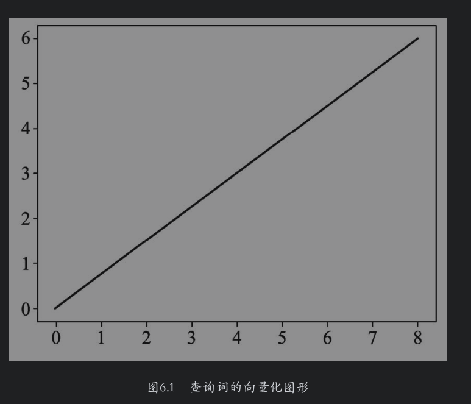

鉴于查询词只包含“金都”和“酒店”两个词，因此在后续的匹配过程中，只使用这两个维度和候选文档进行匹配。假设有如下三个文档：

·文档1为金都又金都酒店，因为其包含两个“金都”，所以“金都”的TF-IDF值可以更大一些，例如10，则该文档的向量化表示为[10,6]。

·文档2为文雅酒店，则其向量化表示为[0,6]。

·文档3为金都客栈，则其向量化表示为[8,0]。

在二维空间上根据查询词和候选文档进行绘图，如图6.2所示。

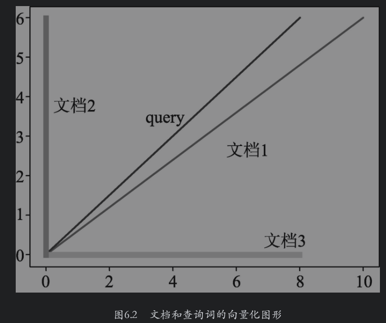

对于以上文档向量，**如果其和查询词向量的夹角比较小，则两个向量最接近；反之，则文档和查询词向量相似度降低。**

### 3.2.3 BM25算法简介

在 ES5.0 版本之前其实一直都是使用TF-IDF来计算相似度评分，但由于下面的这些缺陷，它后来转而使用BM25：

**未考虑文档长度影响：1000个词的文档含有10个关键词，比10个词的文档含有1个词，相似度并不一定更高，因为文档越长所含的关键字也会更多**
**未考虑词频饱和度：词频饱和度指的是当词频超过一定数量之后，它对相关度的影响将趋于饱和。换句话说，词频10次的相关度比词频1次的分值要大很多，但100次与10次之间差距就不会那么明显了**

基于上述两个原因，ES 5.0之后采用了BM25算法作为默认的相似度评分算法，BM25算法实际上也借鉴了TF-IDF算法的思想，随着词频的变大和逆向文档频率的变小，相似度会变大，但是不同之处在于考虑了文档长度影响以及词频饱和度，BM25的计算式基于贝叶斯定律推导，是一种概率评分模型，实际上可描述为 IDF * TF
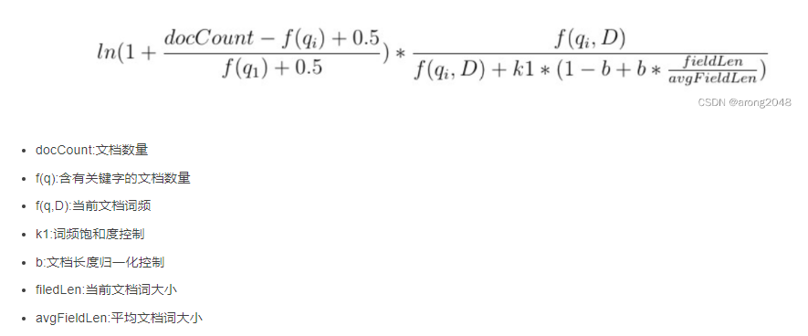

**BM25词频饱和度控制**
在BM25算法中，控制词频饱和度的参数是k1，默认值为1.2，参数k1的值越小词频对相关度的影响就会越快趋于饱和，而值越大词频饱和度变化越慢。

**BM25长度归一化控制**
长度归一化控制也就是文档长度控制，引入了b作为控制因子，使用当前文档长度及平均文档长度的比值来归一化文档长度的影响，当当前文档长度大于平均文档长度时则整体得分会被惩罚。b=0则不开启长度归一化，b=1则完全开启长度归一化， b默认=0.75。

当前的商用搜索引擎一般都使用BM25算法对搜索结果进行排序，**从6.X开始，ES默认使用该算法对搜索的文档进行排序。与向量空间模型不同，BM25算法使用的是概率模型，它属于bag-of-words模型**。bag-of-words模型**只考虑文档中单个词的词频，不考虑句子结构或者词与词之间的顺序等关系**。该算法的推导部分本节不进行讨论，下面直接给出BM25算法的打分公式：

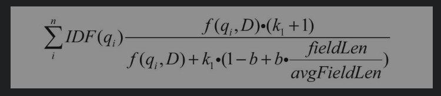

搜索时，ES对搜索文本进行分词，qi代表每一个被切分的词语，文档的最终得分是文档与这些词语的匹配值之和。

在公式中可以看到熟悉的IDF，但是这里的IDF值的计算方法和3.2.1节中介绍的有些区别，其计算公式为：

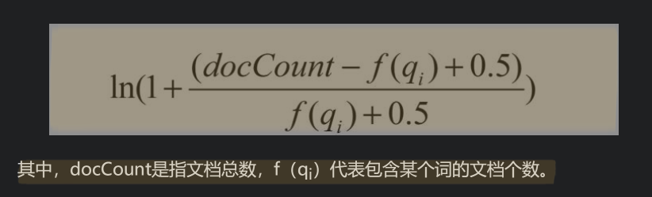

一般来说，**文档如果足够短，则其分值应该更高**。例如，在酒店的名称和描述中搜索“金都酒店”，如果酒店A的名称中包含“金都”和“酒店”这两个词，而酒店B的简介中包含这两个词，则酒店A的分值肯定比酒店B要高一些。基于此，在上面的公式中使用了文档长度除以文档的平均长度，即fieldLen/avgFieldLen。**当然，这里的两个长度指的是文档被分词以后词语的个数。可以看到，这个比值放在公式的分母位置，这也彰显出该比值和总分是负相关的。即如果文档长度大于平均长度，则总分降低；反之，如果文档长度小于平均长度，则总分升高。**

为了控制文档长度对总分的影响，在文档长度除以文档的平均长度这个比值前面添加了一个参数b。**如果该值较大，则当前文档长度对其总分的影响加大；如果该值较小，则当前文档长度对其总分的影响减弱；如果b为0，则直接忽略文档长度对其总分的影响。**

我们知道，**词语在文档中出现的频率越高，文档与该词语相关的可能性就越大。因此，在上面的公式中，增加了f（qi,D），表示提升词语在文档中的频率**。如果**一个词语属于高频词并且在多个文档中出现**，那么它在当前的文档中出现的频率也很大，甚至抵消了IDF的值，这时候如果不加以限制，这种词会极大地提升文档的相关性。

因此在**上面的公式中使用k1对上述情况加以限制，让过高的TF值不产生过大的影响**。如图6.3所示为TF-IDF和BM25的TF对相关性的影响，该图来自ES的官方博客。从图6.3中可以看出，BM25引入k1变量以后，词语在文档中的TF值在1～10时，其正向影响急速上升，但是当TF值大于10时，其影响接近于上限，而TF-IDF的文档相关性却随着TF值的不断增大而增大。

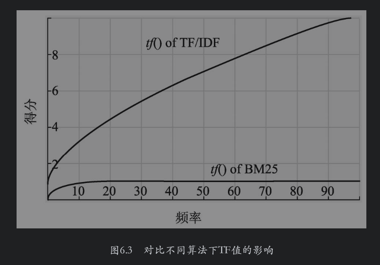

说明：图6.3中的tf()of TF/IDF表示随着TF值的增大TF-IDF文档相关性的变化趋势；“tf()of BM25”表示随着TF值的增大BM25文档相关性的变化趋势。

为方便与后面的例子进行对比，下面对公式进行简单地变换：

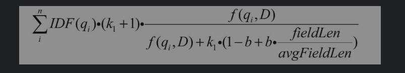

在上述变换后的公式中，将（k1+1）单独提了出来，是为了后面介绍实例解析时方便对照explain结果中的boost和TF值。

### 3.2.4 BM25实例解析

下面结合实例对BM25算法的计算结果进行解析。为了简单起见，此处创建的酒店索引只包含一个字段title，定义索引的DSL如下：

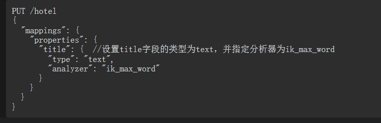

首先写入下面的数据：

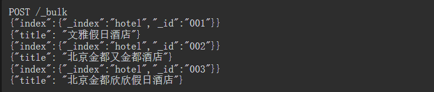

下面使用match搜索文档并开启explain功能：

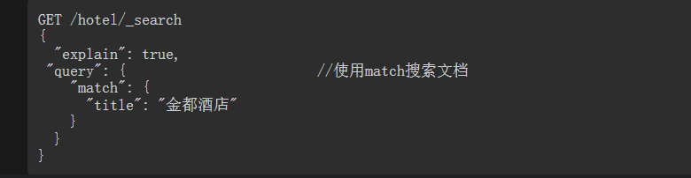

为方便阐述，下面把explain的一部分打分结果进行折叠：

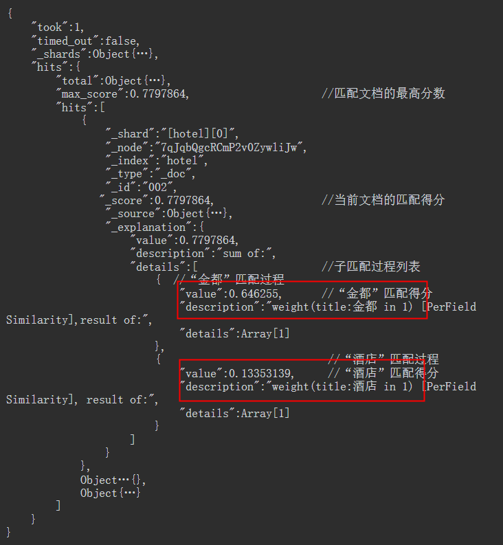

通过以上结果可以看到，搜索“金都酒店”时，ES将查询词拆分成“金都”和“酒店”分别和索引中的文档进行匹配。其中，文档002和查询词匹配的得分最高，值为0.7797864，该值为“金都”和文档002的匹配分（分值为0.646255）与“酒店”和文档002的匹配分（分值为0.13353139）之和。很明显，“酒店”和文档002的匹配分偏低，**主要是因为“酒店”的IDF值比较低（在多个文档出现，属于高频词）。**

现在我们把焦点聚集在“金都”和文档002的匹配分上，其得分0.646255=boost·IDF·TF，这部分的explain描述如下：

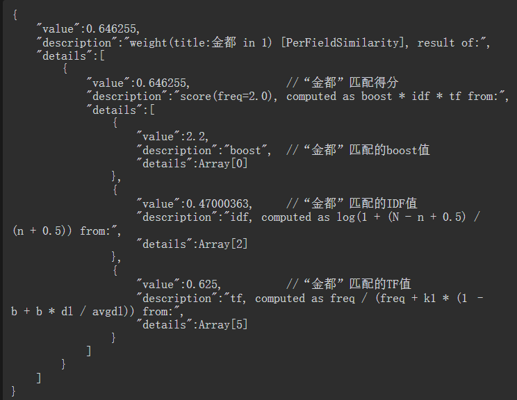

上述结果中将匹配得分拆成了三部分，即boost、IDF和TF，score=boost·IDF·TF。下面分别对这三部分进行介绍。（总文档数3，包含金都的文档数2 --》IDF    TF 词频：见下图 当前文档词频2，文档长度5，平均文档长度5）

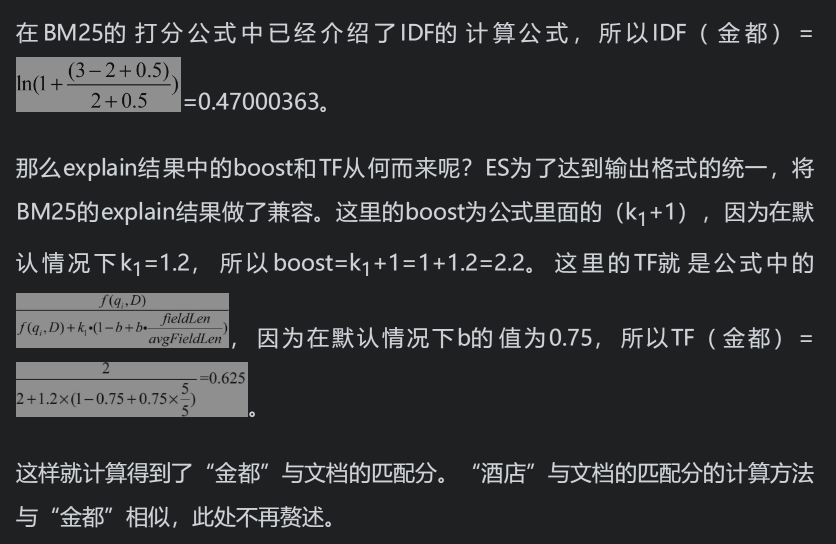

### 3.2.5 BM25参数调节

通过前面的介绍可以知道，BM25算法的打分公式中有两个参数，**即k1和b，分别用来控制TF和文档长度对打分的影响。**在ES中，这两个参数的默认值分别为1.2和0.75。一般情况下，使用这两个参数的默认值已经能够提供不错的搜索效果，因此不需要更改。不过ES还是开放了参数调节的功能，用户可以在索引的settings中调节这两个参数来影响打分。在settings中，可以自定义一个相似度算法，然后指定该算法使用BM25算法，并对参数k1和参数b进行设置。参数k1的值一般介于1.2～2.0，参数b的值一般为0.3～0.9。

以下示例更改了k1和b的值，将k1调整为2，将b调整为0.7。

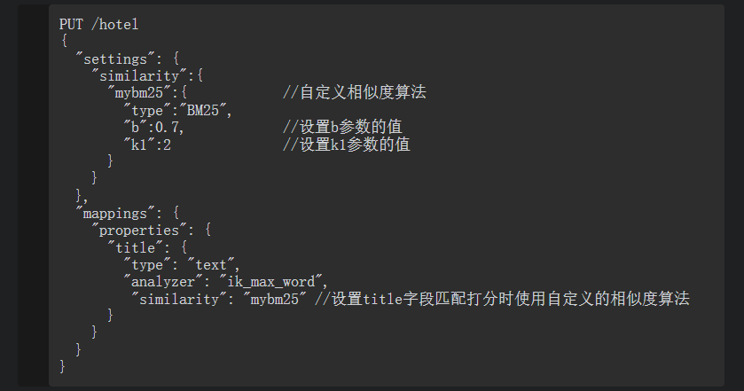

在不同的场景中，b和k1的取值是不同的，没有放之四海而皆准的方案，需要不断地调试并观察它们对于总体排序的影响，这样才能获得符合当前场景预期的排序结果的最佳方案。

### **3.2.6 分布式场景对排序的影响**

在前面介绍IDF时，某个词语的IDF值的计算过程依赖于包含该词的文档个数。

**在理想情况下，我们希望计算索引中所有包含该词的文档个数。但是在分布式场景中，这种想法是不现实的，因为在多分片模式下，出于性能方面的原因，不可能在短时间内将这些文档都找到。因此在ES内部，IDF的计算是在当前分片内进行的。**

**文档分布不均匀时，每个分片内的IDF值可能是不一样的。假设当前索引中有10个文档都包含“金都”，其中有8个文档存储在分片1上，剩下的2个文档存储在分片2上。在这种情况下，两个分片“金都”中的IDF值是不同的。**

不过不用过于担心这种情况，因为在绝大多数生产环境中，文档的分布都是比较均匀的。可能索引刚刚建立后，文档比较少，有分布不均匀的情况，随着文档逐渐增多，数据分布将逐渐趋于均匀。

如果文档确实比较少，多个分片的IDF值不同，**用户希望使用整个索引文档的IDF，则可以设置索引的主分片数为1，这样便可以解决该问题。但是需要切记，进行这种设置的前提是文档比较少。**以下示例中将索引的主分片数设置为了1。

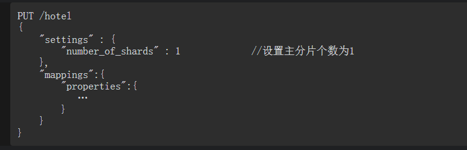

### 3.2.7 使用其他相关性算法

通过前面的介绍我们知道，BM25为ES默认的相关性排序算法。**ES还提供了其他相关性排序算法，如DFR算法、DFI算法、IB算法、LM算法和Dirichlet算法等。这些算法在搜索场景中不常用**，因此其具体使用方法和参数含义这里不做介绍。下面仅通过一个示例简单说明如何使用DFR相关性算法，并设置其参数basic_model、after_effect和normalization的值。

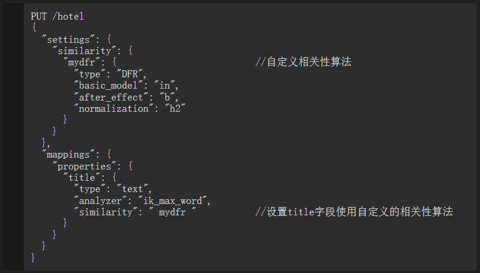