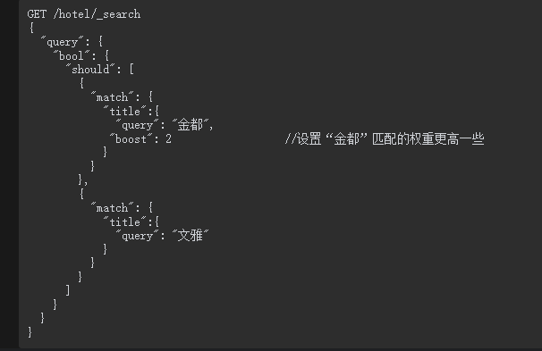

# 3.3 Elasticsearch从入门到放弃-权重及打分

文档摘自《Elasticsearch搜索引擎构建入门与实战》

参考：

```
https://blog.csdn.net/qq_29860591/article/details/109574595
https://blog.csdn.net/pbrlovejava/article/details/122290078
https://www.cnblogs.com/huan1993/p/15416099.html    elasticsearch地理位置查询
https://www.freesion.com/article/5162262542/#41__364   FUNCTION_SCORE详解
```

## 1.查询时设置权重

在默认情况下，这些查询的权重都为1，也就是查询之间都是平等的。有时我们希望某些查询的权重高一些，也就是在其他条件相同的情况下，匹配该查询的文档得分更高。此时应该怎么做呢？本节将介绍的boosting查询和boost设置可以满足上述查询需求。

### 1.1 查询时boost参数的设置

在ES中可以通过查询的boost值对某个查询设定其权重。在默认情况下，所有查询的boost值为1。但是当设置某个查询的boost为2时，不代表匹配该查询的文档评分是原来的2倍，而是代表匹配该查询的文档得分相对于其他文档得分被提升了。例如，可以为查询A设定boost值为3，为查询B设定boost值为6，则在进行相关性计算时，查询B的权重将比查询A相对更高一些。

**boost值的设置只限定在term查询和类match查询中，其他类型的查询不能使用boost设置。boost值没有特别约束，因为它代表的是一个相对值。当该值在0～1时表示对权重起负向作用，当该值大于1时表示对权重起正向作用。**


在上面的DSL中设定了索引的主分片数为1，这是为了方便计算文本的IDF值，现在向索引中写入数据：


下面对索引进行查询，假设“金都”或者“文雅”是两个酒店的品牌，用户想查询标题中包含“金都”或者“文雅”的酒店文档：


在默认情况下，各个子查询的boost值为1，也就是说上述的两个match查询是平等的。文档的分值等于两个match相关性分数之和。执行上述DSL后结果如下：


通过上述结果可以看到，“金都”品牌的酒店文档的打分相对低一些，如果想对“金都”品牌的酒店进行推广，也就是提升标题中包含“金都”这些文档的排序分值，则可以设定“金都”的match查询的boost值更高一些，例如下面的DSL：



执行上述DSL后，ES的返回结果如下：


如上所示，设定的boost值提升了标题中包含“金都”的文档的得分。现在我们来思考一下上述match查询的打分细节，通过6.1节可以知道，在默认情况下，文档的boost为BM25中的k1+1，因为在默认情况下k1=1.2，所以boost=k1+1=1.2+1=2.2。当在match查询中设置boost为2时，匹配该查询文档的最终boost=（k1+1）×2=（1.2+1）×2=4.4。可以使用explain进行验证：


下面将上述DSL执行后的部分结果进行折叠，仅显示第一个文档的打分细节：


通过上面的结果可以看到，title字段使用标准分析器，设置“金都”这个match查询的boost值为2后，在查询时“金都”被切分成“金”“都”，这两个切分的字在BM25查询中的最终boost值都为4.4。因此设置match查询的boost参数可以直接影响BM25的评分机制，从而影响整体结果的相关度。更近一步说，设置boost参数为某个值后并不是将查询命中的文档分数乘以该值，而是将BM25中的boost参数乘以该数值。

### 1.2 在Java客户端中使用boost参数

在Java客户端中使用boost参数时，只需要在QueryBuilder实例中调用boost()方法即可，以下Java代码和上面的DSL在搜索结果上是等效的：


### 1.3  boosting查询

**虽然使用boost值可以对查询的权重进行调整，但是仅限于term查询和类match查询。**有时需要调整更多类型的查询，如搜索酒店时，需要将房价低于200的酒店权重降低，此时可能需要用到range查询，但是range查询不能使用boost参数，这时可以使用ES的boosting查询进行封装。

**ES的boosting查询分为两部分，一部分是positive查询，代表正向查询，另一部分是negative查询，代表负向查询。**可以通过negative_boost参数设置负向查询的权重系数，该值的范围为0～1。最终的文档得分为：正向匹配值+负向匹配值×negative_boost。

### 1.4 简单函数


### 1.5 衰减函数


### 1.6 Script Score

#### 1.6.1 Painless简介

### 1.7 二次打分


## 2 基于地理位置查询

### 2.1 基于地理位置查询

随着互联网+的热门，越来越多的传统行业将全部或者部分业务转移到互联网上，其中不乏一些和地理位置强相关的行业。基于地理位置的搜索功能，大大提升了人们的生活和工作效率。例如，外出旅行时，只需要用手机打开订酒店的应用软件，查找附近心仪的酒店下单即可；又或者打车行业，人们不用在寒冷的户外去拦截出租车，只需要在室内打开手机里的打车App定位到当前位置，然后确定目的地，系统就可以为附近的车辆派发订单。

幸运的是，ES为用户提供了基于地理位置的搜索功能。**它主要支持两种类型的地理查询：一种是地理点（geo_point），即经纬度查询，另一种是地理形状查询（geo_shape），即支持点、线、圆形和多边形查询等**。

从实用性上来说，地理点（即geo_point）数据类型的使用更多一些，因为篇幅所限，本节只对地理点类型进行详细介绍。

对应于geo_point字段类型的查询方式有3种，分别为geo_distance查询、geo_bounding_box查询和geo_polygon。

geo_distance查询方式需要用户指定一个坐标点，在指定距离该点的范围后，ES即可查询到相应的文档。假设北京天安门的经纬度为[116.4039,39.915143]，以下为使用geo_distance查询所找到的天安门5km范围内的酒店：


Java客户端使用QueryBuilders.geoDistanceQuery()方法构建geo_distance请求，同时可以设置基准点坐标和周边距离。以下代码展示了geo_distance请求的使用逻辑：


geo_shape查询提供的是矩形内的搜索，需要用户给出左上角的顶点地理坐标和右下角的顶点地理坐标。假设定义国贸商圈为一个矩形，其左上角顶点的经纬度为[116.457044,39.922821]，右下角顶点的经纬度为[116.479466,39.907104]，则在国贸商圈内搜索酒店的DSL如下：


geo_polygon比geo_shape提供的地理范围功能更加灵活，它支持多边形内的文档搜索，使用该查询需要提供多边形所有顶点的地理坐标。假设北京地坛公园商圈的地形为三角形，该三角形的三个顶点的经纬度分别为[116.417088,39.959829]、[116.432035,39.960272]和[116.421399,39.965802]，则在地坛公园商圈内搜索酒店的DSL语句如下：


Java客户端使用QueryBuilders.geoPolygonQuery()方法构建geo_polygon请求，在构建请求之前，需要将多边形的顶点事先准备好。以下代码展示了geo_polygon请求的使用逻辑：


### 2.2 按地理距离排序

前面我们介绍了ES提供的基于地理位置的查询功能，使用geo_distance查询，配合sort可以指定另一种排序规则，即按照文档坐标与指定坐标的距离对结果进行排序。使用时，需要在sort内部指定排序名称为geo_distanc，并指定目的地坐标。除了可以指定升序或者降序排列外，还可以指定排序结果中sort子句中的距离的计量单位，默认值为km即千米。在进行距离计算时，系统默认使用的算法为arc，该算法的特点是计算精准但是耗费时间较长，用户可以使用distance_type参数选择另一种计算速度快但经度略差的算法，名称为plane。如下示例使用geo_distance查询天安门5km范围内的酒店，并按照距离由近及远进行排序：


在Java客户端中对geo_distance的搜索结果进行排序时，可以调用SortBuilders.geo DistanceSort()方法新建geo_distance查询对象的实例，然后将该实例传给searchSource Builder.sort()方法即可完成按照距离排序的要求。对应上面的排序DSL，Java代码如下：


但是这种排序有些绝对性，有些时候排序可能不只是距离一个标准。例如当搜索酒店时，酒店距离当前位置越近越好。假定距离当前位置1km范围内的酒店都可以接受，如果使用过滤器将超过1km的酒店排除掉，**这种做法未免有些“生硬”**。假设一个酒店距离当前位置刚好是1.1km，其好评度也不错，那么是可以考虑一下该酒店的。所以我们希望酒店最好距离当前位置在1km范围内，如果超过1km，酒店的评分应该随着距离的增大有一个明显的下降趋势。为了解决这类问题，可以使用上文中提到的**衰减函数**。下文中会介绍一些实战应用。


## 3 代码中的几种实战场景

### 场景1：高斯衰减函数-同下

场景：商品价格300-400优先展示

```
       GaussDecayFunctionBuilder price = ScoreFunctionBuilders.gaussDecayFunction("price", 350, 50, 50, 0.2).setWeight(500);
            FunctionScoreQueryBuilder.FilterFunctionBuilder priceFunctionBuilder = new FunctionScoreQueryBuilder.FilterFunctionBuilder(price);
            functionBuilders.add(priceFunctionBuilder);
```


### 场景2：基于地理位置查询-距离函数

参考文档 ：

https://www.cnblogs.com/huan1993/p/15416099.html    elasticsearch地理位置查询

https://www.freesion.com/article/5162262542/#41__364   FUNCTION_SCORE详解


```java
/@Component
public class TestConfig3 implements ApplicationListener {

    @Autowired
    private RestHighLevelClient client;

    private ElasticsearchRestTemplate elasticsearchRestTemplate;
    public static final String INDEXNAME="stores_test";

    @Override
    public void onApplicationEvent(ApplicationEvent event) {
        if (event instanceof ContextRefreshedEvent) {
            try {
                // 1、构建查询请求 SearchRequest
                SearchRequest searchRequest = new SearchRequest(INDEXNAME);
                SearchSourceBuilder sourceBuilder = new SearchSourceBuilder();
                //计算位置并查询
                long nowtime = System.currentTimeMillis();
                //查询某个默认经纬度为基准   2公里米范围内 
                double lat=30.183794918767084;
                double lon=120.19081557616879;

                BoolQueryBuilder boolQueryBuilder = QueryBuilders.boolQuery();
                
                GeoDistanceQueryBuilder geoDistanceQueryBuilder = QueryBuilders.geoDistanceQuery("location").point(lat, lon)
                        .distance(2, DistanceUnit.KILOMETERS);
                boolQueryBuilder.filter(geoDistanceQueryBuilder);
                
                //按距离排序
                GeoDistanceSortBuilder geoDistanceSortBuilder= SortBuilders.geoDistanceSort("location",lat, lon).point(lat,lon).unit(DistanceUnit.KILOMETERS).order(SortOrder.ASC);
                
                FunctionScoreQueryBuilder.FilterFunctionBuilder[] filterFunctionBuilders = new FunctionScoreQueryBuilder.FilterFunctionBuilder[2];
                //距离打分按照高斯衰减函数：当前默认位置，2km以内权重最高 2km->(2+3)Km曲线衰减，衰减率降到0.4；5KM以上评分更低
                GaussDecayFunctionBuilder locationGaussDecayFunctionBuilder=ScoreFunctionBuilders.gaussDecayFunction("location",new GeoPoint(lat, lon),"2km","3km",0.4).setWeight(2);
                  //时间按照高斯衰减函数：当前时间，2天以内权重最高，都是1 2km->(2+1)d曲线衰减，衰减率降到0.4；3天以上评分更低
                GaussDecayFunctionBuilder createTimeGaussDecayFunctionBuilder=ScoreFunctionBuilders.gaussDecayFunction("createTime",System.currentTimeMillis(),"2d","1d",0.4).setWeight(3);
                filterFunctionBuilders[1]=new FunctionScoreQueryBuilder.FilterFunctionBuilder(boolQueryBuilder, locationGaussDecayFunctionBuilder);
                filterFunctionBuilders[2]=new FunctionScoreQueryBuilder.FilterFunctionBuilder(boolQueryBuilder, createTimeGaussDecayFunctionBuilder);
                FunctionScoreQueryBuilder functionScoreQuery = QueryBuilders.functionScoreQuery(boolQueryBuilder, filterFunctionBuilders).scoreMode(FunctionScoreQuery.ScoreMode.SUM).boostMode(CombineFunction.SUM);
                //排序
                if (ObjectUtil.isNotEmpty(searchKey)) {
                    sourceBuilder.sort("_score", SortOrder.DESC).sort("createTime",SortOrder.ASC).sort(geoDistanceSortBuilder);
                }else{
                    sourceBuilder.query(functionScoreQuery).from(0).size(5).sort("createTime",SortOrder.ASC).sort(geoDistanceSortBuilder);
                }
                searchRequest.source(sourceBuilder.query(boolQueryBuilder));
                client.searchAsync(searchRequest, RequestOptions.DEFAULT, new ActionListener<SearchResponse>() {
                     @Override
                     public void onResponse(SearchResponse searchResponse) {
                         System.out.println("SearchRequest耗时：" + (System.currentTimeMillis() - nowtime) + "结果集");
                         if(ObjectUtil.isNotEmpty(searchResponse.getHits())){
                             searchResponse.getHits().forEach(v-> {
                                 if(String.valueOf(v.getSortValues()[1]).equals("Infinity")){
                                     System.out.println(JSON.toJSONString(v.getSourceAsMap()) + "---距离" +  "超过2000km");
                                 }else {
                                     System.out.println(JSON.toJSONString(v.getSourceAsMap()) + "---距离" + new BigDecimal(String.valueOf(v.getSortValues()[2])).setScale(2, RoundingMode.HALF_UP) + "km");
                                 }
                             });
                         }else{
                             System.out.println("");
                         }
                     }

                     @Override
                     public void onFailure(Exception e) {
                             e.printStackTrace();
                     }
                 });
                //删除测试索引
//                GetIndexRequest e_request2 = new GetIndexRequest(INDEXNAME);
//                boolean exist2 = client.indices().exists(e_request2, RequestOptions.DEFAULT);
//                if (exist2) {
//                    DeleteIndexRequest request = new DeleteIndexRequest(INDEXNAME);
//                    AcknowledgedResponse delete = client.indices().delete(request, RequestOptions.DEFAULT);
//                    System.out.println(" DeleteIndexRequest删除索引--------" + delete.isAcknowledged());
//                }
            } catch (Exception e) {
                e.printStackTrace();
            }
        }
    }


}
```


### 场景3：综合打分

距离5km以内；分别按照在售商品数量权重，星级，店铺评分，商品评分权重查询

```java
 SearchSourceBuilder sourceBuilder = new SearchSourceBuilder();
        sourceBuilder.highlighter();// 高亮
        String[] includes = {"storeId", "supplierId", "storeName", "signPic", "storeStar", "location", "stars", "features", "salesSumTrue", "provinceName", "cityName", "districtName", "onSaleGoodsCount"};
        String[] excludes = {"sellerCity", "sellerDistinct", "sellerProvince", "provinceCode", "cityCode", "districtCode"};
        sourceBuilder.fetchSource(includes, excludes);

        BoolQueryBuilder boolQueryBuilder = QueryBuilders.boolQuery();
//经纬度--》默认5km以内店铺
if (searchStoreParam.getDistance() == null || searchStoreParam.getDistance() <= 0) {
            searchStoreParam.setDistance(5000L);
        }
         if (ObjectUtil.isNotEmpty(searchStoreParam.getLatitude()) && ObjectUtil.isNotEmpty(searchStoreParam.getLongitude())) {
            double latitude = new BigDecimal(searchStoreParam.getLatitude()).doubleValue();
            double longitude = new BigDecimal(searchStoreParam.getLongitude()).doubleValue();
            GeoDistanceQueryBuilder geoDistanceQueryBuilder = QueryBuilders.geoDistanceQuery("location").point(latitude, longitude)
                    .distance(searchStoreParam.getDistance(), DistanceUnit.METERS);
            boolQueryBuilder.filter(geoDistanceQueryBuilder);
        }

        //省级行政区编码
        if (searchStoreParam.getProvinceCode() != null && searchStoreParam.getProvinceCode() > 0L) {
            TermQueryBuilder termQueryBuilder = QueryBuilders.termQuery("provinceCode", searchStoreParam.getProvinceCode());
            boolQueryBuilder.must(termQueryBuilder);
        }
        //市级行政区编码
        if (searchStoreParam.getCityCode() != null && searchStoreParam.getCityCode() > 0L) {
            TermQueryBuilder termQueryBuilder = QueryBuilders.termQuery("cityCode", searchStoreParam.getCityCode());
            boolQueryBuilder.must(termQueryBuilder);
        }
        //区县级行政区编码
        if (searchStoreParam.getDistrictCode() != null && searchStoreParam.getDistrictCode() > 0L) {
            TermQueryBuilder termQueryBuilder = QueryBuilders.termQuery("districtCode", searchStoreParam.getDistrictCode());
            boolQueryBuilder.must(termQueryBuilder);
        }
        //星级查询
        if (searchStoreParam.getStars() != null && searchStoreParam.getStars() > 0L) {
            TermQueryBuilder termQueryBuilder = QueryBuilders.termQuery("stars", searchStoreParam.getStars());
            boolQueryBuilder.must(termQueryBuilder);
        }
        //店铺id
        if (ObjectUtil.isNotEmpty(searchStoreParam.getStoreIds())) {
            TermsQueryBuilder termQueryBuilder = QueryBuilders.termsQuery("storeId", searchStoreParam.getStoreIds());
            boolQueryBuilder.must(termQueryBuilder);
        }
List<FunctionScoreQueryBuilder.FilterFunctionBuilder> scoreFunctionBuilderList = new ArrayList<>();

//在售商品数量权重
            if (ObjectUtil.isNotEmpty(searchStoreParam.getIsAgritainment()) && searchStoreParam.getIsAgritainment().equals(1) || searchSort.equals(0)) {
                ScoreFunctionBuilder<?> onSaleGoodsCountFunction = ScoreFunctionBuilders.fieldValueFactorFunction("onSaleGoodsCount").setWeight(3f)
                        .missing(1d)
                        .modifier(FieldValueFactorFunction.Modifier.NONE).factor(10f);
                FunctionScoreQueryBuilder.FilterFunctionBuilder onSaleGoodsCountScore = new FunctionScoreQueryBuilder.FilterFunctionBuilder(onSaleGoodsCountFunction);
                scoreFunctionBuilderList.add(onSaleGoodsCountScore);
            }
//星级权重
            if (searchSort.equals(2) || searchSort.equals(0)) {
                ScoreFunctionBuilder<?> starsScoreFunction = ScoreFunctionBuilders.fieldValueFactorFunction("stars").setWeight(3f)
                        .missing(1d)
                        .modifier(FieldValueFactorFunction.Modifier.NONE).factor(10f);
                FunctionScoreQueryBuilder.FilterFunctionBuilder starsScore = new FunctionScoreQueryBuilder.FilterFunctionBuilder(starsScoreFunction);
                scoreFunctionBuilderList.add(starsScore);
            }
//店铺评分优先：增加店铺评分权重
            if (searchSort.equals(3)) {
                ScoreFunctionBuilder<?> starsScoreFunction = ScoreFunctionBuilders.fieldValueFactorFunction("storeStar").setWeight(3f)
                        .missing(1d)
                        .modifier(FieldValueFactorFunction.Modifier.LOG1P).factor(10f);
                FunctionScoreQueryBuilder.FilterFunctionBuilder starsScore = new FunctionScoreQueryBuilder.FilterFunctionBuilder(starsScoreFunction);
                scoreFunctionBuilderList.add(starsScore);
            }
//店铺商品评价评分优先：增加店铺商品评价评分权重
            if (searchSort.equals(4)) {
                ScoreFunctionBuilder<?> starsScoreFunction = ScoreFunctionBuilders.fieldValueFactorFunction("goodsStar").setWeight(3f)
                        .missing(1d)
                        .modifier(FieldValueFactorFunction.Modifier.NONE).factor(10f);
                FunctionScoreQueryBuilder.FilterFunctionBuilder starsScore = new FunctionScoreQueryBuilder.FilterFunctionBuilder(starsScoreFunction);
                scoreFunctionBuilderList.add(starsScore);
            }
        }
//创建时间权重
//            ScoreFunctionBuilder<?> createTimeScoreFunction = ScoreFunctionBuilders.fieldValueFactorFunction("createTime").setWeight(300f)
//                .missing(1000 * 86400 * 365d)
//                .modifier(FieldValueFactorFunction.Modifier.LOG1P).factor(1f);
//            FunctionScoreQueryBuilder.FilterFunctionBuilder createTimeScore = new FunctionScoreQueryBuilder.FilterFunctionBuilder(createTimeScoreFunction);
//            scoreFunctionBuilderList.add(createTimeScore);

//综合上述权重
        FunctionScoreQueryBuilder.FilterFunctionBuilder[] filterFunctionBuilders = new FunctionScoreQueryBuilder.FilterFunctionBuilder[scoreFunctionBuilderList.size()];
        for (int i = 0; i < scoreFunctionBuilderList.size(); i++) {
            filterFunctionBuilders[i] = scoreFunctionBuilderList.get(i);
        }
//权重求和
        FunctionScoreQueryBuilder functionScoreQuery = QueryBuilders.functionScoreQuery(boolQueryBuilder, filterFunctionBuilders).scoreMode(FunctionScoreQuery.ScoreMode.SUM).boostMode(CombineFunction.SUM);
        sourceBuilder.query(functionScoreQuery);

//排序
if (searchSort.equals(1)) {
            //距离优先
            if (ObjectUtil.isNotEmpty(geoDistanceSortBuilder)) {
                sourceBuilder.sort(geoDistanceSortBuilder);
            }
            sourceBuilder.sort("_score", SortOrder.DESC);
        } else {
            //其他优先
            sourceBuilder.sort("_score", SortOrder.DESC);
            if (ObjectUtil.isNotEmpty(geoDistanceSortBuilder)) {
                sourceBuilder.sort(geoDistanceSortBuilder);
            }
        }

//查询
  sourceBuilder.timeout(TimeValue.timeValueSeconds(2));

        // 设置分页查询
        int start = searchStoreParam.getPageSize() * (searchStoreParam.getStartPage() - 1);
        if (start < 0) start = 0;
        sourceBuilder.from(start);
        sourceBuilder.size(searchStoreParam.getPageSize());
        // 3、搜索条件放入请求当中
        request.source(sourceBuilder);
        logger.info("store search params ==>" + sourceBuilder.toString());
        // 4、执行请求 client上线
        SearchResponse response = null;
        try {
            response = client.search(request, RequestOptions.DEFAULT);
        } catch (IOException e) {
            logger.error("店铺查询异常：", e);
        }
```


### 场景4：批量更新-painless的使用实践

```
https://www.elastic.co/guide/en/elasticsearch/painless/7.16/painless-api-reference-shared-java-util.html#painless-api-reference-shared-HashMap  es官网hashmap结构函数

https://blog.csdn.net/laoyang360/article/details/121738408  Elasticsearch Painless 脚本 ctx、doc、_source 的区别是什么
```

场景：在一些对实时性要求比较高的场景，需要实时更新ES中的状态信息；

一种方案是根据canal订阅binlog同步日志到MQ,然后异步更新；

一种是通过业务发消息到MQ，异步解耦更新；

比如：首页信息流中，商品上下架：可能涉及到不同推荐类型的文档批量更新。比如：店铺的商品信息要下架，比如商品视频，商品评论要下架

文档格式如下：

```json
//店铺
{
  "took" : 0,
  "timed_out" : false,
  "_shards" : {
    "total" : 1,
    "successful" : 1,
    "skipped" : 0,
    "failed" : 0
  },
  "hits" : {
    "total" : {
      "value" : 6,
      "relation" : "eq"
    },
    "max_score" : 1.0,
    "hits" : [
      {
        "_index" : "homepage_recommend_test",
        "_type" : "_doc",
        "_id" : "127083834393067520_4",
        "_score" : 1.0,
        "_source" : {
          "cityCode" : 1,
          "createTime" : 1658474106000,
          "districtCode" : 17,
          "goods" : [
            {
              "backendCategoryId" : "_5_1546_1547_",
              "currentBackendCategoryId" : "1547",
              "goodId" : 490132,
              "goodName" : "吃红烧肉啦啦",
              "goodsImageUrl" : "https://1111.jpeg",
              "goodsVideoUrl" : "",
              "isOnSale" : 1,   //电批商品上下架状态
              "parentBackendCategoryId" : "1546",
              "sellCount" : 1
            }
          ],
          "id" : "127083834393067520_4",
          "isDelete" : 0,   //店铺上下架状态
          "isRecommend" : 0,
          "processTime" : 1659077746000,
          "provinceCode" : 43282904292360190,
          "recommendId" : 127083834393067520,
          "recommendName" : "蜡笔小新",
          "recommendType" : 4,
          "url" : "https://2222.jpeg"
        }
      }
        ]
  }
}
//视频
{
  "took" : 0,
  "timed_out" : false,
  "_shards" : {
    "total" : 1,
    "successful" : 1,
    "skipped" : 0,
    "failed" : 0
  },
  "hits" : {
    "total" : {
      "value" : 6,
      "relation" : "eq"
    },
    "max_score" : 1.0,
    "hits" : [
      {
        "_index" : "homepage_recommend_test",
        "_type" : "_doc",
        "_id" : "19_7",
        "_score" : 1.0,
        "_source" : {
          "cityCode" : 1,
          "createTime" : 1658917361000,
          "districtCode" : 17,
          "goods" : [
            {
              "backendCategoryId" : "_1_11_27_155_",
              "currentBackendCategoryId" : "155",
              "goodId" : 43070,
              "goodName" : "测试商品商品AA",
              "goodsImageUrl" : "https://232323.png",
              "goodsVideoUrl" : "",
              "isOnSale" : 1,
              "parentBackendCategoryId" : "27",
              "sellCount" : 111213
            },
            {
              "backendCategoryId" : "_1_87_107",
              "currentBackendCategoryId" : "107",
              "goodId" : 3819,
              "goodName" : "塘栖粢毛肉圆  350g装4盒",
              "goodsImageUrl" : "https://1111.png",
              "goodsVideoUrl" : "",
              "isOnSale" : 1,
              "parentBackendCategoryId" : "87",
              "sellCount" : 438
            },
            {
              "backendCategoryId" : "_1_11_27_157",
              "currentBackendCategoryId" : "157",
              "goodId" : 16095,
              "goodName" : "华味亨 绿葡萄干400g新疆吐鲁番葡萄干休闲零食独立小包装（约17小包）",
              "goodsImageUrl" : "https://22222.png",
              "goodsVideoUrl" : "",
              "isOnSale" : 1,
              "parentBackendCategoryId" : "27",
              "sellCount" : 6
            }
          ],
          "id" : "19_7",
          "isDelete" : 0,
          "isRecommend" : 0,
          "processTime" : 1659078660000,
          "provinceCode" : 43282904292360190,
          "recommendId" : 19,
          "recommendName" : "测试视频111",
          "recommendType" : 7,
          "url" : "https://232323.png",
          "videoType" : 2
        }
      }
       ]
  }
}
```

**场景1 ：**下架商品，批量更新包含该商品的其他分类；

//商品下架：对应的电商商品,视频,评论,酒店民宿,餐饮玩乐删除,并且里面的商品下架；直播,店铺，平台视频只更新里面的商品上下架状态
商品上架相反

```java
public BulkByScrollTask.Status updateHomePageRecommendIndexByQuery(TradeHomePageRecommendUpdateRequest tradeHomePageRecommendUpdateRequest) {
        // //只适用于单个商品上下架批量更新操作
        UpdateByQueryRequest request = new UpdateByQueryRequest(homePageRecommendIndexName);
        Long goodId = tradeHomePageRecommendUpdateRequest.getRecommendId();
        TermQueryBuilder termQueryBuilder = QueryBuilders.termQuery("goods.goodId", goodId);
        request.setQuery(termQueryBuilder);
        //设置分片并行
        //request.setSlices(2);
        //设置版本冲突时继续执行
        request.setConflicts("proceed");
        //设置更新完成后刷新索引 ps很重要如果不加可能数据不会实时刷新
        request.setRefresh(true);
        //设置要修改的内容可以多个值多个用；隔开
        Map params = new HashMap();
        params.put("isDelete", tradeHomePageRecommendUpdateRequest.getIsDelete());
        params.put("goodId", goodId);
        if (tradeHomePageRecommendUpdateRequest.getIsDelete().equals(0)) {
            params.put("isOnSale", 1);
        }
        if (tradeHomePageRecommendUpdateRequest.getIsDelete().equals(1)) {
            params.put("isOnSale", 0);
        }
        //商品下架：对应的电商商品,商品视频,评论,酒店民宿,餐饮玩乐删除,并且里面的商品下架；直播,店铺，平台视频只更新里面的商品上下架状态
        //商品上架相反
        request.setScript(new Script(ScriptType.INLINE, "painless", //
                "if ((ctx._source.recommendType==" + TradeHomePageRecommendTypeEnum.TRADE_GOODVIDEOS.getRecommendType() + "&&ctx._source.videoType==" + TradeHomePageVideoTypeEnum.STORE_VIDEO.getVideoType() + ") " +
                        "|| ctx._source.recommendType==" + TradeHomePageRecommendTypeEnum.TRADE_GOODCOMMENTS.getRecommendType() + " ||" +
                        "ctx._source.recommendType==" + TradeHomePageRecommendTypeEnum.TRADE_GOODS.getRecommendType() +
                        "||ctx._source.recommendType==" + TradeHomePageRecommendTypeEnum.TRADE_HOTELS.getRecommendType() +
                        "||ctx._source.recommendType==" + TradeHomePageRecommendTypeEnum.TRADE_RESTAURANTS.getRecommendType() + ")" +
                        "{ ctx._source.isDelete=params.isDelete } "
                        + "for (int i=0;i<ctx._source.goods.size();i++){ if (ctx._source.goods[i].goodId == params.goodId) {ctx._source.goods[i].isOnSale=params.isOnSale} }"
                , params));
        BulkByScrollResponse response = null;
        try {
            response = client.updateByQuery(request, RequestOptions.DEFAULT);
            logger.info("Status = " + response.getStatus());
        } catch (Exception e) {
            e.printStackTrace();
            logger.error("商品上下架批量修改索引修改失败, 商品Id=" + goodId, e);
        }
        return response.getStatus();
    }
```

**场景二**：平台视频里面删除商品；直播里面删除商品 需要更新列表里商品状态；只对已有数据做批量更新；涉及**单个 文档内部的list集合修改**

```
//平台视频里面新增删除商品；直播里面删除商品 需要更新列表里商品状态
    public RestStatus updateHomePageRecommendGoodsIndex(TradeHomePageRecommendUpdateRequest tradeHomePageRecommendUpdateRequest) {
        List<TradeHomePageRecommendUpdateRequest.TradeHomePageRecommendGoodsUpdateRequest> goodIds = tradeHomePageRecommendUpdateRequest.getGoodIds();
        for (int i = 0; i < goodIds.size(); i++) {
            Long goodId=goodIds.get(i).getGoodId();
            Integer isOnSale=goodIds.get(i).getIsOnSale();
            UpdateByQueryRequest request = new UpdateByQueryRequest(homePageRecommendIndexName);
            TermQueryBuilder termQueryBuilder = QueryBuilders.termQuery("id",
                    tradeHomePageRecommendUpdateRequest.getRecommendId() +
                            "_" + tradeHomePageRecommendUpdateRequest.getRecommendType());
            request.setQuery(termQueryBuilder);
            //设置分片并行
            //request.setSlices(2);
            //设置版本冲突时继续执行
            request.setConflicts("proceed");
            //设置更新完成后刷新索引 ps很重要如果不加可能数据不会实时刷新
            request.setRefresh(true);
            Map params = new HashMap();
            params.put("goodId", goodId);
            params.put("isOnSale", isOnSale);
            request.setScript(new Script(ScriptType.INLINE, "painless",
                    "for (int i=0;i<ctx._source.goods.size();i++){ if (ctx._source.goods[i].goodId == params.goodId) {ctx._source.goods[i].isOnSale=params.isOnSale} }"
                    , params));
            BulkByScrollResponse response = null;
            try {
                response = client.updateByQuery(request, RequestOptions.DEFAULT);
                logger.info("Status = " + response.getStatus());
            } catch (Exception e) {
                e.printStackTrace();
                logger.error("商品上下架批量修改索引修改失败, 商品Id=" + goodId, e);
                return RestStatus.EXPECTATION_FAILED;
            }
        }
        return RestStatus.OK;
    }
```

**场景二**：对已有数据，批量更新推荐位信息；只对已有数据做批量更新；涉及**多个 文档内部的list集合批量修改**

```java
/**
 * 对已有数据，批量更新推荐位信息;没有的数据需要加入--->需要区分七种类型
 * 只对已有数据做批量更新；批量修改 多个匹配的文档内部的list集合
 * param 设置map集合;和id去匹配,需要注意的是 painless map value不能存对象
 * @param result
 * @return
 */
 
   public RestStatus updateHomePageRecommendIndexByQuery(List<TradeSearchRecommendDBDto> result) {
        if (ObjectUtil.isEmpty(result)) {
            return RestStatus.OK;
        }
        UpdateByQueryRequest request = new UpdateByQueryRequest(homePageRecommendIndexName);
        List<String> ids = result.stream().map(v -> {
            return v.getRelationId() + "_" + v.getRecommendType();
        }).collect(Collectors.toList());
        TermsQueryBuilder termsQueryBuilder = QueryBuilders.termsQuery("id", ids);
        Map<String, Map<String, String>> idToRecommendMapping = new HashMap<String, Map<String, String>>();
        //Map<String, TradeHomePageRecommendIndexDto> idToRecommendMapping = new HashMap<String, TradeHomePageRecommendIndexDto>();
        result.stream().forEach(v -> {
            //painless map value不能存对象
            //异常：cannot write xcontent for unknown value of type class com.anchu.wsnb.wsnbsearch.DTO.TradeHomePageRecommendIndexDto
//              TradeHomePageRecommendIndexDto tradeHomePageRecommendIndexDto=new TradeHomePageRecommendIndexDto();
//              tradeHomePageRecommendIndexDto.setIsRecommend(1);
//              tradeHomePageRecommendIndexDto.setRecPositionId(v.getRelationId());
//              tradeHomePageRecommendIndexDto.setRecommendSort(v.getRecommendSort());
//              idToRecommendMapping.put(v.getRelationId() + "_" + v.getRecommendType(), tradeHomePageRecommendIndexDto);
            Map<String, String> map = new HashMap<String, String>();
            map.put("isRecommend", "1");
            map.put("recPositionId", v.getId() + "");
            map.put("recommendSort", v.getRecommendSort() + "");
            idToRecommendMapping.put(v.getRelationId() + "_" + v.getRecommendType(), map);
        });
        request.setQuery(termsQueryBuilder);
        //设置分片并行
        //request.setSlices(2);
        //设置版本冲突时继续执行
        request.setConflicts("proceed");
        //设置更新完成后刷新索引 ps很重要如果不加可能数据不会实时刷新
        request.setRefresh(true);
        Map params = new HashMap();
        params.put("idToRecommendMapping", idToRecommendMapping);
        request.setScript(new Script(ScriptType.INLINE, "painless",
                "Map map=params.idToRecommendMapping; def docid=ctx._source.id;"
                        +
                        "if(map.containsKey(docid))" +
                        "{ " +
//                        "ctx._source.isRecommend=params.idToRecommendMapping.get(docid).isRecommend;" +
//                        "ctx._source.recPositionId=params.idToRecommendMapping.get(docid).recPositionId;" +
//                       "ctx._source.recommendSort=params.idToRecommendMapping.get(docid).recommendSort;" +
                        "ctx._source.isRecommend=params.idToRecommendMapping.get(docid).get(\"isRecommend\");" +
                        "ctx._source.recPositionId=params.idToRecommendMapping.get(docid).get(\"recPositionId\");" +
                        "ctx._source.recommendSort=params.idToRecommendMapping.get(docid).get(\"recommendSort\");" +
                        "}"
                , params));
        BulkByScrollResponse response = null;
        try {
            //https://www.elastic.co/guide/en/elasticsearch/painless/7.16/painless-api-reference-shared-java-util.html#painless-api-reference-shared-HashMap
            response = client.updateByQuery(request, RequestOptions.DEFAULT);
            logger.info("批量更新推荐位信息tatus = " + response.getStatus());
        } catch (Exception e) {
            e.printStackTrace();
            logger.error("批量更新推荐位信息失败", e.getMessage());
            e.printStackTrace();
            return RestStatus.EXPECTATION_FAILED;
        }
        return RestStatus.OK;
    }
```

