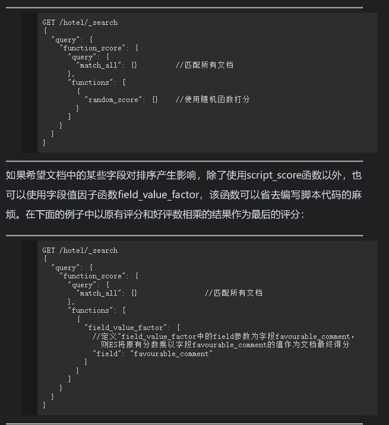
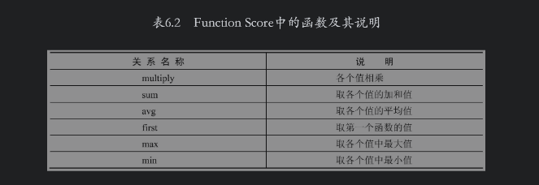
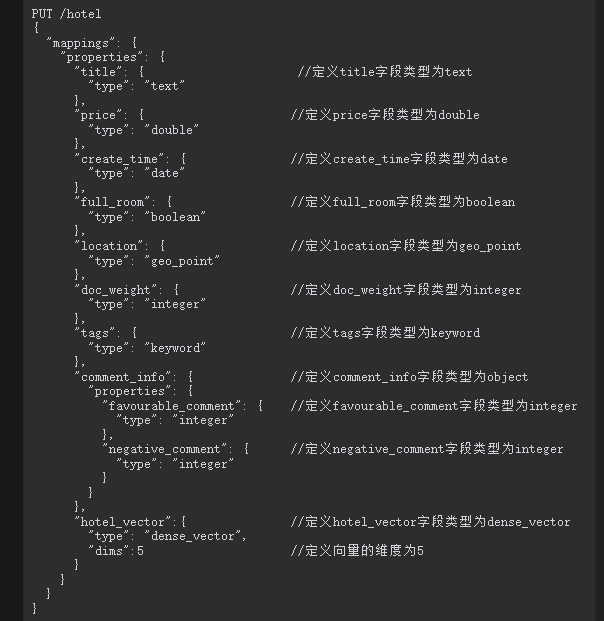
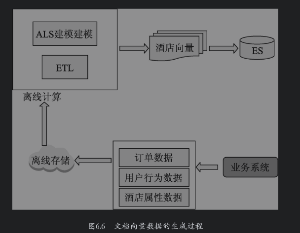

# 3.3 Elasticsearch从入门到放弃-权重及打分

文档摘自《Elasticsearch搜索引擎构建入门与实战》

参考：

```
https://blog.csdn.net/qq_29860591/article/details/109574595
https://blog.csdn.net/pbrlovejava/article/details/122290078
https://www.cnblogs.com/huan1993/p/15416099.html    elasticsearch地理位置查询
https://www.freesion.com/article/5162262542/#41__364   FUNCTION_SCORE详解

```

## 1.查询时设置权重

在默认情况下，这些查询的权重都为1，也就是查询之间都是平等的。有时我们希望某些查询的权重高一些，也就是在其他条件相同的情况下，匹配该查询的文档得分更高。此时应该怎么做呢？本节将介绍的boosting查询和boost设置可以满足上述查询需求。

### 1.1 查询时boost参数的设置

在ES中可以通过查询的boost值对某个查询设定其权重。在默认情况下，所有查询的boost值为1。但是当设置某个查询的boost为2时，不代表匹配该查询的文档评分是原来的2倍，而是代表匹配该查询的文档得分相对于其他文档得分被提升了。例如，可以为查询A设定boost值为3，为查询B设定boost值为6，则在进行相关性计算时，查询B的权重将比查询A相对更高一些。

**boost值的设置只限定在term查询和类match查询中，其他类型的查询不能使用boost设置。boost值没有特别约束，因为它代表的是一个相对值。当该值在0～1时表示对权重起负向作用，当该值大于1时表示对权重起正向作用。**


在上面的DSL中设定了索引的主分片数为1，这是为了方便计算文本的IDF值，现在向索引中写入数据：


下面对索引进行查询，假设“金都”或者“文雅”是两个酒店的品牌，用户想查询标题中包含“金都”或者“文雅”的酒店文档：


在默认情况下，各个子查询的boost值为1，也就是说上述的两个match查询是平等的。文档的分值等于两个match相关性分数之和。执行上述DSL后结果如下：


通过上述结果可以看到，“金都”品牌的酒店文档的打分相对低一些，如果想对“金都”品牌的酒店进行推广，也就是提升标题中包含“金都”这些文档的排序分值，则可以设定“金都”的match查询的boost值更高一些，例如下面的DSL：


执行上述DSL后，ES的返回结果如下：


如上所示，设定的boost值提升了标题中包含“金都”的文档的得分。现在我们来思考一下上述match查询的打分细节，通过6.1节可以知道，在默认情况下，文档的boost为BM25中的k1+1，因为在默认情况下k1=1.2，所以boost=k1+1=1.2+1=2.2。当在match查询中设置boost为2时，匹配该查询文档的最终boost=（k1+1）×2=（1.2+1）×2=4.4。可以使用explain进行验证：


下面将上述DSL执行后的部分结果进行折叠，仅显示第一个文档的打分细节：


通过上面的结果可以看到，title字段使用标准分析器，设置“金都”这个match查询的boost值为2后，在查询时“金都”被切分成“金”“都”，这两个切分的字在BM25查询中的最终boost值都为4.4。因此设置match查询的boost参数可以直接影响BM25的评分机制，从而影响整体结果的相关度。更近一步说，设置boost参数为某个值后并不是将查询命中的文档分数乘以该值，而是将BM25中的boost参数乘以该数值。

### 1.2 在Java客户端中使用boost参数

在Java客户端中使用boost参数时，只需要在QueryBuilder实例中调用boost()方法即可，以下Java代码和上面的DSL在搜索结果上是等效的：


### 1.3  boosting查询

**虽然使用boost值可以对查询的权重进行调整，但是仅限于term查询和类match查询。**有时需要调整更多类型的查询，如搜索酒店时，需要将房价低于200的酒店权重降低，此时可能需要用到range查询，但是range查询不能使用boost参数，这时可以使用ES的boosting查询进行封装。

**ES的boosting查询分为两部分，一部分是positive查询，代表正向查询，另一部分是negative查询，代表负向查询。**可以通过negative_boost参数设置负向查询的权重系数，该值的范围为0～1。最终的文档得分为：正向匹配值+负向匹配值×negative_boost。

先来看看使用原始查询时的搜索排序状态，以下DSL为搜索“金都”查询：


搜索结果如下：


可以看到，上面的搜索结果只是按照标题相关度进行了打分，其中，标价为200元的“金都欣欣酒店”排在第二位，如果希望它排在最后该怎么做呢？**下面的DSL将对房价低于200元的酒店进行降权处理**：


执行上述DSL后，ES搜索结果如下：


通过上面的结果可知，对房价低于200元的酒店进行降权处理后，目标酒店已经排在了最后面。

如果在以上结果基础上要求降低满房酒店的权重该怎么做呢？我们可以将在negative中的查询进行扩展：


在以上查询中，使用布尔查询将“房价低于200元”和“满房状态”的酒店封装到了一个布尔查询中然后放入negative查询中，执行上述DSL后，搜索结果如下：


如上所示，通过使用negative进行调权，“房价低于200元”和“满房状态”的酒店都排在了后面。

#### 在Java客户端中使用boosting查询

在Java客户端中可以使用QueryBuilders.boostingQuery()方法构建BoostingQueryBuilder的实例对象，该方法有两个参数，即positiveQuery和negativeQuery，分别代表正向查询和负向查询。构建完BoostingQueryBuilder对象之后，可以使用其negativeBoost()方法设置负向查询的权重系数。以下Java代码和上面的DSL是等效的：


### 1.4 Function Score查询简介

前面几节介绍了ES的相关性排序，其中可以定制相关性算法及对其配套的参数进行设置。但是用户没有办法更多地参与到文档打分逻辑中，尤其是当前的业务需求不仅依靠相关性进行排序，而是由多种因素共同作用的，排序的规则比较复杂。例如，**一个酒店搜索引擎，不仅需要考虑查询词和酒店名称的匹配程度，而且还需要评估酒店的好评率、地理位置和设施服务等诸多因素。ES提供了Function Score查询模式，用户可以借助该查询模式使用多种因素来影响打分逻辑。**

####  1.4.1 简单函数

我们在第4章中简要介绍了在Function Score查询中可以使用random_score随机函数对文档进行打分，在Function Score查询中还提供了其他打分函数，如表6.1所示。


在这些函数中，比较灵活的是script_score函数，它支持用户使用脚本自定义评分函数。在函数体中，既可以使用原有的score值进行计算，也可以使用文档的某个字段值的一些运算结果来影响评分的值。下面使用script_score函数将原有评分和好评数相乘的结果作为最后的评分是，示例如下：


需要注意的是，script_score子句中的结果必须大于或者等于0，不能为负数，否则，ES将会报错。以下是script_score取值为原有评分和差评数的乘积再乘以-1的查询示例：


另外，还可以使用params为script_score传递参数。在下面的示例中，将原有评分和评论进行相乘，然后乘以p，并将得到的结果作为最后的评分。其中，p的值是通过params中的传递参数得到的。


random_score产生0～1的随机小数，但是不包括1。在默认情况下，该随机函数使用的随机种子为文档_id，可以通过seed参数指定随机数种子。例如，使用随机函数的简单形式对文档打分：




如果在Function Score的functions子句中有多个函数，则可以使用score_mode参数定义各个函数值之间的计算关系，当前支持的计算关系如表6.2所示。




#### 1.4.2 衰减函数

在对文档进行打分时，希望在某个值域附近进行衰减打分。例如当搜索酒店时，酒店距离当前位置越近越好。假定距离当前位置1km范围内的酒店都可以接受，如果使用过滤器将超过1km的酒店排除掉，这种做法未免有些“生硬”。假设一个酒店距离当前位置刚好是1.1km，其好评度也不错，那么是可以考虑一下该酒店的。所以我们希望酒店最好距离当前位置在1km范围内，如果超过1km，酒店的评分应该随着距离的增大有一个明显的下降趋势。为了解决这类问题，可以在Function Score查询中使用衰减函数。

ES提供了3个衰减函数，分别为gauss、linear和exp，这3个函数的区别主要是衰减曲线形状不同，但是它们的用法和参数设置都是一样的。如图6.4所示为以年龄


衰减函数可以用于数值型、日期型和地理位置型数据，需要用户设置一个中心值，如果实际值偏离中心值，无论大于中心值还是小于中心值，文档的分数都将降低。由图6.4可知，

**gauss图像有点类似于钟摆，起初，其衰减值随着年龄的增大缓慢增大，然后到达某个区域后急速增大，直到到达某个阈值后又急速减小，最后又缓慢减小；**

**linear的函数曲线是一条直线，其衰减值随着年龄的增大而线性增大，直到到达某个阈值后随着年龄的增大而线性减小；**

**exp是一种指数衰减，它的衰减速率比gauss要激烈一些。**

- 使用衰减函数时，可以设定如下参数：
- origin：用于设定计算距离的原点，该参数的值必须和字段类型相对应。
- offset：用于设定距离原点多远范围内的数据将享有和原点一样的衰减值，其默认值为0。
- scale：衰减曲线的一个锚点，即定义到该点的值，其衰减的值为某个值（即为decay的值）。这个锚点横坐标值的定义为原点+offset+scale，纵坐标为decay参数的值。
- decay：和scale配套使用，用于设定锚点的纵坐标，即衰减值，其默认值为0.5。

下面用一个酒店搜索的实例来介绍衰减函数的使用，先来建立酒店索引：


为方便介绍，在索引中写入一些酒店数据，这些酒店都是北京天安门附近的酒店：


假设当前位置是天安门，经纬度坐标为[116.4039,39.915143]，需求为搜索附近5km内的酒店，其中最佳距离是1km，超过1km的酒店打分需要按照距离进行衰减，其中3km的时候酒店衰减得分为0.4，则搜索的DSL如下：


#### 1.4.3 Script Score

现在让我们进入灵活度最高的排序打分世界！ES提供的Script Score查询可以以编写脚本的方式对文档进行灵活打分，以实现自定义干预结果排名的目的。**Script Score默认的脚本语言为Painless，在Painless中可以访问文档字段，也可以使用ES内置的函数，甚至可以通过给脚本传递参数这种方式联通内部和外部数据。**

##### 1.4.3.1 Painless简介

ElasticStack在升级到5.0版本之后，带来了一个新的脚本语言，[painless](https://www.elastic.co/guide/en/elasticsearch/painless/5.5/index.html)。这里说“新的“是相对与已经存在groove而言的。还记得Groove脚本的漏洞吧，Groove脚本开启之后，如果被人误用可能带来各种漏洞，为什么呢，主要是这些外部的脚本引擎太过于强大，什么都能做，用不好或者设置不当就会引起安全风险，基于安全和性能方面，所以elastic.co开发了一个新的脚本引擎，名字就叫Painless，顾名思义，简单安全，无痛使用，和Groove的沙盒机制不一样，Painless使用白名单来限制函数与字段的访问，针对es的场景来进行优化，只做es数据的操作，更加轻量级，速度要快好几倍，并且支持Java静态类型，语法保持Groove类似，还支持Java的lambda表达式。

painless可以用在所有可以使用script的场景下，并具有以下特性

- 高性能。painless在es的运行速度是其他语言的数倍

- 安全。使用白名单来限制函数与字段的访问，避免了可能的安全隐患
- 可选类型。你可以在脚本当中使用强类型的编程方式或者动态类型的编程方式。
- 语法。扩展了java的基本语法以兼容groove风格的脚本语言特性，使得plainless易读易写
- 有针对的优化。这门语言是为elasticsearch专门定制的。

##### 1.4.3.2 数据类型

**1.变量**

变量在使用之前必须先进行声明，其声明方式和Java保持一致。如果变量在声明时没有指定值，则使用变量类型对应的默认值。

**2.数据类型**

Painless支持的原始类型有：byte、short、char、int、long、float、double和boolean。可以按照Java的方式声明它们，例如下面的代码：

```groovy
int i=0;
boolean a=true;
double s;
```

在Painless中也可以使用引用类型，可以使用new关键字对引用类型进行初始化，例如下面的代码：

```groovy
//声明List类型时有两种方式，方式一为直接定义空的List，此时有隐式声明和显式声明两种
List l=new ArrayList();//显式
List l2=[];//隐式
l.add(1);

//声明Map类型时有两种方式，方式一为直接定义空的Map，此时有隐式声明和显式声明两种。
Map map=[:]//隐式
Map map2=new HashMap();
map =["k1":"v1","k2":"v2"];
//在Painless中使用Set类型时，可直接使用new关键字进行Set的定义，例如：
Set set=new HashSet();
set.add(1);
set.add(2);
for (def e in set){
    ....
}
String a="abcd";
int xx=new int[3];
a[0]=1;
a[1]=2;
a[2]=3;
int xx2=new int[3]{1,2,3};

```

painless还支持使用def对动态类型的变量进行声明，它的作用是在声明时不指定类型而是在运行时判断数据类型，例如下面的代码：

```groovy
def x=5;
def y="adc";
```

##### 1.4.3.3 条件和循环

在Painless中条件语句的使用和大多数语言是一样的，其支持使用if语句对条件进行判断，但是不支持else if或者switch语句，if语句中的条件值为boolean型。如果引用文档中的字段，编写代码时需要注意判断字段为空的情况，在后面的内容中将会介绍如何在Painless脚本中使用文档字段值。以下代码为if条件判断：

```groovy
def a=10;
if(a>0){
  .....
}
```

Painless支持for循环、while循环和do…while循环，循环内的条件和if相同，下面的代码演示了for循环的一种使用方法：

```groovy
def result=10;
for(def a=0;a<10;a++){
    result=a+1;
}
```

##### **1.4.3.4 在Script Score中使用Painless**

在Script Score查询中可以使用Painless脚本进行打分脚本的开发，脚本代码主体放在参数source的值中，注意，Script Score查询中的脚本代码必须有返回值并且类型为数值型，如果没有返回值，则Script Score查询默认返回0。

下面定义酒店索引的结构如下：



为方便演示，向酒店索引中新增如下数据：


以下代码演示了使用脚本代码进行打分的基本方法：


##### 1.4.3.5 使用文档数据

**1.使用普通字段**

**如果字段属于基本数据类型，则可以通过params._source.$field_name获取字段的值**。例如，在酒店索引中，price字段为double类型，weight字段为integer类型，以下DSL演示了这两个字段的使用：


**也可以使用doc['$field']来引用字段，使用doc['$field'].value引用字段的值。**例如，下面的DSL和上面的DSL的效果是相同的：


**2.使用数组字段**

当字段类型为数组时，可以直接使用for循环遍历数组中的元素，请看以下DSL：


**3.使用object类型的字段**

在访问object类型字段中的值时，除了使用“.”操作符引用该object类型的字段外，对其他字段的访问与访问索引的普通字段类似。例如，酒店评论中的好评数据，可以使用params._source.comment_info['favourable_comment']来引用，以下DSL将评论数作为酒店的分值返回：


**4.使用文档评分**

在使用match匹配搜索时，ES会对文档进行BM25算法打分，尽管BM25很好地完成了评分/相关性，但有时需要根据业务需求在原有评分的基础上对相关性进行干预。可以用_score直接获取BM25算法的打分数值，请看以下示例代码：


##### 1.4.3.6 向脚本传参

Painless不提供任何网络访问的功能，假设有一部分文档数据存储在Redis中，应该如何传递数据呢？答案就是向Painless传参。假设我们已经通过Java客户端连接Redis获取到了某个特定搜索应该设定的权重值，**那么在索引中搜索时，可以通过params关键字定义参数名称并设置其值，在代码中通过params['$para']这种形式进行引用，**以下示例演示了使用Params关键字传递参数的方法：


##### 1.4.3.7 在Script Score中使用函数

在学习Function Score查询时，我们知道在其中可以使用一些ES内置的预定义函数进行打分干预。同样，在Script Score中也可以使用这些函数，本节将介绍一些实际应用中的常用函数。

**1.使用saturation函数**

saturation，顾名思义，它是计算饱和度的函数，其实相当于计算占比，即saturation（value,k）=value/（k+value），请看如下示例：

```
return saturation(params._source.weight,10);
```

以上代码中，文档的分值为酒店的好评率。

**2.使用sigmoid函数**

sigmoid函数在处理数值型数据时将其值的变换值映射到0～1


在使用Function Score时，sigmoid函数可以对某个字段的数据进行相应的处理，以下代码直接返回调用sigmoid函数处理doc_weight字段后的值


**3.使用随机函数**

在使用ES的搜索结果时，如果希望给不同用户推荐的商品排序是不同的，可以使用随机函数对商品的打分进行控制。S**cript Score中的randomScore函数可以产生0～1的小数（不包含边界值），其使用方式为randomScore（<seed>,<fieldName>）**，其中，seed为随机数种子，fieldName为非必传参数，这时ES将使用Lucene文档的ID值作为该参数的值。


**4.使用向量计算函数**

ES支持向量数据类型，那么在ES中文档的向量数据是如何生成的呢？在一般情况下，索引中文档的向量是事先用模型计算完成的，如图6.6所示为以酒店搜索为例酒店的向量计算过程。



酒店的向量存储在ES中后，需要给定一个查询向量，对索引中的酒店文档向量按照向量相似度计算的算法进行查询。从7.X版本开始，**ES的Script Score中提供了几种向量相似度计算的函数**。

**cosineSimilarity函数可以计算给定查询向量和文档向量之间的余弦相似度，因为余弦值可能有负数，但是脚本的返回值必须大于或等于0，所以一般对其进行加1处理，**请看下面的示例：


通过结果可以看到，酒店名称中包含“文雅”的有文档005和文档001，**查询的酒店向量和文档005的酒店向量是相同的，因此计算其consin值为1，再加上之前的1，文档005的分数为2。文档001和查询向量的consin值为0.4875506，再加上之前的1，文档001的分数为1.4875506。**也就是说，最终的文档排序是和向量相似度正相关的。

**dotProduct函数可以计算给定查询向量和文档向量之间的点乘值，因为点乘值也可能是负数，所以在返回值时需要保证该值为正数或者0。**可以使用sigmoid函数进行处理，示例如下：


**1norm和l2norm函数可以计算给定查询向量和文档向量之间的距离**，其中，**l1norm用来计算向量之间的曼哈顿距离，l2norm用来计算向量之间的欧氏距离。**与余弦相似度不同，**距离越小代表向量越相近**，**因此返回值取其倒数即可**，请看示


**5.使用向量计算函数**

参照标题1.4.2

##### 1.4.3.8 在Java客户端中使用Script Score


### 1.7 二次打分

前面**介绍的搜索打分都是针对整个匹配结果集的，如果一个搜索匹配了几十万个文档，对这些文档使用Function Score或者Script Score查询进行打分是非常耗时的，整个排序性能大打折扣**。针对这种情况，ES提供了Query Rescore功能作为折中方案，它支持**只针对返回文档的一部分文档进行打分**。

**Query Rescore工作的阶段是在原始查询打分之后，它支持对打分后Top-N的文档集合执行第二次查询和打分。通过设置window_size参数可以控制在每个分片上进行二次打分查询的文档数量，在默认情况下window_size的值为10。在默认情况下，文档的最终得分等于原查询和rescore查询的分数之和。**当然，还可以使用参数对这两部分的权重进行控制，后面将结合实例介绍这部分内容。

#### 1.7.1示例

本节继续使用前面章节的索引，现在有一个比较简单的查询：查询价格大于300元的酒店。DSL如下：


从结果中可以看到，索引中有5个文档，匹配的文档数为4。因为使用的是范围查询，所以匹配的文档得分都为1。如果想提升在上述排序中前两个名称中包含“金都”的酒店文档排名，而这两个目标酒店的位置分别为1和3，当前的索引主分片数为1，那么应该设置window_size的值为3，使用二次打分对查询进行扩展的DSL如下：


在上面的DSL中，二次打分使用rescore进行封装，在rescore中可以设置二次打分的查询query和window_size，window_size设置为3意味着对每个分片的前3个文档进行二次打分。执行上述DSL的结果如下：


通过对比rescore前后的结果可以看到，原有的文档002和文档004分别排在第2和第3的位置，并且得分都是1。在rescore的查询中对TOP3且标题含有“金都”的文档进行了加分操作，因此文档002和文档004的得分得到了提升。因为文档004的标题更短，所以它的分数相对更高一些，处在第一个位置，文档002处在第二个位置。

**在默认情况下，当存在二次打分时，文档的得分为：原始查询分数+二次打分分数。而用户可以为这两部分的分数设置权重，所以文档得分为：原始查询分数×原始查询权重+二次打分分数×二次打分权重。**


#### 1.7.2在Java客户端中使用二次打分


## 2 基于地理位置查询

### 2.1 基于地理位置查询

文档参考：

```
https://www.cnblogs.com/huan1993/p/15416099.html#1geo_bounding_box__108
```

随着互联网+的热门，越来越多的传统行业将全部或者部分业务转移到互联网上，其中不乏一些和地理位置强相关的行业。基于地理位置的搜索功能，大大提升了人们的生活和工作效率。例如，外出旅行时，只需要用手机打开订酒店的应用软件，查找附近心仪的酒店下单即可；又或者打车行业，人们不用在寒冷的户外去拦截出租车，只需要在室内打开手机里的打车App定位到当前位置，然后确定目的地，系统就可以为附近的车辆派发订单。

幸运的是，ES为用户提供了基于地理位置的搜索功能。**它主要支持两种类型的地理查询：一种是地理点（geo_point），即经纬度查询，另一种是地理形状查询（geo_shape），即支持点、线、圆形和多边形查询等**。

从实用性上来说，地理点（即geo_point）数据类型的使用更多一些，因为篇幅所限，本节只对地理点类型进行详细介绍。

对应于geo_point字段类型的查询方式有3种，分别为geo_distance查询、geo_bounding_box查询和geo_polygon。

geo_distance查询方式需要用户指定一个坐标点，在指定距离该点的范围后，ES即可查询到相应的文档。假设北京天安门的经纬度为[116.4039,39.915143]，以下为使用geo_distance查询所找到的天安门5km范围内的酒店：


Java客户端使用QueryBuilders.geoDistanceQuery()方法构建geo_distance请求，同时可以设置基准点坐标和周边距离。以下代码展示了geo_distance请求的使用逻辑：


geo_shape查询提供的是矩形内的搜索，需要用户给出左上角的顶点地理坐标和右下角的顶点地理坐标。假设定义国贸商圈为一个矩形，其左上角顶点的经纬度为[116.457044,39.922821]，右下角顶点的经纬度为[116.479466,39.907104]，则在国贸商圈内搜索酒店的DSL如下：


geo_polygon比geo_shape提供的地理范围功能更加灵活，它支持多边形内的文档搜索，使用该查询需要提供多边形所有顶点的地理坐标。假设北京地坛公园商圈的地形为三角形，该三角形的三个顶点的经纬度分别为[116.417088,39.959829]、[116.432035,39.960272]和[116.421399,39.965802]，则在地坛公园商圈内搜索酒店的DSL语句如下：


Java客户端使用QueryBuilders.geoPolygonQuery()方法构建geo_polygon请求，在构建请求之前，需要将多边形的顶点事先准备好。以下代码展示了geo_polygon请求的使用逻辑：


### 2.2 按地理距离排序

前面我们介绍了ES提供的基于地理位置的查询功能，使用geo_distance查询，配合sort可以指定另一种排序规则，即按照文档坐标与指定坐标的距离对结果进行排序。使用时，需要在sort内部指定排序名称为geo_distanc，并指定目的地坐标。除了可以指定升序或者降序排列外，还可以指定排序结果中sort子句中的距离的计量单位，默认值为km即千米。在进行距离计算时，系统默认使用的算法为arc，该算法的特点是计算精准但是耗费时间较长，用户可以使用distance_type参数选择另一种计算速度快但经度略差的算法，名称为plane。如下示例使用geo_distance查询天安门5km范围内的酒店，并按照距离由近及远进行排序：


在Java客户端中对geo_distance的搜索结果进行排序时，可以调用SortBuilders.geo DistanceSort()方法新建geo_distance查询对象的实例，然后将该实例传给searchSource Builder.sort()方法即可完成按照距离排序的要求。对应上面的排序DSL，Java代码如下：


但是这种排序有些绝对性，有些时候排序可能不只是距离一个标准。例如当搜索酒店时，酒店距离当前位置越近越好。假定距离当前位置1km范围内的酒店都可以接受，如果使用过滤器将超过1km的酒店排除掉，**这种做法未免有些“生硬”**。假设一个酒店距离当前位置刚好是1.1km，其好评度也不错，那么是可以考虑一下该酒店的。所以我们希望酒店最好距离当前位置在1km范围内，如果超过1km，酒店的评分应该随着距离的增大有一个明显的下降趋势。为了解决这类问题，可以使用上文中提到的**衰减函数**。下文中会介绍一些实战应用。


## 3 代码中的几种实战场景

### 场景1：高斯衰减函数-同下

场景：商品价格300-400优先展示

```
       GaussDecayFunctionBuilder price = ScoreFunctionBuilders.gaussDecayFunction("price", 350, 50, 50, 0.2).setWeight(500);
            FunctionScoreQueryBuilder.FilterFunctionBuilder priceFunctionBuilder = new FunctionScoreQueryBuilder.FilterFunctionBuilder(price);
            functionBuilders.add(priceFunctionBuilder);
```


### 场景2：基于地理位置查询-sigmoid函数

```java
//创建时间高斯函数1天最高,7天衰减
GaussDecayFunctionBuilder createTime = ScoreFunctionBuilders.gaussDecayFunction("createTime", System.currentTimeMillis(), "1d", "6d", 0.2).setWeight(1);
FunctionScoreQueryBuilder.FilterFunctionBuilder timeFunctionBuilder = new FunctionScoreQueryBuilder.FilterFunctionBuilder(createTime);
functionBuilders.add(timeFunctionBuilder);
//String scoreScript = "if(ctx._source.goods.size()>0){return sigmoid(ctx._source.goods.[0].sellCount,0.5,1) }";
//销量排序在0-1之间打分，权重=5
String scoreScript = "_score=0; return _score+sigmoid(doc['goods.sellCount'].value, 0.5, 1)";
HashMap<String,Object> params = new HashMap<String,Object>();
FunctionScoreQueryBuilder.FilterFunctionBuilder sellCountFunctionBuilder = new FunctionScoreQueryBuilder.FilterFunctionBuilder(ScoreFunctionBuilders.scriptFunction(new Script(ScriptType.INLINE, "painless", scoreScript, params)).setWeight(1));
functionBuilders.add(sellCountFunctionBuilder);
FunctionScoreQueryBuilder.FilterFunctionBuilder[] filterFunctionBuilders = functionBuilders.toArray(
        new FunctionScoreQueryBuilder.FilterFunctionBuilder[functionBuilders.size()]);
FunctionScoreQueryBuilder functionScoreQuery = QueryBuilders.functionScoreQuery(boolQueryBuilder, filterFunctionBuilders).
        scoreMode(FunctionScoreQuery.ScoreMode.SUM).boostMode(CombineFunction.SUM);
sourceBuilder.query(functionScoreQuery);
```

### 场景3：基于地理位置查询-距离函数

参考文档 ：

https://www.cnblogs.com/huan1993/p/15416099.html    elasticsearch地理位置查询

https://www.freesion.com/article/5162262542/#41__364   FUNCTION_SCORE详解


```java
/@Component
public class TestConfig3 implements ApplicationListener {

    @Autowired
    private RestHighLevelClient client;

    private ElasticsearchRestTemplate elasticsearchRestTemplate;
    public static final String INDEXNAME="stores_test";

    @Override
    public void onApplicationEvent(ApplicationEvent event) {
        if (event instanceof ContextRefreshedEvent) {
            try {
                // 1、构建查询请求 SearchRequest
                SearchRequest searchRequest = new SearchRequest(INDEXNAME);
                SearchSourceBuilder sourceBuilder = new SearchSourceBuilder();
                //计算位置并查询
                long nowtime = System.currentTimeMillis();
                //查询某个默认经纬度为基准   2公里米范围内 
                double lat=30.183794918767084;
                double lon=120.19081557616879;

                BoolQueryBuilder boolQueryBuilder = QueryBuilders.boolQuery();
                
                GeoDistanceQueryBuilder geoDistanceQueryBuilder = QueryBuilders.geoDistanceQuery("location").point(lat, lon)
                        .distance(2, DistanceUnit.KILOMETERS);
                boolQueryBuilder.filter(geoDistanceQueryBuilder);
                
                //按距离排序
                GeoDistanceSortBuilder geoDistanceSortBuilder= SortBuilders.geoDistanceSort("location",lat, lon).point(lat,lon).unit(DistanceUnit.KILOMETERS).order(SortOrder.ASC);
                
                FunctionScoreQueryBuilder.FilterFunctionBuilder[] filterFunctionBuilders = new FunctionScoreQueryBuilder.FilterFunctionBuilder[2];
                //距离打分按照高斯衰减函数：当前默认位置，2km以内权重最高 2km->(2+3)Km曲线衰减，衰减率降到0.4；5KM以上评分更低
                GaussDecayFunctionBuilder locationGaussDecayFunctionBuilder=ScoreFunctionBuilders.gaussDecayFunction("location",new GeoPoint(lat, lon),"2km","3km",0.4).setWeight(2);
                  //时间按照高斯衰减函数：当前时间，2天以内权重最高，都是1 2km->(2+1)d曲线衰减，衰减率降到0.4；3天以上评分更低
                GaussDecayFunctionBuilder createTimeGaussDecayFunctionBuilder=ScoreFunctionBuilders.gaussDecayFunction("createTime",System.currentTimeMillis(),"2d","1d",0.4).setWeight(3);
                filterFunctionBuilders[1]=new FunctionScoreQueryBuilder.FilterFunctionBuilder(boolQueryBuilder, locationGaussDecayFunctionBuilder);
                filterFunctionBuilders[2]=new FunctionScoreQueryBuilder.FilterFunctionBuilder(boolQueryBuilder, createTimeGaussDecayFunctionBuilder);
                FunctionScoreQueryBuilder functionScoreQuery = QueryBuilders.functionScoreQuery(boolQueryBuilder, filterFunctionBuilders).scoreMode(FunctionScoreQuery.ScoreMode.SUM).boostMode(CombineFunction.SUM);
                //排序
                if (ObjectUtil.isNotEmpty(searchKey)) {
                    sourceBuilder.sort("_score", SortOrder.DESC).sort("createTime",SortOrder.ASC).sort(geoDistanceSortBuilder);
                }else{
                    sourceBuilder.query(functionScoreQuery).from(0).size(5).sort("createTime",SortOrder.ASC).sort(geoDistanceSortBuilder);
                }
                searchRequest.source(sourceBuilder.query(boolQueryBuilder));
                client.searchAsync(searchRequest, RequestOptions.DEFAULT, new ActionListener<SearchResponse>() {
                     @Override
                     public void onResponse(SearchResponse searchResponse) {
                         System.out.println("SearchRequest耗时：" + (System.currentTimeMillis() - nowtime) + "结果集");
                         if(ObjectUtil.isNotEmpty(searchResponse.getHits())){
                             searchResponse.getHits().forEach(v-> {
                                 if(String.valueOf(v.getSortValues()[1]).equals("Infinity")){
                                     System.out.println(JSON.toJSONString(v.getSourceAsMap()) + "---距离" +  "超过2000km");
                                 }else {
                                     System.out.println(JSON.toJSONString(v.getSourceAsMap()) + "---距离" + new BigDecimal(String.valueOf(v.getSortValues()[2])).setScale(2, RoundingMode.HALF_UP) + "km");
                                 }
                             });
                         }else{
                             System.out.println("");
                         }
                     }

                     @Override
                     public void onFailure(Exception e) {
                             e.printStackTrace();
                     }
                 });
                //删除测试索引
//                GetIndexRequest e_request2 = new GetIndexRequest(INDEXNAME);
//                boolean exist2 = client.indices().exists(e_request2, RequestOptions.DEFAULT);
//                if (exist2) {
//                    DeleteIndexRequest request = new DeleteIndexRequest(INDEXNAME);
//                    AcknowledgedResponse delete = client.indices().delete(request, RequestOptions.DEFAULT);
//                    System.out.println(" DeleteIndexRequest删除索引--------" + delete.isAcknowledged());
//                }
            } catch (Exception e) {
                e.printStackTrace();
            }
        }
    }


}
```


### 场景4：综合打分

距离5km以内；分别按照在售商品数量权重，星级，店铺评分，商品评分权重查询

```java
 SearchSourceBuilder sourceBuilder = new SearchSourceBuilder();
        sourceBuilder.highlighter();// 高亮
        String[] includes = {"storeId", "supplierId", "storeName", "signPic", "storeStar", "location", "stars", "features", "salesSumTrue", "provinceName", "cityName", "districtName", "onSaleGoodsCount"};
        String[] excludes = {"sellerCity", "sellerDistinct", "sellerProvince", "provinceCode", "cityCode", "districtCode"};
        sourceBuilder.fetchSource(includes, excludes);

        BoolQueryBuilder boolQueryBuilder = QueryBuilders.boolQuery();
//经纬度--》默认5km以内店铺
if (searchStoreParam.getDistance() == null || searchStoreParam.getDistance() <= 0) {
            searchStoreParam.setDistance(5000L);
        }
         if (ObjectUtil.isNotEmpty(searchStoreParam.getLatitude()) && ObjectUtil.isNotEmpty(searchStoreParam.getLongitude())) {
            double latitude = new BigDecimal(searchStoreParam.getLatitude()).doubleValue();
            double longitude = new BigDecimal(searchStoreParam.getLongitude()).doubleValue();
            GeoDistanceQueryBuilder geoDistanceQueryBuilder = QueryBuilders.geoDistanceQuery("location").point(latitude, longitude)
                    .distance(searchStoreParam.getDistance(), DistanceUnit.METERS);
            boolQueryBuilder.filter(geoDistanceQueryBuilder);
        }

        //省级行政区编码
        if (searchStoreParam.getProvinceCode() != null && searchStoreParam.getProvinceCode() > 0L) {
            TermQueryBuilder termQueryBuilder = QueryBuilders.termQuery("provinceCode", searchStoreParam.getProvinceCode());
            boolQueryBuilder.must(termQueryBuilder);
        }
        //市级行政区编码
        if (searchStoreParam.getCityCode() != null && searchStoreParam.getCityCode() > 0L) {
            TermQueryBuilder termQueryBuilder = QueryBuilders.termQuery("cityCode", searchStoreParam.getCityCode());
            boolQueryBuilder.must(termQueryBuilder);
        }
        //区县级行政区编码
        if (searchStoreParam.getDistrictCode() != null && searchStoreParam.getDistrictCode() > 0L) {
            TermQueryBuilder termQueryBuilder = QueryBuilders.termQuery("districtCode", searchStoreParam.getDistrictCode());
            boolQueryBuilder.must(termQueryBuilder);
        }
        //星级查询
        if (searchStoreParam.getStars() != null && searchStoreParam.getStars() > 0L) {
            TermQueryBuilder termQueryBuilder = QueryBuilders.termQuery("stars", searchStoreParam.getStars());
            boolQueryBuilder.must(termQueryBuilder);
        }
        //店铺id
        if (ObjectUtil.isNotEmpty(searchStoreParam.getStoreIds())) {
            TermsQueryBuilder termQueryBuilder = QueryBuilders.termsQuery("storeId", searchStoreParam.getStoreIds());
            boolQueryBuilder.must(termQueryBuilder);
        }
List<FunctionScoreQueryBuilder.FilterFunctionBuilder> scoreFunctionBuilderList = new ArrayList<>();

//在售商品数量权重
            if (ObjectUtil.isNotEmpty(searchStoreParam.getIsAgritainment()) && searchStoreParam.getIsAgritainment().equals(1) || searchSort.equals(0)) {
                ScoreFunctionBuilder<?> onSaleGoodsCountFunction = ScoreFunctionBuilders.fieldValueFactorFunction("onSaleGoodsCount").setWeight(3f)
                        .missing(1d)
                        .modifier(FieldValueFactorFunction.Modifier.NONE).factor(10f);
                FunctionScoreQueryBuilder.FilterFunctionBuilder onSaleGoodsCountScore = new FunctionScoreQueryBuilder.FilterFunctionBuilder(onSaleGoodsCountFunction);
                scoreFunctionBuilderList.add(onSaleGoodsCountScore);
            }
//星级权重
            if (searchSort.equals(2) || searchSort.equals(0)) {
                ScoreFunctionBuilder<?> starsScoreFunction = ScoreFunctionBuilders.fieldValueFactorFunction("stars").setWeight(3f)
                        .missing(1d)
                        .modifier(FieldValueFactorFunction.Modifier.NONE).factor(10f);
                FunctionScoreQueryBuilder.FilterFunctionBuilder starsScore = new FunctionScoreQueryBuilder.FilterFunctionBuilder(starsScoreFunction);
                scoreFunctionBuilderList.add(starsScore);
            }
//店铺评分优先：增加店铺评分权重
            if (searchSort.equals(3)) {
                ScoreFunctionBuilder<?> starsScoreFunction = ScoreFunctionBuilders.fieldValueFactorFunction("storeStar").setWeight(3f)
                        .missing(1d)
                        .modifier(FieldValueFactorFunction.Modifier.LOG1P).factor(10f);
                FunctionScoreQueryBuilder.FilterFunctionBuilder starsScore = new FunctionScoreQueryBuilder.FilterFunctionBuilder(starsScoreFunction);
                scoreFunctionBuilderList.add(starsScore);
            }
//店铺商品评价评分优先：增加店铺商品评价评分权重
            if (searchSort.equals(4)) {
                ScoreFunctionBuilder<?> starsScoreFunction = ScoreFunctionBuilders.fieldValueFactorFunction("goodsStar").setWeight(3f)
                        .missing(1d)
                        .modifier(FieldValueFactorFunction.Modifier.NONE).factor(10f);
                FunctionScoreQueryBuilder.FilterFunctionBuilder starsScore = new FunctionScoreQueryBuilder.FilterFunctionBuilder(starsScoreFunction);
                scoreFunctionBuilderList.add(starsScore);
            }
        }
//创建时间权重
//            ScoreFunctionBuilder<?> createTimeScoreFunction = ScoreFunctionBuilders.fieldValueFactorFunction("createTime").setWeight(300f)
//                .missing(1000 * 86400 * 365d)
//                .modifier(FieldValueFactorFunction.Modifier.LOG1P).factor(1f);
//            FunctionScoreQueryBuilder.FilterFunctionBuilder createTimeScore = new FunctionScoreQueryBuilder.FilterFunctionBuilder(createTimeScoreFunction);
//            scoreFunctionBuilderList.add(createTimeScore);

//综合上述权重
        FunctionScoreQueryBuilder.FilterFunctionBuilder[] filterFunctionBuilders = new FunctionScoreQueryBuilder.FilterFunctionBuilder[scoreFunctionBuilderList.size()];
        for (int i = 0; i < scoreFunctionBuilderList.size(); i++) {
            filterFunctionBuilders[i] = scoreFunctionBuilderList.get(i);
        }
//权重求和
        FunctionScoreQueryBuilder functionScoreQuery = QueryBuilders.functionScoreQuery(boolQueryBuilder, filterFunctionBuilders).scoreMode(FunctionScoreQuery.ScoreMode.SUM).boostMode(CombineFunction.SUM);
        sourceBuilder.query(functionScoreQuery);

//排序
if (searchSort.equals(1)) {
            //距离优先
            if (ObjectUtil.isNotEmpty(geoDistanceSortBuilder)) {
                sourceBuilder.sort(geoDistanceSortBuilder);
            }
            sourceBuilder.sort("_score", SortOrder.DESC);
        } else {
            //其他优先
            sourceBuilder.sort("_score", SortOrder.DESC);
            if (ObjectUtil.isNotEmpty(geoDistanceSortBuilder)) {
                sourceBuilder.sort(geoDistanceSortBuilder);
            }
        }

//查询
  sourceBuilder.timeout(TimeValue.timeValueSeconds(2));

        // 设置分页查询
        int start = searchStoreParam.getPageSize() * (searchStoreParam.getStartPage() - 1);
        if (start < 0) start = 0;
        sourceBuilder.from(start);
        sourceBuilder.size(searchStoreParam.getPageSize());
        // 3、搜索条件放入请求当中
        request.source(sourceBuilder);
        logger.info("store search params ==>" + sourceBuilder.toString());
        // 4、执行请求 client上线
        SearchResponse response = null;
        try {
            response = client.search(request, RequestOptions.DEFAULT);
        } catch (IOException e) {
            logger.error("店铺查询异常：", e);
        }
```

### 场景5：Elasticsearch更新指定字段操作_update_by_query

原文链接：https://blog.csdn.net/zixuanyankai/article/details/124146178

MYSQL语句：update index_name set name = ‘wb’ where id = ‘20132112534’;

```
POST /index_name/_update_by_query
{
  "query": {
    "bool": {
      "must": [
        {
          "term": {
            "id": "20132112534"
          }
        }
      ]
    }
  },
  "script": {
    "ctx._source['name'] = 'wb'"
  }
}
//或者
curl -XPOST http://host:9200/index_name/_update_by_query -H 'Content-Type: application/json' -d '
{
  "query": {
    "bool": {
      "must": [
        {
          "term": {
            "id": "20132112534"
          }
        }
      ]
    }
  },
  "script": {
    "ctx._source['name'] = 'wb'"
  }
}
```


MYSQL语句：update index_name set name = ‘wb’ where (a_time - b_time = 100000)

```
POST /index_name/_update_by_query
{
  "query": {
    "bool": {
      "must": [
        {
          "script": {
            "script": {
              "source": "doc['a_time'].value- doc['b_time'].value == 100000"
            }
          }
        }
      ]
    }
  },
  "script": {
    "source": "ctx._source.name = params.name",
    "params": {
      "name": "wb"
    }
  }
}
//或者
curl -XPOST http://host:9200/index_name/_update_by_query -H 'Content-Type: application/json' -d '
{
  "query": {
    "bool": {
      "must": [
        {
          "script": {
            "script": {
              "source": "doc['a_time'].value- doc['b_time'].value == 100000"
            }
          }
        }
      ]
    }
  },
  "script": {
    "source": "ctx._source.name = params.name",
    "params": {
      "name": "wb"
    }
  }
}
```


MYSQL语句：update index_name set sort_time = update_time where sort_time is null;

```
POST /index_name/_update_by_query
{
  "query": {
    "bool": {
      "must_not": [
        {
          "exists": {
            "field": "sort_time"
          }
        }
      ]
    }
  },
  "script": {
    "source": "ctx._source['sort_time'] = ctx._source['update_time']"
  }
}
//或者
curl -XPOST http://host:9200/index_name/_update_by_query -H 'Content-Type: application/json' -d '
{
  "query": {
    "bool": {
      "must_not": [
        {
          "exists": {
            "field": "sort_time"
          }
        }
      ]
    }
  },
  "script": {
    "source": "ctx._source['sort_time'] = ctx._source['update_time']"
  }
}
```


### 场景6：批量更新-painless的使用实践

```
https://www.elastic.co/guide/en/elasticsearch/painless/7.16/painless-api-reference-shared-java-util.html#painless-api-reference-shared-HashMap  es官网hashmap结构函数

https://blog.csdn.net/laoyang360/article/details/121738408  Elasticsearch Painless 脚本 ctx、doc、_source 的区别是什么
```

场景：在一些对实时性要求比较高的场景，需要实时更新ES中的状态信息；

一种方案是根据canal订阅binlog同步日志到MQ,然后异步更新；

一种是通过业务发消息到MQ，异步解耦更新；

比如：首页信息流中，商品上下架：可能涉及到不同推荐类型的文档批量更新。比如：店铺的商品信息要下架，比如商品视频，商品评论要下架

文档格式如下：

```json
//店铺
{
  "took" : 0,
  "timed_out" : false,
  "_shards" : {
    "total" : 1,
    "successful" : 1,
    "skipped" : 0,
    "failed" : 0
  },
  "hits" : {
    "total" : {
      "value" : 6,
      "relation" : "eq"
    },
    "max_score" : 1.0,
    "hits" : [
      {
        "_index" : "homepage_recommend_test",
        "_type" : "_doc",
        "_id" : "127083834393067520_4",
        "_score" : 1.0,
        "_source" : {
          "cityCode" : 1,
          "createTime" : 1658474106000,
          "districtCode" : 17,
          "goods" : [
            {
              "backendCategoryId" : "_5_1546_1547_",
              "currentBackendCategoryId" : "1547",
              "goodId" : 490132,
              "goodName" : "吃红烧肉啦啦",
              "goodsImageUrl" : "https://1111.jpeg",
              "goodsVideoUrl" : "",
              "isOnSale" : 1,   //电批商品上下架状态
              "parentBackendCategoryId" : "1546",
              "sellCount" : 1
            }
          ],
          "id" : "127083834393067520_4",
          "isDelete" : 0,   //店铺上下架状态
          "isRecommend" : 0,
          "processTime" : 1659077746000,
          "provinceCode" : 43282904292360190,
          "recommendId" : 127083834393067520,
          "recommendName" : "蜡笔小新",
          "recommendType" : 4,
          "url" : "https://2222.jpeg"
        }
      }
        ]
  }
}
//视频
{
  "took" : 0,
  "timed_out" : false,
  "_shards" : {
    "total" : 1,
    "successful" : 1,
    "skipped" : 0,
    "failed" : 0
  },
  "hits" : {
    "total" : {
      "value" : 6,
      "relation" : "eq"
    },
    "max_score" : 1.0,
    "hits" : [
      {
        "_index" : "homepage_recommend_test",
        "_type" : "_doc",
        "_id" : "19_7",
        "_score" : 1.0,
        "_source" : {
          "cityCode" : 1,
          "createTime" : 1658917361000,
          "districtCode" : 17,
          "goods" : [
            {
              "backendCategoryId" : "_1_11_27_155_",
              "currentBackendCategoryId" : "155",
              "goodId" : 43070,
              "goodName" : "测试商品商品AA",
              "goodsImageUrl" : "https://232323.png",
              "goodsVideoUrl" : "",
              "isOnSale" : 1,
              "parentBackendCategoryId" : "27",
              "sellCount" : 111213
            },
            {
              "backendCategoryId" : "_1_87_107",
              "currentBackendCategoryId" : "107",
              "goodId" : 3819,
              "goodName" : "塘栖粢毛肉圆  350g装4盒",
              "goodsImageUrl" : "https://1111.png",
              "goodsVideoUrl" : "",
              "isOnSale" : 1,
              "parentBackendCategoryId" : "87",
              "sellCount" : 438
            },
            {
              "backendCategoryId" : "_1_11_27_157",
              "currentBackendCategoryId" : "157",
              "goodId" : 16095,
              "goodName" : "华味亨 绿葡萄干400g新疆吐鲁番葡萄干休闲零食独立小包装（约17小包）",
              "goodsImageUrl" : "https://22222.png",
              "goodsVideoUrl" : "",
              "isOnSale" : 1,
              "parentBackendCategoryId" : "27",
              "sellCount" : 6
            }
          ],
          "id" : "19_7",
          "isDelete" : 0,
          "isRecommend" : 0,
          "processTime" : 1659078660000,
          "provinceCode" : 43282904292360190,
          "recommendId" : 19,
          "recommendName" : "测试视频111",
          "recommendType" : 7,
          "url" : "https://232323.png",
          "videoType" : 2
        }
      }
       ]
  }
}
```

**场景1 ：**下架商品，批量更新包含该商品的其他分类；

//商品下架：对应的电商商品,视频,评论,酒店民宿,餐饮玩乐删除,并且里面的商品下架；直播,店铺，平台视频只更新里面的商品上下架状态
商品上架相反

```java
public BulkByScrollTask.Status updateHomePageRecommendIndexByQuery(TradeHomePageRecommendUpdateRequest tradeHomePageRecommendUpdateRequest) {
        // //只适用于单个商品上下架批量更新操作
        UpdateByQueryRequest request = new UpdateByQueryRequest(homePageRecommendIndexName);
        Long goodId = tradeHomePageRecommendUpdateRequest.getRecommendId();
        TermQueryBuilder termQueryBuilder = QueryBuilders.termQuery("goods.goodId", goodId);
        request.setQuery(termQueryBuilder);
        //设置分片并行
        //request.setSlices(2);
        //设置版本冲突时继续执行
        request.setConflicts("proceed");
        //设置更新完成后刷新索引 ps很重要如果不加可能数据不会实时刷新
        request.setRefresh(true);
        //设置要修改的内容可以多个值多个用；隔开
        Map params = new HashMap();
        params.put("isDelete", tradeHomePageRecommendUpdateRequest.getIsDelete());
        params.put("goodId", goodId);
        if (tradeHomePageRecommendUpdateRequest.getIsDelete().equals(0)) {
            params.put("isOnSale", 1);
        }
        if (tradeHomePageRecommendUpdateRequest.getIsDelete().equals(1)) {
            params.put("isOnSale", 0);
        }
        //商品下架：对应的电商商品,商品视频,评论,酒店民宿,餐饮玩乐删除,并且里面的商品下架；直播,店铺，平台视频只更新里面的商品上下架状态
        //商品上架相反
        request.setScript(new Script(ScriptType.INLINE, "painless", //
                "if ((ctx._source.recommendType==" + TradeHomePageRecommendTypeEnum.TRADE_GOODVIDEOS.getRecommendType() + "&&ctx._source.videoType==" + TradeHomePageVideoTypeEnum.STORE_VIDEO.getVideoType() + ") " +
                        "|| ctx._source.recommendType==" + TradeHomePageRecommendTypeEnum.TRADE_GOODCOMMENTS.getRecommendType() + " ||" +
                        "ctx._source.recommendType==" + TradeHomePageRecommendTypeEnum.TRADE_GOODS.getRecommendType() +
                        "||ctx._source.recommendType==" + TradeHomePageRecommendTypeEnum.TRADE_HOTELS.getRecommendType() +
                        "||ctx._source.recommendType==" + TradeHomePageRecommendTypeEnum.TRADE_RESTAURANTS.getRecommendType() + ")" +
                        "{ ctx._source.isDelete=params.isDelete } "
                        + "for (int i=0;i<ctx._source.goods.size();i++){ if (ctx._source.goods[i].goodId == params.goodId) {ctx._source.goods[i].isOnSale=params.isOnSale} }"
                , params));
        BulkByScrollResponse response = null;
        try {
            response = client.updateByQuery(request, RequestOptions.DEFAULT);
            logger.info("Status = " + response.getStatus());
        } catch (Exception e) {
            e.printStackTrace();
            logger.error("商品上下架批量修改索引修改失败, 商品Id=" + goodId, e);
        }
        return response.getStatus();
    }
```

**场景二**：平台视频里面删除商品；直播里面删除商品 需要更新列表里商品状态；只对已有数据做批量更新；涉及**单个 文档内部的list集合修改**

```
//平台视频里面新增删除商品；直播里面删除商品 需要更新列表里商品状态
    public RestStatus updateHomePageRecommendGoodsIndex(TradeHomePageRecommendUpdateRequest tradeHomePageRecommendUpdateRequest) {
        List<TradeHomePageRecommendUpdateRequest.TradeHomePageRecommendGoodsUpdateRequest> goodIds = tradeHomePageRecommendUpdateRequest.getGoodIds();
        for (int i = 0; i < goodIds.size(); i++) {
            Long goodId=goodIds.get(i).getGoodId();
            Integer isOnSale=goodIds.get(i).getIsOnSale();
            UpdateByQueryRequest request = new UpdateByQueryRequest(homePageRecommendIndexName);
            TermQueryBuilder termQueryBuilder = QueryBuilders.termQuery("id",
                    tradeHomePageRecommendUpdateRequest.getRecommendId() +
                            "_" + tradeHomePageRecommendUpdateRequest.getRecommendType());
            request.setQuery(termQueryBuilder);
            //设置分片并行
            //request.setSlices(2);
            //设置版本冲突时继续执行
            request.setConflicts("proceed");
            //设置更新完成后刷新索引 ps很重要如果不加可能数据不会实时刷新
            request.setRefresh(true);
            Map params = new HashMap();
            params.put("goodId", goodId);
            params.put("isOnSale", isOnSale);
            request.setScript(new Script(ScriptType.INLINE, "painless",
                    "for (int i=0;i<ctx._source.goods.size();i++){ if (ctx._source.goods[i].goodId == params.goodId) {ctx._source.goods[i].isOnSale=params.isOnSale} }"
                    , params));
            BulkByScrollResponse response = null;
            try {
                response = client.updateByQuery(request, RequestOptions.DEFAULT);
                logger.info("Status = " + response.getStatus());
            } catch (Exception e) {
                e.printStackTrace();
                logger.error("商品上下架批量修改索引修改失败, 商品Id=" + goodId, e);
                return RestStatus.EXPECTATION_FAILED;
            }
        }
        return RestStatus.OK;
    }
```

**场景二**：对已有数据，批量更新推荐位信息；只对已有数据做批量更新；涉及**多个 文档内部的list集合批量修改**

```java
/**
 * 对已有数据，批量更新推荐位信息;没有的数据需要加入--->需要区分七种类型
 * 只对已有数据做批量更新；批量修改 多个匹配的文档内部的list集合
 * param 设置map集合;和id去匹配,需要注意的是 painless map value不能存对象
 * @param result
 * @return
 */
 
   public RestStatus updateHomePageRecommendIndexByQuery(List<TradeSearchRecommendDBDto> result) {
        if (ObjectUtil.isEmpty(result)) {
            return RestStatus.OK;
        }
        UpdateByQueryRequest request = new UpdateByQueryRequest(homePageRecommendIndexName);
        List<String> ids = result.stream().map(v -> {
            return v.getRelationId() + "_" + v.getRecommendType();
        }).collect(Collectors.toList());
        TermsQueryBuilder termsQueryBuilder = QueryBuilders.termsQuery("id", ids);
        Map<String, Map<String, String>> idToRecommendMapping = new HashMap<String, Map<String, String>>();
        //Map<String, TradeHomePageRecommendIndexDto> idToRecommendMapping = new HashMap<String, TradeHomePageRecommendIndexDto>();
        result.stream().forEach(v -> {
            //painless map value不能存对象
            //异常：cannot write xcontent for unknown value of type class com.anchu.wsnb.wsnbsearch.DTO.TradeHomePageRecommendIndexDto
//              TradeHomePageRecommendIndexDto tradeHomePageRecommendIndexDto=new TradeHomePageRecommendIndexDto();
//              tradeHomePageRecommendIndexDto.setIsRecommend(1);
//              tradeHomePageRecommendIndexDto.setRecPositionId(v.getRelationId());
//              tradeHomePageRecommendIndexDto.setRecommendSort(v.getRecommendSort());
//              idToRecommendMapping.put(v.getRelationId() + "_" + v.getRecommendType(), tradeHomePageRecommendIndexDto);
            Map<String, String> map = new HashMap<String, String>();
            map.put("isRecommend", "1");
            map.put("recPositionId", v.getId() + "");
            map.put("recommendSort", v.getRecommendSort() + "");
            idToRecommendMapping.put(v.getRelationId() + "_" + v.getRecommendType(), map);
        });
        request.setQuery(termsQueryBuilder);
        //设置分片并行
        //request.setSlices(2);
        //设置版本冲突时继续执行
        request.setConflicts("proceed");
        //设置更新完成后刷新索引 ps很重要如果不加可能数据不会实时刷新
        request.setRefresh(true);
        Map params = new HashMap();
        params.put("idToRecommendMapping", idToRecommendMapping);
        request.setScript(new Script(ScriptType.INLINE, "painless",
                "Map map=params.idToRecommendMapping; def docid=ctx._source.id;"
                        +
                        "if(map.containsKey(docid))" +
                        "{ " +
//                        "ctx._source.isRecommend=params.idToRecommendMapping.get(docid).isRecommend;" +
//                        "ctx._source.recPositionId=params.idToRecommendMapping.get(docid).recPositionId;" +
//                       "ctx._source.recommendSort=params.idToRecommendMapping.get(docid).recommendSort;" +
                        "ctx._source.isRecommend=params.idToRecommendMapping.get(docid).get(\"isRecommend\");" +
                        "ctx._source.recPositionId=params.idToRecommendMapping.get(docid).get(\"recPositionId\");" +
                        "ctx._source.recommendSort=params.idToRecommendMapping.get(docid).get(\"recommendSort\");" +
                        "}"
                , params));
        BulkByScrollResponse response = null;
        try {
            //https://www.elastic.co/guide/en/elasticsearch/painless/7.16/painless-api-reference-shared-java-util.html#painless-api-reference-shared-HashMap
            response = client.updateByQuery(request, RequestOptions.DEFAULT);
            logger.info("批量更新推荐位信息tatus = " + response.getStatus());
        } catch (Exception e) {
            e.printStackTrace();
            logger.error("批量更新推荐位信息失败", e.getMessage());
            e.printStackTrace();
            return RestStatus.EXPECTATION_FAILED;
        }
        return RestStatus.OK;
    }
```

