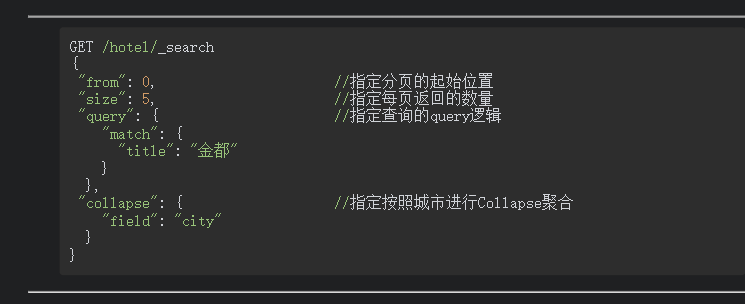

# 3.4 Elasticsearch从入门到放弃-聚合

文档摘自《Elasticsearch搜索引擎构建入门与实战》

### 1.背景

当用户使用搜索引擎完成搜索后，在展示结果中需要进行进一步的筛选，而筛选的维度需要根据当前的搜索结果进行汇总，这就用到了聚合技术。聚合的需求在很多应用程序中都有所体现，**例如在京东App中搜索“咸鸭蛋”，然后单击搜索界面中的“筛选”按钮，在弹出的界面中可以对当前的搜索结果进行进一步的过滤**。例如，可以从价格区间、品牌、分类、枚数等维度分别进行筛选，（**具体筛选条件是从第一步搜索条件中得到的**）如图所示。

ES支持丰富的聚合操作，**不仅可以使用聚合功能对文档进行计数，还可以计算文档字段的平均值、最大值和最小值等。ES还提供了桶聚合的功能，以便于对多维度数据进行聚合。**接下来结合实例介绍这些内容。另外，如果希望搜索结果和聚合结果一起返回，其中绕不开的一个主题就是分页和排序，本章也会对这两部内容进行介绍。

为方便介绍，下面重新定义酒店的索引。

接着向索引中写入示例数据，具体如下：

### 2. 聚合指标

#### 2.1 常见的统计指标

在搜索聚合时，用户可能会关注字段的相关统计信息，例如平均值、最大值、最小值及加和值等。例如，**用户在使用一个二手房交易搜索引擎进行搜索时，可能会关注当前城市各个区域的房产平均价格**。再例如，**用户在搜索酒店时，也可能会关注附近各个区域酒店的最低价格**。如图7.2所示，左图为在链家App的地图模式，可以搜索到当前位置附近的二手房平均交易价格；右图为携程App的地图模式，可以搜索到当前位置附近最低价格的酒店。

ES聚合请求的地址也是索引的搜索地址，可以使用aggs子句封装聚合请求。当使用avg子句进行平均值的聚合时，可以在avg子句中指定聚合的字段。在默认情况下，查询将匹配所有文档，如果不需要返回匹配的文档信息，最好将返回的文档个数设置为0。这样既可以让结果看起来更整洁，又可以提高查询速度。下面的DSL将查询所有酒店的平均价格并且不返回匹配的文档信息。

在上面的搜索结果中，索引中的5个文档全部命中，由于DSL设置size为0，所以命中文档的信息没有显示。在搜索结果的aggregations子句中存储着聚合结果，其中my_agg是聚合的名称，其对应的value值就是具体聚合结果，即酒店的平均价格。如果聚合的指标字段不是ES的基本类型，例如object类型，则可以使用点运算符进行引用。下面的DSL演示了

为了避免多次请求，ES还提供了stats聚合。stats聚合可以将对应字段的最大值、最小值、平均值及加和值一起计算并返回计算结果。下面的DSL展示了stats的用法。

以下代码演示了在Java中使用stats聚合的逻辑。

#### 2.2 空值处理

在索引中的一部分文档很可能其某些字段是缺失的，在介绍空值处理之前，首先介绍ES聚合查询提供的value_count聚合，该聚合用于统计字段非空值的个数。以下示例使用value_count聚合统计了price字段中非空值的个数。

下面的代码演示了在Java中使用value_count对price字段进行聚合的逻辑。

需要指出的是，如果判断的字段是**数组类型**，则value_count统计的是符合条件的所有文档中该字段**数组中非空元素个数的总和，而不是数组的个数总和**。下面的DSL用于统计tags字段数组中非空元素个数的总和。

如果需要以空值字段的数据作为聚合指标对其进行聚合，可以在指标统计中通过missing参数指定填充值对空值进行填充。以下示例演示了对price字段进行聚合，并设定了当字段值为空值时使用100进行替代的查询请求。

以下代码演示了在Java中当聚合指标为空值时指定填充值的逻辑。

## 3. 桶聚合

前面介绍的聚合指标是指符合条件的文档字段的聚合，有时还需要根据某些维度进行聚合。例如在搜索酒店时，**按照城市、是否满房、标签和创建时间等维度统计酒店的平均价格。这些字段统称为“桶”，在同一维度内有一个或者多个桶**。例如城市桶，有“北京”“天津”等，是否满房桶，有“满房”“非满房”。

### 3.1 单维度桶聚合

最简单的桶聚合是单维度桶聚合，指的是按照一个维度对文档进行分组聚合。**在桶聚合时，聚合的桶也需要匹配，匹配的方式有terms、filter和ranges等**。本节只介绍比较有代表性的terms查询和ranges查询，对其他匹配方式感兴趣读者可以阅读相关文档进行学习，这里不再赘述。

terms聚合是按照字段的实际完整值进行匹配和分组的，它使用的维度字段必须是keyword、bool、keyword数组等适合精确匹配的数据类型，因此不能对text字段直接使用terms聚合，**如果对text字段有terms聚合的需求，则需要在创建索引时为该字段增加多字段功能**。

在默认情况下，**进行桶聚合时如果不指定指标，则ES默认聚合的是文档计数，该值以doc_count为key存储在每一个bucket子句中**。在聚合结果的buckets的两个bucket中，key字段的值分别为“北京”“天津”，表示两个bucket的唯一标识；doccount_字段的值分别为3和2，表示两个bucket的文档计数。返回的doccount_是近似值，并不是一个准确数，因此在聚合外围，**ES给出了两个参考值doc_count_error_upper_bound和sum_other__doc_count，doc_count_error_upper表示被遗漏的文档数量可能存在的最大值，sum_other_doc_count表示除了返回给用户的文档外剩下的文档总数。**

从上述结果中可以看到，在满房和非满房的bucket结果中多出了一个字段，名称为key_as_string，其值分别是true和false。另外，这两个bucket的key值分别为1和0。这是因为，**如果桶字段类型不是keyword类型，ES在聚合时会将桶字段转换为Lucene存储的实际值进行识别。true在Lucene中存储为1，false在Lucene中存储为0，这就是为什么满房和非满房的key字段分别为1和0的原因。**这种情况给用户的使用带来了一些困惑，因为和原始值的差别比较大。针对这个问题，我们可以使用ES提供的key_as_string桶识别字段，它是原始值的字符串形式，和原始值的差别比较小。

以下代码演示了在Java中使用terms聚合进行单维度桶聚合的逻辑：

除了terms聚合，ranges聚合也是经常使用的一种聚合。它匹配的是数值字段，表示按照数值范围进行分组。用户可以在ranges中添加分组，每个分组用from和to表示分组的起止数值。注意该分组包含起始数值，不包含终止数值。以下DSL演示了使用ranges进行聚合的方法：

以下代码演示了在Java中使用ranges聚合的逻辑：

有时**还需要对单维度桶指定聚合指标，聚合指标单独使用子aggs进行封装，该aggs子句的使用方式和上一节介绍的聚合指标相同。**以下请求表示按照城市维度进行聚合，统计各个城市的平均酒店价格：

在上面的结果中，聚合桶的维度是城市，当前索引中城市为“北京”的文档个数为3，城市为“天津”的文档个数为2。将这两组文档的聚合结果在buckets子句中进行了封装，可以根据key字段进行聚合桶的识别，**每个聚合的组中既有文档个数又有价格的加和值。**

以下代码演示了在Java中使用桶聚合和指标聚合的逻辑：

### 3.2 多维度桶嵌套聚合

在某些业务需求中，不仅需要一个维度的桶聚合，而且还可能有多维度桶嵌套聚合的需求。例如在搜索酒店时，可能**需要统计各个城市的满房和非满房状态下的酒店平均价格**。**ES支持嵌套桶聚合，进行嵌套时，可以使用aggs子句进行子桶的继续嵌套，指标放在最里面的子桶内**。以下DSL演示了多维度桶的使用方法：

上述DSL被执行后，ES返回的结果如下：

从结果中可以看到，第一层的分桶先按照城市分组分为“北京”“天津”；第二层在“北京”“天津”桶下面继续分桶，分为“满房”“非满房”桶，对应的聚合指标即价格的加和值存储在内部的my_sum字段中。

以下代码演示了在Java中使用多维度桶进行聚合的逻辑：

### 3.3 地理距离聚合

按照地理距离进行聚合是一个非常实用的功能，例如在搜索酒店时，可能需要对附近的酒店个数先预览一下**：查看距离当前位置2km范围内、2～3km范围内、5km范围内的酒店个数。**再如，**在与电动汽车相关的充电需求中，车主需要搜寻附近充电桩的数量，以便能快速地完成充电。**如图7.3所示为国家电网“e充电”手机App的地图搜索模式，用户附近的汽车充电桩数量将随着地图的缩放而逐渐变化。

用户可以使用geo_distance聚合进行地理距离聚合，通过field参数来设置距离计算的字段，可以在origin子句中设定距离的原点，通过unit参数来设置距离的单位，可以选择mi和km，分别表示米和千米。ranges子句用来对距离进行阶段性的分组，该子句的使用方式和前面介绍的range聚合类似。以下DSL演示了使用geo_distance聚合进行地理距离聚合的方法：

在上述DSL中，给定了一个地理位置，此处使用ranges聚合对距离该位置的酒店划分了3个分组的桶：第1个桶为3km范围内；第2个桶为3～10km；第3个桶为大于等于10km。执行上述DSL后，ES返回的结果如下：

其中，在aggregations结果子句中对应查询的分组有3个bucket桶，表示按照距离划分的3个组，每个bucket桶内分别给出了key和文档数量等信息。

也可以指定聚合指标进行地理距离聚合，下面的DSL将按照bucket分桶聚合酒店的最低价格：

执行上述DSL后，聚合结果如下：

以下代码演示了在Java中使用地理距离分组并计算最低价格的逻辑：**（注意两个聚合之间距离和价格有父子关系）**

## 4. 聚合方式

ES支持灵活的聚合方式，它不仅支持聚合和查询相结合，而且还可以使聚合的过滤条件不影响搜索条件，并且还支持在聚合后的结果中进行过滤筛选。本节将介绍这些聚合方式。

### 4.1　直接聚合

直接聚合指的是聚合时的DSL没有query子句，是直接对索引内的所有文档进行聚合。前面介绍的示例都属于直接聚合，这里不再进行演示。

### 4.2　先查询再聚合

以下代码演示了在Java中先查询再聚合的逻辑：

### 4.3　前过滤器

有时需要对聚合条件进一步地过滤，但是又不能影响当前的查询条件。例如**用户进行酒店搜索时的搜索条件是天津的酒店，但是聚合时需要将非满房的酒店平均价格进行聚合并展示给用户。此时不能变更用户的查询条件，需要在聚合子句中添加过滤条件。**下面的DSL展示了在聚合时使用过滤条件的用法：

执行上述DSL后，ES返回的结果如下：

通过上述结果可以知道，满足查询条件的文档个数为2，命中的文档为004和005，**但是在聚合时要求匹配非满房的酒店，只有文档004满足聚合条件，因此酒店的平均值为文档004的price字段值**。

以下代码演示了在Java中使用前过滤器的逻辑：**（注意两个聚合之间前置过滤 满房状态和价格有父子关系）**

### 4.4　后过滤器

在有些场景中，需要根据条件进行数据查询，但是聚合的结果集不受影响。例如**在酒店搜索场景中，用户的查询词为“假日”，此时应该展现标题中带有“假日”的酒店。但是在该页面中，如果还希望给用户呈现出全国各个城市的酒店的平均价格，这时可以使用ES提供的后过滤器功能。该过滤器是在查询和聚合之后进行过滤的，因此它的过滤条件对聚合没有影响。**以下的DSL展示了后过滤器的使用：

在上面的查询中，使用match匹配title中包含“假日”的酒店，并且查询出这些酒店的平均价格，**最后使用post_filter设置后过滤器的条件，将酒店的城市锁定为“北京”**（title包含假日的有四个文档，把找到城市在北京的，只有三个，一个天津的被排除掉了，算平均价格）。执行该DSL后，ES返回的结果如下：

以下代码演示了在Java中使用后过滤器的逻辑：

## 5.聚合排序

根据前面的介绍可知，ES对于聚合结果的默认排序规则有时并非是我们期望的。可以使用ES提供的sort子句进行自定义排序，有多种排序方式供用户选择：**可以按照聚合后的文档计数的大小进行排序；可以按照聚合后的某个指标进行排序；还可以按照每个组的名称进行排序**。下面将介绍以上3种排序功能。

### 5.1  按文档计数排序

在聚合排序时，业务需求可能有按照每个组聚合后的文档数量进行排序的场景。此时可以使用_count来引用每组聚合的文档计数进行排序。以下DSL演示了按照城市的酒店平均价格进行聚合，并按照聚合后的文档计数进行升序排列的请求：

执行上述DSL后，ES返回的结果如下：

以下代码演示了在Java中使用文档计数进行聚合排序的逻辑：

### 5.2 按聚合指标排序

在聚合排序时，业务需求可能有按照每个组聚合后的指标值进行排序的场景。此时可以使用指标的聚合名称来引用每组聚合的文档计数。以下DSL**演示了按照城市的酒店平均价格进行聚合，并按照聚合后的平均价格进行升序排列的请求**：

执行上述DSL后，ES返回的结果如下：

以下代码演示了在Java中按照聚合指标进行聚合排序的逻辑：**（城市和平均价格是父子关系）**

### 5.3 按分组key排序

在聚合排序时，业务需求可能有按照每个分组的组名称排序的场景。此时可以使用_key来引用分组名称。以下DSL演示了**按照城市的酒店平均价格进行聚合，并按照聚合后的分组名称进行升序排列**的请求：

执行上述DSL后，ES返回的结果如下：

以下代码演示了在Java中按照分组key进行聚合排序的逻辑：：**（城市和平均价格是父子关系）**

## 6. 聚合分页

ES支持同时返回查询结果和聚合结果，前面介绍聚合查询时，查询结果和聚合结果各自封装在不同的子句中。但**有时我们希望聚合的结果按照每组选出前N个文档的方式进行呈现**，最常见的一个场景就是电商搜索，如搜索苹果手机6S，搜索结果应该展示苹果手机6S型号中的一款手机即可，而不论该型号手机的颜色有多少种。另外，当聚合结果和查询结果封装在一起时，还需要考虑对结果分页的问题，此时前面介绍的聚合查询就不能解决这些问题了。**ES提供的Top hits聚合和Collapse聚合可以满足上述需求，但是这两种查询的分页方案是不同的。本节将介绍Top hits聚合和Collapse聚合，并分别给出这两种查询的分页方案**。

### 6.1 Top hits聚合

顾名思义，**Top hits聚合指的是聚合时在每个分组内部按照某个规则选出前N个文档进行展示**。例如，搜索“金都”时，如果希望**按照城市分组，每组按照匹配分数降序展示3条文档**数据，DSL如下：

执行上述查询后，ES返回的结果如下：

可以看到，在索引中一共有3个文档命中match查询条件，在聚合结果中按照城市分成了两个组“北京”“天津”，在“北京”下面有两个文档命中，并且**按照得分将展示文档进行了降序排列**，“天津”只有一个文档命中。

**Top hits聚合能满足“聚合的结果按照每组选出N个文档的方式进行呈现”的需求，但是很遗憾，它不能完成自动分页功能。**如果在聚合中使用Top hits聚合并期望对数据进行分页，则要求聚合的结果一定不能太多，因为需要由客户端自行进行分页，此时对分页内存的存储能力是一个挑战。可以一次性获取聚合结果并将其存放在内存中或者Redis中，然后自行实现翻页逻辑，完成翻页。假设数据一次性存储到Redis的list结构中，以下示例代码演示了从Redis分页取数据的逻辑：

### 6.2 Collapse聚合

如前面所述，当**在索引中有大量数据命中时，Top hits聚合存在效率问题，并且需要用户自行排序**。针对上述问题，ES推出了Collapse聚合，即用户可以在collapse子句中指定分组字段，匹配query的结果按照该字段进行分组，并在每个分组中按照得分高低展示组内的文档。当用户在query子句外指定from和size时，将作用在Collapse聚合之后，即此时的分页是作用在分组之后的。以下DSL展示了Collapse聚合的用法：

执行上述DSL后，ES返回的结果如下：

从结果中可以看到，与Top hits聚合不同，Collapse聚合的结果是封装在hit中的。在索引中一共有3个文档命中match查询条件，在聚合结果中已经按照城市分成了两个组，即“北京”“天津”，在“北京”下面有两个文档命中，其中得分最高的文档为003，“天津”只有一个文档命中。上述结果不仅能按照得分进行排序，并且具备分页功能。

以下代码演示了在Java中使用Collapse聚合的逻辑：

