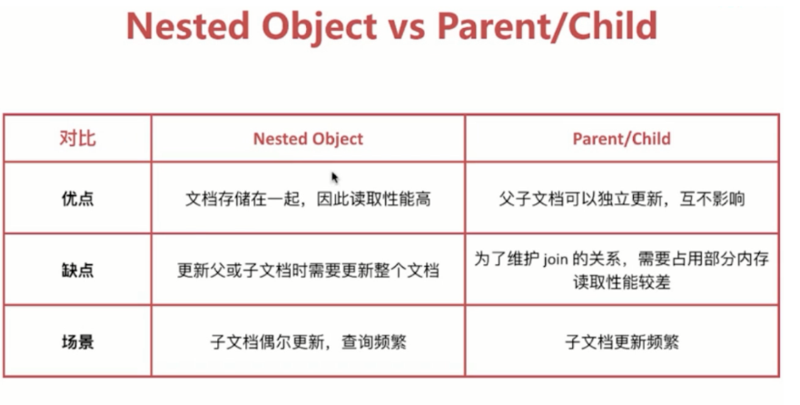

# 3.5 Elasticsearch从入门到放弃-nested对象

## 1.项目背景

最近项目增加了一个新需求，用户店铺商品搜索,可以根据店铺名称和商品名称进行模糊搜索,为了省事，我们建了一个新的索引，文档结构 同一个文档中包含店铺信息，每个店铺信息有一个字段，这个字段设置这个商家的在售商品列表。


结构如下：

```json
PUT shopping_info
{
    "mappings" : {
      "properties" : {
        "shoppingGoods" : {
          "properties" : {
            "goodsId" : {
              "type" : "long"
            },
            "goodsName" : {
              "type" : "text",
              "fields" : {
                "keyword" : {
                  "type" : "keyword",
                  "ignore_above" : 256
                }
              }
            },
            "imageUrls" : {
              "type" : "text",
              "fields" : {
                "keyword" : {
                  "type" : "keyword",
                  "ignore_above" : 256
                }
              }
            },
            "supplierId" : {
              "type" : "long"
            }
        }},
        "headPic" : {
          "type" : "text",
          "fields" : {
            "keyword" : {
              "type" : "keyword",
              "ignore_above" : 256
            }
          }
        },
        "mainGoods" : {
          "type" : "text",
          "fields" : {
            "keyword" : {
              "type" : "keyword",
              "ignore_above" : 256
            }
          }
        },
        "storeId" : {
          "type" : "long"
        },
        "storeName" : {
          "type" : "text",
          "fields" : {
            "keyword" : {
              "type" : "keyword",
              "ignore_above" : 256
            }
          }
        },
        "suppliersId" : {
          "type" : "long"
        },
        "suppliersName" : {
          "type" : "text",
          "fields" : {
            "keyword" : {
              "type" : "keyword",
              "ignore_above" : 256
            }
          }
        }
      }
    }

}


GET shopping_info/_mapping

{
  "shopping_info" : {
    "mappings" : {
      "properties" : {
        "shoppingGoods" : {
          "properties" : {
            "goodsId" : {
              "type" : "long"
            },
            "goodsName" : {
              "type" : "text",
              "fields" : {
                "keyword" : {
                  "type" : "keyword",
                  "ignore_above" : 256
                }
              }
            },
            "imageUrls" : {
              "type" : "text",
              "fields" : {
                "keyword" : {
                  "type" : "keyword",
                  "ignore_above" : 256
                }
              }
            },
            "supplierId" : {
              "type" : "long"
            }
          }
        },
        "headPic" : {
          "type" : "text",
          "fields" : {
            "keyword" : {
              "type" : "keyword",
              "ignore_above" : 256
            }
          }
        },
        "mainGoods" : {
          "type" : "text",
          "fields" : {
            "keyword" : {
              "type" : "keyword",
              "ignore_above" : 256
            }
          }
        },
        "storeId" : {
          "type" : "long"
        },
        "storeName" : {
          "type" : "text",
          "fields" : {
            "keyword" : {
              "type" : "keyword",
              "ignore_above" : 256
            }
          }
        },
        "suppliersId" : {
          "type" : "long"
        },
        "suppliersName" : {
          "type" : "text",
          "fields" : {
            "keyword" : {
              "type" : "keyword",
              "ignore_above" : 256
            }
          }
        }
      }
    }
  }
}
```
由上可见，每个店铺信息会包含一个shoppingGoods商品列表;

接下来添加数据：

```json
POST shopping_info/_doc/1
{
        
          "shoppingGoods" : [
            {
              "goodsId" : 1,
              "goodsName" : "商品1-1",
              "imageUrls" : "https://tttt.jpeg",
              "supplierId" : 1,
              "trait" : "常山胡柚皮包裹云南宫廷普洱"
            },
            {
              "goodsId" : 2,
              "goodsName" : "商品1-2",
              "imageUrls" : "https://tttt.jpeg",
              "supplierId" : 1,
              "trait" : "化痰止咳"
            }
          ],
          "headPic" : "https://tttt.jpeg",
          "mainGoods" : "胡柚青果茶",
          "storeName" : "aaa旗舰店",
          "suppliersId" : 1,
          "suppliersName" : "aaa公司"
        
}

POST shopping_info/_doc/2
{
        
          "shoppingGoods" : [
            {
              "goodsId" : 2,
              "goodsName" : "商品2-2",
              "imageUrls" : "https://tttt.jpeg",
              "supplierId" : 2,
              "trait" : "常山胡柚皮包裹云南宫廷普洱"
            },
            {
              "goodsId" : 3,
              "goodsName" : "商品2-3",
              "imageUrls" : "https://tttt.jpeg",
              "supplierId" : 2,
              "trait" : "化痰止咳"
            }
          ],
          "headPic" : "https://tttt.jpeg",
          "mainGoods" : "胡柚青果茶",
          "storeName" : "bbb旗舰店",
          "suppliersId" : 2,
          "suppliersName" : "bbb公司"
        
}
```

基于店铺搜索,店铺及结果商品正常

```json
GET shopping_info/_search
{
  "query": {
  
        "match_phrase": {
          "suppliersName": "bbb"
        }
    }
  
}

//-----------------结果--------------------
{
  "took" : 0,
  "timed_out" : false,
  "_shards" : {
    "total" : 1,
    "successful" : 1,
    "skipped" : 0,
    "failed" : 0
  },
  "hits" : {
    "total" : {
      "value" : 1,
      "relation" : "eq"
    },
    "max_score" : 0.6931471,
    "hits" : [
      {
        "_index" : "shopping_info",
        "_type" : "_doc",
        "_id" : "2",
        "_score" : 0.6931471,
        "_source" : {
          "shoppingGoods" : [
            {
              "goodsId" : 2,
              "goodsName" : "商品2-2",
              "imageUrls" : "https://tttt.jpeg",
              "supplierId" : 2,
              "trait" : "常山胡柚皮包裹云南宫廷普洱"
            },
            {
              "goodsId" : 3,
              "goodsName" : "商品2-3",
              "imageUrls" : "https://tttt.jpeg",
              "supplierId" : 2,
              "trait" : "化痰止咳"
            }
          ],
          "headPic" : "https://tttt.jpeg",
          "mainGoods" : "胡柚青果茶",
          "storeName" : "bbb旗舰店",
          "suppliersId" : 2,
          "suppliersName" : "bbb公司"
        }
      }
    ]
  }
}
```


基于商品名称搜索，包含该商品名的店铺都搜索出来，但是商品的结果不是我们想要的集合，**需求是：对应的里面嵌套的商品列表也需要过滤**

```java
GET shopping_info/_search
{
  "query": {
  
        "match_phrase": {
          "shoppingGoods.goodsName": "2-2"
        }
    }
  
}

//-----------------结果--------------------
{
  "took" : 0,
  "timed_out" : false,
  "_shards" : {
    "total" : 1,
    "successful" : 1,
    "skipped" : 0,
    "failed" : 0
  },
  "hits" : {
    "total" : {
      "value" : 1,
      "relation" : "eq"
    },
    "max_score" : 0.36464313,
    "hits" : [
      {
        "_index" : "shopping_info",
        "_type" : "_doc",
        "_id" : "2",
        "_score" : 0.36464313,
        "_source" : {
          "shoppingGoods" : [
            {
              "goodsId" : 2,
              "goodsName" : "商品2-2",
              "imageUrls" : "https://tttt.jpeg",
              "supplierId" : 2,
              "trait" : "常山胡柚皮包裹云南宫廷普洱"
            },
            {
              "goodsId" : 3,
              "goodsName" : "商品2-3",
              "imageUrls" : "https://tttt.jpeg",
              "supplierId" : 2,
              "trait" : "化痰止咳"
            }
          ],
          "headPic" : "https://tttt.jpeg",
          "mainGoods" : "胡柚青果茶",
          "storeName" : "bbb旗舰店",
          "suppliersId" : 2,
          "suppliersName" : "bbb公司"
        }
      }
    ]
  }
}
```

## 2.如何修改

那么问题来了，如果改成两个索引（店铺/商品），那么当前项目代码就要进行大改，成本较大，那么有没有什么方式可以通过同一索引结构，作上述的功能呢？百度了一下，确实有方法。

### 

参考文档：[Elastic：查询数组时如何只返回匹配的数组元素_wu@55555的博客-CSDN博客_es 数组查询](https://blog.csdn.net/qq_24950043/article/details/121699304)

[干货 | Elasticsearch Nested类型深入详解_铭毅天下的博客-CSDN博客_elasticsearch nested](https://blog.csdn.net/laoyang360/article/details/82950393)

### 2.1 原因分析

elasticsearch中的内部对象无法按预期工作
这里的问题是elasticsearch（lucene）使用的库没有内部对象的概念，因此内部对象被扁平化为一个简单的字段名称和值列表。
我们的文档内部存储为：

```
{
  "title":                    [ invest, money ],
  "body":                     [ as, investing, money, please, soon, start ],
  "tags":                     [ invest, money ],
  "published_on":             [ 18 Oct 2017 ]
  "comments.name":            [ smith, john, william ],
  "comments.comment":         [ after, article, good, i, investing, nice, post, reading, started, this, very ],
  "comments.age":             [ 33, 34, 38 ],
  "comments.rating":          [ 7, 8, 9 ],
  "comments.commented_on":    [ 20 Nov 2017, 25 Nov 2017, 30 Nov 2017 ]
}

```

您可以清楚地看到，comments.name和comments.age之间的关系已丢失。
这就是为什么我们的文档匹配内部对象列表（比如上面的商品列表）的查询。

要解决这个问题，我们只需要对elasticsearch的映射进行一些小改动。
**如果您查看索引的映射，您会发现shoppingGoods字段的类型是object。**
**我们需要更新它的类型为nested。**

### 2.2 Elasticsearch: nested对象

在处理大量数据时，关系数据库存在很多问题。 无论是速度，高效处理，有效并行化，可扩展性还是成本，当数据量开始增长时，关系数据库都会失败。该关系数据库的另一个挑战是必须预先定义关系和模式。

Elasticsearch也是一个NoSQL文档数据存储。 但是，尽管是一个NoSQL数据存储，**Elasticsearch在一定程度上提供了很多帮助来管理关系数据**。 它支持类似SQL的连接，并且在嵌套和相关的数据实体上工作得非常棒。

一个店铺可能有多个商品。这种数据就是关系数据。使用Elasticsearch，您可以通过保留轻松地工作与不同实体的关联以及强大的全文搜索和分析。 

#### 2.2.1 Nested类型的作用？注意：**一对多的关系存在于同一个文档之中**

**nested类型是对象数据类型的专用版本，它允许对象数组以可以彼此独立查询的方式进行索引。**

Elasticsearch通过引入两种类型的文档关系模型使这成为可能：

- nested 关系: 在这种关系中，这种**一对多的关系存在于同一个文档之中**
- parent-child 关系：在这种关系中，它们**存在于不同的文档之中**。

这两种关系在同一个模式下工作，即一对多个的关系。一个root或parent可以有一个及多个子object。

#### 2.2.2 Nested类型的适用场景



#### 2.2.3 原有结构不支持inner_hit查询

```json
GET shopping_info/_search
{
  "query": {
        "match_phrase": {
          "expoEnterpriseGoods.goodsName": "自制莲子"
        }
      },
      "inner_hits": {
        "ignore_unmapped": true
      }
  
}

-------结果-----
{
  "error" : {
    "root_cause" : [
      {
        "type" : "parsing_exception",
        "reason" : "Unknown key for a START_OBJECT in [inner_hits].",
        "line" : 7,
        "col" : 21
      }
    ],
    "type" : "parsing_exception",
    "reason" : "Unknown key for a START_OBJECT in [inner_hits].",
    "line" : 7,
    "col" : 21
  },
  "status" : 400
}
    


GET shopping_info/_search
{
  "query": {
    "nested": {
      "path": "expoEnterpriseGoods",
      "query": {
        "match_phrase": {
          "expoEnterpriseGoods.goodsName": "自制莲子"
        }
      },
      "inner_hits": {
        "ignore_unmapped": true
      }
    }
  }
}

--结果----
{
  "error" : {
    "root_cause" : [
      {
        "type" : "query_shard_exception",
        "reason" : "failed to create query: [nested] failed to find nested object under path [expoEnterpriseGoods]",
        "index_uuid" : "R-a889FTQcqbFzPbeRPQIQ",
        "index" : "shopping_info"
      }
    ],
    "type" : "search_phase_execution_exception",
    "reason" : "all shards failed",
    "phase" : "query",
    "grouped" : true,
    "failed_shards" : [
      {
        "shard" : 0,
        "index" : "shopping_info",
        "node" : "fTeqUiPtTFyJAZVTU0AYfQ",
        "reason" : {
          "type" : "query_shard_exception",
          "reason" : "failed to create query: [nested] failed to find nested object under path [expoEnterpriseGoods]",
          "index_uuid" : "R-a889FTQcqbFzPbeRPQIQ",
          "index" : "shopping_info",
          "caused_by" : {
            "type" : "illegal_state_exception",
            "reason" : "[nested] failed to find nested object under path [expoEnterpriseGoods]"
          }
        }
      }
    ]
  },
  "status" : 400
}
```


#### 2.2.4 删除索引，将上述文档的shoppingGoods集合改为nested对象

```json

DELETE shopping_info

PUT shopping_info
{
    "mappings" : {
      "properties" : {
        "shoppingGoods" : {
           "type" : "nested",   //注意此处定义shoppingGoods的类型为nested
          "properties" : {
            "goodsId" : {
              "type" : "long"
            },
            "goodsName" : {
              "type" : "text",
              "fields" : {
                "keyword" : {
                  "type" : "keyword",
                  "ignore_above" : 256
                }
              }
            },
            "imageUrls" : {
              "type" : "text",
              "fields" : {
                "keyword" : {
                  "type" : "keyword",
                  "ignore_above" : 256
                }
              }
            },
            "supplierId" : {
              "type" : "long"
            }
        }},
        "headPic" : {
          "type" : "text",
          "fields" : {
            "keyword" : {
              "type" : "keyword",
              "ignore_above" : 256
            }
          }
        },
        "mainGoods" : {
          "type" : "text",
          "fields" : {
            "keyword" : {
              "type" : "keyword",
              "ignore_above" : 256
            }
          }
        },
        "storeId" : {
          "type" : "long"
        },
        "storeName" : {
          "type" : "text",
          "fields" : {
            "keyword" : {
              "type" : "keyword",
              "ignore_above" : 256
            }
          }
        },
        "suppliersId" : {
          "type" : "long"
        },
        "suppliersName" : {
          "type" : "text",
          "fields" : {
            "keyword" : {
              "type" : "keyword",
              "ignore_above" : 256
            }
          }
        }
      }
    }

}


GET shopping_info/_mapping    
    
{
  "shopping_info" : {
    "mappings" : {
      "properties" : {
        "headPic" : {
          "type" : "text",
          "fields" : {
            "keyword" : {
              "type" : "keyword",
              "ignore_above" : 256
            }
          }
        },
        "mainGoods" : {
          "type" : "text",
          "fields" : {
            "keyword" : {
              "type" : "keyword",
              "ignore_above" : 256
            }
          }
        },
        "shoppingGoods" : {
          "type" : "nested",
          "properties" : {
            "goodsId" : {
              "type" : "long"
            },
            "goodsName" : {
              "type" : "text",
              "fields" : {
                "keyword" : {
                  "type" : "keyword",
                  "ignore_above" : 256
                }
              }
            },
            "imageUrls" : {
              "type" : "text",
              "fields" : {
                "keyword" : {
                  "type" : "keyword",
                  "ignore_above" : 256
                }
              }
            },
            "supplierId" : {
              "type" : "long"
            }
          }
        },
        "storeId" : {
          "type" : "long"
        },
        "storeName" : {
          "type" : "text",
          "fields" : {
            "keyword" : {
              "type" : "keyword",
              "ignore_above" : 256
            }
          }
        },
        "suppliersId" : {
          "type" : "long"
        },
        "suppliersName" : {
          "type" : "text",
          "fields" : {
            "keyword" : {
              "type" : "keyword",
              "ignore_above" : 256
            }
          }
        }
      }
    }
  }
}
```

添加上述测试数据

```json
POST shopping_info/_doc/1
{
        
          "shoppingGoods" : [
            {
              "goodsId" : 1,
              "goodsName" : "商品1-1",
              "imageUrls" : "https://tttt.jpeg",
              "supplierId" : 1,
              "trait" : "常山胡柚皮包裹云南宫廷普洱"
            },
            {
              "goodsId" : 2,
              "goodsName" : "商品1-2",
              "imageUrls" : "https://tttt.jpeg",
              "supplierId" : 1,
              "trait" : "化痰止咳"
            }
          ],
          "headPic" : "https://tttt.jpeg",
          "mainGoods" : "胡柚青果茶",
          "storeName" : "aaa旗舰店",
          "suppliersId" : 1,
          "suppliersName" : "aaa公司"
        
}


POST shopping_info/_doc/2
{
        
          "shoppingGoods" : [
            {
              "goodsId" : 2,
              "goodsName" : "商品2-2",
              "imageUrls" : "https://tttt.jpeg",
              "supplierId" : 2,
              "trait" : "常山胡柚皮包裹云南宫廷普洱"
            },
            {
              "goodsId" : 3,
              "goodsName" : "商品2-3",
              "imageUrls" : "https://tttt.jpeg",
              "supplierId" : 2,
              "trait" : "化痰止咳"
            }
          ],
          "headPic" : "https://tttt.jpeg",
          "mainGoods" : "胡柚青果茶",
          "storeName" : "bbb旗舰店",
          "suppliersId" : 2,
          "suppliersName" : "bbb公司"
        
}
```

#### 2.2.5 通过inner_hit以及ignore_unmapped来实现查询过滤：

基于商品名称搜索，包含该商品名的店铺都搜索出来，商品的结果是我们想要的集合，**需求是：对应的里面嵌套的商品列表也需要过滤**

**忽略未映射的字段(Ignoring Unmapped Fields)**

默认情况下，如果字段没有相关联的映射，搜索请求将失败。ignore_unmapped参数可以忽略该字段，如果这个字段没有映射，并不通过该字段排序。

```json
GET shopping_info/_search
{
  "query": {

        "match_phrase": {
          "shoppingGoods.goodsName": "2-2"
        }
    }
  
}

//---结果----
{
  "took" : 0,
  "timed_out" : false,
  "_shards" : {
    "total" : 1,
    "successful" : 1,
    "skipped" : 0,
    "failed" : 0
  },
  "hits" : {
    "total" : {
      "value" : 0,
      "relation" : "eq"
    },
    "max_score" : null,
    "hits" : [ ]
  }
}


//----需要修改查询条件如下----
GET shopping_info/_search
{
  "query": {
    "nested": {
      "path": "shoppingGoods",
      "query": {
        "match_phrase": {
          "shoppingGoods.goodsName": "2-2"
        }
      },
      "inner_hits": {
        "ignore_unmapped": true  
      }
    }
  }
}


//------查看结果，过滤前的商品列表放在原有结构层级 ，过滤后的商品列表放在inner_hits集合中，我们可以从这里获取
{
  "took" : 4,
  "timed_out" : false,
  "_shards" : {
    "total" : 1,
    "successful" : 1,
    "skipped" : 0,
    "failed" : 0
  },
  "hits" : {
    "total" : {
      "value" : 1,
      "relation" : "eq"
    },
    "max_score" : 0.7133499,
    "hits" : [
      {
        "_index" : "shopping_info",
        "_type" : "_doc",
        "_id" : "2",
        "_score" : 0.7133499,
        "_source" : {
          "shoppingGoods" : [
            {
              "goodsId" : 2,
              "goodsName" : "商品2-2",
              "imageUrls" : "https://tttt.jpeg",
              "supplierId" : 2,
              "trait" : "常山胡柚皮包裹云南宫廷普洱"
            },
            {
              "goodsId" : 3,
              "goodsName" : "商品2-3",
              "imageUrls" : "https://tttt.jpeg",
              "supplierId" : 2,
              "trait" : "化痰止咳"
            }
          ],
          "headPic" : "https://tttt.jpeg",
          "mainGoods" : "胡柚青果茶",
          "storeName" : "bbb旗舰店",
          "suppliersId" : 2,
          "suppliersName" : "bbb公司"
        },
        "inner_hits" : {
          "shoppingGoods" : {
            "hits" : {
              "total" : {
                "value" : 1,
                "relation" : "eq"
              },
              "max_score" : 0.7133499,
              "hits" : [
                {
                  "_index" : "shopping_info",
                  "_type" : "_doc",
                  "_id" : "2",
                  "_nested" : {
                    "field" : "shoppingGoods",
                    "offset" : 0
                  },
                  "_score" : 0.7133499,
                  "_source" : {
                    "supplierId" : 2,
                    "goodsId" : 2,
                    "imageUrls" : "https://tttt.jpeg",
                    "trait" : "常山胡柚皮包裹云南宫廷普洱",
                    "goodsName" : "商品2-2"
                  }
                }
              ]
            }
          }
        }
      }
    ]
  }
}

```


### 3.java实现

#### **3.1 nested对象 创建结构nested对象**

这块nested对象的映射，在创建索引时，手动指定创建的，**因为之前地理位置geo_point对象注解不生效的缘故，防止nested注解也不生效**，手动创建

```java
private void rebuildIndex() {
        try {
            GetIndexRequest e_request = new GetIndexRequest(expoEnterPriseIndexName);
            boolean exist = client.indices().exists(e_request, RequestOptions.DEFAULT);
            if (exist) {
                DeleteIndexRequest request = new DeleteIndexRequest(expoEnterPriseIndexName);
                AcknowledgedResponse delete = client.indices().delete(request, RequestOptions.DEFAULT);
                logger.info("索引--------" + delete.isAcknowledged());
            }
            CreateIndexRequest crequest = new CreateIndexRequest(expoEnterPriseIndexName);
            crequest.mapping("{\"properties\":{\"expoEnterpriseGoods\" : {\n" +
                    "   \"type\": \"nested\",\n" +
                    "          \"properties\" : {\n" +
                    "            \"ancestryCategoryId\" : {\n" +
                    "              \"type\" : \"long\"\n" +
                    "            },\n" +
                    "            \"goodsId\" : {\n" +
                    "              \"type\" : \"long\"\n" +
                    "            },\n" +
                    "            \"goodsName\" : {\n" +
                    "              \"type\" : \"text\",\n" +
                    "              \"fields\" : {\n" +
                    "                \"keyword\" : {\n" +
                    "                  \"type\" : \"keyword\",\n" +
                    "                  \"ignore_above\" : 256\n" +
                    "                }\n" +
                    "              }\n" +
                    "            },\n" +
                    "            \"imageUrls\" : {\n" +
                    "              \"type\" : \"text\",\n" +
                    "              \"fields\" : {\n" +
                    "                \"keyword\" : {\n" +
                    "                  \"type\" : \"keyword\",\n" +
                    "                  \"ignore_above\" : 256\n" +
                    "                }\n" +
                    "              }\n" +
                    "            },\n" +
                    "            \"supplierId\" : {\n" +
                    "              \"type\" : \"long\"\n" +
                    "            },\n" +
                    "            \"trait\" : {\n" +
                    "              \"type\" : \"text\",\n" +
                    "              \"fields\" : {\n" +
                    "                \"keyword\" : {\n" +
                    "                  \"type\" : \"keyword\",\n" +
                    "                  \"ignore_above\" : 256\n" +
                    "                }\n" +
                    "              }\n" +
                    "            }\n" +
                    "          }\n" +
                    "        }}}", XContentType.JSON);
            //2客户端执行请求，请求后获得响应
            CreateIndexResponse response = client.indices().create(crequest, RequestOptions.DEFAULT);
            logger.info("索引重新创建结果:{}", response);
        } catch (Exception e) {
            logger.error("索引重新创建异常:{}", e);
        }
    }
```

#### 3.2 nested对象 批量新增数据接口及对于的java对象

```java
private RestStatus createNewIndex(List<ShoppingInfoDto> shoppingInfoDtos) {
        RestStatus status = RestStatus.OK;
        if (CollectionUtils.isEmpty(shoppingInfoDtos)) {
            return status;
        }
        try {
            BulkRequest b_request = new BulkRequest();
//            b_request.timeout("3s");
            for (ShoppingInfoDto shoppingInfoDto : ShoppingInfoDtos) {
                b_request.add(new IndexRequest("shopping_info").id("" + expoEnterpriseDto.getSuppliersId()) // 这里不设置id的话就会生成随机的id，可以保证没有重复的id
                        .source(JSON.toJSONString(shoppingInfoDto), XContentType.JSON));
            }
            BulkResponse responses = client.bulk(b_request, RequestOptions.DEFAULT);
            return responses.status();
        } catch (Exception e) {
            logger.error("参展企业索引创建异常：", e);
        }
        return status;
    }
```

```java
@Data
public class ShoppingInfoDto {

    /**
     * 商家ID（企业ID）
     */
    @Field(type = FieldType.Long)
    private Long suppliersId;

    /**
     * 商家名称（企业名称）
     */
    @Field(type = FieldType.Text, analyzer = "ik_max_word")
    private String suppliersName;

    /**
     * 店铺名称
     */
    @Field(type = FieldType.Text, analyzer = "ik_max_word")
    private String storeName;

    /**
     * 店铺ID
     */
    @Field(type = FieldType.Long)
    private Long storeId;

    /**
     * 店铺ID
     */
    @Field(type = FieldType.Text)
    private String headPic;

    /**
     * 主营商品
     */
    @Field(type = FieldType.Text)
    private String mainGoods;

    /**
     * 商品列表
     */
    @Field(type = FieldType.Nested)  //注意此处的类型为nested
    List<ShoppingGoodsDTO> shoppingGoods;

    @Override
    public String toString() {
        return JSON.toJSONString(this);
    }
}


@Data
public class ShoppingGoodsDTO {

    @Field(type = FieldType.Long)
    @ApiModelProperty(value = "店铺id")
    private Long supplierId;//店铺id

    @Field(type = FieldType.Long)
    @ApiModelProperty(value = "商品id")
    private Long goodsId;//商品id


    @Field(type = FieldType.Text, analyzer = "ik_max_word")
    @ApiModelProperty(value = "商品标题")
    private String goodsName;//商品标题


    @Field(type = FieldType.Text)
    @ApiModelProperty(value = "商品图片")
    private String imageUrls;//商品图片
}
```


#### 3.3  nested对象 在java代码中如何封装查询条件

```java
      
//基于店铺名称搜索

if (ObjectUtil.isNotEmpty(request.getSuppliersName())) {
            MatchQueryBuilder matchQueryBuilder = QueryBuilders.matchQuery("suppliersName", request.getSuppliersName());
            boolQueryBuilder.must(matchQueryBuilder);
        }
//基于商品名称搜索

if (ObjectUtil.isNotEmpty(request.getGoodsName())) {
            MatchPhraseQueryBuilder matchQueryBuilder = QueryBuilders.matchPhraseQuery("shoppingGoods.goodsName", request.getGoodsName());
            NestedQueryBuilder nestedQueryBuilder = QueryBuilders.nestedQuery("shoppingGoods", matchQueryBuilder, ScoreMode.None);
            InnerHitBuilder innerHitBuilder = new InnerHitBuilder();
            innerHitBuilder.setIgnoreUnmapped(true);
            nestedQueryBuilder.ignoreUnmapped(true).innerHit(innerHitBuilder);
            boolQueryBuilder.must(nestedQueryBuilder);
        }
```

#### 3.4 nested对象 在java代码中如何处理查询结果

从上面的搜索结果可以得到，nested对象搜出来的结果有两层，在原来的结果里面，会嵌套一层基于条件过滤之后的商品列表，**并放在在inner_hits中，所以对于商品名称搜索的结果  需要在inner_hits做二次解析**，而**如果是店铺名称搜索，就按照原有结果集获取**

```java
     List<ShoppingGoodsDTO> shoppingGoodsDTOs = new ArrayList<ShoppingGoodsDTO>();
            //非商品查询,从原有结果集第一层直接获取
            if (ObjectUtil.isEmpty(request.getGoodsName()) && ObjectUtil.isNotEmpty(hit.getSourceAsMap().get("shoppingGoods"))) {
                shoppingGoodsDTOs = (List<ShoppingGoodsDTO>) hit.getSourceAsMap().get("shoppingGoods");
            }
            //商品查询,需要过滤商品子文档，从innerHits子集获取
            if (ObjectUtil.isNotEmpty(request.getGoodsName()) && ObjectUtil.isNotEmpty(hit.getInnerHits()) && ObjectUtil.isNotEmpty(hit.getInnerHits().get("shoppingGoods"))) {
                SearchHit[] searchGoodHits = hit.getInnerHits().get("shoppingGoods").getHits();
                for (SearchHit searchGoodHit : searchGoodHits) {
                   ShoppingGoodsDTO shoppingGoodsDTO = new ShoppingGoodsDTO();
                    Long supplierId = null;//店铺id
                    Long goodsId = null;//商品id
                    String goodsName = null;//商品标题
                    String imageUrls = null;//商品图片
                    if (ObjectUtil.isNotEmpty(searchGoodHit.getSourceAsMap().get("supplierId"))) {
                        supplierId = Long.parseLong(searchGoodHit.getSourceAsMap().get("supplierId").toString());
                    }
                    if (ObjectUtil.isNotEmpty(searchGoodHit.getSourceAsMap().get("goodsId"))) {
                        goodsId = Long.parseLong(searchGoodHit.getSourceAsMap().get("goodsId").toString());
                    }
                    if (ObjectUtil.isNotEmpty(searchGoodHit.getSourceAsMap().get("goodsName"))) {
                        goodsName = searchGoodHit.getSourceAsMap().get("goodsName").toString();
                    }
                    if (ObjectUtil.isNotEmpty(searchGoodHit.getSourceAsMap().get("trait"))) {
                        trait = searchGoodHit.getSourceAsMap().get("trait").toString();
                    }
                    if (ObjectUtil.isNotEmpty(searchGoodHit.getSourceAsMap().get("imageUrls"))) {
                        imageUrls = searchGoodHit.getSourceAsMap().get("imageUrls").toString();
                    }
                    if (ObjectUtil.isNotEmpty(goodsName)) {
                        shoppingGoodsDTO.setSupplierId(supplierId);
                        shoppingGoodsDTO.setGoodsId(goodsId);
                        shoppingGoodsDTO.setGoodsName(goodsName);
                        shoppingGoodsDTO.setImageUrls(imageUrls);
                        shoppingGoodsDTOs.add(expoEnterpriseGoodsDTO);
                    }
                }
            }
```

