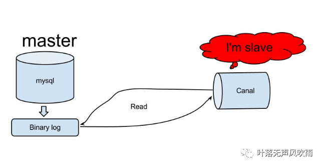
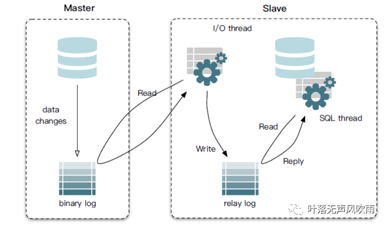
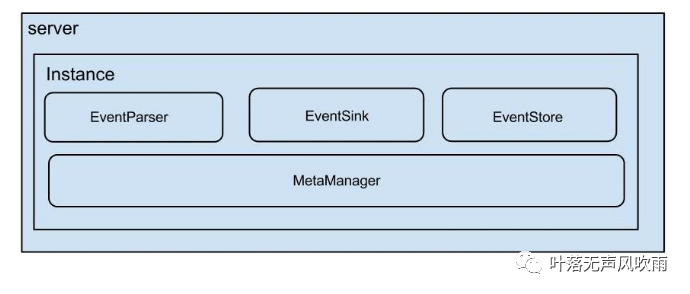
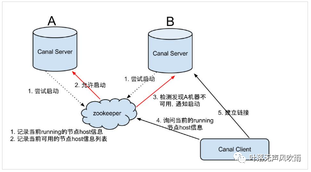
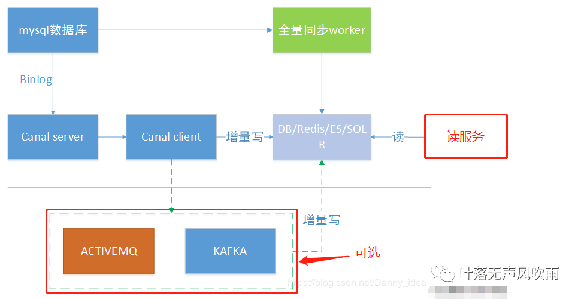
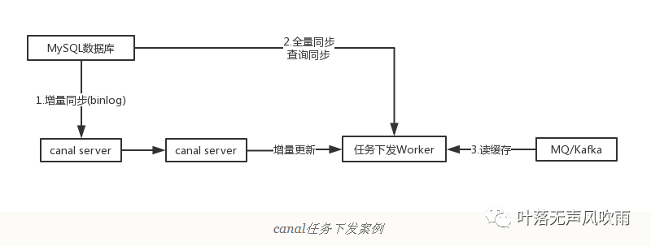
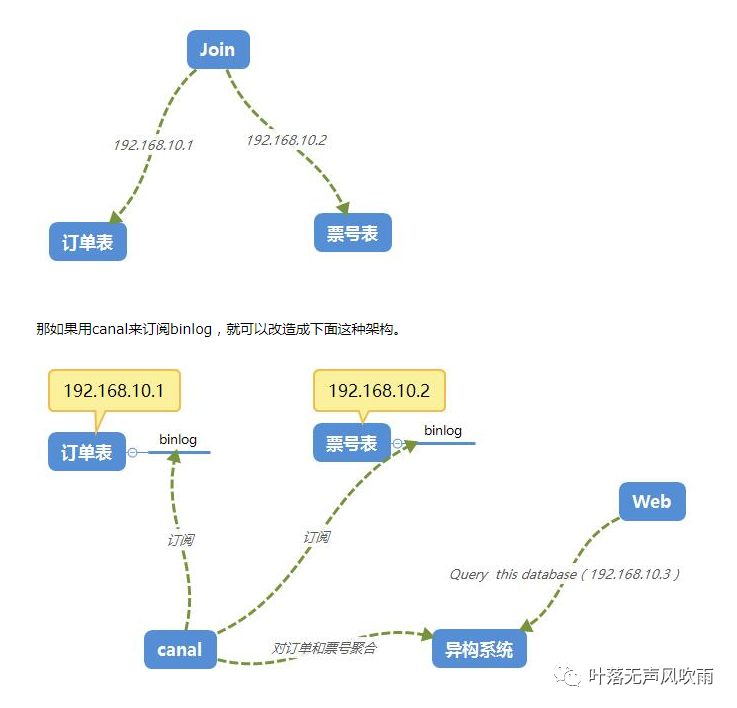

# 3.工具使用：canal从入门到实战（3)

## Canal简介

参考文档：[Canal——原理架构及应用场景 - 曹伟雄 - 博客园 (cnblogs.com)](https://www.cnblogs.com/caoweixiong/p/11824423.html)

**Canal**是阿里开源的一款基于Mysql数据库binlog的增量订阅和消费组件，通过它可以订阅数据库的binlog日志，然后进行一些数据消费，如数据镜像、数据异构、数据索引、缓存更新等。相对于消息队列，通过这种机制可以实现数据的**有序化和一致性**。

github地址：https://github.com/alibaba/canal

完整wiki地址：https://github.com/alibaba/canal/wiki


## Canal工作原理



1. canal模拟mysql slave与mysql master的交互协议，伪装自己是一个mysql slave，向mysql master发送dump协议；
2. mysql master收到mysql slave（canal）发送的**dump请求**，开始**推送**binlog增量日志给slave(也就是canal)；
3. mysql slave（canal伪装的）收到binlog增量日志后,就可以对这部分日志进行解析，获取主库的结构及数据变更；


## 基本概念

#### MySQL日志

参考文档：

[redo/undo log、binlog 的详解及其区别 - 简书 (jianshu.com)](https://www.jianshu.com/p/57c510f4ec28)

[mysql日志：redo log、binlog、undo log 区别与作用 - 云+社区 - 腾讯云 (tencent.com)](https://cloud.tencent.com/developer/article/1888595)

##### **1、**[**mysql**](https://cloud.tencent.com/product/cdb?from=10680)**常用日志**

- 错误日志
- 查询日志
- 慢查询日志
- 事务日志【redo log（重做日志）、undo log（回滚日志）】
- 二进制日志【bin log】

##### 2、redo log

1. 概念：**重做日志**用来实现事务持久性，主要有两部分文件组成，重做日志缓冲（redo log buffer）以及重做日志文件（redo log），前者是在内存中，后者是在磁盘中。
2.  作用：确保事务的持久性。防止在发生故障的时间点，尚有脏页未写入磁盘，在重启 mysql 服务的时候，根据 redo log 进行重做，从而达到事务的持久性这一特性。
3. 内容：物理格式的日志，记录的是物理数据页面的修改的信息，其 redo log 是顺序写入 redo log file 的物理文件中去的。

##### 3、undo log

​    概念：**回滚日志**，用来记录数据被修改前的信息。正好跟前面的重做日志进行相反操作。undo log主要记录的是数据的逻辑变化，为了在发生错误时回滚之前的操作，需要将之前的操作都记录下来，然后在发生错误时才可以回滚。

 作用：保存了事务发生之前的数据的一个版本，可以用于回滚，同时可以提供多版本并发控制下的读（MVCC），也即非锁定读；

　　内容：逻辑格式的日志，在执行 undo 的时候，仅仅是将数据从逻辑上恢复至事务之前的状态，而不是从物理页面上操作实现的，这一点是不同于 redo log 的。

##### 4、bin log

1. 概念：**归档日志**。记录了所有的DDL和DML语句（除查询语句外），以事件形式记录，是事务安全型。
2. 作用：**用于复制，在主从复制中，从库利用主库上的 binlog 进行重播，实现主从同步**。用于[数据库](https://cloud.tencent.com/solution/database?from=10680)的基于时间点的还原。
3. 内容：逻辑格式的日志，可以简单认为就是执行过的事务中的 sql 语句。但又不完全是 sql 语句这么简单，而是包括了执行的 sql 语句（增删改）反向的信息，也就意味着 delete 对应着反向的 insert；update 对应着 update 执行前后的版本的信息；insert 对应着 delete 和 insert 本身的信息。

　　binlog 有三种日志模式：

- Statement（基于 SQL 语句的复制）：
  - 优点：不需要记录每一行的变化，减少了binlog日志量，节约了IO，提高性能。
  - 由于记录的只是执行语句，为了这些语句能在slave上正确运行，因此还必须记录每条语句在执行的时候的一些相关信息，以保证所有语句能在slave得到和在master端执行时候相同 的结果。
- Row（基于行的复制）
  - 优点：可以不记录执行的sql语句的上下文相关的信息，仅需要记录那一条记录被修改成什么了。所以rowlevel的日志内容会非常清楚的记录下每一行数据修改的细节。而且不会出现某些特定情况下的存储过程，以及trigger的调用和触发无法被正确复制的问题。
  - 缺点：所有的执行的语句当记录到日志中的时候，都将以每行记录的修改来记录，这样可能会产生大量的日志内容。
-  Mixed（混合模式）
  - 一般的语句修改使用statment格式保存binlog，如一些函数，statement无法完成主从复制的操作，则采用row格式保存binlog,MySQL会根据执行的每一条具体的sql语句来区分对待记录的日志形式，也就是在Statement和Row之间选择一种。


##### 5、redo log 和 undo log

redo log 是重做日志，提供 **前滚** 操作；undo log 是回退日志，提供 **回滚** 操作。

 Undo 记录某 **数据** 被修改 **前** 的值，可以用来在事务失败时进行 rollback；
 Redo 记录某 **数据块** 被修改 **后** 的值，可以用来恢复未写入 data file 的已成功事务更新的数据。

1. Redo Log 保证事务的持久性
2. Undo Log 保证事务的原子性（在 InnoDB 引擎中，还用 Undo Log 来实现 MVCC）

比如某一时刻数据库 DOWN 机了，有两个事务，一个事务已经提交，另一个事务正在处理。数据库重启的时候就要根据日志进行前滚及回滚，把已提交事务的更改写到数据文件，未提交事务的更改恢复到事务开始前的状态。即当数据恢复时，**通过 redo log 将所有已经在存储引擎内部提交的事务应用 redo log 恢复，所有已经 prepared 但是没有 commit 的 transactions 将会应用 undo log 做 roll back。**

##### 6、redo/undo log 和 binlog

两者区别还是挺多的，大致如下:

- 层次不同。redo/undo 是 innodb 引擎层维护的，而 binlog 是 mysql server 层维护的，跟采用何种引擎没有关系，记录的是所有引擎的更新操作的日志记录。
- 记录内容不同。redo/undo 记录的是 每个页/每个数据 的修改情况，属于物理日志+逻辑日志结合的方式（redo log 是物理日志，undo log 是逻辑日志）。binlog 记录的都是事务操作内容，binlog 有三种模式：Statement（基于 SQL 语句的复制）、Row（基于行的复制） 以及 Mixed（混合模式）。不管采用的是什么模式，当然格式是二进制的，
- 记录时机不同。redo/undo 在 **事务执行过程中** 会不断的写入，而 binlog 是在 **事务最终提交前** 写入的。binlog 什么时候刷新到磁盘跟参数 `sync_binlog` 相关。
- 使用场景不同。redo用于以用来恢复未写入 data file 的已成功事务更新的数据；undo日志用来在事务失败时进行 rollback；这俩都用于数据库数据恢复。bin log **用于复制，在主从复制中，从库利用主库上的 binlog 进行重播，实现主从同步**。用于[数据库](https://cloud.tencent.com/solution/database?from=10680)的基于时间点的还原

#### Mysql主从同步原理

canal工作原理其实也是基于mysql主从同步原理的，所以理解mysql主从同步原理是第一步



　　 同步原理：

1. Master主库，启动Binlog机制，将变更数据写入Binlog文件；
2. Slave（I/O thread），从Master**主库拉取**binlon数据，将它拷贝到Slave的中继日志(relay log)中；
3. Slave（SQL thread），回放Binlog，更新从库数据；

　　 启用Binlog注意以下几点：

1. Master主库一般会有多台Slave订阅，且Master主库要支持业务系统实时变更操作，服务器资源会有瓶颈；
2.  需要同步的数据表一定要有主键；

#### Mysql主从同步搭建实战

参考文档：

[MySQL主从同步详解与配置 - 知乎 (zhihu.com)](https://zhuanlan.zhihu.com/p/335142300)

```mysql
change master to master_host='192.168.137.100',master_user='rep',master_password='test@A123456',master_log_file='localhost-bin.000002',master_log_pos=154;
Query OK, 0 rows affected, 2 warnings (0.01 sec)


 start slave;
```

#### Canal高可用搭建实战

参考文档https://blog.csdn.net/wuxintdrh/article/details/113626484

## Canal架构



说明：
server代表一个canal运行实例，对应于一个jvm
instance对应于一个数据队列

instance模块：
eventParser (数据源接入，模拟slave协议和master进行交互，协议解析)
eventSink (Parser和Store链接器，进行数据过滤，加工，分发的工作)
eventStore (数据存储)
metaManager (增量订阅&消费信息管理器)

 

## Canal-HA机制

canal是支持HA的，其实现机制也是**依赖zookeeper**来实现的，用到的特性有watcher和EPHEMERAL节点(和session生命周期绑定)，与HDFS的HA类似。

canal的ha分为两部分，*canal server和canal client分别有对应的ha实现*

- canal server: 为了减少对mysql dump的请求，**不同server上的instance(*不同server上的相同instance*)要求同一时间只能有一个处于running**，其他的处于standby状态(standby是instance的状态)。
- *canal client*: **为了保证有序性，一份instance同一时间只能由一个canal client进行get/ack/rollback操作**，否则客户端接收无法保证有序。（有点类似于slave节点只启动了一个sql thread线程去重放日志）

server ha的架构图如下：



大致步骤：

1. canal server要启动某个*canal instance*时都先向zookeeper_进行一次尝试启动判断_(实现：创建EPHEMERAL节点，谁创建成功就允许谁启动)
2. 创建zookeeper节点成功后，对应的canal server就启动对应的canal instance，*没有创建成功的canal instance就会处于standby状态*。
3. 一旦zookeeper发现canal server A创建的*instance节点*消失后，立即通知其他的canal server再次进行步骤1的操作，重新选出一个canal server启动instance。
4. canal client每次进行connect时，会首先向zookeeper询问当前是谁启动了canal instance，然后和其建立链接，一旦链接不可用，会重新尝试connect。

**Canal Client的方式和canal server方式类似，也是利用zookeeper的抢占EPHEMERAL节点的方式进行控制.**

当主canal client宕机后，备用canal client会识别到，并接管过来，开始订阅instance，向目标端进行同步。

## Canal应用场景

### 　　1**、同步缓存redis/全文搜索ES**

　　canal一个常见应用场景是同步缓存/全文搜索，当数据库变更后通过binlog进行缓存/ES的增量更新。当缓存/ES更新出现问题时，应该回退binlog到过去某个位置进行重新同步，并提供全量刷新缓存/ES的方法，如下图所示。



 

### 　　**2、下发任务**

　　另一种常见应用场景是下发任务，当数据变更时需要通知其他依赖系统。其原理是任务系统监听数据库变更，然后将变更的数据写入MQ/kafka进行任务下发，比如商品数据变更后需要通知商品详情页、列表页、搜索页等先关系统。这种方式可以保证数据下发的精确性，通过MQ发送消息通知变更缓存是无法做到这一点的，而且业务系统中不会散落着各种下发MQ的代码，从而实现了下发归集，如下图所示。



 

### 　　**3、数据异构**

　　在大型网站架构中，DB都会采用分库分表来解决容量和性能问题，但分库分表之后带来的新问题。比如不同维度的查询或者聚合查询，此时就会非常棘手。一般我们会通过数据异构机制来解决此问题。

所谓的数据异构，那就是将需要join查询的多表按照某一个维度又聚合在一个DB中。让你去查询。canal就是实现数据异构的手段之一。




## 项目思考


### 1.canal的有序性和  一致性（？？？明天测下回滚的场景）

单机版/高可用版，通过canal client消费：

首先binlog本身是有序的，无论单机版/还是高可用版,canal本身同一时刻起作用的实例只有一个，canal本身内部存在一个ringBuffer的无锁环形队列，会将binlog生成事件放入队列，基于日志事件顺序消费。（高可用查阅标题Canal-HA机制）


MQ消费：

参考文档：

[Canal Kafka RocketMQ QuickStart · alibaba/canal Wiki (github.com)](https://github.com/alibaba/canal/wiki/Canal-Kafka-RocketMQ-QuickStart)


### 2.canal在项目中的使用场景分析

（1）同步es搜索，比如商品/店铺搜索

（2）驾驶舱的页面汇总

（3）优惠券库存、基础信息，红包雨缓存同步

（4）运营后台首页数据统计，商品基础信息，直播间数据实时

（5）店铺、商品销售信息统计

### 2.当前需要解决的问题

#### （1）项目如何应用

1.第一阶段：调研初试阶段，首先是调研搭建canal，项目小范围应用，首先从驾驶舱数据同步入手，单机版canal同步数据。（这一阶段需要做的是搭框架，封装canal client业务接口）

2.第二阶段：根据性能效果，讨论是否进一步canal 高可用的必要性，讨论是否进一步引入rocketMQ消息队列或者 canal adaptor。

3.第三阶段:  在上面总结的项目中的使用场景，继续进一步引入canal.

#### （2）canal高可用必须依赖zookeeeper

这块其实是因为canal内部高可用是类似于主备节点的高可用方式，源码内部已经集成了zookeeper的相关接口，所以目前版本只能用zookeeper。

####  (3)  业务如何落地-----需要补充动态topic，白名单黑名单？？？

1. 这块牵扯到那些表结构的哪些数据需要用到canal

2. 由于增量的数据格式，需要根据业务封装（比如DDL,DML需要分开处理；对应表的表数据增删改操作对应处理）

#### (4) 保证消息的有序处理

后续加入rocketMQ的话,需要保证消费端的有序性及一致性，关联标题canal的有序性和 一致性


