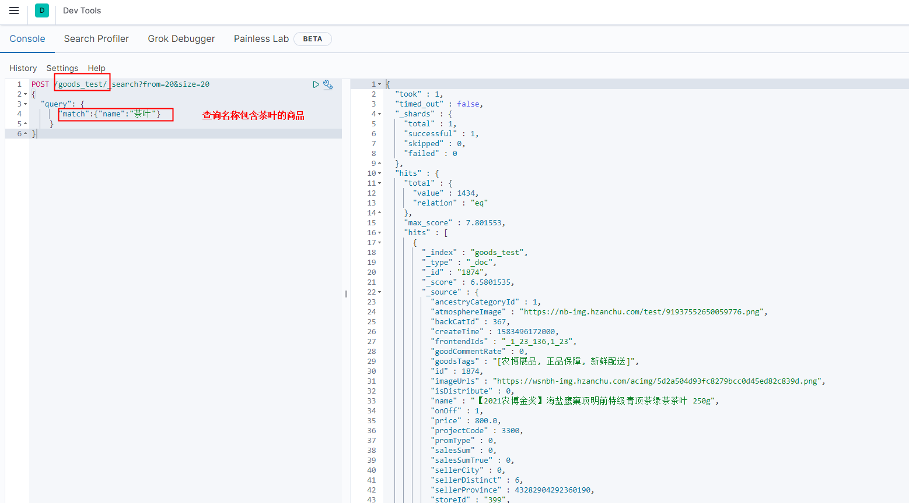
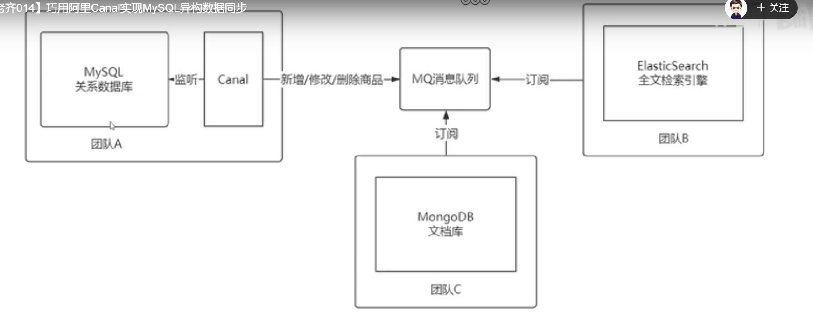

## 框架学习

### spring boot依赖

版本2.3.9

```xml
<parent>
        <groupId>org.springframework.boot</groupId>
        <artifactId>spring-boot-starter-parent</artifactId>
        <version>2.3.9.RELEASE</version>
        <relativePath/> <!-- lookup parent from repository -->
</parent>

        <dependency>
            <groupId>org.springframework.boot</groupId>
            <artifactId>spring-boot-starter-jdbc</artifactId>
            <exclusions>
                <exclusion>
                    <groupId>org.springframework.boot</groupId>
                    <artifactId>spring-boot-starter-logging</artifactId>
                </exclusion>
            </exclusions>
        </dependency>


```

redis

```
 <dependency>
            <groupId>org.springframework.boot</groupId>
            <artifactId>spring-boot-starter-data-redis</artifactId>
            <version>2.4.4</version>
            <exclusions>
                <exclusion>
                    <groupId>org.springframework.boot</groupId>
                    <artifactId>spring-boot-starter-logging</artifactId>
                </exclusion>
            </exclusions>
        </dependency>
```

log4j

```
     <!-- 引入log4j依赖-->
        <dependency>
            <groupId>org.apache.logging.log4j</groupId>
            <artifactId>log4j-core</artifactId>
            <version>2.17.0</version>
        </dependency>
        <dependency>
            <groupId>org.apache.logging.log4j</groupId>
            <artifactId>log4j-jul</artifactId>
            <version>2.17.0</version>
        </dependency>
        <dependency>
            <groupId>org.apache.logging.log4j</groupId>
            <artifactId>log4j-api</artifactId>
            <version>2.17.0</version>
        </dependency>
```


### mybatis-plus

参照官网

[简介 | MyBatis-Plus (baomidou.com)](https://baomidou.com/pages/24112f/)

### nacos注册中心

```xml
        <dependency>
            <groupId>org.apache.dubbo</groupId>
            <artifactId>dubbo-registry-nacos</artifactId>
            <version>2.7.15</version>
        </dependency>
        <dependency>
            <groupId>com.alibaba.nacos</groupId>
            <artifactId>nacos-client</artifactId>
            <version>2.0.3</version>
        </dependency>
```

服务启动类加注解@EnableDiscoveryClient

```
@EnableDiscoveryClient
@SpringBootApplication
@ComponentScan(basePackages = {"com.anchu"})
@MapperScan(basePackages = {"com.anchu.mallgoods.mapper"})
public class MallGoodsApplication {

    public static void main(String[] args) {
        SpringApplication.run(MallGoodsApplication.class, args);
    }

    @Bean
    public ServletRegistrationBean dispatcherRegistration() {
        return new ServletRegistrationBean(dispatcherServlet());
    }
    @Bean(name = DispatcherServletAutoConfiguration.DEFAULT_DISPATCHER_SERVLET_BEAN_NAME)
    public LoggableDispatcherServlet dispatcherServlet() {
        return new LoggableDispatcherServlet();
    }

}
```

### dubbo服务--待补充

待定

### mysql

```shell
连接名: rm-bp1x5rc602ldboia20o.mysql.rds.aliyuncs.com_3306
主机名/IP 地址: rm-bp1x5rc602ldboia20o.mysql.rds.aliyuncs.com
埠: 3306
用户名: test_write
保存密码: True
数据库名：actrade_online
密码：Ac@1q3e_Chen!

# 命令行访问
cd C:\ProgramData\Microsoft\Windows\Start Menu\Programs\MySQL\MySQL Server 5.6

C:\ProgramData\Microsoft\Windows\Start Menu\Programs\MySQL\MySQL Server 5.6>
"MySQL 5.6 Command Line Client - Unicode.lnk" 
-h rm-bp1x5rc602ldboia20o.mysql.rds.aliyuncs.com -P 3306 -D actrade_online -u test_write -p
Enter password: *************
Welcome to the MySQL monitor.  Commands end with ; or \g.
Your MySQL connection id is 1251374
Server version: 5.6.16-log Source distribution

Copyright (c) 2000, 2018, Oracle and/or its affiliates. All rights reserved.

Oracle is a registered trademark of Oracle Corporation and/or its
affiliates. Other names may be trademarks of their respective
owners.

Type 'help;' or '\h' for help. Type '\c' to clear the current input statement.

mysql> show tables;
+---------------------------------------+
| Tables_in_actrade_online              |
+---------------------------------------+
| databasechangelog                     |
| databasechangeloglock                 |
| gov_function                          |
| gov_function_role                     |
| gov_role                              |
| gov_user_info                         |
| gov_user_role                         |
| gov_violation_alarm                   |
| gov_violation_approve                 |
| gov_violation_approve_log             |
| gov_violation_description             |
| gov_violation_detail                  |
| gov_violation_feedback                |
| gov_violation_statistics              |
| gov_violation_type                    |
| hu_tmp                                |
| trade_activity                        |
| trade_ad                              |
| trade_ad_position                     |
| trade_admin                           |
| trade_admin_role                      |


#本地测试
mysql -h 127.0.0.1 -P 3306 -D actrade_online -u root -p


explain select * from trade_order to2 left join trade_order_goods  tog on tog.order_id =to2.order_id
        left join trade_goods tg on tg.id =tog.goods_id where to2.order_id =10 limit 100000,100 
```


### Elasticsearch 

#### 1.搜索模块

1. git地址 （develop-dufz分支）

   http://121.40.229.154:8083/java/wsnb-search.git

2. 主要功能点

   店铺搜索: StoreSearchController

   测试环境：索引store_test

   商品搜索：GoodsSearchController

   测试环境：索引goods_test

3. 服务器地址，可视化界面

   http://121.196.193.68:5601/login?next=%2Fapp%2Fdev_tools#/console

   用户名/密码：elastic/J6gm7RJFGAkMrqIesMhk

   页面开发工具：

   

4. 官方帮助文档  （以7.13为例）

   **rest 接口文档**  [REST APIs | Elasticsearch Guide [7.13\] | Elastic

   **java client API官方说明** [Java REST Client [7.13\] | Elastic

   **java rest high client API官方说明**[Overview (rest-high-level 7.13.4 API) (elastic.co)](https://artifacts.elastic.co/javadoc/org/elasticsearch/client/elasticsearch-rest-high-level-client/7.13.4/index.html)

#### 2.搜索模块现有接口 ---待补充


#### 3.rest api 简单入门

##### 查询所有数据流或者索引数据

```json
get /_all  

{
  ".apm-agent-configuration" : {
    "aliases" : { }，
      ...............
  }
}

//查询索引结构
GET /goods_test/_mapping/

{
  "goods_test" : {
    "mappings" : {
      "properties" : {
        "ancestryCategoryId" : {
          "type" : "long"
        },
        "atmosphereImage" : {
          "type" : "text",
          "fields" : {
            "keyword" : {
              "type" : "keyword",
              "ignore_above" : 256
            }
          }
        },
        "backCatId" : {
          "type" : "long"
        },
        "commissionValue" : {
          "type" : "float"
        },
        "createTime" : {
          "type" : "long"
        },
        "frontendIds" : {
          "type" : "text",
          "fields" : {
            "keyword" : {
              "type" : "keyword",
              "ignore_above" : 256
            }
          }
        },
        "goodCommentRate" : {
          "type" : "float"
        },
        "goodsTags" : {
          "type" : "text",
          "fields" : {
            "keyword" : {
              "type" : "keyword",
              "ignore_above" : 256
            }
          }
        },
        "id" : {
          "type" : "long"
        },
        "imageUrls" : {
          "type" : "text",
          "fields" : {
            "keyword" : {
              "type" : "keyword",
              "ignore_above" : 256
            }
          }
        },
        "isDistribute" : {
          "type" : "long"
        },
        "label" : {
          "type" : "text",
          "fields" : {
            "keyword" : {
              "type" : "keyword",
              "ignore_above" : 256
            }
          }
        },
        "latitude" : {
          "type" : "text",
          "fields" : {
            "keyword" : {
              "type" : "keyword",
              "ignore_above" : 256
            }
          }
        },
        "location" : {
          "type" : "text",
          "fields" : {
            "keyword" : {
              "type" : "keyword",
              "ignore_above" : 256
            }
          }
        },
        "longitude" : {
          "type" : "text",
          "fields" : {
            "keyword" : {
              "type" : "keyword",
              "ignore_above" : 256
            }
          }
        },
        "name" : {
          "type" : "text",
          "fields" : {
            "keyword" : {
              "type" : "keyword",
              "ignore_above" : 256
            }
          }
        },
        "onOff" : {
          "type" : "long"
        },
        "preheatImage" : {
          "type" : "text",
          "fields" : {
            "keyword" : {
              "type" : "keyword",
              "ignore_above" : 256
            }
          }
        },
        "preheatStarttime" : {
          "type" : "long"
        },
        "price" : {
          "type" : "float"
        },
        "projectCode" : {
          "type" : "long"
        },
        "promId" : {
          "type" : "long"
        },
        "promPrice" : {
          "type" : "float"
        },
        "promType" : {
          "type" : "long"
        },
        "salesSum" : {
          "type" : "long"
        },
        "salesSumTrue" : {
          "type" : "long"
        },
        "sellTotal" : {
          "type" : "float"
        },
        "sellerCity" : {
          "type" : "long"
        },
        "sellerDistinct" : {
          "type" : "long"
        },
        "sellerProvince" : {
          "type" : "long"
        },
        "shareNum" : {
          "type" : "long"
        },
        "showEndtime" : {
          "type" : "long"
        },
        "showStarttime" : {
          "type" : "long"
        },
        "siteName" : {
          "type" : "text",
          "fields" : {
            "keyword" : {
              "type" : "keyword",
              "ignore_above" : 256
            }
          }
        },
        "storeId" : {
          "type" : "text",
          "fields" : {
            "keyword" : {
              "type" : "keyword",
              "ignore_above" : 256
            }
          }
        },
        "supplierId" : {
          "type" : "long"
        },
        "trait" : {
          "type" : "text",
          "fields" : {
            "keyword" : {
              "type" : "keyword",
              "ignore_above" : 256
            }
          }
        },
        "validEndTime" : {
          "type" : "long"
        },
        "validStartTime" : {
          "type" : "long"
        },
        "visitCount" : {
          "type" : "long"
        }
      }
    }
  }
}

```


##### 查询商品 -id查询（goods_id）

```json
//查询商品文档

GET /goods_test/_doc/10086
{
  "_index" : "goods_test",
  "_type" : "_doc",
  "_id" : "10086",
  "_version" : 1,
  "_seq_no" : 4086,
  "_primary_term" : 1,
  "found" : true,
  "_source" : {
    "ancestryCategoryId" : 1,
    "atmosphereImage" : "https://nb-img.hzanchu.com/test/91937552650059776.png",
    "backCatId" : 243,
    "createTime" : 1604397783000,
    "frontendIds" : "",
    "goodCommentRate" : 1.0,
    "goodsTags" : "[农博展品, 正品保障, 新鲜配送]",
    "id" : 10086,
    "imageUrls" : "https://wsnbh-img.hzanchu.com/acimg/f1f1a1a2c742f3929887b937f623bc8b.jpeg",
    "isDistribute" : 0,
    "name" : "【2021农博金奖】温州洞头 顺生牌 烤虾干大号200g 多尺寸多规格",
    "onOff" : 1,
    "price" : 59.9,
    "projectCode" : 3300,
    "promType" : 0,
    "salesSum" : 27,
    "salesSumTrue" : 27,
    "sellerCity" : 3,
    "sellerDistinct" : 42,
    "sellerProvince" : 43282904292360190,
    "siteName" : "温州馆",
    "storeId" : "1032",
    "supplierId" : 1385,
    "trait" : "东海烤虾干 9成干度 无添加剂不咸味道好，4斤活虾≈一斤烤虾",
    "visitCount" : 18
  }
}
```

##### 查询店铺-id查询（storeId）

```json
GET /stores-test/_doc/100

{
  "_index" : "stores-test",
  "_type" : "_doc",
  "_id" : "100",
  "_version" : 1,
  "_seq_no" : 99,
  "_primary_term" : 1,
  "found" : true,
  "_source" : {
    "createTime" : 1574245008000,
    "projectCode" : 3300,
    "sellerCity" : 1,
    "sellerDistinct" : 17,
    "sellerProvince" : 41189115541159936,
    "signPic" : "",
    "storeId" : "100",
    "storeName" : "桐庐畲洪禽业",
    "storeStar" : 0.0,
    "supplierId" : 106
  }
}
```

##### 查看店铺-分页query-模糊匹配

```json
POST /stores_test/_search?from=10&size=2
{
  "query": {
      "match":{"storeName":"浙江"}
    }
}

{
  "took" : 0,
  "timed_out" : false,
  "_shards" : {
    "total" : 1,
    "successful" : 1,
    "skipped" : 0,
    "failed" : 0
  },
  "hits" : {
    "total" : {
      "value" : 240,
      "relation" : "eq"
    },
    "max_score" : 6.778781,
    "hits" : [
      {
        "_index" : "stores_test",
        "_type" : "_doc",
        "_id" : "1439",
        "_score" : 6.177516,
        "_source" : {
          "createTime" : 1603072356000,
          "projectCode" : 3300,
          "sellerCity" : 8,
          "sellerDistinct" : 96,
          "sellerProvince" : 41189115541159936,
          "signPic" : "https://wsnbh-img.hzanchu.com/acimg/0e2d11fcc868007401a5fc9b7808aff5.jpeg",
          "storeId" : "1439",
          "storeName" : "浙江欣昌农业",
          "storeStar" : 5.0,
          "supplierId" : 157
        }
      },
      {
        "_index" : "stores_test",
        "_type" : "_doc",
        "_id" : "1450",
        "_score" : 6.177516,
        "_source" : {
          "createTime" : 1603085370000,
          "projectCode" : 3300,
          "sellerCity" : 1,
          "sellerDistinct" : 26,
          "sellerProvince" : 41189115541159936,
          "signPic" : "https://wsnbh-img.hzanchu.com/acimg/51500f279c6708260fe5ecaa2d0851b0.jpeg",
          "storeId" : "1450",
          "storeName" : "浙江厚德农场",
          "storeStar" : 5.0,
          "supplierId" : 1984
        }
      }
    ]
  }
}

```

##### 查看商品-分页query-模糊匹配

```json
POST /goods_test/_search?from=20&size=2
{
  "query": {
      "match":{"name":"茶叶"}
    }
}

{
  "took" : 0,
  "timed_out" : false,
  "_shards" : {
    "total" : 1,
    "successful" : 1,
    "skipped" : 0,
    "failed" : 0
  },
  "hits" : {
    "total" : {
      "value" : 1434,
      "relation" : "eq"
    },
    "max_score" : 7.801553,
    "hits" : [
      {
        "_index" : "goods_test",
        "_type" : "_doc",
        "_id" : "1874",
        "_score" : 6.5801535,
        "_source" : {
          "ancestryCategoryId" : 1,
          "atmosphereImage" : "https://nb-img.hzanchu.com/test/91937552650059776.png",
          "backCatId" : 367,
          "createTime" : 1583496172000,
          "frontendIds" : "_1_23_136,1_23",
          "goodCommentRate" : 0,
          "goodsTags" : "[农博展品, 正品保障, 新鲜配送]",
          "id" : 1874,
          "imageUrls" : "https://wsnbh-img.hzanchu.com/acimg/5d2a504d93fc8279bcc0d45ed82c839d.png",
          "isDistribute" : 0,
          "name" : "【2021农博金奖】海盐鹰窠顶明前特级青顶茶绿茶茶叶 250g",
          "onOff" : 1,
          "price" : 800.0,
          "projectCode" : 3300,
          "promType" : 0,
          "salesSum" : 0,
          "salesSumTrue" : 0,
          "sellerCity" : 0,
          "sellerDistinct" : 6,
          "sellerProvince" : 43282904292360190,
          "storeId" : "399",
          "supplierId" : 443,
          "trait" : "春茶 手工炒制",
          "visitCount" : 1
        }
      },
      {
        "_index" : "goods_test",
        "_type" : "_doc",
        "_id" : "1878",
        "_score" : 6.5801535,
        "_source" : {
          "ancestryCategoryId" : 1,
          "atmosphereImage" : "https://nb-img.hzanchu.com/test/91937552650059776.png",
          "backCatId" : 367,
          "createTime" : 1583496150000,
          "frontendIds" : "_1_23_136,1_23",
          "goodCommentRate" : 0,
          "goodsTags" : "[农博展品, 正品保障, 新鲜配送]",
          "id" : 1878,
          "imageUrls" : "https://wsnbh-img.hzanchu.com/acimg/4daa4ebbec2aeeb5860d8164e625c5ef.jpeg",
          "isDistribute" : 0,
          "name" : "【2021农博金奖】海盐鹰窠顶明前特级青顶茶绿茶茶叶 250g",
          "onOff" : 1,
          "price" : 398.0,
          "projectCode" : 3300,
          "promType" : 0,
          "salesSum" : 1,
          "salesSumTrue" : 1,
          "sellerCity" : 6,
          "sellerDistinct" : 54,
          "sellerProvince" : 43282904292360190,
          "siteName" : "嘉兴馆",
          "storeId" : "399",
          "supplierId" : 443,
          "trait" : "春茶 手工炒制",
          "visitCount" : 1
        }
      }
    ]
  }
}
```

##### 查看商品-分页query-精确匹配

```json
GET /goods_test/_search?from=1&size=1
{
  "query":{
        "term":{
          "backCatId":201
        }
  }
}


{
  "took" : 0,
  "timed_out" : false,
  "_shards" : {
    "total" : 1,
    "successful" : 1,
    "skipped" : 0,
    "failed" : 0
  },
  "hits" : {
    "total" : {
      "value" : 14,
      "relation" : "eq"
    },
    "max_score" : 1.0,
    "hits" : [
      {
        "_index" : "goods_test",
        "_type" : "_doc",
        "_id" : "12576",
        "_score" : 1.0,
        "_source" : {
          "ancestryCategoryId" : 1,
          "atmosphereImage" : "https://nb-img.hzanchu.com/test/91937552650059776.png",
          "backCatId" : 201,
          "createTime" : 1608199720000,
          "frontendIds" : "_1_11",
          "goodCommentRate" : 1.0,
          "goodsTags" : "[农博展品, 正品保障, 新鲜配送]",
          "id" : 12576,
          "imageUrls" : "https://wsnbh-img.hzanchu.com/acimg/fe393bde798617f8f80539a6fd7bdb5f.jpeg",
          "isDistribute" : 0,
          "name" : "【2021农博金奖】诸暨国伟鸭胚蛋礼盒装1.3千克/20枚",
          "onOff" : 1,
          "price" : 88.0,
          "projectCode" : 3300,
          "promType" : 0,
          "salesSum" : 26,
          "salesSumTrue" : 26,
          "sellerCity" : 9,
          "sellerDistinct" : 59,
          "sellerProvince" : 43282904292360190,
          "siteName" : "绍兴馆",
          "storeId" : "496",
          "supplierId" : 549,
          "trait" : "开袋剥壳即食，加热后食用味道更佳",
          "visitCount" : 5
        }
      }
    ]
  }
}


GET /goods_test/_search
{
  "query":{
        "match":{
          "id":42614
        }

  }
}
GET /goods_test/_doc/42614
```


#### 4.店铺搜索业务加入距离推荐

##### 接口调试

```json
http://10.10.11.12:9001/doc.html
/store/searchStoreByKey

商品店铺信息查询  新接口数组
请求：
{
	"distance": 10000,
	"localCity": 0,
        "storeLocations": [
		{
			"latitude": "30.177516",
			"longitude": "120.201693"
		}, {
			"latitude": "32.177516",
			"longitude": "120.201693"
		}
	],
	"pageSize": 10,
	"province": 0,
	"searchKey": "",
	"startPage": 1
}


响应
{
  "code": 0,
  "msg": "",
  "data": [
    {
      "storeInfo": {
        "signPic": "https://wsnbh.oss-cn-hangzhou.aliyuncs.com/test/d57359db21ee95f131654ca892c2ba07.jpg",
        "storeName": "鑫鑫烟酒店",
        "storeId": "41202119318011904",
        "storeStar": 4.83,
        "latitude": "30.177409",
        "longitude": "120.201644",
        "distance": 12.800404
      },
      "goodsDOList": [
        {
          "promType": 0,
          "atmosphereImage": "",
          "salesSumTrue": 329,
          "price": 0.01,
          "imageUrls": "https://nb-img.hzanchu.com/acimg/1641366635762.jpg",
          "name": "测试普通商品，勿拍",
          "ancestryCategoryId": 1,
          "id": 42235,
          "storeId": "41202119318011904"
        },
        {
          "promType": 0,
          "salesSumTrue": 13,
          "price": 2,
          "imageUrls": "https://nb-img.hzanchu.com/acimg/1644226673058.jpeg",
          "name": "测试民宿商品！勿拍！",
          "ancestryCategoryId": 2,
          "id": 42562,
          "storeId": "41202119318011904"
        },
        {
          "promType": 0,
          "atmosphereImage": "",
          "salesSumTrue": 6,
          "price": 1,
          "imageUrls": "https://nb-img.hzanchu.com/acimg/1641367232038.eastday",
          "name": "测试分销商品，勿拍~",
          "ancestryCategoryId": 1,
          "id": 42238,
          "storeId": "41202119318011904"
        }
      ]
    }
  ]
}
```

##### 查询逻辑

```
  //@TODO begin modify by dufz 2022/04/13 18:00:00 根据经纬度及范围推荐  经纬度/距离范围(单位：米)
  //默认10000,单位米，即10公里
        if(searchStoreParam.getDistance()==null||searchStoreParam.getDistance()<0){
            searchStoreParam.setDistance(10000L);
        }
        if (ObjectUtil.isNotNull(searchStoreParam.getLatitude()) && ObjectUtil.isNotNull(searchStoreParam.getLongitude())){
            double latitude=new BigDecimal(searchStoreParam.getLatitude()).doubleValue();
            double longitude=new BigDecimal(searchStoreParam.getLongitude()).doubleValue();
            GeoDistanceQueryBuilder geoDistanceQueryBuilder = QueryBuilders.geoDistanceQuery("location").point(latitude, longitude)
                    .distance(searchStoreParam.getDistance(), DistanceUnit.METERS);
            boolQueryBuilder.filter(geoDistanceQueryBuilder);
            //按距离排序
            GeoDistanceSortBuilder geoDistanceSortBuilder = SortBuilders.geoDistanceSort("location", latitude, longitude)
                    .point(latitude, longitude).unit(DistanceUnit.METERS).order(SortOrder.ASC);
            sourceBuilder.sort(geoDistanceSortBuilder);
        }
        //@TODO end modify by dufz 2022/04/13 18:00:00 根据经纬度及范围推荐
  
  
  
```

##### 距离搜索DSL

```
//地理位置查询
GET /du-store-test/_search
{
   "from":0,
   "size":10,
   "query":{
      "bool":{
         "filter":{
           "geo_distance":{
            "distance":"10km",
            "location":{
                 "lat":30.177516,
                 "lon":120.201693
            }
          }
   }
   }
},
"sort":[
  {
    "_geo_distance": {
      "location": {
        "lat":30.177516,
        "lon":120.201693
      },
      "order": "asc",
      "unit":"km",
      "distance_type": "plane"
    }
  }]
}
```

##### 浙里农家乐设计评审会议总结

（1）线路详情(所有景点经纬度)/景点详情（单个景点）-附近农家乐：所有景点线路的农家乐，默认六个。定位失败按照星级/创建时间排序

（2）首页推荐农家乐 查看更多-跳转商家列表

商家列表，搜索商家名称，搜索到店铺名称；无法根据店铺下的商品进行搜索（??）

（3）商家列表搜索-店铺信息-智能推荐（距离优先?星级优先?创建时间？）

（4）店铺列表-商家类目


