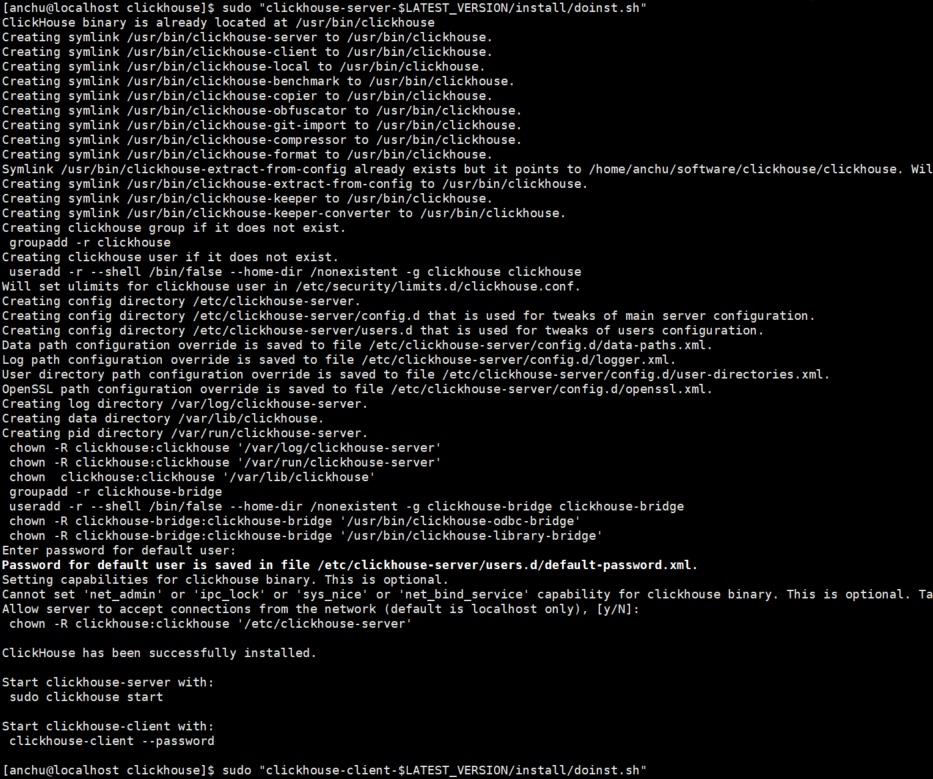
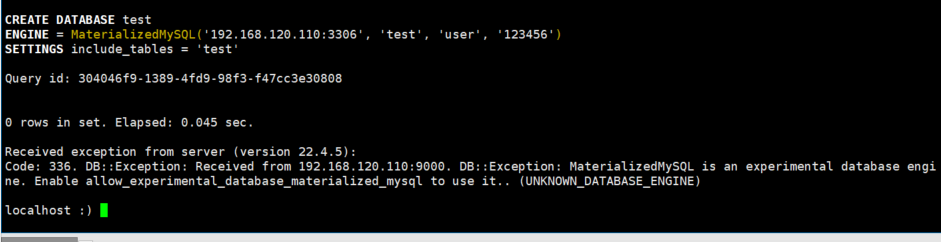

# 4.ClickHouse从入门到放弃

## 4.1 搭建

### 版本选择

```text
ClickHouse: 22.4.5.9
CentOS: Linux release 7.9.2009
MySQL:MySQL-5.7
```


### 下载安装

采用官方预编译的`tgz`软件包方式安装。

参考文档：

https://clickhouse.com/docs/zh/getting-started/install

所需的版本可以通过`curl`或`wget`从存储库`https://packages.clickhouse.com/tgz/`下载。

```shell
# 查看最新版本 22.4.5.9

[root@localhost anchu]# curl -s https://packages.clickhouse.com/tgz/stable/ |grep -Eo '[0-9]+\.[0-9]+\.[0-9]+\.[0-9]+' | sort -V -r | head -n 1
22.4.5.9

# 设置临时环境变量并下载

[anchu@localhost ~]$ LATEST_VERSION=$(curl -s https://packages.clickhouse.com/tgz/stable/ | \
>     grep -Eo '[0-9]+\.[0-9]+\.[0-9]+\.[0-9]+' | sort -V -r | head -n 1)

[anchu@localhost ~]$ export LATEST_VERSION
[anchu@localhost ~]$ echo $LATEST_VERSION
22.4.5.9
[anchu@localhost ~]$ cd software/
[anchu@localhost software]$ mkdir clickhouse
[anchu@localhost software]$ cd clickhouse/

# 根据最新版本下载
[anchu@localhost clickhouse]$ curl -O "https://packages.clickhouse.com/tgz/stable/clickhouse-common-static-$LATEST_VERSION-amd64.tgz"


[anchu@localhost clickhouse]$ 
curl -O "https://packages.clickhouse.com/tgz/stable/clickhouse-common-static-dbg-$LATEST_VERSION-amd64.tgz"

[anchu@localhost clickhouse]$
curl -O "https://packages.clickhouse.com/tgz/stable/clickhouse-server-$LATEST_VERSION-amd64.tgz"

[anchu@localhost clickhouse]$ 
curl -O "https://packages.clickhouse.com/tgz/stable/clickhouse-client-$LATEST_VERSION-amd64.tgz"

# 查看并解压

[anchu@localhost clickhouse]$ ll -h
total 1011M
-rw-rw-r--. 1 anchu anchu  35K May 11 11:03 clickhouse-client-22.4.5.9-amd64.tgz
-rw-rw-r--. 1 anchu anchu 226M May 11 10:54 clickhouse-common-static-22.4.5.9-amd64.tgz
-rw-rw-r--. 1 anchu anchu 785M May 11 11:01 clickhouse-common-static-dbg-22.4.5.9-amd64.tgz
-rw-rw-r--. 1 anchu anchu  55K May 11 11:03 clickhouse-server-22.4.5.9-amd64.tgz

#解压安装
[anchu@localhost clickhouse]$  tar -xzvf "clickhouse-common-static-$LATEST_VERSION-amd64.tgz"
[anchu@localhost clickhouse]$  tar -xzvf "clickhouse-common-static-dbg-$LATEST_VERSION-amd64.tgz"
[anchu@localhost clickhouse]$  tar -xzvf "clickhouse-server-$LATEST_VERSION-amd64.tgz"
[anchu@localhost clickhouse]$  tar -xzvf "clickhouse-client-$LATEST_VERSION-amd64.tgz"

```

### 配置启动

首先，需要当前用户有sudo权限,配置如下

```shell
[root@localhost clickhouse]# su root
[root@localhost clickhouse]# chmod u+w /etc/sudoers
[root@localhost clickhouse]# vi /etc/sudoers
anchu   ALL=(ALL)       ALL
```

初始化

```shell
[anchu@localhost clickhouse]$ su anchu
Password: 
[anchu@localhost clickhouse]$ pwd
/home/anchu/software/clickhouse

[anchu@localhost clickhouse]$ sudo "clickhouse-common-static-$LATEST_VERSION/install/doinst.sh"

[anchu@localhost clickhouse]$sudo "clickhouse-common-static-dbg-$LATEST_VERSION/install/doinst.sh"

[anchu@localhost clickhouse] sudo "clickhouse-server-$LATEST_VERSION/install/doinst.sh"

# 安装clickhouse-server
[anchu@localhost clickhouse]$ sudo "clickhouse-server-$LATEST_VERSION/install/doinst.sh"

ClickHouse binary is already located at /usr/bin/clickhouse
Creating symlink /usr/bin/clickhouse-server to /usr/bin/clickhouse.
Creating symlink /usr/bin/clickhouse-client to /usr/bin/clickhouse.
Creating symlink /usr/bin/clickhouse-local to /usr/bin/clickhouse.
Creating symlink /usr/bin/clickhouse-benchmark to /usr/bin/clickhouse.
Creating symlink /usr/bin/clickhouse-copier to /usr/bin/clickhouse.
Creating symlink /usr/bin/clickhouse-obfuscator to /usr/bin/clickhouse.
Creating symlink /usr/bin/clickhouse-git-import to /usr/bin/clickhouse.
Creating symlink /usr/bin/clickhouse-compressor to /usr/bin/clickhouse.
Creating symlink /usr/bin/clickhouse-format to /usr/bin/clickhouse.
Symlink /usr/bin/clickhouse-extract-from-config already exists but it points to /home/anchu/software/clickhouse/clickhouse. Will replace the old symlink to /usr/bin/clickhouse.
Creating symlink /usr/bin/clickhouse-extract-from-config to /usr/bin/clickhouse.
Creating symlink /usr/bin/clickhouse-keeper to /usr/bin/clickhouse.
Creating symlink /usr/bin/clickhouse-keeper-converter to /usr/bin/clickhouse.
Creating clickhouse group if it does not exist.
 groupadd -r clickhouse
Creating clickhouse user if it does not exist.
 useradd -r --shell /bin/false --home-dir /nonexistent -g clickhouse clickhouse
Will set ulimits for clickhouse user in /etc/security/limits.d/clickhouse.conf.
Creating config directory /etc/clickhouse-server.
Creating config directory /etc/clickhouse-server/config.d that is used for tweaks of main server configuration.
Creating config directory /etc/clickhouse-server/users.d that is used for tweaks of users configuration.
Data path configuration override is saved to file /etc/clickhouse-server/config.d/data-paths.xml.
Log path configuration override is saved to file /etc/clickhouse-server/config.d/logger.xml.
User directory path configuration override is saved to file /etc/clickhouse-server/config.d/user-directories.xml.
OpenSSL path configuration override is saved to file /etc/clickhouse-server/config.d/openssl.xml.
Creating log directory /var/log/clickhouse-server.
Creating data directory /var/lib/clickhouse.
Creating pid directory /var/run/clickhouse-server.
 chown -R clickhouse:clickhouse '/var/log/clickhouse-server'
 chown -R clickhouse:clickhouse '/var/run/clickhouse-server'
 chown  clickhouse:clickhouse '/var/lib/clickhouse'
 groupadd -r clickhouse-bridge
 useradd -r --shell /bin/false --home-dir /nonexistent -g clickhouse-bridge clickhouse-bridge
 chown -R clickhouse-bridge:clickhouse-bridge '/usr/bin/clickhouse-odbc-bridge'
 chown -R clickhouse-bridge:clickhouse-bridge '/usr/bin/clickhouse-library-bridge'
Enter password for default user: 
Password for default user is saved in file /etc/clickhouse-server/users.d/default-password.xml.
Setting capabilities for clickhouse binary. This is optional.
Cannot set 'net_admin' or 'ipc_lock' or 'sys_nice' or 'net_bind_service' capability for clickhouse binary. This is optional. Taskstats accounting will be disabled. To enable taskstats accounting you may add the required capability later manually.
Allow server to accept connections from the network (default is localhost only), [y/N]: 
 chown -R clickhouse:clickhouse '/etc/clickhouse-server'

ClickHouse has been successfully installed.

Start clickhouse-server with:
 sudo clickhouse start
Start clickhouse-client with:
 clickhouse-client --password

#默认用户 default 密码 clickhouse


# 安装clickhouse-client
[anchu@localhost clickhouse]$  sudo "clickhouse-client-$LATEST_VERSION/install/doinst.sh"
```



启动clickhouse-server

```shell
[anchu@localhost clickhouse]$  sudo clickhouse start
 chown -R clickhouse: '/var/run/clickhouse-server/'
Will run su -s /bin/sh 'clickhouse' -c '/usr/bin/clickhouse-server --config-file /etc/clickhouse-server/config.xml --pid-file /var/run/clickhouse-server/clickhouse-server.pid --daemon'
Waiting for server to start
Server started
```

启动clickhouse-client,并连接clickhouse-server  (--multiline等同于-m，支持sql换行)

```shell
[anchu@localhost clickhouse]$ clickhouse-client --user=default --password=clickhouse --host=127.0.0.1 --multiline
ClickHouse client version 22.4.5.9 (official build).
Connecting to 127.0.0.1:9000 as user default.
Connected to ClickHouse server version 22.4.5 revision 54455.

Warnings:
 * Linux transparent hugepage are set to "always".
 * Linux threads max count is too low.
 * Maximum number of threads is lower than 30000. There could be problems with handling a lot of simultaneous queries.

localhost :) show tables;

SHOW TABLES

Query id: f8a39afa-9152-4232-bb1e-aa67b2bddaca

Ok.

0 rows in set. Elapsed: 0.002 sec. 

localhost :) quit;
Bye.

```

## 4.2 测试数据

修改默认配置文件/etc/clickhouse-server/config.xml，支持远程访问

```shell
[anchu@localhost ~]$ su root
Password: 
[root@localhost anchu]# vi /etc/clickhouse-server/config.xml
[root@localhost anchu]# chmod u+w /etc/clickhouse-server/config.xml
[root@localhost anchu]# vi /etc/clickhouse-server/config.xml
#去掉注释
<listen_host>::</listen_host>
#或者 <listen_host>0.0.0.0</listen_host>
#重启
[anchu@localhost ~]$ su anchu
#注意启动方式
[anchu@localhost ~]$ 
 sudo clickhouse start
```

连接测试 (dbeaver或者clickhouse客户端均可)


```shell
#默认用户 default 密码 clickhouse 默认库default
[anchu@localhost clickhouse]$ clickhouse-client --user=default --password=clickhouse -h 192.168.120.110 --port 9000 -m
ClickHouse client version 22.4.5.9 (official build).
Connecting to 192.168.120.110:9000 as user default.
Connected to ClickHouse server version 22.4.5 revision 54455.
localhost :) 
```

#### (1)mysql表引擎使用（postgre引擎类似）

##### 1 应用

参考文档 ：

https://clickhouse.com/docs/zh/engines/database-engines/mysql

https://clickhouse.com/docs/zh/engines/database-engines/postgresql

https://www.cnblogs.com/MrYang-11-GetKnow/p/15901385.html

**官网描述：MySQL引擎用于将远程的MySQL服务器中的表映射到ClickHouse中，并允许您对表进行insert和select查询，以方便您在ClickHouse与MySQL之间进行数据交换。**
**MySQL数据库引擎会将对其的查询转换为MySQL语法并发送到MySQL服务器中，因此您可以执行诸如show tables或show create table之类的操作。**

ClickHouse使用mysql引擎可以与mysql数据库中的数据表建⽴映射，并通过SQL向其**发起远程查询或插入数据**，这是一个异步的过程，相当于ck起了一个线程专门用于同步mysql的数据到ck，主要在于同步mysql配置表的信息，因为配置表常有修改的需求，而ck并不擅长修改记录，且配置表的记录往往在几百条，配置表的同步往往是实时的，**目前针对小表数据使用，数据量大的表不建议使用**。

##### 2 语法规则

1）引擎定义：

```
CREATE TABLE [IF NOT EXISTS] [db.]table_name [ON CLUSTER cluster]
(
name1 [type1] [DEFAULT|MATERIALIZED|ALIAS expr1] [TTL expr1],
name2 [type2] [DEFAULT|MATERIALIZED|ALIAS expr2] [TTL expr2],
...
) ENGINE = MySQL('host:port', 'database', 'table', 'user',
'password'[, replace_query, 'on_duplicate_clause']);
2）参数含义：
```

host： port表示MySQL的地址和端⼝。
database表示数据库的名称。
table表示需要映射的表名称。
user表示MySQL的⽤户名。
password表示MySQL的密码。
replace_query默认为0，对应MySQL的REPLACE INTO语法。如果将它设置为1，则会⽤REPLACE INTO代替INSERT INTO。
on_duplicate_clause默认为0，对应MySQL的ON DUPLICATE KEY语法。如果需要使⽤该设置，则必须将replace_query设置成0。

##### 3 示例

```sql
--创建一张mysql测试表：
CREATE TABLE `trade_store` (
  `id` int(11) unsigned NOT NULL AUTO_INCREMENT COMMENT 'id',
  `store_id` bigint(20) NOT NULL COMMENT '店铺id',
  `suppliers_id` bigint(20) NOT NULL COMMENT '商家id',
  `network_num` varchar(50) NOT NULL DEFAULT '' COMMENT '订单来了网络号',
  `im_identifier` varchar(50) DEFAULT '' COMMENT 'im注册id (store_自增id)暂时无用',
  `store_name` varchar(50) NOT NULL COMMENT '店铺名称',
  `head_pic` varchar(200) NOT NULL DEFAULT '0' COMMENT '店铺头像图片id',
  `sign_pic` varchar(300) DEFAULT '0' COMMENT '店铺招牌图片id',
  `store_type` tinyint(4) NOT NULL DEFAULT '0' COMMENT '店铺类型 1.农产品  2.名宿 3.景点  4.餐饮  ',
  `mobile` varchar(20) NOT NULL DEFAULT '' COMMENT '店铺联系手机号',
  `landline` varchar(20) NOT NULL DEFAULT '0' COMMENT '固话（暂时无用）',
  `coordinates` varchar(100) NOT NULL DEFAULT '' COMMENT '经纬度坐标',
  `latitude` varchar(255) NOT NULL DEFAULT '' COMMENT '纬度',
  `longitude` varchar(255) NOT NULL DEFAULT '' COMMENT '经度',
  `psite_id` bigint(20) NOT NULL DEFAULT '0' COMMENT '省级展馆id',
  `csite_id` bigint(20) NOT NULL DEFAULT '0' COMMENT '市级展馆id',
  `site_id` bigint(20) NOT NULL DEFAULT '0' COMMENT '区县展馆id（如果为省市级展馆 存0）',
  `real_site_id` bigint(20) NOT NULL DEFAULT '0' COMMENT '真实展馆id（省市区展馆中最低级展馆id）',
  `state` tinyint(1) NOT NULL DEFAULT '0' COMMENT '状态 0：启用，1：禁用',
  `stars` tinyint(2) NOT NULL DEFAULT '0' COMMENT '星级',
  `rooms` bigint(20) NOT NULL DEFAULT '0' COMMENT '房间数',
  `beds` bigint(20) NOT NULL DEFAULT '0' COMMENT '床位数',
  `seats` bigint(20) NOT NULL DEFAULT '0' COMMENT '餐位数',
  `features` varchar(150) NOT NULL DEFAULT '' COMMENT '服务特色',
  `store_star` float(10,2) DEFAULT '5.00' COMMENT '店铺平均评分',
  `service_star` float(10,2) DEFAULT '5.00' COMMENT '店铺服务平均评分',
  `goods_star` float(10,2) DEFAULT '5.00' COMMENT '店铺商品评价评分',
  `shipping_star` float(10,2) DEFAULT '5.00' COMMENT '店铺物流评价评分',
  `create_time` datetime DEFAULT CURRENT_TIMESTAMP COMMENT '创建时间',
  `update_time` datetime DEFAULT CURRENT_TIMESTAMP ON UPDATE CURRENT_TIMESTAMP COMMENT '更新时间',
  `project_code` varchar(50) NOT NULL DEFAULT '' COMMENT '登录端',
  PRIMARY KEY (`id`),
  UNIQUE KEY `un_store_id` (`store_id`),
  KEY `idx_suppliers_id` (`suppliers_id`)
) ENGINE=InnoDB AUTO_INCREMENT=31301 DEFAULT CHARSET=utf8mb4 COMMENT='商家店铺表'

-- 创建clickhouse表，并指定引擎为mysql：
create table trade_store
(
  `id` int(11) unsigned NOT NULL AUTO_INCREMENT COMMENT 'id',
  `store_id` bigint(20) NOT NULL COMMENT '店铺id',
  `suppliers_id` bigint(20) NOT NULL COMMENT '商家id',
  `network_num` varchar(50) NOT NULL DEFAULT '' COMMENT '订单来了网络号',
  `im_identifier` varchar(50) DEFAULT '' COMMENT 'im注册id (store_自增id)暂时无用',
  `store_name` varchar(50) NOT NULL COMMENT '店铺名称',
  `head_pic` varchar(200) NOT NULL DEFAULT '0' COMMENT '店铺头像图片id',
  `sign_pic` varchar(300) DEFAULT '0' COMMENT '店铺招牌图片id',
  `store_type` tinyint(4) NOT NULL DEFAULT '0' COMMENT '店铺类型 1.农产品  2.名宿 3.景点  4.餐饮  ',
  `mobile` varchar(20) NOT NULL DEFAULT '' COMMENT '店铺联系手机号',
  `landline` varchar(20) NOT NULL DEFAULT '0' COMMENT '固话（暂时无用）',
  `coordinates` varchar(100) NOT NULL DEFAULT '' COMMENT '经纬度坐标',
  `latitude` varchar(255) NOT NULL DEFAULT '' COMMENT '纬度',
  `longitude` varchar(255) NOT NULL DEFAULT '' COMMENT '经度',
  `psite_id` bigint(20) NOT NULL DEFAULT '0' COMMENT '省级展馆id',
  `csite_id` bigint(20) NOT NULL DEFAULT '0' COMMENT '市级展馆id',
  `site_id` bigint(20) NOT NULL DEFAULT '0' COMMENT '区县展馆id（如果为省市级展馆 存0）',
  `real_site_id` bigint(20) NOT NULL DEFAULT '0' COMMENT '真实展馆id（省市区展馆中最低级展馆id）',
  `state` tinyint(1) NOT NULL DEFAULT '0' COMMENT '状态 0：启用，1：禁用',
  `stars` tinyint(2) NOT NULL DEFAULT '0' COMMENT '星级',
  `rooms` bigint(20) NOT NULL DEFAULT '0' COMMENT '房间数',
  `beds` bigint(20) NOT NULL DEFAULT '0' COMMENT '床位数',
  `seats` bigint(20) NOT NULL DEFAULT '0' COMMENT '餐位数',
  `features` varchar(150) NOT NULL DEFAULT '' COMMENT '服务特色',
  `store_star` float(10,2) DEFAULT '5.00' COMMENT '店铺平均评分',
  `service_star` float(10,2) DEFAULT '5.00' COMMENT '店铺服务平均评分',
  `goods_star` float(10,2) DEFAULT '5.00' COMMENT '店铺商品评价评分',
  `shipping_star` float(10,2) DEFAULT '5.00' COMMENT '店铺物流评价评分',
  `create_time` datetime DEFAULT CURRENT_TIMESTAMP COMMENT '创建时间',
  `update_time` datetime DEFAULT CURRENT_TIMESTAMP ON UPDATE CURRENT_TIMESTAMP COMMENT '更新时间',
  `project_code` varchar(50) NOT NULL DEFAULT '' COMMENT '登录端'
)
engine = MySQL('192.168.120.110:3306', 'test', 'trade_store', 'root', '123456');
```

#####  4 总结

mysql引擎有点类似于 pg的FWD,会将请求转发给mysql，还是在mysql上执行，适合小表

FDW（Foreign Data Wrapper）是PostgreSQL（下文简称PG）中一项非常有意思的技术，通过它可以将PG变成一个通用的SQL引擎，使得用户可以通过SQL访问存储在PG之外的数据。

#### （2）SummingMergeTree引擎

##### 1 应用

参考文档：

https://clickhouse.com/docs/zh/engines/table-engines/mergetree-family/summingmergetree

该引擎继承自 [MergeTree](https://clickhouse.com/docs/zh/engines/table-engines/mergetree-family/mergetree)。区别在于，当合并 `SummingMergeTree` 表的数据片段时，**ClickHouse 会把所有具有相同主键的行合并为一行，该行包含了被合并的行中具有数值数据类型的列的汇总值（测试的时候批量导数据会很慢，可能就是这个原因）**。如果主键的组合方式使得单个键值对应于大量的行，则可以显著的减少存储空间并加快数据查询的速度。

我们推荐将该引擎和 `MergeTree` 一起使用。例如，在准备做报告的时候，将完整的数据存储在 `MergeTree` 表中，并且使用 `SummingMergeTree` 来存储聚合数据。这种方法可以使你避免因为使用不正确的主键组合方式而丢失有价值的数据。

##### 2 语法规则

1）引擎定义：

```
CREATE TABLE [IF NOT EXISTS] [db.]table_name [ON CLUSTER cluster]
(
    name1 [type1] [DEFAULT|MATERIALIZED|ALIAS expr1],
    name2 [type2] [DEFAULT|MATERIALIZED|ALIAS expr2],
    ...
) ENGINE = SummingMergeTree([columns])
[PARTITION BY expr]
[ORDER BY expr]
[SAMPLE BY expr]
[SETTINGS name=value, ...]
```

##### 3 示例

```sql
-- 不能在mysql中创建，因为mysql库是通过MaterializeMySQL引擎创建，不支持创建在此引擎里面

-- Code: 48. DB::Exception: Received from 192.168.120.110:9000. DB::Exception: MaterializedMySQL database does not support CREATE TABLE. (NOT_IMPLEMENTED)

CREATE TABLE default.trade_order_sum
(
    `id` Int32 COMMENT '自增ID',
    `order_id` Int64 COMMENT '订单ID',
    `order_no` String COMMENT '订单编号',
    `user_id` Int64 COMMENT '用户ID',
    `supplier_id` Nullable(Int64) COMMENT '供应商ID',
    `supplier_name` Nullable(String) COMMENT '供应商名称',
    `store_image` Nullable(String) COMMENT '店铺头像',
    `store_id` Nullable(Int64) COMMENT '店铺ID',
    `store_name` Nullable(String) COMMENT '店铺名称',
    `order_from` Int8 COMMENT '订单来源 1：android 2:ios 3:小程序 4:H5 5:其他 6:线下',
    `order_type` Int8 COMMENT '订单类型 1农产品订单2民宿订单3旅游订单4景点订单5餐饮订单6拼团订单',
    `order_status` Int8 COMMENT '订单状态 1待支付 2待确认 3待成团 4待发货 5待使用 6待收货 7交易成功 8交易关闭',
    `pay_code` Nullable(String) COMMENT '支付编码（alipay，wechatpay,
 cloudflash）',
    `pay_name` Nullable(String) COMMENT '支付名称（支付宝支付，微信支付）',
    `pay_no` Nullable(String) COMMENT '支付单号',
    `pay_time` Nullable(DateTime) COMMENT '支付成功时间',
    `pay_send_time` Nullable(DateTime) COMMENT '支付上送时间',
    `receiver_name` Nullable(String) COMMENT '收件人名称',
    `mobile` Nullable(String) COMMENT '手机号',
    `province` Nullable(String) COMMENT '省',
    `city` Nullable(String) COMMENT '市',
    `district` Nullable(String) COMMENT '区',
    `town` Nullable(String) COMMENT '街道',
    `address` Nullable(String) COMMENT '详细地址',
    `last_shipping_time` Nullable(DateTime) COMMENT '最后发货时间',
    `total_amount` Nullable(Decimal(12,
 4)) COMMENT '货款合计',
    `post_fee` Nullable(Decimal(12,
 4)) COMMENT '邮费',
    `paymet` Nullable(Decimal(12,
 4)) COMMENT '应付金额',
    `discount_fee` Nullable(Decimal(12,
 4)) COMMENT '店铺优惠',
    `coupon_fee` Nullable(Decimal(12,
 4)) COMMENT '平台优惠',
    `prom_fee` Nullable(Decimal(14,
 4)) COMMENT '活动优惠',
    `accept_time` Nullable(DateTime) COMMENT '接单时间',
    `seller_memo` Nullable(String) COMMENT '卖家备注',
    `buyer_momo` Nullable(String) COMMENT '买家备注',
    `confirm_time` Nullable(DateTime) COMMENT '确认收货时间',
    `shipping_type` Int8 COMMENT '配送方式1快递2同城配送3自提',
    `order_commit_id` String COMMENT '订单提交ID，用于拆分订单展示',
    `team_id` Nullable(Int64) COMMENT '拼团团队id',
    `pick_template_id` Nullable(Int32) COMMENT '自提id',
    `is_delete` Nullable(Int8) COMMENT '删除标记',
    `update_time` Nullable(DateTime) COMMENT '更新时间',
    `create_time` Nullable(DateTime) COMMENT '创建时间',
    `project_code` Nullable(String) COMMENT '项目编码',
    `cancel_reason` Nullable(Int32) COMMENT '订单取消原因(1、手动取消 2、超时自动取消 3、拒绝接单 4、超时未接单 5、)',
    `join_from` Nullable(String) COMMENT '加购来源',
    `is_settlement` Nullable(Int8) COMMENT '是否结算',
    `is_system` Nullable(Int8) COMMENT '是否系统生成 0否1是',
    `outer_order_no` Nullable(String) COMMENT '外部订单号，用于第三方',
    `_sign` Int8 MATERIALIZED 1,
    `_version` UInt64 MATERIALIZED 1,
    INDEX _version _version TYPE minmax GRANULARITY 1
)
ENGINE = SummingMergeTree(_version)
PARTITION BY intDiv(id,
 4294967)
ORDER BY (id)
SETTINGS index_granularity = 8192


-- 查看创建表
localhost :) use default;

localhost :)  show tables;

┌─name────────────┐
│ trade_order_sum │
└─────────────────┘ 

localhost :) 


SELECT
                                      sum(o.total_amount + o.post_fee) AS gmv,
                                      sum(o.paymet + o.discount_fee + o.coupon_fee) AS salesAmount
                                  FROM
                                      trade_order_sum o;
-- 查询所有商家GMV统计和销售额                                      
localhost :) SELECT
                                      sum(o.total_amount + o.post_fee) AS gmv,
                                      sum(o.paymet + o.discount_fee + o.coupon_fee) AS salesAmount
                                  FROM
                                      trade_order_sum o;
                                      
                                      
 -- 获取所有商家每年 销售额和GMV
 with formatDateTime(create_time,'%Y') as year  
select year,sum(o.total_amount + o.post_fee) AS gmv,sum(o.paymet + o.discount_fee + o.coupon_fee) AS salesAmount  from trade_order_sum o
group by year order by year asc;


 
-- 获取所有商家每年每月 销售额和GMV 

select formatDateTime(create_time,'%Y') as year ,formatDateTime(create_time,'%m') as month,sum(o.total_amount + o.post_fee) as gmv,sum(o.paymet + o.discount_fee + o.coupon_fee) AS salesAmount,count(o.id) AS ordercounts  from trade_order_sum o   group by year,month

-- 获取所有商家今年每月 销售额和GMV
   
select  formatDateTime(now(),'%Y') as year ,formatDateTime(create_time,'%m') as month,sum(o.total_amount + o.post_fee) as gmv,sum(o.paymet + o.discount_fee + o.coupon_fee) AS salesAmount,count(o.id) AS ordercounts  from trade_order_sum o  where formatDateTime(create_time,'%Y')=year  group by month

-- 获取所有商家今年当月 销售额和GMV
   
select  formatDateTime(now(),'%Y-%m') as nowmonth,sum(o.total_amount + o.post_fee) as gmv,sum(o.paymet + o.discount_fee + o.coupon_fee) AS salesAmount,count(o.id) AS ordercounts  from trade_order_sum o  where formatDateTime(create_time,'%Y-%m')=nowmonth

-- 获取所有商家一段时间内的 销售额和GMV
with timeRange as( select toDateTime('2022-04-01 00:00:00') AS startTime,toDateTime('2022-04-30 23:59:59') AS endTime)

select  sum(o.total_amount + o.post_fee) as gmv,sum(o.paymet + o.discount_fee + o.coupon_fee) AS salesAmount,count(o.id) AS ordercounts  from trade_order_sum o,timeRange where o.create_time>=timeRange.startTime and o.create_time<=endTime
                                    
```

##### 4 总结

查询统计快，初始化数据慢

#### （3）MaterializeMySQL引擎

##### 1 应用

参考文档

https://clickhouse.com/docs/zh/engines/database-engines/materialized-mysql

https://clickhouse.com/docs/en/engines/database-engines/materialized-mysql

https://blog.csdn.net/zhangcongyi420/article/details/122763198

https://mp.weixin.qq.com/s?__biz=Mzg5NTY2NTE1NQ==&mid=2247489252&idx=2&sn=5b2bf18a41d0c459aaa2dea7514c345c&chksm=c00d8388f77a0a9e16f399ed02c3eb886d5fbefec84297748aff83d6feced91d761f0f88b087#rd

https://www.cnblogs.com/MrYang-11-GetKnow/p/16051021.html

https://cdn.modb.pro/db/49058

clickhouse 20.8将新增 MaterializeMySQL引擎 ,可通过binlog日志实时物化mysql数据，极大提升了数仓的查询性能和数据同步的时效性；原有mysql中承担的数据分析工作 可交由clickhouse去做，这么做可显著降低线上mysql的负载，从此OLTP与OLAP业务实现完美融合。

**1.1 特点**

　　（1）MaterializeMySQL 同时支持全量和增量同步，在 database 创建之初会全量同步MySQL 中的表和数据，之后则会通过 binlog 进行增量同步。

　　（2）MaterializeMySQL database 为其所创建的每张 ReplacingMergeTree 自动增加了_sign 和 _version 字段。

　　其中，_version 用作 ReplacingMergeTree 的 ver 版本参数，每当监听到 insert、update和 delete 事件时，在 databse 内全局自增。而 _sign 则用于标记是否被删除，取值 1 或

者 -1。

　　目前 MaterializeMySQL 支持如下几种 binlog 事件:

　　➢MYSQL_WRITE_ROWS_EVENT:_sign = 1，_version ++

　　➢MYSQL_DELETE_ROWS_EVENT:_sign = -1，_version ++

　　➢MYSQL_UPDATE_ROWS_EVENT:新数据 _sign = 1

　　➢MYSQL_QUERY_EVENT: 支持 CREATE TABLE 、DROP TABLE 、RENAME TABLE 等。

　　即支持mysql 5.6/5.7/8.0版本数据库，兼容insert，update，delete，alter，create，drop，truncate等大部分DDL操作。

**1.2.使用细则**

（1）DDL 查询

　　MySQL DDL 查询被转换成相应的 ClickHouse DDL 查询（ALTER, CREATE, DROP, RENAME）。如果 ClickHouse 不能解析某些 DDL 查询，该查询将被忽略。

（2）数据复制

　　MaterializeMySQL 不支持直接插入、删除和更新查询，而是将 DDL 语句进行相应转换：

　　①MySQL INSERT 查询被转换为 INSERT with _sign=1。

　　②MySQL DELETE 查询被转换为 INSERT with _sign=-1。

　　③MySQL UPDATE 查询被转换成 INSERT with _sign=1 和 INSERT with _sign=-1。

　　即使用`MaterializedMySQL`数据库引擎时，ReplacingMergeTree表与虚拟`_sign`和`_version`列一起使用。

- `_version`— 交易计数器。键入UInt64。
- `_sign`— 删除标记。键入Int8。可能的值：
  - `1`— 未删除行，
  - `-1`— 行被删除。

（3）SELECT 查询

　　如果在 SELECT 查询中没有指定_version，则使用 FINAL 修饰符，返回_version 的最大值对应的数据，即最新版本的数据。

　　如果在 SELECT 查询中没有指定_sign，则默认使用 WHERE _sign=1，即返回未删除状态（_sign=1)的数据。

（4）索引转换

　　ClickHouse 数据库表会自动将 MySQL 主键和索引子句转换为 ORDER BY 元组。

　　ClickHouse 只有一个物理顺序，由 ORDER BY 子句决定。如果需要创建新的物理顺序，请使用物化视图。

- `_sign=-1`没有从表中物理删除的行。
- `UPDATE/DELETE`引擎不支持级联查询`MaterializedMySQL`，因为它们在 MySQL 二进制日志中不可见。
- 复制很容易被破坏。
- 禁止对数据库和表进行手动操作。
- `MaterializedMySQL`受optimize_on_insert 设置影响。`MaterializedMySQL`当 MySQL 服务器中的表发生变化时，数据会合并到数据库中的相应表中。

（5）类型转换

| MySQL                 | ClickHouse  |
| --------------------- | ----------- |
| TINY                  | Int8        |
| SHORT                 | Int16       |
| INT24                 | Int32       |
| LONG                  | UInt32      |
| LONGLONG              | UInt64      |
| FLOAT                 | Float32     |
| DOUBLE                | Float64     |
| DECIMAL, NEWDECIMAL   | Decimal     |
| DATE, NEWDATE         | Date32      |
| DATETIME, TIMESTAMP   | DateTime    |
| DATETIME2, TIMESTAMP2 | DateTime64  |
| YEAR                  | UInt16      |
| TIME                  | Int64       |
| ENUM                  | Enum        |
| STRING                | String      |
| VARCHAR, VAR_STRING   | String      |
| BLOB                  | String      |
| GEOMETRY              | String      |
| BINARY                | FixedString |
| BIT                   | UInt64      |
| SET                   | UInt64      |

##### 2 语法规则

```
CREATE DATABASE [IF NOT EXISTS] db_name [ON CLUSTER cluster]
ENGINE = MaterializedMySQL('host:port', ['database' | database], 'user', 'password') [SETTINGS ...]
[TABLE OVERRIDE table1 (...), TABLE OVERRIDE table2 (...)]
```

**引擎参数**

- `host:port` — MySQL 服务地址.
- `database` — MySQL 数据库名称.
- `user` — MySQL 用户名.
- `password` — MySQL 用户密码.

**引擎配置**

- `max_rows_in_buffer` — 允许在内存中缓存数据的最大行数(对于单个表和无法查询的缓存数据)。当超过这个数字时，数据将被物化。默认值:`65 505`。
- `max_bytes_in_buffer` - 允许在内存中缓存数据的最大字节数(对于单个表和无法查询的缓存数据)。当超过这个数字时，数据将被物化。默认值: `1 048 576 `。
- `max_rows_in_buffers` - 允许在内存中缓存数据的最大行数(用于数据库和无法查询的缓存数据)。当超过这个数字时，数据将被物化。默认值: `65 505`。
- `max_bytes_in_buffers` - 允许在内存中缓存数据的最大字节数(用于数据库和无法查询的缓存数据)。当超过这个数字时，数据将被物化。默认值: `1 048 576`。
- `max_flush_data_time `- 允许数据在内存中缓存的最大毫秒数(对于数据库和无法查询的缓存数据)。当超过这个时间，数据将被物化。默认值: `1000`。
- `max_wait_time_when_mysql_unavailable` - MySQL不可用时的重试间隔(毫秒)。负值禁用重试。默认值:`1000`。 — `allows_query_when_mysql_lost `—允许在MySQL丢失时查询物化表。默认值:`0`(`false`)。
- `allows_query_when_mysql_lost` — ‎允许在MySQL丢失时查询实例化表. 默认值: `0` (`false`).
- `materialized_mysql_tables_list` 以逗号分隔的mysql数据库表列表，该列表将由MaterializedMySQL数据库引擎复制。默认值：空列表 — 表示将复制整个表‎.

##### 3 示例

```sql
CREATE DATABASE mysql ENGINE = MaterializedMySQL('192.168.120.110:3306', 'test', 'user', '123456')
     SETTINGS
        allows_query_when_mysql_lost=true,
        max_wait_time_when_mysql_unavailable=10000,
        materialized_mysql_tables_list=trade_order,trade_store;
        
        
      
```

**报错1**：Enable allow_experimental_database_materialized_mysql to use it.. (UNKNOWN_DATABASE_ENGINE)  需要配置：allow_experimental_database_materialized_mysql 



配置如下：

```sql
[anchu@localhost ~]$ clickhouse-client --user=default --password=clickhouse -h 192.168.120.110 --port 9000 -m

localhost :) SET allow_experimental_database_materialized_mysql = 1;

Query id: a7aeef05-f7c7-4fa7-b14c-b0a8eeb658db

Ok.

0 rows in set. Elapsed: 0.002 sec. 

localhost :) CREATE DATABASE test ENGINE = MaterializedMySQL('192.168.120.110:3306', 'test', 'user', '123456')
                  SETTINGS
                     include_tables ='test';

CREATE DATABASE test
ENGINE = MaterializedMySQL('192.168.120.110:3306', 'test', 'user', '123456')
SETTINGS include_tables = 'test'

Query id: 7dab5817-9e89-40dc-b8a3-8a5776b4a39f

0 rows in set. Elapsed: 0.026 sec. 
Received exception from server (version 22.4.5):
Code: 501. DB::Exception: Received from 192.168.120.110:9000. DB::Exception: Cannot create MySQL database, because Code: 115. DB::Exception: Unknown setting include_tables: for database MaterializedMySQL. (UNKNOWN_SETTING),. (CANNOT_CREATE_DATABASE)

localhost :)CREATE DATABASE mysql ENGINE = MaterializedMySQL('192.168.120.110:3306', 'test', 'user', '123456')
                  SETTINGS
                     allows_query_when_mysql_lost=true,
                     max_wait_time_when_mysql_unavailable=10000,
                     materialized_mysql_tables_list='TEST';

```

**报错2**：MySQL SYNC USER ACCESS ERR: mysql sync user needs at least GLOBAL PRIVILEGES:'RELOAD, REPLICATION SLAVE, REPLICATION CLIENT' and SELECT PRIVILEGE on Database test.   需要当前用户有REPLICATION SLAVE权限


参考文档：https://cdn.modb.pro/db/49058

- 创建用户
- 全局赋予 replication client,replication slave, reload 权限
- 对同步库 test 赋予 select 权限

```sql
-- mysql中创建用户,并赋予权限
[anchu@localhost ~]$ mysql -u root -P 3306 -h 192.168.120.110  -p
Enter password: 
Welcome to the MySQL monitor.  Commands end with ; or \g.
Your MySQL connection id is 98
Server version: 5.7.24-log MySQL Community Server (GPL)
mysql>  CREATE USER 'clickhouse'@'%' IDENTIFIED BY 'clickhouse';
Query OK, 0 rows affected (0.08 sec)

mysql> GRANT select ON test.* TO 'clickhouse'@'%';   -- 注意库名test
Query OK, 0 rows affected (0.01 sec)

mysql> GRANT  replication client,replication slave, reload on *.* to 'clickhouse'@'%';
Query OK, 0 rows affected (0.00 sec)

mysql> FLUSH PRIVILEGES;
Query OK, 0 rows affected (0.01 sec)

mysql> 


-- clickhouse 继续创建索引，切换为clickhouse用户

clickhouse-client --user=default --password=clickhouse -h 192.168.120.110 --port 9000 -m

localhost :) SET allow_experimental_database_materialized_mysql = 1; -- 会话层面，需要改在配置文件里

Query id: a7aeef05-f7c7-4fa7-b14c-b0a8eeb658db

Ok.

localhost :)  CREATE DATABASE mysql ENGINE = MaterializedMySQL('192.168.120.110:3306', 'test', 'clickhouse', 'clickhouse')
                               SETTINGS
                                  allows_query_when_mysql_lost=true,
                                  max_wait_time_when_mysql_unavailable=10000,
                                  materialized_mysql_tables_list='test';

CREATE DATABASE mysql
ENGINE = MaterializedMySQL('192.168.120.110:3306', 'test', 'clickhouse', 'clickhouse')
SETTINGS allows_query_when_mysql_lost = 1, max_wait_time_when_mysql_unavailable = 10000, materialized_mysql_tables_list = 'test'

Query id: fbb7b97d-f992-454c-a4d2-9a855b23c501

Ok.

0 rows in set. Elapsed: 0.056 sec. 


--查看数据库mysql
localhost :) show databases;

SHOW DATABASES

Query id: 9926a02d-1d4d-4a13-9aaa-68f320e5763a

┌─name───────────────┐
│ INFORMATION_SCHEMA │
│ default            │
│ information_schema │
│ mysql              │
│ system             │
└────────────────────┘

5 rows in set. Elapsed: 0.003 sec. 

localhost :) use mysql;


localhost :) show tables;  


localhost :) 
```

 **报错3**：没有同步到表，原因是必须有主键；

```sql
-- clickhouse 删除之前创建的mysql库
localhost :) drop database mysql;
localhost :)  CREATE DATABASE mysql ENGINE = MaterializedMySQL('192.168.120.110:3306', 'test', 'clickhouse', 'clickhouse')
                               SETTINGS
                                  allows_query_when_mysql_lost=true,
                                  max_wait_time_when_mysql_unavailable=10000,
                                  materialized_mysql_tables_list='trade_store,trade_order';

localhost :) use mysql;
localhost :) show tables;

SHOW TABLES

Query id: 4f33e86c-0e93-4c8a-913f-4dccd4bb179d

┌─name────────┐
│ trade_order │
│ trade_store │
└─────────────┘


localhost :) select * from trade_store limit 1;

SELECT *
FROM trade_store
LIMIT 1

Query id: e6e56f04-fea2-493b-aa7a-19c981eb7846

┌─id─┬─store_id─┬─suppliers_id─┬─network_num─┬─im_identifier─┬─store_name───┬─head_pic───────────────────────────────────────────────────────────────┬─sign_pic──────────────────────────────────────────────────────────────────┬─store_type─┬─mobile──────┬─landline─┬─coordinates─┬─latitude─┬─longitude─┬──────────psite_id─┬──────────csite_id─┬─site_id─┬─real_site_id─┬─state─┬─stars─┬─rooms─┬─beds─┬─seats─┬─features─┬─store_star─┬─service_star─┬─goods_star─┬─shipping_star─┬─────────create_time─┬─────────update_time─┬─project_code─┐
│  1 │        1 │            1 │             │               │ 网上农博测试 │ https://nb-img.hzanchu.com/acimg/3564e3565e8bd1bc3bb7418a8f24c24d.jpeg │ https://wsnbh-img.hzanchu.com/acimg/3e7d4729d601b160497836a0ee381a17.jpeg │          0 │ 17716256898 │ 0        │             │          │           │ 43657283580821504 │ 43657508412293120 │     112 │          112 │     0 │     0 │     0 │    0 │     0 │          │          5 │            5 │          5 │             5 │ 2019-11-13 11:31:07 │ 2022-04-25 18:51:30 │ 3300         │
└────┴──────────┴──────────────┴─────────────┴───────────────┴──────────────┴────────────────────────────────────────────────────────────────────────┴───────────────────────────────────────────────────────────────────────────┴────────────┴─────────────┴──────────┴─────────────┴──────────┴───────────┴───────────────────┴───────────────────┴─────────┴──────────────┴───────┴───────┴───────┴──────┴───────┴──────────┴────────────┴──────────────┴────────────┴───────────────┴─────────────────────┴─────────────────────┴──────────────┘

1 rows in set. Elapsed: 0.012 sec. Processed 5.39 thousand rows, 2.16 MB (468.51 thousand rows/s., 187.57 MB/s.)


```

**对比统计** select sum(post_fee+paymet) from trade_order 查看订单GMV，销售额统计;

```sql
-- clickhouse 查看订单GMV

localhost :) select sum(post_fee+paymet) from trade_order;
┌─sum(plus(post_fee, paymet))─┐
│                256190863.32 │
└─────────────────────────────┘
→ Progress: 2.09 million rows, 488.26 MB (585.99 thousand rows/s., 137.02 MB/s.) ██████████████████████ ↘ Progress: 2.09 million rows, 488.81 MB (586.64 thousand rows/s., 137.17 MB/s.) ██████████████████████↓ Progress: 2.09 million rows, 488.81 MB (586.63 thousand rows/s., 137.17 MB/s.) ██████████████████████

1 rows in set. Elapsed: 3.563 sec. Processed 2.09 million rows, 488.81 MB (586.63 thousand rows/s., 137.17 MB/s.)

localhost :) select sum(post_fee+paymet) from trade_order;


-- mysql 查看订单GMV
mysql> select sum(post_fee+paymet) from trade_order;
+----------------------+
| sum(post_fee+paymet) |
+----------------------+
|       256190863.3200 |
+----------------------+
1 row in set (6.26 sec)
```


```sql

-- 分别在mysql 和clickhouse中执行以下操作 获取商家销售额和GMV：
SELECT
                         o.supplier_id AS supplierId,
                         o.store_id AS storeId,
                         sum(o.total_amount + o.post_fee) AS gmv,
                         sum(o.paymet + o.discount_fee + o.coupon_fee) AS salesAmount
                     FROM
                         trade_order o 
 group by o.supplier_id,o.store_id;

                     
-- 项目中查询gmv和销售额            
SELECT
            o.order_id AS orderId,
            o.supplier_id AS supplierId,
            o.store_id AS storeId,
            sum(o.total_amount + o.post_fee) AS gmv,
            sum(o.paymet + o.discount_fee + o.coupon_fee) AS salesAmount,
            o.order_status AS orderStatus,
            o.cancel_reason as cancelReason,
            o.pay_time as payTime,
            o.project_code as projectCode
        FROM
            trade_order o            
        WHERE o.create_time >="2022-04-01 00:00:00" and o.create_time <="2022-04-30 23:59:59"
        and o.is_system = 0
        GROUP BY
            o.order_id
```


```sql
-- 获取所有商家销售额和GMV
SELECT
                         sum(o.total_amount + o.post_fee) AS gmv,
                         sum(o.paymet + o.discount_fee + o.coupon_fee) AS salesAmount
                     FROM
                         trade_order o;
```


其他查询

```sql
 -- 获取每个商家每天的销售额和GMV 
 SELECT
                         o.supplier_id AS supplierId,
                         o.store_id AS storeId,
                         sum(o.total_amount + o.post_fee) AS gmv,
                         sum(o.paymet + o.discount_fee + o.coupon_fee) AS salesAmount,
                         toStartOfDay(o.create_time) as timeInterval
                     FROM
                         trade_order o 
         group by o.supplier_id,o.store_id,toStartOfDay(o.create_time);
         
 -- 获取所有商家每天的销售额和GMV
  SELECT

                         sum(o.total_amount + o.post_fee) AS gmv,
                         sum(o.paymet + o.discount_fee + o.coupon_fee) AS salesAmount,
                         toStartOfDay(o.create_time) as timeInterval
                     FROM
                         trade_order o 
         group by toStartOfDay(o.create_time);
 -- 获取所有商家今天的销售额和GMV  ????
  SELECT

                         sum(o.total_amount + o.post_fee) AS gmv,
                         sum(o.paymet + o.discount_fee + o.coupon_fee) AS salesAmount,
                         toStartOfDay(create_time) as timeInterval
                     FROM
                         trade_order o 
                         where toStartOfDay(create_time)
 
  -- 获取所有商家大于某个时间点的 销售额和GMV
  with formatDateTime(create_time,'%H') as hour
select sum(o.total_amount + o.post_fee) AS gmv,sum(o.paymet + o.discount_fee + o.coupon_fee) AS salesAmount  from trade_order o  where hour>'10' and hour<'12'
;

 -- 获取所有商家每月(每年都统计)大于某个时间点的 销售额和GMV
   with ( select formatDateTime(now(),'%H') as hour,formatDateTime(now(),'%m') as month) as timeInterval

 with formatDateTime(create_time,'%H') as hour  
select formatDateTime(create_time,'%m') as month,sum(o.total_amount + o.post_fee) AS gmv,sum(o.paymet + o.discount_fee + o.coupon_fee) AS salesAmount  from trade_order o  where hour>'10' and hour<'12'
group by month order by month asc;

-- 获取所有商家每年 销售额和GMV
 with formatDateTime(create_time,'%Y') as year  
select year,sum(o.total_amount + o.post_fee) AS gmv,sum(o.paymet + o.discount_fee + o.coupon_fee) AS salesAmount  from trade_order o
group by year order by year asc;

-- with语句
with timeInterval as (select formatDateTime(create_time,'%Y') as year ,formatDateTime(create_time,'%m') as month from trade_order group by year,month) 
   
-- 获取所有商家每年每月 销售额和GMV 

select formatDateTime(create_time,'%Y') as year ,formatDateTime(create_time,'%m') as month,sum(o.total_amount + o.post_fee) as gmv,sum(o.paymet + o.discount_fee + o.coupon_fee) AS salesAmount,count(o.id) AS ordercounts  from trade_order o   group by year,month

-- 获取所有商家今年每月 销售额和GMV
   
select  formatDateTime(now(),'%Y') as year ,formatDateTime(create_time,'%m') as month,sum(o.total_amount + o.post_fee) as gmv,sum(o.paymet + o.discount_fee + o.coupon_fee) AS salesAmount,count(o.id) AS ordercounts  from trade_order o  where formatDateTime(create_time,'%Y')=year  group by month

-- 获取所有商家今年当月 销售额和GMV
   
select  formatDateTime(now(),'%Y-%m') as nowmonth,sum(o.total_amount + o.post_fee) as gmv,sum(o.paymet + o.discount_fee + o.coupon_fee) AS salesAmount,count(o.id) AS ordercounts  from trade_order o  where formatDateTime(create_time,'%Y-%m')=nowmonth

-- 获取所有商家一段时间内的 销售额和GMV
with timeRange as( select toDateTime('2022-04-01 00:00:00') AS startTime,toDateTime('2022-04-30 23:59:59') AS endTime)

select  sum(o.total_amount + o.post_fee) as gmv,sum(o.paymet + o.discount_fee + o.coupon_fee) AS salesAmount,count(o.id) AS ordercounts  from trade_order o,timeRange where o.create_time>=timeRange.startTime and o.create_time<=endTime
```

参考文档：

https://blog.csdn.net/u011228841/article/details/97235746

Modifier	Description	Example
%C	year divided by 100 and truncated to integer (00-99)	20
%d	day of the month, zero-padded (01-31)	02
%D	Short MM/DD/YY date, equivalent to %m/%d/%y	01/02/2018
%e	day of the month, space-padded ( 1-31)	2
%F	short YYYY-MM-DD date, equivalent to %Y-%m-%d	2018-01-02
%H	hour in 24h format (00-23)	22
%I	hour in 12h format (01-12)	10
%j	day of the year (001-366)	002
%m	month as a decimal number (01-12)	01
%M	minute (00-59)	33
%n	new-line character ('\n')	 
%p	AM or PM designation	PM
%R	24-hour HH:MM time, equivalent to %H:%M	22:33
%S	second (00-59)	44
%t	horizontal-tab character ('\t')	 
%T	ISO 8601 time format (HH:MM:SS), equivalent to %H:%M:%S	22:33:44
%u	ISO 8601 weekday as number with Monday as 1 (1-7)	2
%V	ISO 8601 week number (01-53)	01
%w	weekday as a decimal number with Sunday as 0 (0-6)	2
%y	Year, last two digits (00-99)	18
%Y	Year	2018
%%	a % sign	%

##### 4总结

查询统计慢一些，同步数据快


## 4.3总结

##### 优化 混搭模式-物化视图优化 

**MaterializeMySQL引擎同步数据，物化视图SummingMergeTree引擎查询统计**

-- 由于MaterializeMySQL引擎初始化数据快,但是查询慢
-- SummingMergeTree初始化数据慢，查询快
-- 可以基于MaterializeMySQL引擎创建新表SummingMergeTree引擎的 先做每个订单的统计物化视图

参考文档：

https://blog.csdn.net/weixin_44080445/article/details/119780193

https://cloud.tencent.com/developer/article/1988528


```sql
localhost :) CREATE MATERIALIZED VIEW trade_order_view
             ENGINE=SummingMergeTree
             -- PARTITION BY (date) ORDER BY (date)
             -- ORDER BY (date)
             PARTITION BY intDiv(id,4294967) ORDER BY (id)
             AS SELECT 
             o.id,
             o.order_id,
             o.order_no,
             formatDateTime(create_time,'%F') as date,
             sum(o.total_amount + o.post_fee) as gmv,
             sum(o.paymet + o.discount_fee + o.coupon_fee) AS salesAmount
             from mysql.trade_order o   
             group by o.id,o.order_id,o.order_no,date
             order by id asc;

-- 由于MaterializeMySQL引擎初始化数据快,但是查询慢
-- SummingMergeTree初始化数据慢，查询快
-- 可以基于MaterializeMySQL引擎创建新表SummingMergeTree引擎的 先做每个订单的统计物化视图

----------------------创建物化视图--------------------------
CREATE MATERIALIZED VIEW trade_order_view
ENGINE = SummingMergeTree
PARTITION BY intDiv(id, 4294967)
ORDER BY id AS
SELECT
    o.id,
    o.order_id,
    o.order_no,
    formatDateTime(create_time, '%F') AS date,
    sum(o.total_amount + o.post_fee) AS gmv,
    sum((o.paymet + o.discount_fee) + o.coupon_fee) AS salesAmount
FROM mysql.trade_order AS o
GROUP BY
    o.id,
    o.order_id,
    o.order_no,
    date
ORDER BY id ASC

localhost :) show tables;
SHOW TABLES
Query id: 85218a64-bfff-4555-876d-e5017c324ee4

┌─name───────────────────────────────────────────┐
│ .inner_id.f5cf465c-49b2-487d-b614-afc592178793 │
│ trade_order_sum                                │
│ trade_order_view                               │
└────────────────────────────────────────────
----------------------创建物化视图--------------------------
----------------------查询物化视图--------------------------
 select  o.date,sum(o.gmv) as gmv,sum(o.salesAmount) AS salesAmount,count(o.salesAmount) AS ordercounts  from  trade_order_view o group by o.date
 
 0 rows in set. Elapsed: 0.301 sec.  --没有数据
----------------------查询物化视图--------------------------


--问题1： MaterializeMySQL引擎不支持DDL
Received exception from server (version 22.4.5):
Code: 48. DB::Exception: Received from 192.168.120.110:9000. DB::Exception: MaterializedMySQL database does not support CREATE TABLE. (NOT_IMPLEMENTED)

--问题2：order 和分区键，主键不为空
Code: 44. DB::Exception: Received from 192.168.120.110:9000. DB::Exception: Sorting key contains nullable columns, but `setting allow_nullable_key` is disabled. (ILLEGAL_COLUMN)
-- 问题3：order 和分区键，主键不为空并且是必需的
Code: 42. DB::Exception: Received from 192.168.120.110:9000. DB::Exception: ORDER BY or PRIMARY KEY clause is missing. Consider using extended storage definition syntax with ORDER BY or PRIMARY KEY clause. With deprecated old syntax (highly not recommended) storage SummingMergeTree requires 3 to 5 parameters: 

-- 问题4：物化视图创建完，会有 .inner_id.f5cf465c-49b2-487d-b614-afc592178793 ，持久化物化视图数据的表，可以查询和视图结果一样
localhost :) select * from `.inner_id.f5cf465c-49b2-487d-b614-afc592178793`;
localhost :) select * from trade_order_view;
 0 rows in set. Elapsed: 0.301 sec.  --没有数据
-- 问题5：物化视图默认不同步数据，需配置参数 POPULATE,删除视图，重新创建如下
drop view trade_order_view;

----------------------创建物化视图，并初始化数据--------------------------
CREATE MATERIALIZED VIEW trade_order_view
ENGINE = SummingMergeTree
PARTITION BY intDiv(id, 4294967)
ORDER BY id 
POPULATE AS
SELECT
    o.id,
    o.order_id,
    o.order_no,
    formatDateTime(create_time, '%F') AS date,
    sum(o.total_amount + o.post_fee) AS gmv,
    sum((o.paymet + o.discount_fee) + o.coupon_fee) AS salesAmount
FROM mysql.trade_order AS o
GROUP BY
    o.id,
    o.order_id,
    o.order_no,
    date
ORDER BY id ASC

----------------------创建物化视图，并初始化数据--------------------------
----------------------查询物化视图--------------------------
 select  o.date,sum(o.gmv) as gmv,sum(o.salesAmount) AS salesAmount,count(o.salesAmount) AS ordercounts  from  trade_order_view o 
 
Query id: 4d58ce64-f43b-4d34-9a03-15fdd4b48d0c

┌──────────gmv─┬──salesAmount─┬─ordercounts─┐
│ 322998710.02 │ 298196356.85 │     2090450 │
└──────────────┴──────────────┴─────────────┘
----------------------查询物化视图--------------------------
```


## 4.4  clickhouse+mybatis集成

未完待定