# 5.skywalking链路日志从入门到放弃

## 1.简介

参考文档：

```
https://blog.csdn.net/feiying0canglang/article/details/120191083

https://www.jianshu.com/p/5b4bc9eebb04
一个人开发Spring Cloud Alibaba微服务（1）SkyWalking实现Dubbo全链路追踪

https://skywalking.apache.org/zh/2020-04-19-skywalking-quick-start/#  官方中文文档

https://skywalking.apache.org/docs/main/v9.0.0/readme/ 最新版9.0官方英文文档

```

### 1.1 概念

**SkyWalking 是什么？**

> FROM http://skywalking.apache.org/
>
> 是一个开源可观察性平台，用于收集，分析，聚合和可视化来自服务和云原生基础架构的数据。SkyWalking 提供了一种简单的方法来保持分布式系统的清晰视图，甚至可以跨云。它是一种现代 APM，专为微服务、云原生架构和基于容器（Docker、K8s、Mesos）架构而设计。

**为什么使用SKyWalking**

> ‎SkyWalking提供了在许多不同的场景中观察和监控分布式系统的解决方案。首先，与传统方法一样，SkyWalking为Java，C#，Node，.js Go，PHP和Nginx LUA等服务提供自动仪器代理。（呼吁Python和C++SDK贡献）。随着多语言开发,持续部署的开发环境环境，云原生基础架构变得更加强大，但也变得更加复杂。SkyWalking 的**服务网格**接收器允许 SkyWalking 从 Istio/Envoy 和 Linkerd 等服务网格框架接收遥测数据，从而允许用户了解整个分布式系统。‎
>
> ‎SkyWalking 为‎**‎服务、服务‎实例‎‎、‎‎端点‎‎、‎进程‎**‎提供监控功能。术语“服务”、“实例”和“终端”在当今无处不在，因此值得在 SkyWalking 的上下文中定义它们的具体含义：‎
>
> - **‎Service服务‎**‎。表示一组/组工作负荷，这些工作负荷为传入请求提供相同的行为。您可以在使用工具代理或 SDK 时定义服务名称。SkyWalking 也可以使用您在 Istio 等平台中定义的名称。‎
> - **‎Service Instance服务实例‎**‎。服务组中的每个工作负荷称为一个实例。就像`pods`在Kubernetes中一样，它不需要是单个操作系统进程，但是，如果你使用的是仪器代理，实例实际上是一个真正的操作系统进程。‎
> - **Endpoint‎端点‎**‎。服务中用于传入请求的路径，例如 HTTP URI 路径或 gRPC 服务类 + 方法签名。‎
> - **‎Process流程‎**‎。操作系统进程。在某些情况下，服务实例不是一个进程，例如 Pod Kubernetes 可能包含多个进程。‎
>
> ‎通过 SkyWalking，用户可以了解服务和端点之间的拓扑关系，查看每个服务/服务实例/端点的指标并设置报警规则。‎
>
> ‎从 v9 开始，SkyWalking 引入了新的核心概念 ‎**‎Layer‎**‎。 ‎**‎Layer**‎‎层表示‎计算机科学中的抽象框架，例如操作系统（OS_LINUX层），Kubernetes（k8s层）。所有检测到的实例都属于一个层来表示此实例的运行环境，该服务将根据其实例具有一个或多个层定义。‎
>
> ‎此外，您还可以集成‎
>
> 1. ‎其他分布式跟踪使用SkyWalk原生代理和SDK与Zipkin，Jaeger和OpenCensus。‎
> 2. ‎其他指标系统，如Prometheus，Sleuth（Micrometer），OpenTelemetry。‎

### 1.2 功能列表

SkyWalking 有哪些功能？

> FROM http://skywalking.apache.org/
>
> - 多种监控手段。可以通过语言探针和 service mesh 获得监控数据。
> - 多个语言自动探针。包括 Java，.NET Core 和 Node.JS。
> - 轻量高效。无需大数据平台，和大量的服务器资源。
> - 模块化。UI、存储、集群管理都有多种机制可选。
> - 支持告警。
> - 优秀的可视化解决方案。

### 1.3 整体架构

SkyWalking 整体架构如何？

> FROM http://skywalking.apache.org/
>
> 

整个架构，分成上、下、左、右四部分：

> 考虑到让描述更简单，我们舍弃掉 Metric 指标相关，而着重在 Tracing 链路相关功能。

- 上部分 **Agent** ：负责从应用中，收集链路信息，发送给 SkyWalking OAP 服务器。目前支持 SkyWalking、Zikpin、Jaeger 等提供的 Tracing 数据信息。而我们目前采用的是，SkyWalking Agent 收集 SkyWalking Tracing 数据，传递给服务器。
- 下部分 **SkyWalking OAP** ：负责接收 Agent 发送的 Tracing 数据信息，然后进行分析(Analysis Core) ，存储到外部存储器( Storage )，最终提供查询( Query )功能。
- 右部分 **Storage** ：Tracing 数据存储。目前支持 ES、MySQL、Sharding Sphere、TiDB、H2 多种存储器。而我们目前采用的是 ES ，主要考虑是 SkyWalking 开发团队自己的生产环境采用 ES 为主。
- 左部分 **SkyWalking UI** ：负责提供控台，查看链路等等。

> V9.0.0架构
>
> 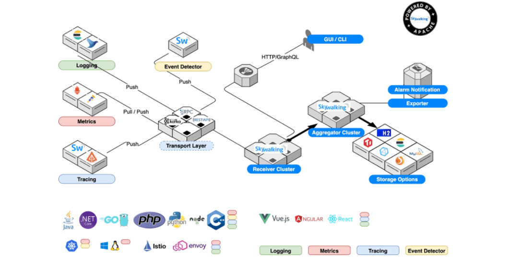
>
> - **Probe**s collect data and reformat them for SkyWalking requirements (different probes support different sources).  **探测器‎**‎（探针）收集数据并根据SkyWalking要求重新格式化它们（不同的探测器支持不同的来源）。‎
> - **Platform backend** supports data aggregation, analysis and streaming process covers traces, metrics, and logs.  **‎**‎支持数据聚合、分析和流式处理，涵盖跟踪、指标和日志。‎
> - **Storage** houses SkyWalking data through an open/plugable interface. You can choose an existing implementation, such as ElasticSearch, H2, MySQL, TiDB, InfluxDB, or implement your own. Patches for new storage implementors welcome! 通过开放/可插入的接口容纳SkyWalk数据。您可以选择现有的实现，例如ElasticSearch，H2，MySQL，TiDB，InfluxDB，或者实现自己的实现。欢迎为新的存储实施者提供补丁
> - **UI** is a highly customizable web based interface allowing SkyWalking end users to visualize and manage SkyWalking data.  是一个高度可定制的基于Web的界面，允许SkyWalking最终用户可视化和管理SkyWalking数据。‎

### 1.4 官方文档

在 https://github.com/apache/skywalking/tree/master/docs 地址下，提供了 SkyWalking 的**英文**文档。

考虑到大多数胖友的英语水平和艿艿不相伯仲，再加上胖友一开始对 SkyWalking 比较陌生，所以比较推荐先阅读 https://github.com/SkyAPM/document-cn-translation-of-skywalking 地址，提供了 SkyWalking 的**中文**文档，看了下，到今天2022年5月24号更新到8.0。

考虑到胖友使用 SkyWalking 的目的，是实现**分布式链路追踪**的功能，所以最好去了解下相关的知识。这里推荐阅读两篇文章：

- [《OpenTracing 官方标准 —— 中文版》](https://github.com/opentracing-contrib/opentracing-specification-zh)
- Google 论文 [《Dapper，大规模分布式系统的跟踪系统》](http://www.iocoder.cn/Fight/Dapper-translation/?self)


### 1.5 service mesh（服务网格）

参考文档

https://github.com/SkyAPM/document-cn-translation-of-skywalking/blob/master/docs/zh/8.0.0/concepts-and-designs/service-mesh-probe.md

#### 什么是服务网格

下面的解释来自Istio文档。

> 服务网格通常用于描述组成此类应用程序的微服务网络以及它们之间的交互。随着服务网格的大小和复杂性的增长，它会变得更难理解和管理。它需要包括发现、负载平衡、故障恢复、度量和监视以及更复杂的操作需求A/B测试、金丝雀发布、限流、访问控制和端到端身份验证。

参考文档:

https://zhuanlan.zhihu.com/p/28794062 Service Mesh—微服务中的流量管理中间件

> **Service mesh 与 Cloud Native**
>
> Kubernetes 设计之初就是按照 Cloud Native 的理念设计的，Cloud Native 中有个重要概念就是微服务的架构设计，当将单体应用拆分微服务后， 随着服务数量的增多，如何微服务进行管理以保证服务的 SLA 呢？为了从架构层面上解决这个问题，解放程序员的创造性，避免繁琐的服务发现、监控、分布式追踪等事务，Service mesh 应运而生。
>
> **服务水平协议**（Service Level Agreement，SLA）是在一定开销（通常这个开销是驱动提供服务质量的主要因素）下，为了保障服务的性能和可靠性，服务提供商与用户间或者服务提供商之间定义的一种双方认可的协定。
>
> ## **什么是 service mesh？**
>
> Service mesh 有如下几个特点：
>
> - 应用程序间通讯的中间层
> - 轻量级网络代理
> - 应用程序无感知
> - 解耦应用程序的重试/超时、监控、追踪和服务发现
>
> 目前两款流行的 service mesh 开源软件 [Istio](https://link.zhihu.com/?target=https%3A//istio.io/) 和 [Linkerd](https://link.zhihu.com/?target=https%3A//linkerd.io/) 都可以直接在 kubernetes 中集成，其中 Linkerd 已经成为 CNCF 成员。
>
> ## 理解 Service Mesh
>
> 如果用一句话来解释什么是 Service Mesh，可以将它比作是应用程序或者说微服务间的 TCP/IP，负责服务之间的网络调用、限流、熔断和监控。对于编写应用程序来说一般无须关心 TCP/IP 这一层（比如通过 HTTP 协议的 RESTful 应用），同样使用 Service Mesh 也就无须关系服务之间的那些**原来是通过应用程序或者其他框架实现的事情**，比如 Spring Cloud、OSS，现在只要交给 Service Mesh 就可以了。
>
> [Phil Calçado](https://link.zhihu.com/?target=http%3A//philcalcado.com/) 在他的这篇博客 [Pattern: Service Mesh](https://link.zhihu.com/?target=http%3A//philcalcado.com/2017/08/03/pattern_service_mesh.html) 中详细解释了 Service Mesh 的来龙去脉：
>
> 1. 从最原始的主机之间直接使用网线相连
> 2. 网络层的出现
> 3. 集成到应用程序内部的控制流
> 4. 分解到应用程序外部的控制流
> 5. 应用程序的中集成服务发现和断路器
> 6. 出现了专门用于服务发现和断路器的软件包/库，如 [Twitter 的 Finagle](https://link.zhihu.com/?target=https%3A//finagle.github.io/) 和 [Facebook 的 Proxygen](https://link.zhihu.com/?target=https%3A//code.facebook.com/posts/1503205539947302)，这时候还是集成在应用程序内部
> 7. 出现了专门用于服务发现和断路器的开源软件，如 [Netflix OSS](https://link.zhihu.com/?target=http%3A//netflix.github.io/)、Airbnb 的 [synapse](https://link.zhihu.com/?target=https%3A//github.com/airbnb/synapse) 和 [nerve](https://link.zhihu.com/?target=https%3A//github.com/airbnb/nerve)
> 8. 最后作为微服务的中间层 service mesh 出现
>
> Service mesh 的架构如下图所示：
>
> 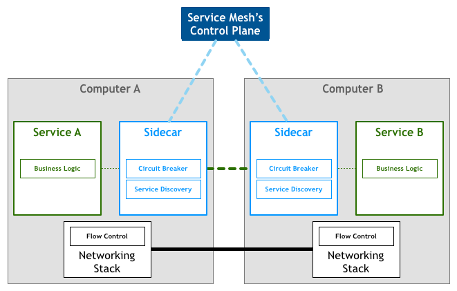
>
> 图片来自：[Pattern: Service Mesh](https://link.zhihu.com/?target=http%3A//philcalcado.com/2017/08/03/pattern_service_mesh.html)
>
> Service mesh 作为 sidecar 运行，对应用程序来说是透明，所有应用程序间的流量都会通过它，所以对应用程序流量的控制都可以在 serivce mesh 中实现。
>
> ## **Service mesh如何工作？**
>
> 下面以 Linkerd 为例讲解 service mesh 如何工作，Istio 作为 service mesh 的另一种实现原理与 linkerd 基本类似，后续文章将会详解 Istio 和 Linkerd 如何在 kubernetes 中工作。
>
> 1. Linkerd 将服务请求路由到目的地址，根据中的参数判断是到生产环境、测试环境还是 staging 环境中的服务（服务可能同时部署在这三个环境中），是路由到本地环境还是公有云环境？所有的这些路由信息可以动态配置，可以是全局配置也可以为某些服务单独配置。
> 2. 当 Linkerd 确认了目的地址后，将流量发送到相应服务发现端点，在 kubernetes 中是 service，然后 service 会将服务转发给后端的实例。
> 3. Linkerd 根据它观测到最近请求的延迟时间，选择出所有应用程序的实例中响应最快的实例。
> 4. Linkerd 将请求发送给该实例，同时记录响应类型和延迟数据。
> 5. 如果该实例挂了、不响应了或者进程不工作了，Linkerd 将把请求发送到其他实例上重试。
> 6. 如果该实例持续返回 error，Linkerd 会将该实例从负载均衡池中移除，稍后再周期性得重试。
> 7. 如果请求的截止时间已过，Linkerd 主动失败该请求，而不是再次尝试添加负载。
> 8. Linkerd 以 metric 和分布式追踪的形式捕获上述行为的各个方面，这些追踪信息将发送到集中 metric 系统。
>
> ## **为何使用 service mesh？**
>
> Service mesh 并没有给我们带来新功能，它是用于解决其他工具已经解决过的问题，只不过这次是在 Cloud Native 的 kubernetes 环境下的实现。
>
> 在传统的 MVC 三层 Web 应用程序架构下，服务之间的通讯并不复杂，在应用程序内部自己管理即可，但是在现今的复杂的大型网站情况下，单体应用被分解为众多的微服务，服务之间的依赖和通讯十分复杂，出现了 twitter 开发的 [Finagle](https://link.zhihu.com/?target=https%3A//twitter.github.io/finagle/)、Netflix 开发的 [Hystrix](https://link.zhihu.com/?target=https%3A//github.com/Netflix/Hystrix) 和 Google 的 Stubby 这样的 ”胖客户端“ 库，这些就是早期的 service mesh，但是它们都近适用于特定的环境和特定的开发语言，并不能作为平台级的 service mesh 支持。
>
> 在 Cloud Native 架构下，容器的使用给予了异构应用程序的更多可行性，kubernetes 增强的应用的横向扩容能力，用户可以快速的编排出复杂环境、复杂依赖关系的应用程序，同时开发者又无须过分关心应用程序的监控、扩展性、服务发现和分布式追踪这些繁琐的事情而专注于程序开发，赋予开发者更多的创造性。

### 1.6 探针简介

参考文档：

```
https://developer.aliyun.com/article/763498
```

在 SkyWalking 中, 探针表示集成到目标系统中的代理或 SDK 库, 它负责收集遥测数据, 包括链路追踪和性能指标。根据目标系统的技术栈, 探针可能有差异巨大的方式来达到以上功能. 但从根本上来说都是一样的, 即收集并格式化数据, 并发送到后端。

从高层次上来讲, SkyWalking 探针可分为以下三组：

- **基于语言的原生代理**. 这种类型的代理运行在目标服务的用户空间中, 就像用户代码的一部分一样. 如 SkyWalking Java 代理, 使用 `-javaagent` 命令行参数在运行期间对代码进行操作, `操作` 一词表示修改并注入用户代码. 另一种代理是使用目标库提供的钩子函数或拦截机制. 如你所见, 这些探针是基于特定的语言和库。
- **服务网格探针**. 服务网格探针从服务网格的 Sidecar 和控制面板收集数据. 在以前, 代理只用作整个集群的入口, 但是有了服务网格和 Sidecar 之后, 我们可以基于此进行观测了。
- **第三方打点类库**. SkyWalking 也能够接收其他流行的打点库产生的数据格式. SkyWalking 通过分析数据,将数据格式化成自身的链路和度量数据格式. 该功能最初只能接收 Zipkin 的 span 数据. 更多参考[其他追踪系统的接收器](https://github.com/SkyAPM/document-cn-translation-of-skywalking/blob/master/docs/zh/8.0.0/setup/backend/backend-receivers.md)。

你不必同时使用 **基于语言的原生代理** 和 **服务网格探针** ，因为两者都收集指标数据，否则你的系统就要承受双倍负载, 且分析数量会翻倍.

有如下几种推荐的方式来使用探针:

1. 只使用 **基于语言的原生代理**.
2. 只使用 **第三方打点库**, 如 Zipkin 打点系统.
3. 只使用 **服务网格探针**.
4. 使用 **服务网格探针**, 配合 **语言原生代理** 或 **第三方打点库**, 来 **追踪状态** . (高级用法)

另外，让我们举例说明什么是 **追踪状态**？

默认情况下, **基于语言的原生代理** 和 **第三方打点库** 都会发送分布式追踪数据到后台, 后者分析/聚合这些追踪数据. **追踪状态**意味着, 后端把这些追踪数据看作是日志一类的事情, 仅仅将他们保存下来, 并且在追踪和指标之间建立联系, 比如 `这个追踪数据属于哪个入口哪个服务?` 。

#### 服务网格探针

参考文档

https://github.com/SkyAPM/document-cn-translation-of-skywalking/blob/master/docs/zh/8.0.0/concepts-and-designs/service-mesh-probe.md

服务网格探针使用了服务网格实现者中提供的可扩展机制，比如 Istio。

#### 探针从哪里采集数据

Istio 是一个非常典型的服务网格的设计和实现。它定义了 **控制平面** 和 **数据平面**，被广泛使用。下面是 Istio 的架构 :

!

服务网格探针可以选择从 **控制平面** 和 **数据平面** 采集数据。在 Istio 中，指的是从 Mixer(Control Panel) 或者 Envoy sidecar(Data Panel) 中采集遥测数据。探针从客户端和服务器端收集每个请求的两个遥测实体，它们其实是相同的数据。

#### 服务网格如何使后端工作

从探针中，您可以看到在这种探针中一定没有相关的跟踪，那么为什么 SkyWalking 平台仍然可以工作？

服务网格探针从每个请求收集遥测数据，因此它知道源、目标、端点、延迟和状态。通过这些，后端可以通过将这些调用合并为行来描述整个拓扑图，以及每个节点通过传入请求的度量。后端解析跟踪数据，请求相同的度量数据。因此，正确的表述是：

**服务网格度量就是跟踪解析器生成的度量。他们是相同的。**


### 1.7 其他分布式调用链对比（pinpoint,skywalking,jaeger,zipkin）

**1. APM简述**

  APM （Application Performance Management）是对企业的应用系统进行实时监控，它是用于实现对应用程序性能管理和故障管理的系统化的解决方案。

**2.APM主要解决的问题：**

1. 集中式度量系统
2. 分布式全链接追踪系统
3. 集中式日志系统（elk）

**3.分布式调用追踪（APM）一览**

1. google的Drapper--未开源，最早的APM
2. 阿里-鹰眼--未开源
3. 大众点评——CAT--跨服务的跟踪功能与点评内部的RPC框架集成，这部分未开源且项目在2014.1已经停止维护。服务粒度的监控，通过代码埋点的方式来实现监控，比如： 拦截器，注解，过滤器等，对代码的侵入性较大，集成成本较高。
4. Hydra-京东: 与dubbo框架集成，对于服务级别的跟踪统计，现有业务可以无缝接入。对于细粒度的兴趣点，需要业务人员手动添加.开源项目已于2013年6月停止维护
5. PinPoint-naver，字节码探针技术，代码无侵入，体系完善不易修改，支持java,技术栈支持dubbo.其他语言社区支援中
6. zipkin--java方便集成于springcloud，社区支持的插件也包括dubbo,rabbit,mysql,httpclient等(https://github.com/openzipkin/brave/tree/master/instrumentation)，同时支持php,go,js等语言客户端，界面功能较为简单，本身无告警功能，可能需要二次开发。代码入侵度小。
7. uber-jaeger， Jaeger支持java/c++/go/node/php，在界面上较为完善（对比zipkin），但是也无告警功能。代码入侵度小。dubbo目前无插件支持，可二次开发。
8. skywalking -华为，类似于PinPoint，目前还在apache孵化中，网上吞吐量对比中强于pinpoint,实际未验证。本身支持dubbo

**4.方案对比**

|                     | pinpoint           | zipkin                   | jaeger                   | skywalking                        |
| ------------------- | ------------------ | ------------------------ | ------------------------ | --------------------------------- |
| OpenTracing兼容     | 否                 | 是                       | 是                       | 是                                |
| 客户端支持语言      | java、php          | java,c#,go,php等         | java,c#,go,php等         | Java, .NET Core, NodeJS and PHP   |
| 存储                | hbase              | ES，mysql,Cassandra,内存 | ES，kafka,Cassandra,内存 | ES，H2,mysql,TIDB,sharding sphere |
| 传输协议支持        | thrift             | http,MQ                  | udp/http                 | gRPC                              |
| ui丰富程度          | 高                 | 低                       | 中                       | 中                                |
| 实现方式-代码侵入性 | 字节码注入，无侵入 | 拦截请求，侵入           | 拦截请求，侵入           | 字节码注入，无侵入                |
| 扩展性              | 低                 | 高                       | 高                       | 中                                |
| trace查询           | 不支持             | 支持                     | 支持                     | 支持                              |
| 告警支持            | 支持               | 不支持                   | 不支持                   | 支持                              |
| jvm监控             | 支持               | 不支持                   | 不支持                   | 支持                              |
| 性能损失            | 高                 | 中                       | 中                       | 低                                |

**5.各方案参考链接**

  1.pinpoint-naver

  github: https://github.com/naver/pinpoint

  docker快速体验：https://github.com/naver/pinpoint-docker

  2.zipkin-推特：

  github: https://github.com/openzipkin/zipkin

  页面详解：https://blog.csdn.net/u012394095/article/details/82585863

  zipkin于php对接：https://www.colabug.com/1872361.html

  3.jaeger-uber

  部分参考资料：

  jaeger简介，部署，入门实践 https://my.oschina.net/u/2548090/blog/1821359

  jaeger——java实现 https://my.oschina.net/u/1789379/blog/1551421

  Uber[分布式](https://so.csdn.net/so/search?q=分布式&spm=1001.2101.3001.7020)追踪系统Jaeger使用介绍和案例（PHP Hprose Go 跨语言调用）

[  https://segmentfault.com/a/1190000011636957](https://segmentfault.com/a/1190000011636957)

  全链路监控Jaeger搭建实战 https://www.jianshu.com/p/ffc597bb4ce8

  jaeger官网快速开始 https://www.jaegertracing.io/docs/1.8/getting-started/

  4.skywalking(推荐)

  github: https://github.com/apache/incubator-skywalking

  SkyWalking 分布式追踪系统 https://www.jianshu.com/p/2fd56627a3cf

  Apache SkyWalking 5.0中文版图文详解使用手册

[  http://skywalking.apache.org/zh/blog/2018-12-18-Apache-SkyWalking-5-0-UserGuide.html](http://skywalking.apache.org/zh/blog/2018-12-18-Apache-SkyWalking-5-0-UserGuide.html)

  skywalking学习笔记 https://juejin.im/post/5ab5b0e26fb9a028e25d7fcb

6.参考资料

  分布式链路追踪技术对比 https://blog.csdn.net/moonpure/article/details/79992855

  回到网易后开源 APM 技术选型与实战 https://www.infoq.cn/article/apm-Pinpoint-practice

  zipkin vs jaeger https://segmentfault.com/a/1190000015308746

  调用链选型之Zipkin，Pinpoint，SkyWalking，CAT https://www.jianshu.com/p/0fbbf99a236e

 参考文档 ：

https://blog.csdn.net/weixin_34393428/article/details/92408030?utm_medium=distribute.wap_aggpage_search_result.none-task-blog-2~aggregatepage~first_rank_ecpm_v1~rank_v31_ecpm-2-92408030.wap_agg_so&utm_term=Jaeger%20%E7%9B%91%E6%8E%A7%E5%AF%B9%E6%AF%94

## 2.skywalking在已有项目中集成

由于之前项目以及成熟，需要在已有的项目结构基础上**最小成本**加入链路日志，由于skywalking  探针和 service mesh机制，**支持dubbo,代码无侵入性以及较为全面的UI功能**，暂定在项目中使用skywalking。

参考文档：

https://skywalking.apache.org/zh/2020-04-19-skywalking-quick-start/

https://github.com/apache/skywalking

### 2.1 版本选择

skywalking9.0.0 

### 2.2 版本下载

https://github.com/apache/skywalking/releases   Git或者官网

https://www.apache.org/dyn/closer.cgi/skywalking/9.0.0/apache-skywalking-apm-9.0.0-src.tgz

https://skywalking.apache.org/downloads/


```shell
#9.0.0版本下载
wget https://github.com/apache/skywalking/archive/refs/tags/v9.0.0.zip
wget https://github.com/apache/skywalking/archive/refs/tags/v9.0.0.tar.gz
或者
wget https://downloads.apache.org/skywalking/9.0.0/apache-skywalking-apm-9.0.0-src.tgz

# git需要编译，我们直接下载编译好的9.0.0 tar包
[anchu@localhost software]$ mkdir skywalking
[anchu@localhost software]$ cd skywalking/
[anchu@localhost skywalking]$ wget https://downloads.apache.org/skywalking/9.0.0/apache-skywalking-apm-9.0.0-src.tgz --no-check-certificate

[anchu@localhost skywalking]$ ls
apache-skywalking-apm-9.0.0  apache-skywalking-apm-9.0.0-src.tgz
[anchu@localhost skywalking]$ tar xzvf apache-skywalking-apm-9.0.0-src.tgz

```

由于9.0版本不支持es存储。在 http://skywalking.apache.org/downloads/ 下，我们下载**操作系统**对应的发布版。

这里，我们选择  8.7.0版本，并且支持Elasticsearch 7.X 版本作为存储。下载版本如下

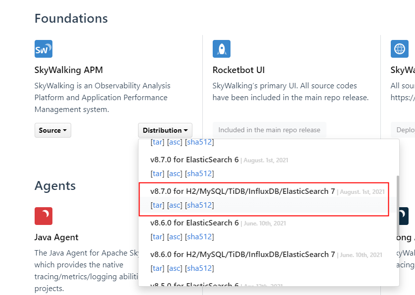

```shell
# linux环境 8.7版本下载，支持es7.0
[anchu@localhost software]$ cd skywalking/
[anchu@localhost skywalking]$ wget https://archive.apache.org/dist/skywalking/8.7.0/apache-skywalking-apm-es7-8.7.0.tar.gz
[anchu@localhost skywalking]$ tar xvf apache-skywalking-apm-es7-8.7.0.tar.gz
[anchu@localhost skywalking]$ cd apache-skywalking-apm-bin-es7
[anchu@localhost apache-skywalking-apm-bin-es7]$ ls
agent  bin  config  config-examples  LICENSE  licenses  NOTICE  oap-libs  README.txt  tools  webapp

# windows 环境下载，直接下载好，并解压
```


### 2.3 已有工程结构

```java

```


### 2.4 已有es环境

centos虚拟机单机版es:版本es7.10.0

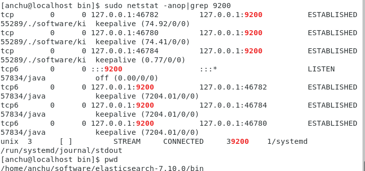

## 3. skywalking+nacos+dubbo+elk

配置持久化：apache-skywalking-apm-bin-es7的config目录的application.yml文件，可以看到持久化有很多方案（es，数据库，时序库，zipkin等等）可以选择，默认是内嵌数据库h2,如下：

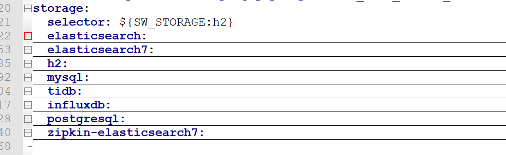

修改配置如下：

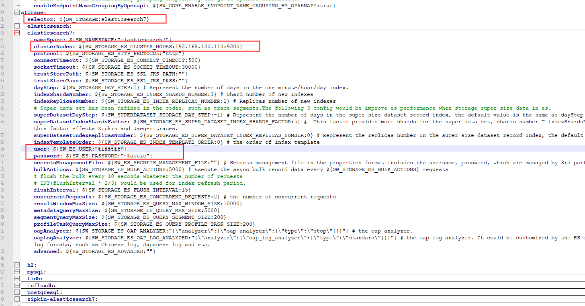

apache-skywalking-apm-bin-es7的webapp目录webapp.yml文件，配置端口服务地址，端口，注册中心等等

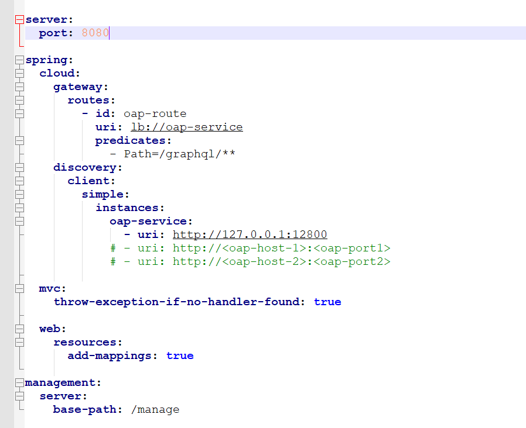

apache-skywalking-apm-bin-es7的bin目录启动脚本startup.bat；apache-skywalking-apm-bin-es7的logs目录查看日志，启动成功，日志中打印了0.0.0.0:11800，这个是agent代理服务要发送的地址及端口

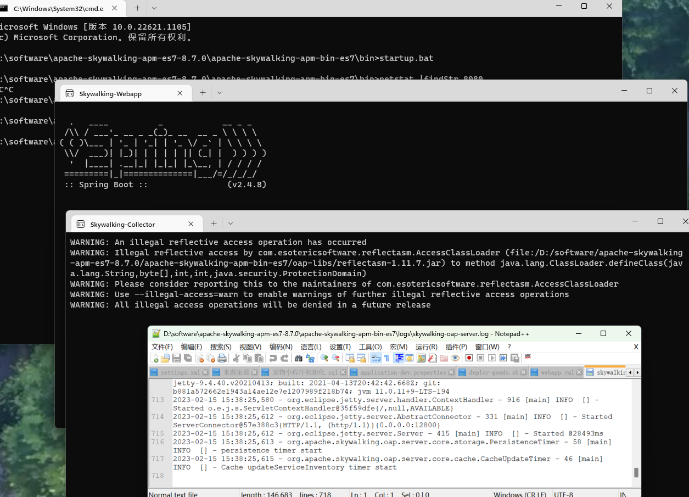

浏览器访问：SkyWalking](http://localhost:8080/)

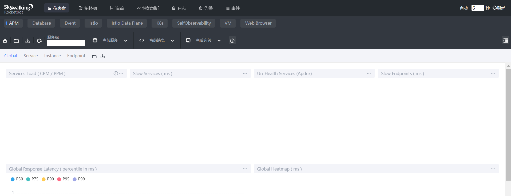


#### **将项目工程集成skywalking。**

因为skywalking使用的是agent的方式，所以对我们的代码是令侵入。只要在启动的时候指定agent的路径即可。

agent目录 ：D:\software\apache-skywalking-apm-es7-8.7.0\apache-skywalking-apm-bin-es7\agent

包名：skywalking-agent.jar  

```shell
java -javaagent:D:\software\apache-skywalking-apm-es7-8.7.0\apache-skywalking-apm-bin-es7\agent\\skywalking-agent.jar  
-Dskywalking.agent.service_name=wsnb-goods-service
-Dskywalking.collector.backend_service=127.0.0.1:11800 
-jar wsnb-goods-1.0-SNAPSHOT.jar &
```

参数解释：

```shell
-javaagent:D:\software\apache-skywalking-apm-es7-8.7.0\apache-skywalking-apm-bin-es7\agent\skywalking-agent.jar   # 指定agent-jar的位置

-Dskywalking.agent.service_name=wsnb-goods-service  # 服务名称

-Dskywalking.collector.backend_service=127.0.0.1:11800 # 指定skywalking的地址
```


ieda中测试如下,vm options加入如下参数

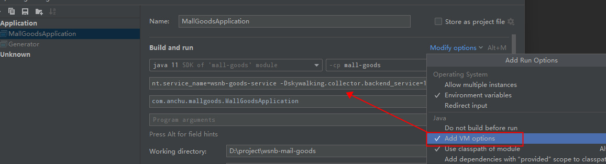

```shell
-javaagent:D:\software\apache-skywalking-apm-es7-8.7.0\apache-skywalking-apm-bin-es7\agent\skywalking-agent.jar -Dskywalking.agent.service_name=wsnb-goods-service -Dskywalking.collector.backend_service=127.0.0.1:11800 
```

服务启动后，开始的几行会打印如下日志：

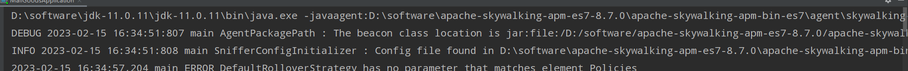

#### 浏览器查看

（注意只有调用一次接口，skyworking才能看到数据，之前调用了查看积分商品详情的接口backplat/pointgoods/detail）看到监控信息如下

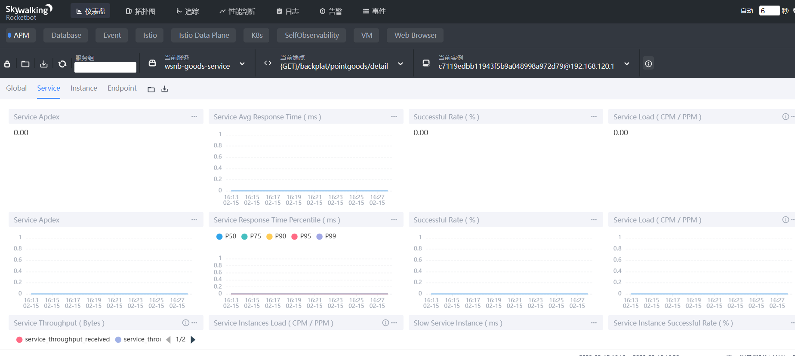


同上：account启动时加入如下参数：服务名：wsnb-account-service

```
-javaagent:D:\software\apache-skywalking-apm-es7-8.7.0\apache-skywalking-apm-bin-es7\agent\skywalking-agent.jar -Dskywalking.agent.service_name=wsnb-account-service -Dskywalking.collector.backend_service=127.0.0.1:11800 
```

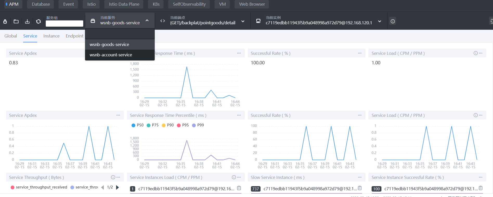

查看服务拓扑图

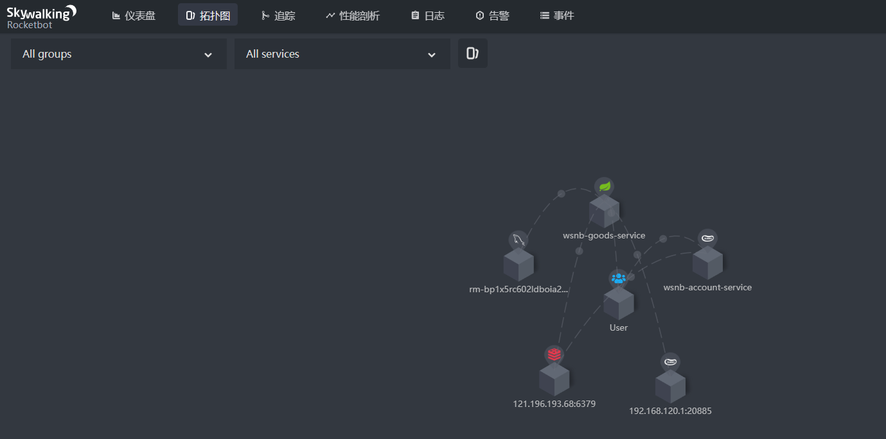

由于查看积分商品详情时，会调用account中的服务验证用户信息，点击追踪，可以整个查看链路

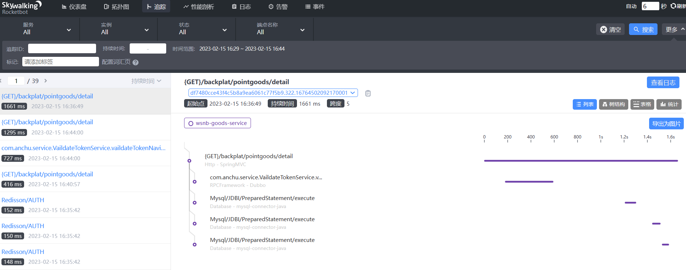

后续会在日志增加traceId

**为什么要在日志中增加traceId ？**

skywalking的ui中是支持traceId  追踪ID进行检索的，所以当出现性能问题的时候，打印出traceId，可以准确找到我们要定位的地方。比如哪一次调用的哪个链路出了问题


#### 可以通过kibana查看es里面的索引数据

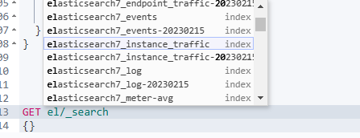

```json
GET elasticsearch7_events/_search
{}

{
  "took" : 1,
  "timed_out" : false,
  "_shards" : {
    "total" : 1,
    "successful" : 1,
    "skipped" : 0,
    "failed" : 0
  },
  "hits" : {
    "total" : {
      "value" : 5,
      "relation" : "eq"
    },
    "max_score" : 1.0,
    "hits" : [
      {
        "_index" : "elasticsearch7_events-20230215",
        "_type" : "_doc",
        "_id" : "8c05ba70-d473-4bb5-9719-49c855775422",
        "_score" : 1.0,
        "_source" : {
          "start_time" : 1676450091298,
          "endpoint" : "",
          "service" : "wsnb-goods-service",
          "name" : "Start",
          "end_time" : 1676450094995,
          "time_bucket" : 202302151634,
          "service_instance" : "",
          "type" : "Normal",
          "message" : "Start Java Application",
          "uuid" : "8c05ba70-d473-4bb5-9719-49c855775422",
          "parameters" : """{"OPTS":"-Dfile.encoding\u003dUTF-8 -Dskywalking.agent.service_name\u003dwsnb-goods-service -Dskywalking.collector.backend_service\u003d127.0.0.1:11800 -javaagent:D:\\Program Files\\JetBrains\\IntelliJ IDEA Community Edition 2021.2.3\\lib\\idea_rt.jar\u003d53167:D:\\Program Files\\JetBrains\\IntelliJ IDEA Community Edition 2021.2.3\\bin -javaagent:D:\\software\\apache-skywalking-apm-es7-8.7.0\\apache-skywalking-apm-bin-es7\\agent\\skywalking-agent.jar"}"""
        }
      },
      {
        "_index" : "elasticsearch7_events-20230215",
        "_type" : "_doc",
        "_id" : "842b39c0-86a2-4de7-866a-d69bfe56a17e",
        "_score" : 1.0,
        "_source" : {
          "start_time" : 1676450534487,
          "endpoint" : "",
          "service" : "wsnb-account-service",
          "name" : "Start",
          "end_time" : 1676450538620,
          "time_bucket" : 202302151642,
          "service_instance" : "",
          "type" : "Normal",
          "message" : "Start Java Application",
          "uuid" : "842b39c0-86a2-4de7-866a-d69bfe56a17e",
          "parameters" : """{"OPTS":"-Dfile.encoding\u003dUTF-8 -Dskywalking.agent.service_name\u003dwsnb-account-service -Dskywalking.collector.backend_service\u003d127.0.0.1:11800 -agentlib:jdwp\u003dtransport\u003ddt_socket,address\u003d127.0.0.1:53725,suspend\u003dy,server\u003dn -javaagent:C:\\Users\\anchu\\AppData\\Local\\JetBrains\\IdeaIC2021.2\\captureAgent\\debugger-agent.jar -javaagent:D:\\software\\apache-skywalking-apm-es7-8.7.0\\apache-skywalking-apm-bin-es7\\agent\\skywalking-agent.jar"}"""
        }
      },
      {
        "_index" : "elasticsearch7_events-20230215",
        "_type" : "_doc",
        "_id" : "71ef8bfc-7b2f-4ba7-9fe2-6ea6a8322174",
        "_score" : 1.0,
        "_source" : {
          "start_time" : 1676450123247,
          "endpoint" : "User",
          "service" : "User",
          "name" : "Alarm",
          "end_time" : 1676450723247,
          "time_bucket" : 202302151635,
          "service_instance" : "",
          "type" : "Error",
          "message" : "Response time of endpoint relation User in User to {GET}/backplat/pointgoods/detail in wsnb-goods-service is more than 1000ms in 2 minutes of last 10 minutes",
          "uuid" : "71ef8bfc-7b2f-4ba7-9fe2-6ea6a8322174",
          "parameters" : null
        }
      },
      {
        "_index" : "elasticsearch7_events-20230215",
        "_type" : "_doc",
        "_id" : "deac7e0a-614e-4859-ac39-afd773d1ab5d",
        "_score" : 1.0,
        "_source" : {
          "start_time" : 1676450123240,
          "endpoint" : "",
          "service" : "wsnb-goods-service",
          "name" : "Alarm",
          "end_time" : 1676450723240,
          "time_bucket" : 202302151635,
          "service_instance" : "c7119edbb11943f5b9a048998a972d79@192.168.120.1",
          "type" : "Error",
          "message" : "Response time of service instance c7119edbb11943f5b9a048998a972d79@192.168.120.1 of wsnb-goods-service is more than 1000ms in 2 minutes of last 10 minutes",
          "uuid" : "deac7e0a-614e-4859-ac39-afd773d1ab5d",
          "parameters" : null
        }
      },
      {
        "_index" : "elasticsearch7_events-20230215",
        "_type" : "_doc",
        "_id" : "a7d9fa51-f9cb-42dd-827b-0c03cf54306b",
        "_score" : 1.0,
        "_source" : {
          "start_time" : 1676450123247,
          "endpoint" : "{GET}/backplat/pointgoods/detail",
          "service" : "wsnb-goods-service",
          "name" : "Alarm",
          "end_time" : 1676450723247,
          "time_bucket" : 202302151635,
          "service_instance" : "",
          "type" : "Error",
          "message" : "Response time of endpoint relation User in User to {GET}/backplat/pointgoods/detail in wsnb-goods-service is more than 1000ms in 2 minutes of last 10 minutes",
          "uuid" : "a7d9fa51-f9cb-42dd-827b-0c03cf54306b",
          "parameters" : null
        }
      }
    ]
  }
}

```

查看两个服务实例流量信息

```
GET elasticsearch7_instance_traffic/_search
{}
```

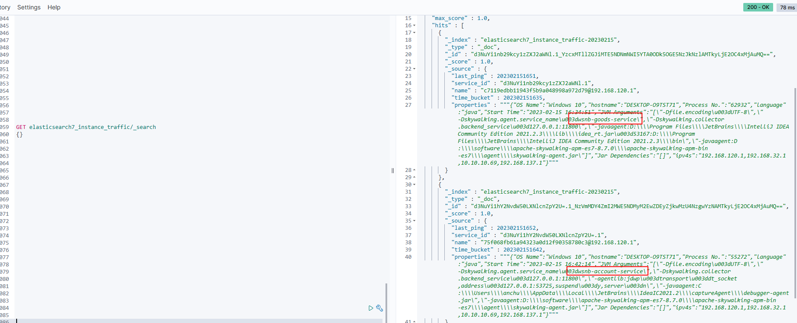

查看服务点流量信息

```
GET elasticsearch7_endpoint_traffic/_search
{}

```

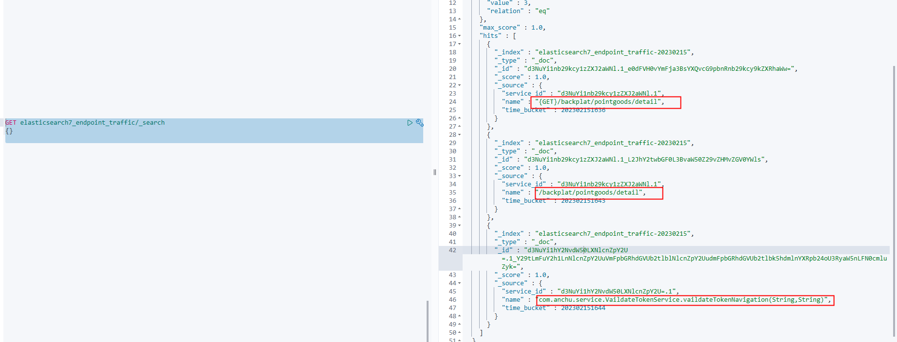