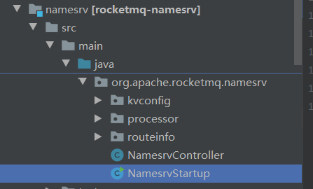
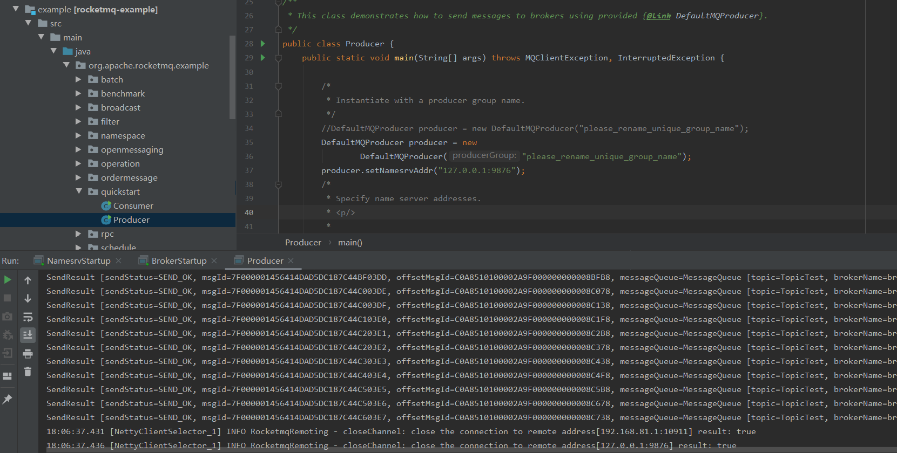

# 6.rocketMQ从入门到放弃(1)

## 1. MQ介绍

### 1.1 为什么要用MQ

消息队列是一种“先进先出”的数据结构


其应用场景主要包含以下3个方面

- 应用解耦 

系统的耦合性越高，容错性就越低。以电商应用为例，用户创建订单后，如果耦合调用库存系统、物流 系统、支付系统，任何一个子系统出了故障或者因为升级等原因暂时不可用，都会造成下单操作异常， 影响用户使用体验。


使用消息队列解耦合，系统的耦合性就会提高了。比如物流系统发生故障，需要几分钟才能来修复，在 这段时间内，物流系统要处理的数据被缓存到消息队列中，用户的下单操作正常完成。当物流系统回复 后，补充处理存在消息队列中的订单消息即可，终端系统感知不到物流系统发生过几分钟故障.

       

- 流量削峰


应用系统如果遇到系统请求流量的瞬间猛增，有可能会将系统压垮。有了消息队列可以将大量请求缓存 起来，分散到很长一段时间处理，这样可以大大提到系统的稳定性和用户体验。


一般情况，为了保证系统的稳定性，如果系统负载超过阈值，就会阻止用户请求，这会影响用户体验， 而如果使用消息队列将请求缓存起来，等待系统处理完毕后通知用户下单完毕，这样总不能下单体验要好。

处于经济考量目的： 业务系统正常时段的QPS如果是1000，流量最高峰是10000，为了应对流量高峰配置高性能的服务器显 然不划算，这时可以使用消息队列对峰值流量削

- 数据分发


通过消息队列可以让数据在多个系统更加之间进行流通。数据的产生方不需要关心谁来使用数据，只需 要将数据发送到消息队列，数据使用方直接在消息队列中直接获取数据即可.


### 1.2 MQ的优点和缺点

优点：解耦、削峰、数据分发

缺点包含以下几点：  

- **系统可用性降低** 系统引入的外部依赖越多，系统稳定性越差。一旦MQ宕机，就会对业务造成影响。 如何保证MQ的高可用？ 

- **系统复杂度提高** MQ的加入大大增加了系统的复杂度，以前系统间是同步的远程调用，现在是通过MQ进行异步调 用。 如何保证消息没有被重复消费？怎么处理消息丢失情况？那么保证消息传递的顺序性？ 

- **一致性问题** A系统处理完业务，通过MQ给B、C、D三个系统发消息数据，如果B系统、C系统处理成功，D系 统处理失败。 如何保证消息数据处理的一致性？

### 1.3 各种MQ产品的比较


## 2.RocketMQ快速入门

RocketMQ是阿里巴巴2016年MQ中间件，使用Java语言开发，在阿里内部，RocketMQ承接了例如“双 11”等高并发场景的消息流转，能够处理万亿级别的消息。

### 2.1 设计理念

RocketMQ设计基于主题的发布与订阅模式，其核心功能包括消息发送、消息存储（Broker）、消息消费，整体设计追求简单与性能第一，主要体现在如下三个方面。

首先，NameServer设计极其简单，摒弃了业界常用的使用Zookeeper充当信息管理的“注册中心”，而是自研NameServer来实现元数据的管理（Topic路由信息等）。**从实际需求出发，因为Topic路由信息无须在集群之间保持强一致，追求最终一致性，并且能容忍分钟级的不一致。正是基于此种情况，RocketMQ的NameServer集群之间互不通信，极大地降低了NameServer实现的复杂程度，对网络的要求也降低了不少，但是性能相比较Zookeeper有了极大的提升。**

**其次是高效的IO存储机制。RocketMQ追求消息发送的高吞吐量，RocketMQ的消息存储文件设计成文件组的概念，组内单个文件大小固定，方便引入内存映射机制，所有主题的消息存储基于顺序写，极大地提供了消息写性能，同时为了兼顾消息消费与消息查找，引入了消息消费队列文件与索引文件。**

**最后是容忍存在设计缺陷，适当将某些工作下放给RocketMQ使用者。消息中间件的实现者经常会遇到一个难题：如何保证消息一定能被消息消费者消费，并且保证只消费一次。RocketMQ的设计者给出的解决办法是不解决这个难题，而是退而求其次，只保证消息被消费者消费，但设计上允许消息被重复消费，这样极大地简化了消息中间件的内核，使得实现消息发送高可用变得非常简单与高效，消息重复问题由消费者在消息消费时实现幂等。**

### 2.2设计目标

RocketMQ作为一款消息中间件，需要解决如下问题。

1．架构模式

RocketMQ与大部分消息中间件一样，采用发布订阅模式，基本的参与组件主要包括：消息发送者、消息服务器（消息存储）、消息消费、路由发现。

2．顺序消息

所谓顺序消息，就是消息消费者按照消息达到消息存储服务器的顺序消费。RocketMQ可以严格保证消息有序。3．消息过滤

消息过滤是指在消息消费时，消息消费者可以对同一主题下的消息按照规则只消费自己感兴趣的消息。**RocketMQ消息过滤支持在服务端与消费端的消息过滤机制。**

1）消息在Broker端过滤。Broker只将消息消费者感兴趣的消息发送给消息消费者。

2）消息在消息消费端过滤，消息过滤方式完全由消息消费者自定义，但缺点是有很多无用的消息会从Broker传输到消费端。

4．消息存储

**消息中间件的一个核心实现是消息的存储，对消息存储一般有如下两个维度的考量：消息堆积能力和消息存储性能。RocketMQ追求消息存储的高性能，引入内存映射机制，所有主题的消息顺序存储在同一个文件中。同时为了避免消息无限在消息存储服务器中累积，引入了消息文件过期机制与文件存储空间报警机制。**

5．消息高可用性通常影响消息可靠性的有以下几种情况。

1）Broker正常关机。

2）Broker异常Crash。

3）OS Crash。

4）机器断电，但是能立即恢复供电情况。

5）机器无法开机（可能是CPU、主板、内存等关键设备损坏）。

6）磁盘设备损坏。

针对上述情况，情况1～4的RocketMQ在同步刷盘机制下可以确保不丢失消息，在异步刷盘模式下，会丢失少量消息。情况5～6属于单点故障，一旦发生，该节点上的消息全部丢失，如果开启了异步复制机制，RoketMQ能保证只丢失少量消息，RocketMQ在后续版本中将引入双写机制，以满足消息可靠性要求极高的场合。

6．消息到达（消费）

低延迟RocketMQ在消息不发生消息堆积时，以**长轮询模式**实现准实时的消息推送模式。

7．确保消息必须被消费一次

**RocketMQ通过消息消费确认机制（ACK）来确保消息至少被消费一次**，但由于**ACK消息有可能丢失**等其他原因，RocketMQ无法做到消息只被消费一次，**有重复消费的可能**。

8．回溯消息

**回溯消息是指消息消费端已经消费成功的消息，由于业务要求需要重新消费消息**。RocketMQ支持按时间回溯消息，时间维度可精确到毫秒，可以向前或向后回溯。

9．消息堆积

消息中间件的主要功能是异步解耦，必须具备应对前端的数据洪峰，提高后端系统的可用性，必然要求消息中间件具备一定的消息堆积能力。RocketMQ消息存储使用磁盘文件（内存映射机制），并且在物理布局上为多个大小相等的文件组成逻辑文件组，可以无限循环使用。RocketMQ消息存储文件并不是永久存储在消息服务器端，而是提供了过期机制，默认保留3天。

10．定时消息

定时消息是指消息发送到Broker后，不能被消息消费端立即消费，要到特定的时间点或者等待特定的时间后才能被消费。**如果要支持任意精度的定时消息消费，必须在消息服务端对消息进行排序，势必带来很大的性能损耗，故RocketMQ不支持任意进度的定时消息，而只支持特定延迟级别。**

11．消息重试机制

消息重试是指消息在消费时，如果发送异常，消息中间件需要支持消息重新投递，RocketMQ支持消息重试机制。

### 2.3 源码下载调试

#### 下载源码

window环境

git clone -b https://github.com/zfsndtl/rocketmq.git

使用idea导入代码如下：


RocketMQ核心目录说明如下。

```
1）broker:broker模块（broker启动进程）。
2）client：消息客户端，包含消息生产者、消息消费者相关类。
3）common：公共包。
4）dev：开发者信息（非源代码）。
5）distribution：部署实例文件夹（非源代码）。
6）example:RocketMQ示例代码。
7）filter：消息过滤相关基础类。
8）filtersrv：消息过滤服务器实现相关类（Filter启动进程）。
9）logappender：日志实现相关类。
10）namesrv:NameServer实现相关类（NameServer启动进程）。
11）openmessaging：消息开放标准，正在制定中。
12）remoting：远程通信模块，基于Netty。
13）srvutil：服务器工具类。
14）store：消息存储实现相关类。
15）style:checkstyle相关实现。
16）test：测试相关类。
17）tools：工具类，监控命令相关实现类。
```

#### maven编译

clean install -Dmaven.test.skip=true


#### 调试代码

创建 conf 配置文件夹,从 distribution 拷贝 broker.conf 和 logback_broker.xml 和 logback_namesrv.xml

在IDEA中启动NameServer、Broker，并运行消息发送与消息消费示例程序。


1）启动NameServer 

展开namesrv模块，右键NamesrvStartup.java



启动报错

```
Please set the ROCKETMQ_HOME variable in your environment to match the location of the RocketMQ installation
```


需要配置ROCKETMQ_HOME

```
ROCKETMQ_HOME=F:\project\rocketmq
```


NameServer启动成功端口默认9876


2）启动Broker

broker.conf 配置文件内容


```properties
# Licensed to the Apache Software Foundation (ASF) under one or more
# contributor license agreements.  See the NOTICE file distributed with
# this work for additional information regarding copyright ownership.
# The ASF licenses this file to You under the Apache License, Version 2.0
# (the "License"); you may not use this file except in compliance with
# the License.  You may obtain a copy of the License at
#
#     http://www.apache.org/licenses/LICENSE-2.0
#
#  Unless required by applicable law or agreed to in writing, software
#  distributed under the License is distributed on an "AS IS" BASIS,
#  WITHOUT WARRANTIES OR CONDITIONS OF ANY KIND, either express or implied.
#  See the License for the specific language governing permissions and
#  limitations under the License.

brokerClusterName = DefaultCluster
brokerName = broker-a
brokerId = 0
# namesrvAddr地址
namesrvAddr=127.0.0.1:9876
deleteWhen = 04
fileReservedTime = 48
brokerRole = ASYNC_MASTER
flushDiskType = ASYNC_FLUSH
autoCreateTopicEnable=true
# 存储路径
storePathRootDir=F:\\RocketMQ\\data\\rocketmq\\dataDir
# commitLog路径
storePathCommitLog=F:\\RocketMQ\\data\\rocketmq\\dataDir\\commitlog
# 消息队列存储路径
storePathConsumeQueue=F:\\RocketMQ\\data\\rocketmq\\dataDir\\consumequeue
# 消息索引存储路径
storePathIndex=F:\\RocketMQ\\data\\rocketmq\\dataDir\\index
# checkpoint文件路径
storeCheckpoint=F:\\RocketMQ\\data\\rocketmq\\dataDir\\checkpoint
# abort文件存储路径
abortFile=F:\\RocketMQ\\data\\rocketmq\\dataDir\\abort

```

注意上述配置文件中的各种路径

```
# 存储路径
storePathRootDir=F:\\RocketMQ\\data\\rocketmq\\dataDir
# commitLog路径
storePathCommitLog=F:\\RocketMQ\\data\\rocketmq\\dataDir\\commitlog
# 消息队列存储路径
storePathConsumeQueue=F:\\RocketMQ\\data\\rocketmq\\dataDir\\consumequeue
# 消息索引存储路径
storePathIndex=F:\\RocketMQ\\data\\rocketmq\\dataDir\\index
# checkpoint文件路径
storeCheckpoint=F:\\RocketMQ\\data\\rocketmq\\dataDir\\checkpoint
# abort文件存储路径
abortFile=F:\\RocketMQ\\data\\rocketmq\\dataDir\\abort
```

启动broker模块的BrokerStartup ,,需要配置 broker.conf 位置和 ROCKETMQ_HOME


配置如下


启动 BrokerStartup如下:


3）发送消息 

进入example模块的 org.apache.rocketmq.example.quickstart 

指定Namesrv地址 运行 main 方法，发送消息 


```java
 //需要修改代码,配置nameserver
 DefaultMQProducer producer = new
 DefaultMQProducer("please_rename_unique_group_name");
 producer.setNamesrvAddr("127.0.0.1:9876");
```



4）消费消息 

进入example模块的 org.apache.rocketmq.example.quickstart 

指定Namesrv地址 ,运行 main 方法消费消息


```java
 //需要修改代码,配置nameserver
DefaultMQPushConsumer consumer = new
DefaultMQPushConsumer("please_rename_unique_group_name_4");
consumer.setNamesrvAddr("127.0.0.1:9876");
```


根据broker.conf配置的路径，查看相关数据文件


至此,rocketMQ源码快速入门结束.

参考文档:

书籍: RocketMQ技术内幕：RocketMQ架构设计与实现原理