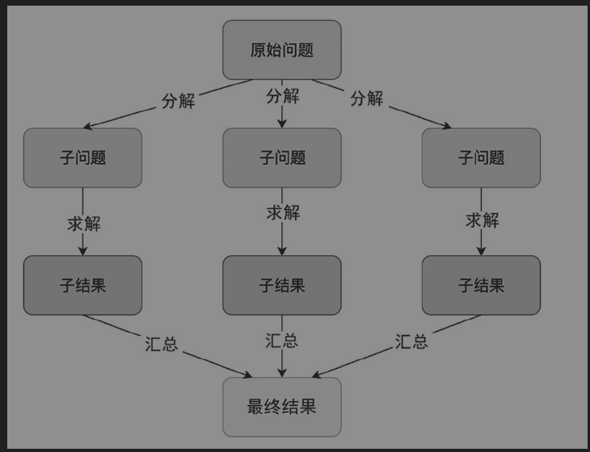

# 9.flink从入门到放弃 -大数据基础概念

文档参考：《Flink原理与实践》   https://weread.qq.com/web/reader/51032ac07236f8e05107816

## 1.什么是大数据

### 1.1  大数据的5个“V”

大数据的5个“V”大数据，顾名思义，就是拥有庞大体量的数据。关于什么是大数据、如何定义大数据、如何使用大数据等一系列问题，拥有不同领域背景的读者的理解各不相同。通常，业界将大数据的特点归纳为图1-1所示的5个“V”。

**Volume**：指数据量大。数据量单位从TB（1 024 GB）、PB（1 024 TB）、EB（1 024 PB）、ZB（1 024 EB）甚至到YB（1 024 ZB）。纽约证券交易所每天产生的交易数据大约在TB级，瑞士日内瓦附近的大型强子对撞机每年产生的数据约为PB级，而目前全球数据总量已经在ZB级，相当于1 000 000 PB。基于更大规模的数据，我们可以对某个研究对象的历史、现状和未来有更加全面的了解。

**Velocity**：指数据产生速度快。数据要求的处理速度更快和时效性更强，因为时间就是金钱。金融市场的交易数据必须以秒级的速度进行处理，搜索和推荐引擎需要以分钟级速度将实时新闻推送给用户。更快的数据处理速度可让我们基于最新的数据做出更加实时的决策。

**Variety**：指数据类型繁多。数据可以是数字、文字、图片、视频等不同的形式，数据源可能是社交网络、视频网站、可穿戴设备以及各类传感器。数据可能是Excel表格等高度结构化的数据，也可能是图片和视频等非结构化的数据。

**Veracity**：指数据真实性。一方面，数据并非天然具有高价值，一些异常值会被掺杂进来，例如，统计偏差、人的情感因素、天气因素、经济因素甚至谎报数据等导致的异常值。另一方面，数据源类型不同，如何将来自多样的数据源的多元异构数据连接、匹配、清洗和转化，最终形成具有真实性的数据是一项非常有挑战性的工作。

**Value：**指数据价值。大数据已经推动了世界的方方面面的发展，从商业、科技到医疗、教育、经济、人文等社会的各个领域，我们研究和利用大数据的最终目的是挖掘数据背后的深层价值

### 1.2 大数据分而治之

计算机诞生之后，一般是在单台计算机上处理数据。大数据时代到来后，一些传统的数据处理方法无法满足大数据的处理需求。将一组计算机组织到一起形成一个集群，利用集群的力量来处理大数据的工程实践逐渐成为主流。**这种使用集群进行计算的方式被称为分布式计算，当前几乎所有的大数据系统都在使用集群进行分布式计算。**

分布式计算的概念听起来很高深，其背后的思想却十分朴素，即分而治之，又称为分治法（Divide and Conquer）。如图1-2所示，**分治法是指将一个原始问题分解为多个子问题，多个子问题分别在多台计算机上求解，借助必要的数据交换和合并策略，将子结果汇总即可求出最终结果的方法。**具体而言，不同的分布式系统使用的算法和策略根据所要解决的问题各有不同，但基本上都是将计算拆分，把子问题放到多台计算机上，分而治之地计算求解。分布式计算的每台计算机（物理机或虚拟机）又被称为一个节点。

分布式计算已经有很多比较成熟的方案，其中比较有名的有**消息传递接口（Message Passing Interface，MPI）和映射归约模型（MapReduce）**。

#### 1.MPI

MPI是一个“老牌”分布式计算框架，从MPI这个名字也可以看出，MPI主要解决节点间数据通信的问题。在前MapReduce时代，MPI是分布式计算的业界标准。MPI现在依然广泛运用于全球各大超级计算中心、大学、研究机构中，许多物理、生物、化学、能源等基础学科的大规模分布式计算都依赖MPI。

使用MPI编程，需要使用分治法将问题分解成子问题，在不同节点上分而治之地求解。MPI提供了一个在多进程、多节点间进行数据通信的方案，因为绝大多数情况下，在中间求解和最终汇总的过程中，需要对多个节点上的数据进行交换和同步。

MPI中最重要的两个操作为数据发送和数据接收，数据发送表示将本进程中某些数据发送给其他进程，数据接收表示接收其他进程的数据。在实际的代码开发过程中，程序员需要自行设计分治算法，将复杂问题分解为子问题，手动调用MPI库，将数据发送给指定的进程。

**MPI能够以很细的粒度控制数据的通信，这是它的优势，从某些方面而言这也是它的劣势，因为细粒度的控制意味着从分治算法设计、数据通信到结果汇总都需要程序员手动控制**。有经验的程序员可以对程序进行底层优化，取得成倍的速度提升。但如果程序员对计算机分布式系统没有太多经验，编码、调试和运行MPI程序的时间成本极高，加上数据在不同节点上分布不均衡和通信延迟等问题，一个节点进程失败将会导致整个程序失败。因此，MPI对大部分程序员来说简直就是“噩梦”

并非所有的程序员都能熟练掌握MPI编程，衡量一个程序的时间成本，不仅要考虑程序运行的时间，也要考虑程序员学习、开发和调试的时间。就像C语言运算速度极快，但是Python却更受欢迎一样，MPI虽然能提供极快的分布式计算速度，但不太接地气。

#### 2.MapReduce

为了解决分布式计算学习和使用成本高的问题，研究人员开发出了更简单易用的MapReduce编程模型。MapReduce是Google于2004年推出的一种编程模型，与MPI将所有事情交给程序员控制不同，MapReduce编程模型只需要程序员定义两个操作：Map和Reduce。

比起MPI，MapReduce编程模型将更多的中间过程做了封装，程序员只需要将原始问题转化为更高层次的应用程序接口（Application Programming Interface，API），至于原始问题如何分解为更小的子问题、中间数据如何传输和交换、如何将计算扩展到多个节点等一系列细节问题可以交给大数据编程模型来解决。因此，MapReduce相对来说学习门槛更低，使用更方便，编程开发速度更快。

假设我们需要大批量地制作三明治，三明治的每种食材可以分别单独处理，Map阶段将原材料在不同的节点上分别进行处理，生成一些中间食材，Shuffle/Group阶段将不同的中间食材进行组合，Reduce阶段最终将一组中间食材组合成三明治成品。可以看到，这种**Map+Shuffle/Group+Reduce**的方式就是分治法的一种实现。

基于MapReduce编程模型，不同的团队分别实现了自己的大数据框架：Hadoop是较早的一种开源实现，如今已经成为大数据领域的业界标杆，之后又出现了Spark和Flink。这些框架提供了编程接口，辅助程序员存储、处理和分析大数据。

## 2.从批处理到流处理

### 2.1 数据与数据流

在大数据的5个“V”中我们已经提到，数据量大且产生速度快。从时间维度来讲，数据源源不断地产生，形成一个无界的数据流（Unbounded Data Stream）。如图1-5所示，**单条数据被称为事件（Event），事件按照时序排列会形成一个数据流**。例如，我们每时每刻的运动数据都会累积到手机传感器上，金融交易随时随地都在发生，物联网（Internet of Things，IoT）传感器会持续监控并生成数据。

数据流中的某段有界数据流（Bounded Data Stream）可以组成一个数据集。我们通常所说的对某份数据进行分析，指的是对某个数据集进行分析。随着数据的产生速度越来越快，数据源越来越多，人们对时效性的重视程度越来越高，如何处理数据流成了大家更为关注的问题。

### 2.2 批处理与流处理

#### 1.批处理

批处理（Batch Processing）是指对一批数据进行处理。我们身边的批处理比比皆是，最常见的批处理例子有：微信运动每天晚上有一个批处理任务，把用户好友一天所走的步数统计一遍，生成排序结果后推送给用户；银行信用卡中心每月账单日有一个批处理任务，把一个月的消费总额统计一次，生成用户月度账单；国家统计局每季度对经济数据做一次统计，公布季度国内生产总值（GDP）。可见，批处理任务一般是对一段时间的数据聚合后进行处理的。对于数据量庞大的应用，如微信运动、银行信用卡中心等情景，一段时间内积累的数据总量非常大，计算非常耗时。

#### 2.流处理

如前文所述，数据其实是以流（Stream）的方式持续不断地产生着的，流处理（Stream Processing）就是对数据流进行处理。时间就是金钱，对数据流进行分析和处理，获取实时数据价值越发重要。如“双十一电商大促销”，管理者要以秒级的响应时间查看实时销售业绩、库存信息以及与竞品的对比结果，以争取更多的决策时间；股票交易要以毫秒级的速度来对新信息做出响应；风险控制要对每一份欺诈交易迅速做出处理，以减少不必要的损失；网络运营商要以极快速度发现网络和数据中心的故障；等等。以上这些场景，一旦出现故障，造成服务的延迟，损失都难以估量。因此，响应速度越快，越能减少损失、增加收入。而IoT和5G的兴起将为数据生成提供更完美的底层技术基础，海量的数据在IoT设备上采集，并通过高速的5G通道传输到服务器，庞大的实时数据流将汹涌而至，流处理的需求肯定会爆炸式增长。

### 2.3 为什么需要一个优秀的流处理框架

处理实时流的系统通常被称为流计算框架、实时计算框架或流处理框架。下面就来解释为何需要一个可靠的流处理框架。

#### 1.股票交易的业务场景

我们都知道股票交易非常依赖各类信息，一些有可能影响股票市场价格的信息经常首发于财经网站、微博、微信等社交媒体平台上。作为人类的我们不可能24小时一直监控各类媒体，如果有一个自动化的系统来做一些分析和预警，将为决策者争取到更多时间。

假设我们有数只股票的交易数据流，我们可以**通过这个数据流来计算以10秒为一个时间窗口的股票价格波动，选出那些超过5%变化幅度的股票，并将这些股票与媒体的实时文本数据做相关分析，以判断媒体上的哪些实时信息会影响股票价格**。当相关分析的结果足够有说服力时，可以将这个系统部署到生产环境，实时处理股票与媒体数据，产生分析报表，并发送给交易人员。那么，如何构建一个可靠的程序来解决上述业务场景问题呢？

#### 2.生产者——消费者模型

处理流数据一般使用“生产者-消费者”（Producer-Consumer）模型来解决问题。如图1-6所示，生产者生成数据，将数据发送到一个缓存区域（Buffer），消费者从缓存区域中消费数据。这里我们暂且不关心生产者如何生产数据，以及数据如何缓存，我们只关心如何实现消费者。

在股票交易的场景中，我们可以启动一个进程来实现消费者，该进程以10秒为一个时间窗口，统计时间窗口内的交易情况，找到波动最大的那些股票。同时，该进程也对新流入的媒体文本进行分析。这个逻辑看起来很容易实现，但深挖之后会发现问题繁多。

### 2.4流处理框架要解决的诸多问题

（1）可扩展性

股票交易和媒体文本的数据量都非常大，仅以微博为例，平均每秒有上千条、每天有上亿条微博数据。一般情况下，单个节点无法处理这样规模的数据，这时候需要使用分布式计算。假如我们使用类似MPI的框架，需要手动设计分治算法，这对很多程序员来说有一定的挑战性。随着数据不断增多，我们能否保证我们的程序能够快速扩展到更多的节点上，以应对更多的计算需求？具体而言，当计算需求增多时，计算资源能否线性增加而不是耗费大量的资源，程序的代码逻辑能否保持简单而不会变得极其复杂？一个具有可扩展性的系统必须能够优雅地解决这些问题。

（2）数据倾斜

在分布式计算中，数据需要按照某种规则分布到各个节点上。假如数据路由规则设计得不够完善，当数据本身分布不均匀时，会发生数据倾斜，这很可能导致部分节点数据量远大于其他节点。这样的后果是：轻则负载重的节点延迟过高，重则引发整个系统的崩溃。假如一条突发新闻在网络媒体平台引发激烈的讨论和分析，数据突增，程序很可能会崩溃。数据倾斜是分布式计算中经常面临的一个问题。

（3）容错性

整个系统崩溃重启后，之前的那些计算如何恢复？或者部分节点发生故障，如何将该节点上的计算迁移到其他的节点上？我们需要一个机制来做故障恢复，以增强系统的容错性。

（4）时序错乱

**限于网络条件和其他各种潜在影响因素，流处理引擎处理某个事件的时间并不是事件本来发生的时间**。比如，你想统计上午11:00:00到11:00:10的交易情况，然而发生在11:00:05的某项交易因网络延迟没能抵达，这时候要直接放弃这项交易吗？绝大多数情况下我们会让程序等待，比如我们会假设数据最晚不会延迟超过10分钟，因此程序会等待10分钟。等待一次也还能接受，但是**如果有多个节点在并行处理呢？每个节点等待一段时间，最后做数据聚合时就要等待更长时间。**

**批处理框架一般处理一个较长时间段内的数据，数据的时序性对其影响较小。批处理框架用更长的时间来换取更好的准确性。流处理框架对时序错乱更为敏感，框架的复杂程度也因此大大增加。**

Flink是解决上述问题的最佳选择之一。如果用Flink去解决前文提到的股票建模问题，只需要设置时间窗口，并在这个时间窗口下做一些数据处理的操作，还可以根据数据量来设置由多少节点并行处理。

## 3.代表性大数据技术

MapReduce编程模型的提出为大数据分析和处理开创了一条先河，其后涌现出一批知名的开源大数据技术，本节主要对一些流行的技术和框架进行简单介绍。

### 3.1　Hadoop

2004年，Hadoop的创始人道格·卡廷（Doug Cutting）和麦克·卡法雷拉（Mike Cafarella）受MapReduce编程模型和Google File System等技术的启发，对其中提及的思想进行了编程实现，Hadoop的名字来源于道格·卡廷儿子的玩具大象。由于道格·卡廷后来加入了雅虎，并在雅虎工作期间做了大量Hadoop的研发工作，因此Hadoop也经常被认为是雅虎开源的一款大数据框架。时至今日，Hadoop不仅是整个大数据领域的先行者和领航者，更形成了一套围绕Hadoop的生态圈，Hadoop和它的生态圈是绝大多数企业首选的大数据解决方案。图1-7展示了Hadoop生态圈一些流行组件。

Hadoop生态圈的核心组件主要有如下3个。

**Hadoop MapReduce**：Hadoop版本的**MapReduce编程模型，可以处理海量数据，主要面向批处理**。

**HDFS**：HDFS（Hadoop Distributed File System）是Hadoop提供的**分布式文件系统**，有很好的扩展性和容错性，为海量数据提供存储支持。

**YARN**：YARN（Yet Another Resource Negotiator）**是Hadoop生态圈中的资源调度器**，可以管理一个Hadoop集群，并为各种类型的大数据任务分配计算资源。这三大组件中，数据存储在HDFS上，由MapReduce负责计算，YARN负责集群的资源管理。除了三大核心组件，Hadoop生态圈还有很多其他著名的组件，部分如下。

**Hive**：借助Hive，用户可以编写结构化查询语言（Structured Query Language，SQL）语句来**查询HDFS上的结构化数据**，SQL语句会被转化成MapReduce运行。

**HBase**：HDFS可以存储海量数据，但访问和查询速度比较慢，HBase可以提供给用户**毫秒级的实时查询服务**，它是一个基于HDFS的分布式数据库。HBase最初受Google Bigtable技术的启发。

**Kafka**：Kafka是一款流处理框架，主要用作**消息队列**。

**ZooKeeper**：Hadoop生态圈中很多组件使用动物来命名，形成了一个大型“动物园”，ZooKeeper是这个动物园的管理者，主要负责**分布式环境的协调**。

### 3.2　Spark

2009年，Spark诞生于加州大学伯克利分校，2013年被捐献给Apache基金会。实际上，Spark的创始团队本来是为了开发集群管理框架Apache Mesos（以下简称Mesos）的，其功能类似YARN，Mesos开发完成后，需要一个基于Mesos的产品运行在上面以验证Mesos的各种功能，于是他们接着开发了Spark。Spark有火花、鼓舞之意，创始团队希望用Spark来证明在Mesos上从零开始创造一个项目非常简单。

Spark是一款大数据处理框架，其开发初衷是改良Hadoop MapReduce的编程模型和提高运行速度，尤其是提升大数据在机器学习方向上的性能。与Hadoop相比，Spark的改进主要有如下两点。

**易用性**：MapReduce模型比MPI更友好，但仍然不够方便。因为并不是所有计算任务都可以被简单拆分成Map和Reduce，有可能为了解决一个问题，要设计多个MapReduce任务，任务之间相互依赖，整个程序非常复杂，导致代码的可读性和可维护性差。Spark提供更加方便易用的接口，提供Java、Scala、Python和R语言API，支持SQL、机器学习和图计算，覆盖了绝大多数计算场景。

**速度快**：**Hadoop的Map和Reduce的中间结果都需要存储到磁盘上，而Spark尽量将大部分计算放在内存中。加上Spark有向无环图的优化，在官方的基准测试中，Spark比Hadoop快一百倍以上。Spark的核心在于计算，主要目的在于优化Hadoop MapReduce计算部分，在计算层面提供更细致的服务**。

Spark的核心在于计算，主要目的在于优化Hadoop MapReduce计算部分，在计算层面提供更细致的服务。

Spark并不能完全取代Hadoop，实际上，从图1-7可以看出，Spark融入了Hadoop生态圈，成为其中的重要一员**。一个Spark任务很可能依赖HDFS上的数据，向YARN申请计算资源，将结果输出到HBase上**。当然，Spark也可以不用依赖这些组件，独立地完成计算。Spark生态圈如图1-8所示。

**Spark主要面向批处理需求，因其优异的性能和易用的接口，Spark已经是批处理界绝对的“王者”。Spark的子模块Spark Streaming提供了流处理的功能，它的流处理主要基于mini-batch的思想。**如图1-9所示，Spark Streaming将输入数据流切分成多个批次，每个批次使用批处理的方式进行计算。因此，Spark是一款集批处理和流处理于一体的处理框架。

### 3.3  Apache Kafka

2010年，LinkedIn开始了其内部流处理框架的开发，2011年将该框架捐献给了Apache基金会，取名Apache Kafka（以下简称Kafka）。Kafka的创始人杰·克雷普斯（Jay Kreps）觉得这个框架主要用于优化读写，应该用一个作家的名字来命名，加上他很喜欢作家卡夫卡的文学作品，觉得这个名字对一个开源项目来说很酷，因此取名Kafka。

Kafka也是一种面向大数据领域的消息队列框架。在大数据生态圈中，Hadoop的HDFS或Amazon S3提供数据存储服务，Hadoop MapReduce、Spark和Flink负责计算，Kafka常常用来连接不同的应用系统。

如图1-10所示，企业中不同的应用系统作为数据生产者会产生大量数据流，这些数据流还需要进入不同的数据消费者，Kafka起到数据集成和系统解耦的作用。系统解耦是让某个应用系统专注于一个目标，以降低整个系统的维护难度。在实践上，**一个企业经常拆分出很多不同的应用系统，系统之间需要建立数据流管道（Stream Pipeline）。假如没有Kafka的消息队列，M个生产者和N个消费者之间要建立M×N个点对点的数据流管道，Kafka就像一个中介，让数据管道的个数变为M+N，大大减小了数据流管道的复杂程度。**

**从批处理和流处理的角度来讲，数据流经Kafka后会持续不断地写入HDFS，积累一段时间后可提供给后续的批处理任务，同时数据流也可以直接流入Flink，被用于流处理。**

随着流处理的兴起，Kafka不甘心只做一个数据流管道，开始向轻量级流处理方向努力，但相比Spark和Flink这样的计算框架，Kafka的主要功能侧重在消息队列上。

### 3.4　Flink

Flink是由德国3所大学发起的学术项目，后来不断发展壮大，并于2014年年末成为Apache顶级项目之一。在德语中，“flink”表示快速、敏捷，以此来表征这款计算框架的特点。

Flink主要面向**流处理**，如果说**Spark是批处理界的“王者”**，那么**Flink就是流处理领域冉冉升起的“新星”**。流处理并不是一项全新的技术，**在Flink之前，不乏流处理引擎，比较著名的有Storm、Spark Streaming，图1-11展示了流处理框架经历的三代演进**。

2011年成熟的Apache Strom（以下简称Storm）是**第一代被广泛采用的流处理引擎**。它是**以数据流中的事件为最小单位来进行计算的**。以事件为单位的框架的优势是延迟非常低，可以提供毫秒级的延迟。流处理结果依赖事件到达的时序准确性，Storm并不能保障处理结果的一致性和准确性。**Storm只支持至少一次（At-Least-Once）和至多一次（At-Most-Once），即数据流里的事件投递只能保证至少一次或至多一次，不能保证只有一次（Exactly-Once）**。在多项基准测试中，Storm的数据吞吐量和延迟都远逊于Flink。对于很多对数据准确性要求较高的应用，Storm有一定劣势。此外，Storm不支持SQL，不支持中间状态（State）。

**2013年成熟的Spark Streaming是第二代被广泛采用的流处理框架。**1.3.2小节中提到，Spark是“一统江湖”的大数据处理框架，**Spark Streaming采用微批次（mini-batch）的思想，将数据流切分成一个个小批次，一个小批次里包含多个事件，以接近实时处理的效果。这种做法保证了“Exactly-Once”的事件投递效果**，因为假如某次计算出现故障，重新进行该次计算即可。Spark Streaming的API相比第一代流处理框架更加方便易用，与Spark批处理集成度较高，因此Spark可以给用户提供一个流处理与批处理一体的体验。**但因为Spark Streaming以批次为单位，每次计算一小批数据，比起以事件为单位的框架来说，延迟从毫秒级变为秒级**。

与前两代引擎不同，在2015年前后逐渐成熟的**Flink是一个支持在有界和无界数据流上做有状态计算的大数据处理框架。它以事件为单位，支持SQL、状态、水位线（Watermark）等特性，支持“Exactly-Once”。**比起Storm，它的吞吐量更高，延迟更低，准确性能得到保障；比起Spark Streaming，它以事件为单位，达到真正意义上的实时计算，且所需计算资源相对更少。具体而言，Flink的优点如下。

(1). 支持事件时间（Event Time）和处理时间（Processing Time）多种时间语义。**即使事件乱序到达，Event Time也能提供准确和一致的计算结果。Procerssing Time适用于对延迟敏感的应用。**

(1). Exactly-Once投递保障。

(2). 毫秒级延迟。

(3). 可以扩展到上千台节点、在阿里巴巴等大公司的生产环境中进行过验证。

(4). 易用且多样的API，包括核心的DataStream API和DataSet API以及Table API和SQL。

(5). 可以连接大数据生态圈各类组件，包括Kafka、Elasticsearch、JDBC、HDFS和Amazon S3。

(6). 可以运行在Kubernetes、YARN、Mesos和独立（Standalone）集群上。

## 4. 从Lambda到Kappa：大数据处理平台的演进

前文已经提到，**流处理框架经历了3代的更新迭代，大数据处理也随之经历了从Lambda架构到Kappa架构的演进。**本节以电商平台的数据分析为例，来解释大数据处理平台如何支持企业在线服务。电商平台会将用户在App或网页的搜索、点击和购买行为以日志的形式记录下来，用户的各类行为形成了一个实时数据流，我们称之为用户行为日志。

### 4.1 Lambda架构

当以Storm为代表的第一代流处理框架成熟后，一些互联网公司为了兼顾数据的实时性和准确性，采用图1-12所示的Lambda架构来处理数据并提供在线服务。**Lambda架构主要分为3部分：批处理层、流处理层和在线服务层。其中数据流来自Kafka这样的消息队列。**

#### 1.批处理层

**在批处理层，数据流首先会被持久化保存到批处理数据仓库中，积累一段时间后，再使用批处理引擎来进行计算。**这个积累时间可以是一小时、一天，也可以是一个月。处理结果最后导入一个可供在线应用系统查询的数据库上。批处理层中的批处理数据仓库可以是HDFS、Amazon S3或其他数据仓库，批处理引擎可以是MapReduce或Spark。

假如电商平台的数据分析部门想查看全网某天哪些商品购买次数最多，可使用批处理引擎对该天数据进行计算。像淘宝、京东这种级别的电商平台，用户行为日志数据量非常大，在这份日志上进行一个非常简单的计算都可能需要几小时。**批处理引擎一般会定时启动，对前一天或前几小时的数据进行处理，将结果输出到一个数据库中。与动辄几小时的批处理的处理时间相比，直接查询一个在线数据库中的数据只需要几毫秒**。**使用批处理生成一个预处理结果，将结果输出到在线服务层的数据库中，是很多企业仍在采用的办法**。

这里计算购买次数的例子相对比较简单，在实际的业务场景中，一般需要做更为复杂的统计分析或机器学习计算，比如构建用户画像时，根据用户年龄和性别等人口统计学信息，分析某类用户最有可能购买的是哪类商品，这类计算耗时更长。

批处理层能保证某份数据的结果的准确性，而且即使程序运行失败，直接重启即可。此外，批处理引擎一般扩展性好，即使数据量增多，也可以通过增加节点数量来横向扩展。

#### 2.流处理层

很明显，假如**整个系统只有一个批处理层，会导致用户必须等待很久才能获取计算结果，一般有几小时的延迟**。电商数据分析部门只能查看前一天的统计分析结果，无法获取当前的结果，这对实时决策来说是一个巨大的时间鸿沟，很可能导致管理者错过最佳决策时机。因此，在批处理层的基础上，**Lambda架构增加了一个流处理层，用户行为日志会实时流入流处理层，流处理引擎生成预处理结果，并导入一个数据库。分析人员可以查看前一小时或前几分钟内的数据结果，这大大增强了整个系统的实时性**。但数据流会有事件乱序等问题，使用早期的流处理引擎，只能得到一个近似准确的计算结果，相当于**牺牲了一定的准确性来换取实时性**。

早期的流处理引擎有一些缺点，由于准确性、扩展性和容错性的不足，流处理层无法直接取代批处理层，只能给用户提供一个近似结果，还不能为用户提供一个一致准确的结果。因此Lambda架构中，出现了批处理和流处理并存。

#### 3.在线服务层

**在线服务层直接面向用户的特定请求，需要将来自批处理层准确但有延迟的预处理结果和流处理层实时但不够准确的预处理结果做融合**。在融合过程中，需要不断将流处理层的实时数据覆盖批处理层的旧数据。很多数据分析工具在数据合并上下了不少功夫，如Apache Druid，它可以融合流处理与批处理结果。当然，我们也可以在应用程序中人为控制预处理结果的融合。存储预处理结果的数据库可能是关系型数据库MySQL，也可能是Key-Value键值数据库Redis或HBase。

#### 4.Lambda架构的优缺点

Lambda架构在实时性和准确性之间做了一个平衡，能够解决很多大数据处理的问题，它的**优点**如下。

（1）批处理的准确度较高，而且在数据探索阶段可以对某份数据试用不同的方法，反复对数据进行实验。

（2）另外，批处理的容错性和扩展性较强。

（3）流处理的实时性较强，可以提供一个近似准确的结果。

Lambda架构的缺点也比较明显，如下。

使用两套大数据处理引擎，如果两套大数据处理引擎的API不同，有任何逻辑上的改动，就需要在两边同步更新，维护成本高，后期迭代的时间周期长。早期流处理层的结果只是近似准确。

### 4.2 Kappa架构

Kafka的创始人杰·克雷普斯认为在很多场景下，维护一套Lambda架构的大数据处理平台耗时耗力，于是提出在某些场景下，没有必要维护一个批处理层，直接使用一个流处理层即可满足需求，即图1-13所示的Kappa架构。

Kappa架构的兴起主要有如下两个原因。

Kafka可以保存更长时间的历史数据，它不仅起到消息队列的作用，也可以存储数据，替代数据库。

Flink流处理引擎解决了事件乱序下计算结果的准确性问题。

Kappa架构相对更简单，实时性更好，所需的计算资源远小于Lambda架构，随着实时处理需求的不断增长，更多的企业开始使用Kappa架构。

Kappa架构的流行并不意味着不再需要批处理，**批处理在一些特定场景上仍然有自己的优势。比如，进行一些数据探索、机器学习实验**，需要使用批处理来反复验证不同的算法。**Kappa架构适用于一些逻辑固定的数据预处理流程，比如统计一个时间段内商品的曝光和购买次数、某些关键词的搜索次数等，这类数据处理需求已经固定，无须反复试验迭代。**

Flink以流处理见长，但也实现了批处理的API，是一个集流处理与批处理于一体的大数据处理引擎，为Kappa架构提供更可靠的数据处理性能，未来Kappa架构将在更多场景下逐渐替换Lambda架构。