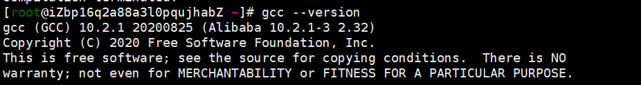

# PolarDB PostgreSQL

git源码地址：

[PolarDB-for-PostgreSQL](https://gitee.com/mirrors_alibaba/PolarDB-for-PostgreSQL)

## 什么是PolarDB PostgreSQL

PolarDB PostgreSQL（下文简称为PolarDB）是阿里云提供的一款基于PostgreSQL的开源数据库系统。PolarDB将PostgreSQL扩展为Shared-Nothing分布式数据库，支持**全局数据一致性**和**跨数据库节点事务管理，保证事务ACID，即保证事务的原子性（Atomicity）、一致性（Consistency）、隔离性（Isolation）和持久性（Durability）**。PolarDB还提供**分布式SQL处理能力**，以及基于Paxos的复制能力实现**数据冗余**和**高可用性**。PolarDB旨在为PostgreSQL在高性能、高扩展性、高可用性和极致弹性等维度增加更多功能和价值。同时，PolarDB尽可能地保留了单节点PostgreSQL数据库的SQL兼容性。

PolarDB主要通过两个方面来提升PostgreSQL数据库的功能和特性：扩展组件和PostgreSQL补丁。扩展组件包括在PostgreSQL内核之外实现的组件，如分布式事务管理、全局或分布式时间服务、分布式SQL处理、附加元数据、内部函数、以及用于管理数据库集群和进行容错或恢复的工具。PolarDB在PostgreSQL的基础上，扩展了PostgreSQL数据库的功能，使PostgreSQL数据库**易于升级**、**轻松迁移**和**快速适应**。PolarDB提供针对PostgreSQL内核所需的补丁，例如针对不同隔离级别的分布式多版本并发控制（MVCC）补丁。补丁仅涉及部分功能和代码。因此，PolarDB数据库可以轻松升级到新版本的PostgreSQL，并保持与PostgreSQL的100%兼容。


## PolarDB快速入门

您可以通过三种方法来快速试用PolarDB：阿里云服务、使用Docker镜像部署和使用源代码部署。

### 阿里云服务部署

阿里云云原生关系型数据库PolarDB PostgreSQL引擎：[官网地址](https://gitee.com/link?target=https%3A%2F%2Fwww.aliyun.com%2Fproduct%2Fpolardb)。

### 使用Docker镜像部署

本节介绍如何创建一个PolarDB-for-Postgresql镜像以及如何使用该镜像快速部署PolarDB数据库。

- 创建一个PolarDB-for-Postgresql镜像。

```
docker build -t polardb-for-postgresql -f ./docker/Dockerfile .
```

- 在10001端口上运行PolarDB-for-Postgresql镜像。

```
docker run --name polardb -p 10001:10001 -d polardb-for-postgresql:latest
```

- 在本地通过psql命令访问PolarDB-for-Postgresql镜像。

```
psql -d postgres -U postgres -h localhost -p 10001
```

- 如果您本地没有安装psql，可以使用以下命令登录到容器，再使用psql。

```
docker exec -it polardb /bin/bash
```

### 源码部署

#### 准备工作

- 下载源代码。下载地址：[https://github.com/alibaba/PolarDB-for-PostgreSQL](https://gitee.com/link?target=https%3A%2F%2Fgithub.com%2Falibaba%2FPolarDB-for-PostgreSQL)。
- 安装依赖包（以CentOS为例）。

```
sudo yum install bison flex libzstd-devel libzstd zstd cmake openssl-devel protobuf-devel readline-devel libxml2-devel libxslt-devel zlib-devel bzip2-devel lz4-devel snappy-devel python-devel
```


gcc版本



- 创建授权密钥用以快速访问数据库。

使用ssh-copy-id命令创建一个授权密钥。使用授权密钥就可以通过pgxc_ctl访问数据库，而无需每次登录都要使用数据库账号对应的密码。

```
ssh-copy-id username@IP
```

- 设置环境变量。

```
vi ~/.bashrc
export PATH="$HOME/polardb/polardbhome/bin:$PATH"
export LD_LIBRARY_PATH="$HOME/polardb/polardbhome/lib:$LD_LIBRARY_PATH"
source ~/.bashrc
```

#### 快速部署（onekey.sh）

onekey.sh脚本使用默认配置来编译PolarDB，部署二进制包，并创建一个由一个主节点和两个只读节点组成的PolarDB集群。运行此脚本前，请先根据“准备工作”章节的内容，检查环境变量、依赖包和授权密钥是否正确配置。

- 运行onekey.sh脚本

```
./onekey.sh all
```

- 检查节点（包括一个主节点和两个只读节点）的进程运行状态及其对应副本的角色和状态。

```
ps -ef|grep polardb
psql -p 10001 -d postgres -c "select * from pg_stat_replication;"
psql -p 10001 -d postgres -c "select * from polar_dma_cluster_status;"
```

#### Postgres-XC/Postgres-XL使用源代码部署

您可以使用pgxc_ctl来管理集群，如配置集群、更新集群配置、初始化集群、启动或停止节点和容灾切换。pgxc_ctl是基于Postgres-XC/Postgres-XL（PG-XC/XL）开源项目的集群管理工具。有关pgxc_ctl的使用方法详情，请参见[部署](https://gitee.com/mirrors_alibaba/PolarDB-for-PostgreSQL/blob/v2.0/doc-CN/deployment.md)。

- 创建并安装二进制包。

您可以使用build.sh脚本来创建。如果创建失败，请参考[部署](https://gitee.com/mirrors_alibaba/PolarDB-for-PostgreSQL/blob/v2.0/doc-CN/deployment.md)排查失败原因。

```
./build.sh
```

- 生成默认配置文件。

```
pgxc_ctl -c $HOME/polardb/polardb_paxos.conf prepare standalone
```

- 部署二进制文件。

```
pgxc_ctl -c $HOME/polardb/polardb_paxos.conf deploy all
```

- 清除安装包残留并初始化集群。

```
pgxc_ctl -c $HOME/polardb/polardb_paxos.conf clean all
pgxc_ctl -c $HOME/polardb/polardb_paxos.conf init all
pgxc_ctl -c $HOME/polardb/polardb_paxos.conf monitor all
```

- 安装集群管理依赖包。

```
pgxc_ctl -c $HOME/polardb/polardb_paxos.conf deploy cm
```

- 启动集群或节点。

```
pgxc_ctl -c $HOME/polardb/polardb_paxos.conf start all
```

- 停止集群或节点。

```
pgxc_ctl -c $HOME/polardb/polardb_paxos.conf stop all
```

- 切换故障节点。

以下示例展示如何在polardb_paxos.conf文件中配置datanode_1为故障切换节点。

```
pgxc_ctl -c $HOME/polardb/polardb_paxos.conf failover datanode datanode_1
```

- 检查集群健康状况。

检查集群状态。

```
pgxc_ctl -c $HOME/polardb/polardb_paxos.conf healthcheck all
```

- 其他命令示例。

```
pgxc_ctl -c $HOME/polardb/polardb_paxos.conf kill all
pgxc_ctl -c $HOME/polardb/polardb_paxos.conf log var datanodeNames
pgxc_ctl -c $HOME/polardb/polardb_paxos.conf show configuration all
```

- 检查和测试。

```
ps -ef | grep postgres
psql -p 10001 -d postgres -c "create table t1(a int primary key, b int);"
createdb test -p 10001
psql -p 10001 -d test -c "select version();"
```

具体部署指南，请参见[部署](https://gitee.com/mirrors_alibaba/PolarDB-for-PostgreSQL/blob/v2.0/doc-CN/deployment.md)。

