# PolarDB for PostgreSQL从入门到放弃

官方文档

[文档 | PolarDB for PostgreSQL (apsaradb.github.io)](https://apsaradb.github.io/PolarDB-for-PostgreSQL/zh/)

码云地址

[PolarDB-for-PostgreSQL: PolarDB是阿里云自研的云原生关系型数据库，采用的是分布式共享存储（存储与计算分离）架构 (gitee.com)](https://gitee.com/mirrors_alibaba/PolarDB-for-PostgreSQL)

##  1.什么是 PolarDB for PostgreSQL


PolarDB for PostgreSQL（下文简称为 PolarDB）是一款阿里云自主研发的云原生数据库产品，100% 兼容 PostgreSQL，采用基于 Shared-Storage 的存储计算分离架构，具有极致弹性、毫秒级延迟、HTAP 的能力。

1. 极致弹性：存储与计算能力均可独立地横向扩展。
   - 当计算能力不够时，可以单独扩展计算集群，数据无需复制。
   - 当存储容量或 I/O 不够时，可以单独扩展存储集群，而不中断业务。
2. 毫秒级延迟：
   - WAL 日志存储在共享存储上，RW 到所有 RO 之间仅复制 WAL 的元数据。
   - 独创的 *LogIndex* 技术，实现了 Lazy 回放和 Parallel 回放，理论上最大程度地缩小了 RW 和 RO 节点间的延迟。
3. HTAP 能力：基于 Shared-Storage 的分布式并行执行框架，加速在 OLTP 场景下的 OLAP 查询。一套 OLTP 型的数据，可支持 2 套计算引擎：
   - 单机执行引擎：处理高并发的 TP 型负载。
   - 分布式执行引擎：处理大查询的 AP 型负载。

PolarDB 还支持时空、GIS、图像、向量、搜索、图谱等多模创新特性，应对企业对数据处理日新月异的需求。

## 2.分支说明

`POLARDB_11_STABLE` 为稳定分支，持存储计算分离的云原生形态。 `distribute` 分支支持分布式形态。

## 3.产品架构

PolarDB 采用了基于 Shared-Storage 的存储计算分离架构。数据库由传统的 Share-Nothing 架构，转变成了 Shared-Storage 架构。由原来的 N 份计算 + N 份存储，转变成了 N 份计算 + 1 份存储。

虽然共享存储上数据是一份，但是**数据在各节点内存中的状态是不同的**，需要通过**内存状态的同步来维护数据的一致性**；同时主节点在刷脏时也需要做协调，避免只读节点读取到超前的 **“未来页面”**，也要避免只读节点读取到过时的没有在内存中被正确回放的 **“过去页面”**。为了解决该问题，PolarDB **创造性地设计了 *LogIndex* 数据结构来维护页面的回放历史，该结构能够实现主节点与只读节点之间的同步**。

在存储计算分离后，I/O 单路延迟变大的同时，I/O 的吞吐也变大了。在处理分析型查询时，仅使用单个只读节点无法发挥出存储侧的大 I/O 带宽优势，也无法利用其他只读节点的 CPU、内存和 I/O 资源。为了解决该问题，PolarDB 研发了基于 Shared-Storage 的并行执行引擎，能够在 SQL 级别上弹性利用任意数目的 CPU 来加速分析查询，支持 HTAP 的混合负载场景。

详情请查阅 [产品架构](https://gitee.com/link?target=https%3A%2F%2Fapsaradb.github.io%2FPolarDB-for-PostgreSQL%2Fzh%2Ftheory%2Farch-overview.html)。


**PolarDB for PostgreSQL 采用了基于 Shared-Storage 的存储计算分离架构。数据库由传统的 Share-Nothing 架构，转变成了 Shared-Storage 架构——由原来的 N 份计算 + N 份存储，转变成了 N 份计算 + 1 份存储；**而 PostgreSQL 使用了传统的单体数据库架构，存储和计算耦合在一起。

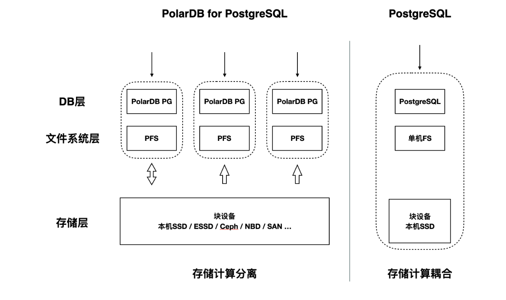

为保证所有计算节点能够以相同的可见性视角访问分布式块存储设备，**PolarDB 需要使用分布式文件系统 [PolarDB File System（PFS）open in new window](https://github.com/ApsaraDB/PolarDB-FileSystem) 来访问块设备**，其实现原理可参考发表在 2018 年 VLDB 上的论文[[1\]](https://apsaradb.github.io/PolarDB-for-PostgreSQL/zh/deploying/introduction.html#fn1)；如果所有计算节点都可以本地访问同一个块存储设备，那么也可以不使用 PFS，直接使用本地的单机文件系统（如 ext4）。这是与 PostgreSQL 的不同点之一。

------

1. [PolarFS: an ultra-low latency and failure resilient distributed file system for shared storage cloud databaseopen in new window](https://www.vldb.org/pvldb/vol11/p1849-cao.pdf) [↩︎](https://apsaradb.github.io/PolarDB-for-PostgreSQL/zh/deploying/introduction.html#fnref1)


## 4.docker环境准备

#### 1.安装docker依赖

yum install -y yum-utils device-mapper-persistent-data lvm2

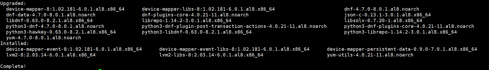

#### 2.执行如下命令，添加Docker CE的软件源信息。

yum-config-manager --add-repo http://mirrors.aliyun.com/docker-ce/linux/centos/docker-ce.repo

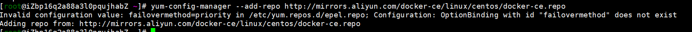

#### 3.执行如下命令，安装Docker CE

yum makecache fast

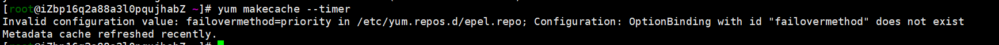

yum -y install docker-ce

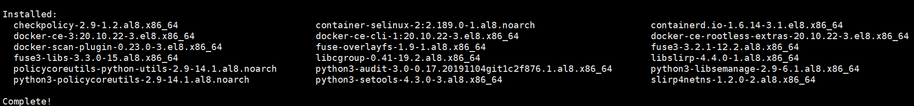

#### 4.查看版本

docker --version


#### 5.执行如下命令，启动Docker服务

systemctl start docker


#### 6.docker配置私有阿里镜像仓库--收费的（暂未用到）

参考文档：[Linux安装Docker并配置Docker镜像加速，daemon.json完整配置详解_共饮一杯无的博客-CSDN博客_daemon.json配置](https://blog.csdn.net/qq_35427589/article/details/124822628)

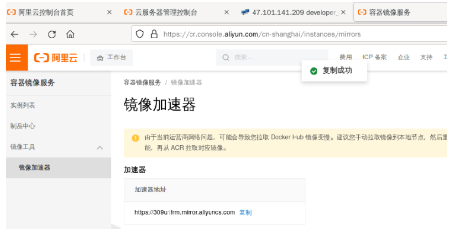

配置镜像地址

`tee /etc/docker/daemon.json <<-'EOF' {  "registry-mirrors": ["https://309u****.mirror.aliyuncs.com"]`

`} EOF`

`查看地址`

`cat /etc/docker/daemon.json` 

`{`

 `"registry-mirrors": ["[https://309u****.mirror.aliyuncs.com](https://309u1frm.mirror.aliyuncs.com)"]`

`}`

#### 7.重新加载服务配置文件

systemctl daemon-reload

#### 8.重启Docker服务。

systemctl restart docker

查看Docker镜像仓库中Nginx的可用版本。

## 5.DockerHub拉取实例镜像快速入门

如果您已安装 Docker，那么可以从 DockerHub 上拉取 PolarDB for PostgreSQL 的 本地存储实例镜像，创建、运行并进入容器，然后直接使用 PolarDB 实例：

#### 单节点

```shell
# 拉取单节点 PolarDB 镜像
docker pull polardb/polardb_pg_local_instance:single
# 查看镜像
[root@iZbp16q2a88a3l0pqujhabZ ~]# docker images
REPOSITORY                          TAG       IMAGE ID       CREATED       SIZE
polardb/polardb_pg_local_instance   single    2f02ef59a596   2 weeks ago   2.13GB

# 创建运行并进入容器
docker run -it --cap-add=SYS_PTRACE --privileged=true --name polardb_pg_single polardb/polardb_pg_local_instance:single bash

# 测试实例可用性--启动后直接在容器内部
[postgres@4f5f76377b6d ~]$psql -h 127.0.0.1 -c 'select version();'
            version
--------------------------------
 PostgreSQL 11.9 (POLARDB 11.9)
(1 row)

[postgres@4f5f76377b6d ~]$ ll
total 24
drwx------ 1 postgres postgres 4096 Dec 23 15:06 tmp_basedir_polardb_pg_1100_bld
drwx------ 1 postgres postgres 4096 Dec 23 15:06 tmp_datadir_polardb_pg_1100_bld
drwx------ 1 postgres postgres 4096 Jan  9 15:12 tmp_master_dir_polardb_pg_1100_bld
[postgres@4f5f76377b6d ~]$ exit
exit

#退出容器重启
[root@iZbp16q2a88a3l0pqujhabZ ~]# docker start 4f5f 
[root@iZbp16q2a88a3l0pqujhabZ ~]# docker exec -it 4f5f /bin/bash
# 查看容器状态
[root@iZbp16q2a88a3l0pqujhabZ ~]# docker ps
CONTAINER ID   IMAGE                                      COMMAND                  CREATED         STATUS         PORTS     NAMES
4f5f76377b6d   polardb/polardb_pg_local_instance:single   "/bin/sh -c '~/tmp_b…"   5 minutes ago   Up 4 seconds             polardb_pg_single

#容器内部操作
[postgres@4f5f76377b6d ~]$ which psql
~/tmp_basedir_polardb_pg_1100_bld/bin/psql
[postgres@4f5f76377b6d ~]$ ll
total 24
drwx------ 1 postgres postgres 4096 Dec 23 15:06 tmp_basedir_polardb_pg_1100_bld
drwx------ 1 postgres postgres 4096 Dec 23 15:06 tmp_datadir_polardb_pg_1100_bld
drwx------ 1 postgres postgres 4096 Jan  9 15:12 tmp_master_dir_polardb_pg_1100_bld

# 查看目录结构，和postgre类似
[postgres@4f5f76377b6d tmp_basedir_polardb_pg_1100_bld]$ ls
bin  include  lib  share
[postgres@4f5f76377b6d tmp_basedir_polardb_pg_1100_bld]$ cd bin 
[postgres@4f5f76377b6d bin]$ ls
clusterdb     ecpg               pg_config       pg_receivewal   pg_test_fsync        polar-initdb.sh          reindexdb
createdb      initdb             pg_controldata  pg_recvlogical  pg_test_timing       polar-replica-initdb.sh  vacuumdb
createuser    oid2name           pg_ctl          pg_resetwal     pg_upgrade           polar_tools              vacuumlo
dbatools.sql  pg_archivecleanup  pg_dump         pg_restore      pg_verify_checksums  postgres
dropdb        pg_basebackup      pg_dumpall      pg_rewind       pg_waldump           postmaster
dropuser      pgbench            pg_isready      pg_standby      polar_basebackup     psql

# 查看pg进程
[postgres@4f5f76377b6d bin]$ ps -ef|grep postgres
postgres       1       0  0 15:12 pts/0    00:00:00 /bin/sh -c ~/tmp_basedir_polardb_pg_1100_bld/bin/pg_ctl -D ~/tmp_master_dir_polardb_pg_1100_bld start &&     bash bash
postgres       9       1  0 15:12 pts/0    00:00:00 /home/postgres/tmp_basedir_polardb_pg_1100_bld/bin/postgres -D /home/postgres/tmp_master_dir_polardb_pg_1100_bld
postgres      10       9  0 15:12 ?        00:00:00 postgres(5432): logger  0
postgres      11       9  0 15:12 ?        00:00:00 postgres(5432): logger  1
postgres      12       9  0 15:12 ?        00:00:00 postgres(5432): logger  2
postgres      13       9  0 15:12 ?        00:00:00 postgres(5432): background flashback log inserter  
postgres      14       9  0 15:12 ?        00:00:00 postgres(5432): background flashback log writer  
postgres      16       9  0 15:12 ?        00:00:00 postgres(5432): polar worker process  
postgres      17       9  0 15:12 ?        00:00:00 postgres(5432): polar wal pipeliner  
postgres      19       9  0 15:12 ?        00:00:00 postgres(5432): checkpointer  
postgres      20       9  0 15:12 ?        00:00:00 postgres(5432): background writer  
postgres      21       9  0 15:12 ?        00:00:00 postgres(5432): walwriter  
postgres      22       9  0 15:12 ?        00:00:01 postgres(5432): background logindex writer  
postgres      23       9  0 15:12 ?        00:00:00 postgres(5432): autovacuum launcher  
postgres      24       9  0 15:12 ?        00:00:00 postgres(5432): stats collector  
postgres      25       9  0 15:12 ?        00:00:00 postgres(5432): logical replication launcher  
postgres      26       9  0 15:12 ?        00:00:00 postgres(5432): polar parallel bgwriter  
postgres      27       9  0 15:12 ?        00:00:00 postgres(5432): polar parallel bgwriter  
postgres      28       9  0 15:12 ?        00:00:00 postgres(5432): polar parallel bgwriter  
postgres      29       9  0 15:12 ?        00:00:00 postgres(5432): polar parallel bgwriter  
postgres      30       9  0 15:12 ?        00:00:00 postgres(5432): polar parallel bgwriter  
postgres      31       1  0 15:12 pts/0    00:00:00 bash
postgres      75       0  0 15:15 pts/1    00:00:00 /bin/bash
postgres     109      75  0 15:20 pts/1    00:00:00 ps -ef
postgres     110      75  0 15:20 pts/1    00:00:00 grep --color=auto postgres

# 停止容器查看状态
[root@iZbp16q2a88a3l0pqujhabZ ~]# docker ps -a
CONTAINER ID   IMAGE                                      COMMAND                  CREATED          STATUS                       PORTS     NAMES
4f5f76377b6d   polardb/polardb_pg_local_instance:single   "/bin/sh -c '~/tmp_b…"   14 minutes ago   Exited (137) 5 seconds ago             polardb_pg_single


```

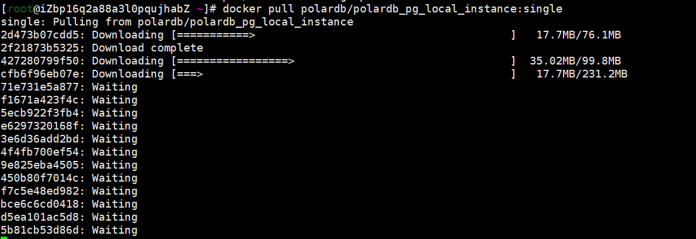

下载完成

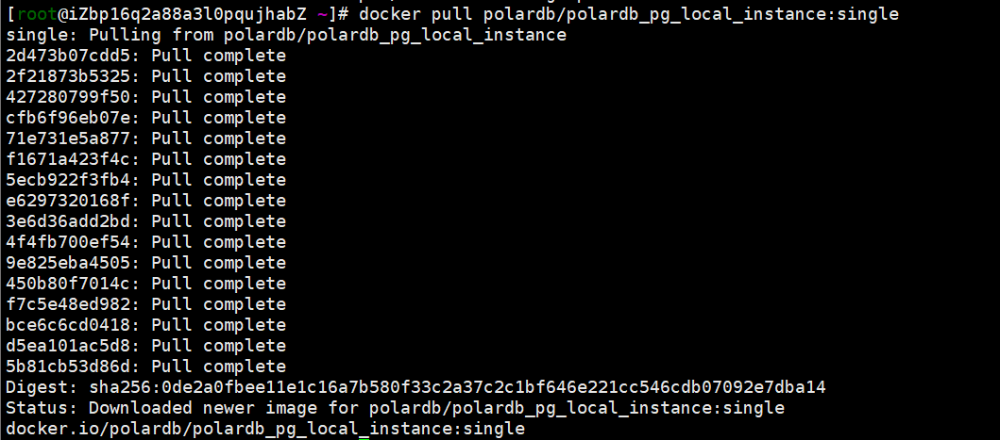

查看

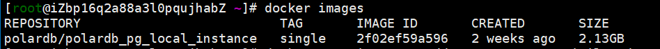

启动容器，启动完之后直接进入到容器内部

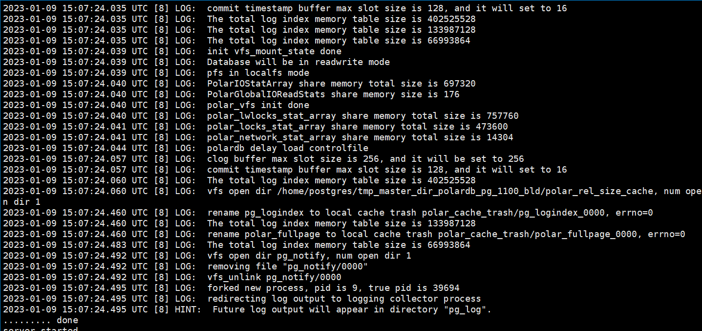

测试实例可用性

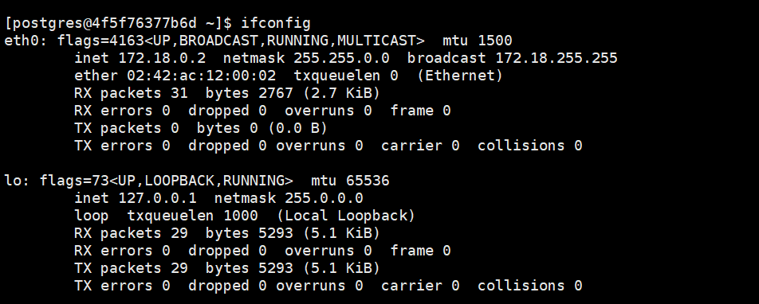

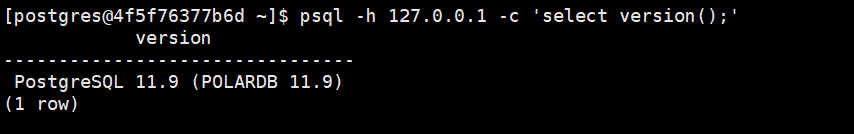

 查看容器状态

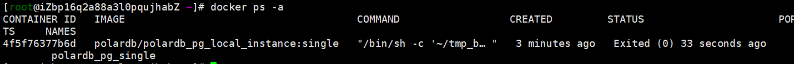

退出重启

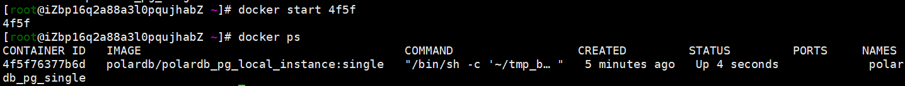

重新进入容器

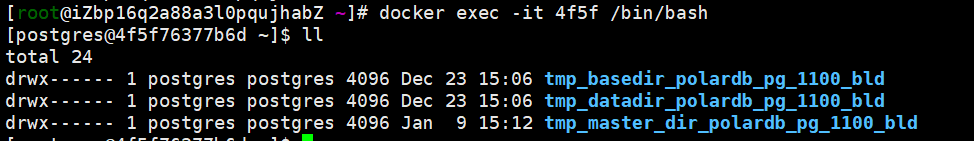

查看目录结构

tmp_basedir_polardb_pg_1100_bld  polardb_pg安装目录：包含pg bin命令，lib库，share目录，include目录

tmp_datadir_polardb_pg_1100_bld 实例数据目录 base具体数据目录

tmp_master_dir_polardb_pg_1100_bld   实例操作命令，pg实例配置文件，pid进程文件等等 

（个人理解是原生pg实例目录；计算和数据存储目录做了分离）

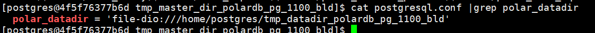


查看进程

/bin/sh -c ~/tmp_basedir_polardb_pg_1100_bld/bin/pg_ctl -D ~/tmp_master_dir_polardb_pg_1100_bld start

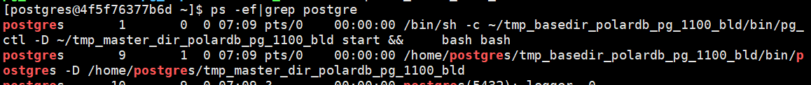


#### 多实例

```bash
# 拉取多节点 PolarDB 镜像
docker pull polardb/polardb_pg_local_instance:withrep
# 创建运行并进入容器
docker run -it --cap-add=SYS_PTRACE --privileged=true --name polardb_pg_withrep polardb/polardb_pg_local_instance:withrep bash
# 测试实例可用性
psql -h 127.0.0.1 -c 'select version();'
            version
--------------------------------
 PostgreSQL 11.9 (POLARDB 11.9)
(1 row)

#退出 停止容器,查看状态
[postgres@0852dbf78886 ~]$ exit
exit

[root@iZbp16q2a88a3l0pqujhabZ /]# docker stop 0852
0852
[root@iZbp16q2a88a3l0pqujhabZ /]# docker ps -a
CONTAINER ID   IMAGE                                       COMMAND                  CREATED             STATUS                           PORTS     NAMES
0852dbf78886   polardb/polardb_pg_local_instance:withrep   "/bin/sh -c '~/tmp_b…"   About an hour ago   Exited (127) 20 seconds ago                polardb_pg_withrep
4f5f76377b6d   polardb/polardb_pg_local_instance:single    "/bin/sh -c '~/tmp_b…"   18 hours ago        Exited (137) About an hour ago             polardb_pg_single

#重启和进入容器
[root@iZbp16q2a88a3l0pqujhabZ ~]# docker start 0852 
[root@iZbp16q2a88a3l0pqujhabZ ~]# docker exec -it 0852 /bin/bash


```

下载并查看镜像

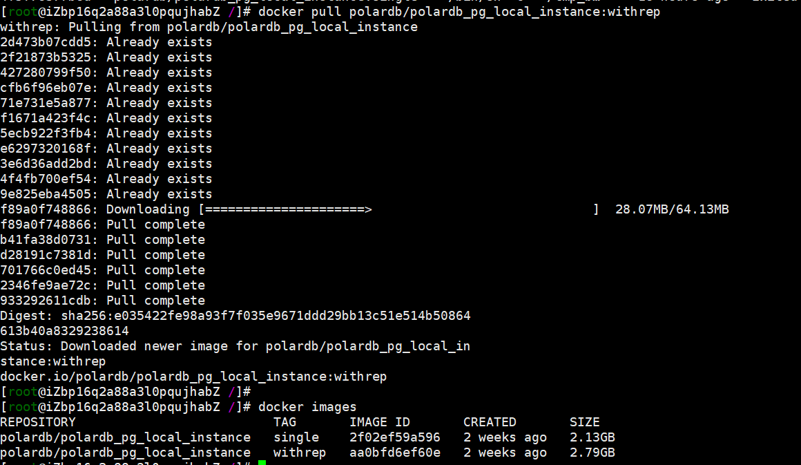

创建运行并进入容器

实例1  /home/postgres/tmp_master_dir_polardb_pg_1100_bld 5432端口

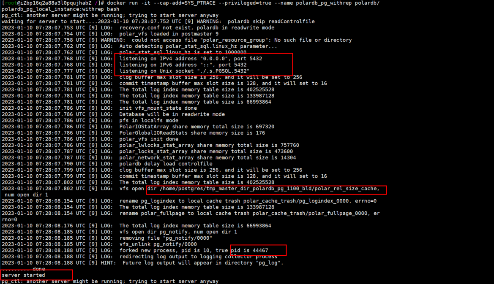

实例2  /home/postgres/tmp_replica_dir_polardb_pg_1100_bld 5433端口

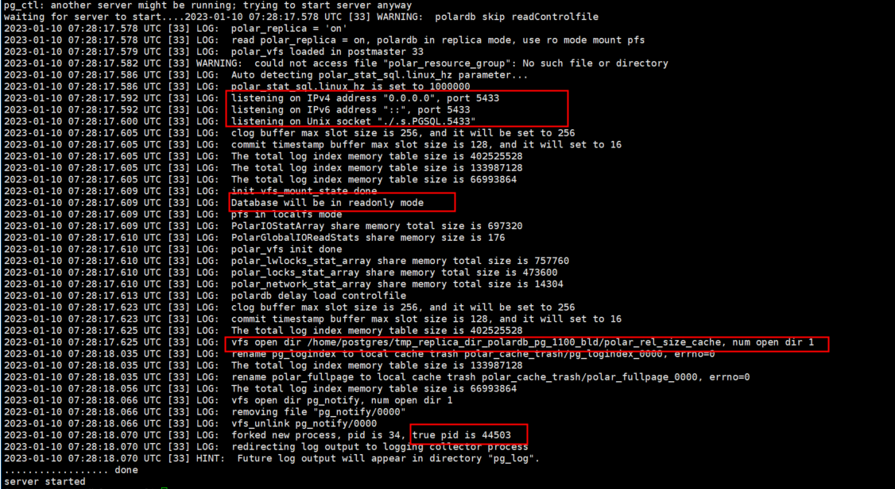

查看节点信息

```shell
#主节点
[postgres@0852dbf78886 ~]$ psql -p 5432
psql (11.9)
Type "help" for help.

postgres=# \dx
                 List of installed extensions
  Name   | Version |   Schema   |         Description          
---------+---------+------------+------------------------------
 plpgsql | 1.0     | pg_catalog | PL/pgSQL procedural language
(1 row)

postgres=# select pid,usename, application_name from pg_stat_replication ;
 pid | usename  | application_name 
-----+----------+------------------
  45 | postgres | replica1
(1 row)

postgres=# select * from pg_replication_slots ;
 slot_name | plugin | slot_type | datoid | database | temporary | active | active_pid | xmin | catalog_xmin | restart_lsn | confirmed_flush_lsn 
-----------+--------+-----------+--------+----------+-----------+--------+------------+------+--------------+-------------+---------------------
 replica1  |        | physical  |        |          | f         | t      |         45 |      |              | 0/179E518   | 
(1 row)

#备节点
[postgres@0852dbf78886 ~]$ psql -p 5433
psql (11.9)
Type "help" for help.

postgres=# select * from pg_replication_slots ;
 slot_name | plugin | slot_type | datoid | database | temporary | active | active_pid | xmin | catalog_xmin | restart_lsn | confirmed_flush_lsn 
-----------+--------+-----------+--------+----------+-----------+--------+------------+------+--------------+-------------+---------------------
(0 rows)

postgres=# select pid,usename, application_name from pg_stat_replication ;
 pid | usename | application_name 
-----+---------+------------------
(0 rows)

postgres=# select pid,status,receive_start_lsn from pg_stat_wal_receiver;
 pid |  status   | receive_start_lsn 
-----+-----------+-------------------
  44 | streaming | 0/179E5C0
(1 row)

```

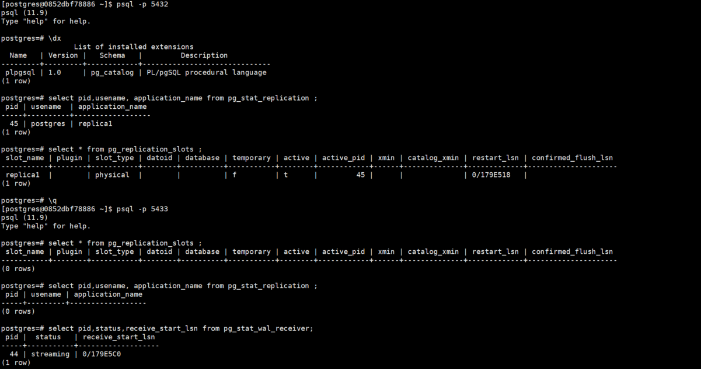

 pg_controldata 查看

```shell
[postgres@0852dbf78886 ~]$ pg_controldata tmp_master_dir_polardb_pg_1100_bld | grep cluster
Database cluster state:               shut down

[postgres@0852dbf78886 ~]$ pg_controldata tmp_replica_dir_polardb_pg_1100_bld/ | grep cluster
Database cluster state:               in archive recovery
```

查看进程

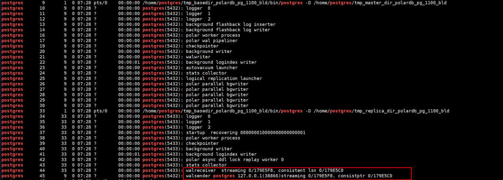

数据测试： 主节点创建test库，备节点同步

```shell
#主节点创建test库，备节点同步
[postgres@0852dbf78886 ~]$ psql -p 5432
psql (11.9)
Type "help" for help.

postgres=# create database test;
CREATE DATABASE


postgres=# \l
                                    List of databases
     Name      |  Owner   | Encoding |   Collate   |    Ctype    |   Access privileges   
---------------+----------+----------+-------------+-------------+-----------------------
 polardb_admin | postgres | UTF8     | en_US.UTF-8 | en_US.UTF-8 | =T/postgres          +
               |          |          |             |             | postgres=CTc/postgres
 postgres      | postgres | UTF8     | en_US.UTF-8 | en_US.UTF-8 | 
 template0     | postgres | UTF8     | en_US.UTF-8 | en_US.UTF-8 | =c/postgres          +
               |          |          |             |             | postgres=CTc/postgres
 template1     | postgres | UTF8     | en_US.UTF-8 | en_US.UTF-8 | =c/postgres          +
               |          |          |             |             | postgres=CTc/postgres
 test          | postgres | UTF8     | en_US.UTF-8 | en_US.UTF-8 | 
(5 rows)

postgres=# \q

#查看备节点
[postgres@0852dbf78886 ~]$ psql -p 5433
psql (11.9)
Type "help" for help.

postgres=# \l
                                    List of databases
     Name      |  Owner   | Encoding |   Collate   |    Ctype    |   Access privileges   
---------------+----------+----------+-------------+-------------+-----------------------
 polardb_admin | postgres | UTF8     | en_US.UTF-8 | en_US.UTF-8 | =T/postgres          +
               |          |          |             |             | postgres=CTc/postgres
 postgres      | postgres | UTF8     | en_US.UTF-8 | en_US.UTF-8 | 
 template0     | postgres | UTF8     | en_US.UTF-8 | en_US.UTF-8 | =c/postgres          +
               |          |          |             |             | postgres=CTc/postgres
 template1     | postgres | UTF8     | en_US.UTF-8 | en_US.UTF-8 | =c/postgres          +
               |          |          |             |             | postgres=CTc/postgres
 test          | postgres | UTF8     | en_US.UTF-8 | en_US.UTF-8 | 
(5 rows)

postgres=# \q


```

查看主节点 postgresql.conf配置文件：  备节点实例名称叫 replica1 

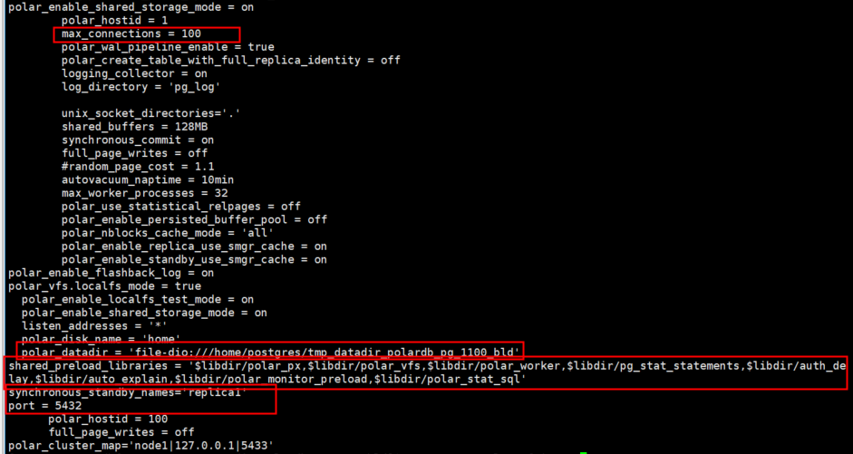

主节点查看备节点信息

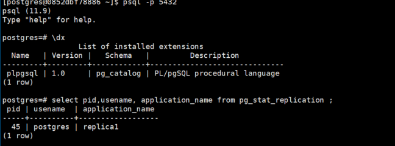

主节点查看归档配置，默认未开启

```
[postgres@0852dbf78886 tmp_master_dir_polardb_pg_1100_bld]$ cat postgresql.conf |grep archive_mode
#archive_mode = off		# enables archiving; off, on, or always
[postgres@0852dbf78886 tmp_master_dir_polardb_pg_1100_bld]$ cat postgresql.conf |grep archive_command
#archive_command = ''	
```


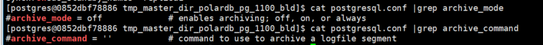


主机点查看主备配置

```shell
[postgres@0852dbf78886 tmp_master_dir_polardb_pg_1100_bld]$ cat postgresql.conf |grep synchronous_commit
#synchronous_commit = on		# synchronization level;
        synchronous_commit = on
[postgres@0852dbf78886 tmp_master_dir_polardb_pg_1100_bld]$ cat postgresql.conf |grep synchronous_standby_names
#synchronous_standby_names = ''	# standby servers that provide sync rep
synchronous_standby_names='replica1'
```

> pg主从有5种模式，由synchronous_commit 参数控制。synchronous_commit 参数的本质就是控制主库什么时候提交。
> remote_apply：所有备库上均已应用完WAL时，主库提交。所以这个模式是同步模式，主从是一致的，主库上能查到的数据备库上一定也可以查到，这种模式下主备没有延时，但对主库提交时间有影响，因为主库commit需要等待网络传输和备库应用时间
> synchronous_commit的含义分2种情况，有从库和无从库时（synchronous_standby_name空或非空时）
>
> 当synchronous_standby_name为非空时：
> remote_apply:从库已应用了wal，主库才可以提交。这种模式主从是同步的
> on：default。主从的wal都写到磁盘上时，主库提交。类似半同步，不会丢数据。
> remote_write：备库接收到wal并将wal日志写到文件系统cache上时，主库提交。此时从库的接收到wal但是还没有落盘，如果操作系统crash，会丢失数据。
> local：主库wal刷到磁盘时提交。这种模式是异步的，主库不需要确认备库状态就可以提交。
> off：本机wal没有刷到磁盘就可以提交，存在数据丢失风险，不推荐。
>
> 当synchronous_standby_name为空时：
> （当synchronous_standby_name为空时，synchronous_commit只有on和off有效，如果是remote_apply, remote_write and local ，那么仍然被认为是on）
> on：default。数据库wal写到磁盘上，事务才可以提交
> off：本机wal没有刷到磁盘就可以提交，存在数据丢失风险，不推荐。

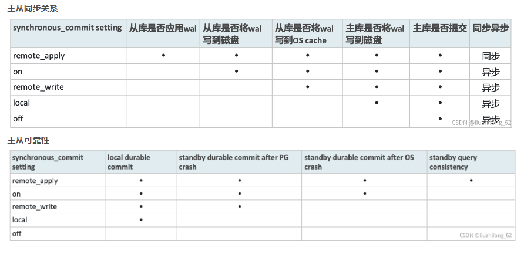

查看pg_hba.conf查看角色权限控制 ；trust 信任免密，无需输密码

```shell
cat pg_hba.conf 
```


备节点查看上述配置

```shell
[postgres@0852dbf78886 ~]$ cd tmp_replica_dir_polardb_pg_1100_bld/
[postgres@0852dbf78886 tmp_replica_dir_polardb_pg_1100_bld]$ ls
base              pg_dynshmem    pg_logindex   pg_snapshots  pg_twophase        polar_fullpage          postgresql.auto.conf
current_logfiles  pg_hba.conf    pg_multixact  pg_stat       PG_VERSION         polar_node_static.conf  postgresql.conf
global            pg_ident.conf  pg_notify     pg_stat_tmp   pg_xact            polar_rel_size_cache    postmaster.opts
pg_commit_ts      pg_log         pg_replslot   pg_subtrans   polar_cache_trash  polar_replica_booted    postmaster.pid
pg_csnlog         pg_logical     pg_serial     pg_tblspc     polar_dma.conf     polar_shmem_stat_file   recovery.conf
[postgres@0852dbf78886 tmp_replica_dir_polardb_pg_1100_bld]$ cat recovery.conf 
primary_conninfo = 'host=localhost port=5432 user=postgres dbname=postgres application_name=replica1'
polar_replica = on
recovery_target_timeline = 'latest'
primary_slot_name = 'replica1'
primary_conninfo = 'host=localhost port=5432 user=postgres dbname=postgres application_name=replica1'
primary_slot_name = 'replica1'
[postgres@0852dbf78886 tmp_replica_dir_polardb_pg_1100_bld]$ cat postgresql.conf |grep synchronous_standby_names
#synchronous_standby_names = ''	# standby servers that provide sync rep
[postgres@0852dbf78886 tmp_replica_dir_polardb_pg_1100_bld]$ cat postgresql.conf |grep synchronous_commit
#synchronous_commit = on		# synchronization level;
        synchronous_commit = on
[postgres@0852dbf78886 tmp_replica_dir_polardb_pg_1100_bld]$ cat postgresql.conf |grep archive_mode
#archive_mode = off		# enables archiving; off, on, or always
[postgres@0852dbf78886 tmp_replica_dir_polardb_pg_1100_bld]$ cat postgresql.conf |grep archive_command
#archive_command = ''		# command to use to archive a logfile segment

```

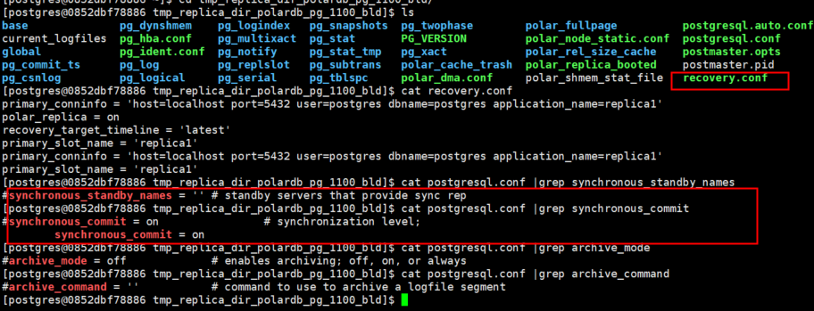

#### HTAP实例

```bash
# 拉取 HTAP PolarDB 镜像
docker pull polardb/polardb_pg_local_instance:htap
# 创建运行并进入容器
docker run -it --cap-add=SYS_PTRACE --privileged=true --name polardb_pg_htap polardb/polardb_pg_local_instance:htap bash
# 测试实例可用性
psql -h 127.0.0.1 -c 'select version();'
            version
--------------------------------
 PostgreSQL 11.9 (POLARDB 11.9)
(1 row)
```

## 6.进阶部署

部署 PolarDB for PostgreSQL 需要在以下三个层面上做准备：

1. **块存储设备层**：用于提供存储介质。可以是单个物理块存储设备（本地存储），也可以是多个物理块设备构成的分布式块存储。
2. **文件系统层**：由于 PostgreSQL 将数据存储在文件中，因此需要在块存储设备上架设文件系统。根据底层块存储设备的不同，可以选用单机文件系统（如 ext4）或分布式文件系统 [PolarDB File System（PFS）open in new window](https://github.com/ApsaraDB/PolarDB-FileSystem)。
3. **数据库层**：PolarDB for PostgreSQL 的编译和部署环境。

以下表格给出了三个层次排列组合出的的不同实践方式，其中的步骤包含：

- 存储层：块存储设备的准备
- 文件系统：PolarDB File System 的编译、挂载
- 数据库层：PolarDB for PostgreSQL 各集群形态的编译部署

我们强烈推荐使用发布在 DockerHub 上的 [PolarDB 开发镜像open in new window](https://hub.docker.com/r/polardb/polardb_pg_devel/tags) 来完成实践！开发镜像中已经包含了文件系统层和数据库层所需要安装的所有依赖，无需手动安装。

|                                                              | 块存储                                                       | 文件系统                                                     |
| ------------------------------------------------------------ | ------------------------------------------------------------ | ------------------------------------------------------------ |
| [实践 1（极简本地部署/开发）](https://apsaradb.github.io/PolarDB-for-PostgreSQL/zh/deploying/db-localfs.html) | 本地 SSD                                                     | 本地文件系统（如 ext4）                                      |
| [实践 2（生产环境最佳实践）](https://apsaradb.github.io/PolarDB-for-PostgreSQL/zh/deploying/storage-aliyun-essd.html) [视频](https://developer.aliyun.com/live/249628) | 阿里云 ECS + ESSD 云盘                                       | PFS                                                          |
| [实践 3（生产环境最佳实践）](https://apsaradb.github.io/PolarDB-for-PostgreSQL/zh/deploying/storage-curvebs.html) [视频](https://developer.aliyun.com/live/250218) | [CurveBSopen in new window](https://opencurve.io/Curve/HOME) 共享存储 | [PFS for Curveopen in new window](https://github.com/opencurve/PolarDB-FileSystem) |
| [实践 4](https://apsaradb.github.io/PolarDB-for-PostgreSQL/zh/deploying/storage-ceph.html) | Ceph 共享存储                                                | PFS                                                          |
| [实践 5](https://apsaradb.github.io/PolarDB-for-PostgreSQL/zh/deploying/storage-nbd.html) | NBD 共享存储                                                 | PFS                                                          |

### 实践1：编译部署：基于单机文件系统

本文将指导您在单机文件系统（如 ext4）上编译部署 PolarDB，适用于所有计算节点都可以访问相同本地磁盘存储的场景。

我们在 DockerHub 上提供了一个 [PolarDB 开发镜像open in new window](https://hub.docker.com/r/polardb/polardb_pg_devel/tags)，里面已经包含编译运行 PolarDB for PostgreSQL 所需要的所有依赖。您可以直接使用这个开发镜像进行实例搭建。镜像目前支持 AMD64 和 ARM64 两种 CPU 架构。

#### 环境准备

拉取开发镜像，创建并进入容器：

```bash
docker pull polardb/polardb_pg_devel
docker run -it \
    --cap-add=SYS_PTRACE --privileged=true \
    --name polardb_pg \
    polardb/polardb_pg_devel bash
```

进入容器后，从 [GitHubopen in new window](https://github.com/ApsaraDB/PolarDB-for-PostgreSQL) 上下载 PolarDB for PostgreSQL 的源代码，稳定分支为 `POLARDB_11_STABLE`。

如果因网络原因不能稳定访问 GitHub，则可以访问 [Gitee 国内镜像open in new window](https://gitee.com/mirrors/PolarDB-for-PostgreSQL)。

- GitHub

```bash
git clone -b POLARDB_11_STABLE https://github.com/ApsaraDB/PolarDB-for-PostgreSQL.git
```

- Gitee 国内镜像

```bash
git clone -b POLARDB_11_STABLE https://gitee.com/mirrors/PolarDB-for-PostgreSQL
```

代码克隆完毕后，进入源码目录：

```bash
cd PolarDB-for-PostgreSQL/
```

#### 编译测试选项说明

以下表格列出了编译、初始化或测试 PolarDB 集群所可能使用到的选项及说明。更多选项及其说明详见源码目录下的 `polardb_build.sh` 脚本。

| 选项                     | 描述                                                         | 默认值 |
| ------------------------ | ------------------------------------------------------------ | ------ |
| `--withrep`              | 是否初始化只读节点                                           | `NO`   |
| `--repnum`               | 只读节点数量                                                 | `1`    |
| `--withstandby`          | 是否初始化热备份节点                                         | `NO`   |
| `--initpx`               | 是否初始化为 HTAP 集群（1 个读写节点，2 个只读节点）         | `NO`   |
| `--with-pfsd`            | 是否编译 PolarDB File System（PFS）相关功能                  | `NO`   |
| `--with-tde`             | 是否初始化 [透明数据加密（TDE）open in new window](https://zhuanlan.zhihu.com/p/84829027) 功能 | `NO`   |
| `--with-dma`             | 是否初始化为 DMA（Data Max Availability）高可用三节点集群    | `NO`   |
| `-r`/ `-t` / `--regress` | 在编译安装完毕后运行内核回归测试                             | `NO`   |
| `-r-px`                  | 运行 HTAP 实例的回归测试                                     | `NO`   |
| `-e` / `--extension`     | 运行扩展插件测试                                             | `NO`   |
| `-r-external`            | 测试 `external/` 下的扩展插件                                | `NO`   |
| `-r-contrib`             | 测试 `contrib/` 下的扩展插件                                 | `NO`   |
| `-r-pl`                  | 测试 `src/pl/` 下的扩展插件                                  | `NO`   |

如无定制的需求，则可以按照下面给出的选项编译部署不同形态的 PolarDB 集群并进行测试。

#### PolarDB 各形态编译部署

##### 本地单节点实例

- 1 个读写节点（运行于 `5432` 端口）

```bash
./polardb_build.sh
```

##### 本地多节点实例

- 1 个读写节点（运行于 `5432` 端口）
- 1 个只读节点（运行于 `5433` 端口）

```bash
./polardb_build.sh --withrep --repnum=1
```

##### 本地多节点带备库实例

- 1 个读写节点（运行于 `5432` 端口）
- 1 个只读节点（运行于 `5433` 端口）
- 1 个备库节点（运行于 `5434` 端口）

```bash
./polardb_build.sh --withrep --repnum=1 --withstandby
```

##### 本地多节点 HTAP 实例

- 1 个读写节点（运行于 `5432` 端口）
- 2 个只读节点（运行于 `5433` / `5434` 端口）

```bash
./polardb_build.sh --initpx
```

##### 实例回归测试

普通实例回归测试：

```bash
./polardb_build.sh --withrep -r -e -r-external -r-contrib -r-pl --with-tde
```

HTAP 实例回归测试：

```bash
./polardb_build.sh -r-px -e -r-external -r-contrib -r-pl --with-tde
```

DMA 实例回归测试：

```bash
./polardb_build.sh -r -e -r-external -r-contrib -r-pl --with-tde --with-dma
```


### 问题

最近在学习 PolarDB for PostgreSQL 的课程，链接如下：
[PolarDB for PostgreSQL 开源人才初级认证培训课程](https://developer.aliyun.com/learning/course/1077)

其中讲到PolarDB的架构


这块有讲到计算存储分离，shared Storage的架构。

这块有个问题：

1. shared Storage的架构感觉和 Oracle 的RAC (shared disk)有点像，这两有什么区别吗？


感谢